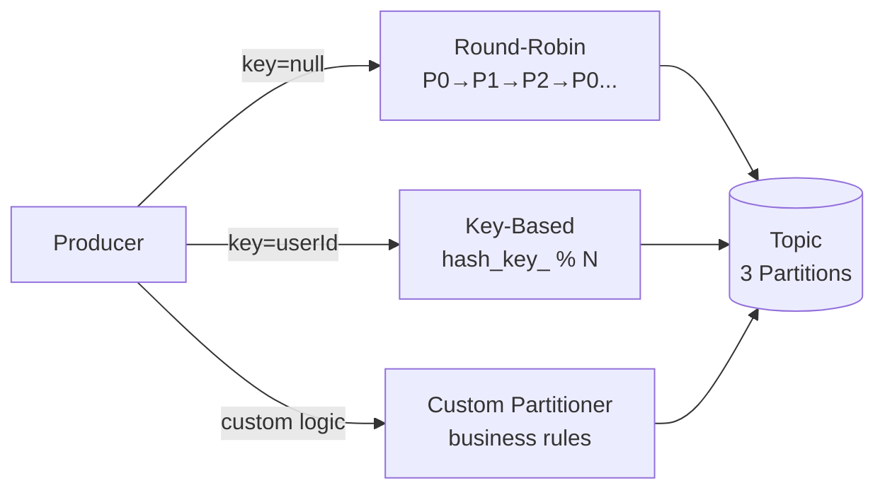
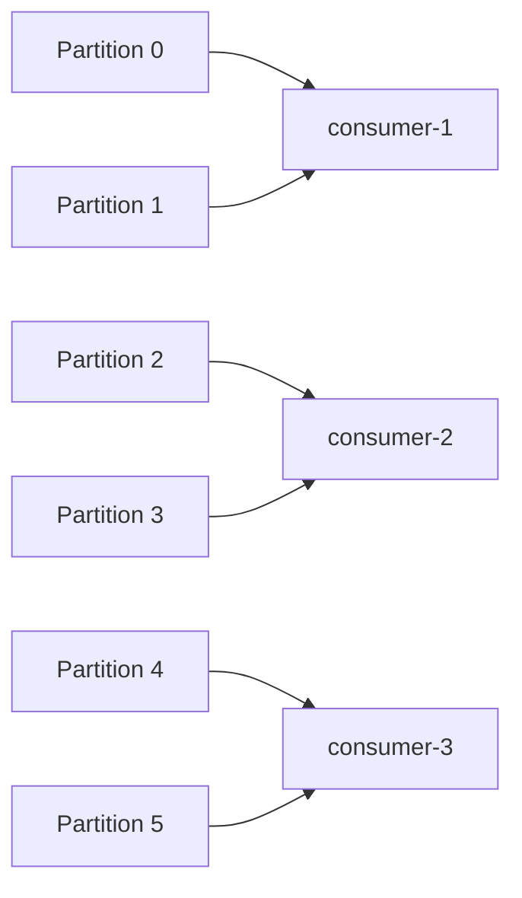
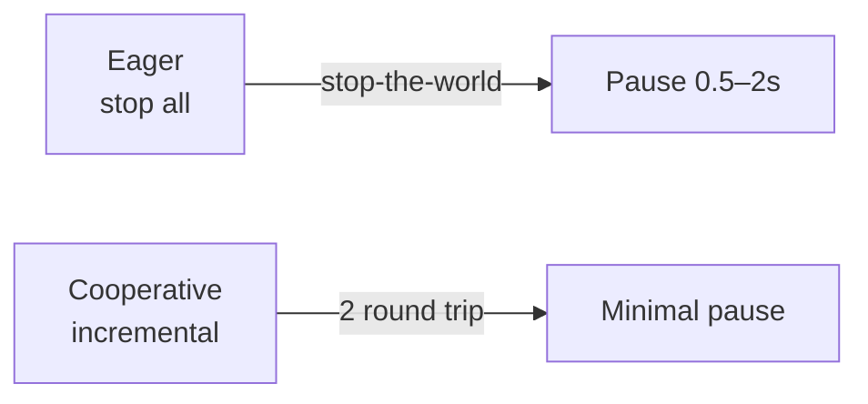

# Level 9: Kafka Producers and Consumers

## Producer API

Producer sends records to a topic. Key parameters:

```java
Properties props = new Properties();
props.put("bootstrap.servers", "broker1:9092,broker2:9092");
props.put("key.serializer",   "org.apache.kafka.common.serialization.StringSerializer");
props.put("value.serializer", "org.apache.kafka.common.serialization.StringSerializer");
props.put("acks", "all");           // delivery guarantees
props.put("retries", 3);
props.put("linger.ms", 5);          // wait for batch
props.put("batch.size", 16384);     // batch size

KafkaProducer<String, String> producer = new KafkaProducer<>(props);
producer.send(new ProducerRecord<>("orders", "user-101", "OrderPlaced"));
```

### The acks parameter

| acks | Guarantee | Performance |
|------|----------|--------------------|
| 0    | Fire-and-forget — no acknowledgment | Maximum |
| 1    | Acknowledgment from leader replica | Medium |
| all (-1) | Acknowledgment from all ISR replicas | Minimum |

📌 **acks=all + min.insync.replicas=2** — production standard.

### Idempotent Producer

Enabled via `enable.idempotence=true`. The producer gets a unique `ProducerID` and a sequence number for each partition — the broker discards duplicates on retry.

```
acks=all + retries=MAX + enable.idempotence=true → exactly-once at-most-once within a session
```

## Partitioning Strategies



**Round-Robin** — even load distribution, no ordering guarantee between messages.

**Key-Based** — `hash(key) % numPartitions`. The same key always goes to the same partition → event ordering for an entity is guaranteed.

**Custom** — implements the `Partitioner` interface. Routing by business logic (priority, event type).

⚠️ **Beginner mistake**: using `null` key for all messages when event ordering for an entity is needed.

## Consumer Groups



- Each partition is assigned to **exactly one** consumer in the group.
- If consumers > partitions — extra consumers are idle.
- Different consumer groups receive all messages independently.
- Groups are identified by `group.id`.

## Offset Management

Offset — the sequential number of a record within a partition. Three important values:

| Offset | Description |
|--------|----------|
| **Current** | Consumer's current read position |
| **Committed** | Saved to `__consumer_offsets` |
| **Log-End** | Last written to the partition |

**Consumer Lag** = Log-End Offset − Current Offset.

**Gap on crash** = Current Offset − Committed Offset (will be re-read).

### Auto vs Manual Commit

```java
// Auto commit (enable.auto.commit=true, auto.commit.interval.ms=5000)
// Risk: at-most-once or at-least-once duplicates

// Manual commit — after processing
consumer.poll(Duration.ofMillis(100))
    .forEach(record -> process(record));
consumer.commitSync();  // or commitAsync()
```

💡 For at-least-once: commit after processing. For exactly-once: transactions or idempotent consumer.

## Rebalancing

When a consumer joins/leaves the group — rebalancing occurs: partition redistribution.



- **EagerRebalance** (before Kafka 2.4): all consumers stop, all partitions are revoked and reassigned.
- **CooperativeStickyAssignor** (Kafka 2.4+): only affected partitions are moved, other consumers are not interrupted.

📌 In production, use `CooperativeStickyAssignor`.

## Common mistakes

⚠️ **max.poll.interval.ms** — if processing a single batch takes longer than this time, the consumer is considered dead and rebalancing is triggered.

⚠️ **session.timeout.ms** — if the consumer doesn't send a heartbeat for longer than this, it's considered dropped. Must be less than max.poll.interval.ms.

⚠️ Committing offset before processing completes → message loss on crash.
