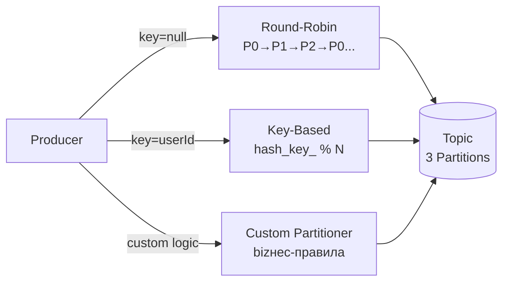
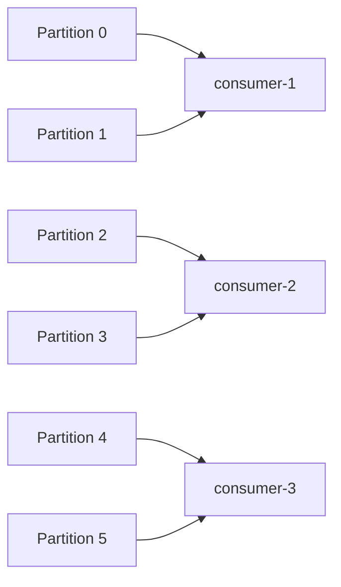
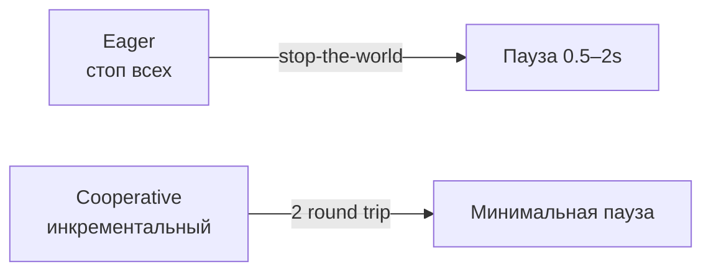

# Уровень 9: Kafka Producers и Consumers

## Producer API

Producer отправляет записи в топик. Ключевые параметры:

```java
Properties props = new Properties();
props.put("bootstrap.servers", "broker1:9092,broker2:9092");
props.put("key.serializer",   "org.apache.kafka.common.serialization.StringSerializer");
props.put("value.serializer", "org.apache.kafka.common.serialization.StringSerializer");
props.put("acks", "all");           // гарантии доставки
props.put("retries", 3);
props.put("linger.ms", 5);          // ждать батч
props.put("batch.size", 16384);     // размер батча

KafkaProducer<String, String> producer = new KafkaProducer<>(props);
producer.send(new ProducerRecord<>("orders", "user-101", "OrderPlaced"));
```

### Параметр acks

| acks | Гарантия | Производительность |
|------|----------|--------------------|
| 0    | Fire-and-forget — нет подтверждения | Максимальная |
| 1    | Подтверждение от leader-реплики | Средняя |
| all (-1) | Подтверждение от всех ISR-реплик | Минимальная |

📌 **acks=all + min.insync.replicas=2** — стандарт для продакшена.

### Idempotent Producer

Включается через `enable.idempotence=true`. Producer получает уникальный `ProducerID` и порядковый номер для каждой партиции — брокер отбрасывает дубликаты при ретрае.

```
acks=all + retries=MAX + enable.idempotence=true → exactly-once at-most-once внутри сессии
```

## Стратегии партиционирования



**Round-Robin** — равномерная нагрузка, нет гарантии порядка между сообщениями.

**Key-Based** — `hash(key) % numPartitions`. Одинаковый ключ всегда в одну партицию → порядок событий для сущности гарантирован.

**Custom** — реализует интерфейс `Partitioner`. Маршрутизация по бизнес-логике (приоритет, тип события).

⚠️ **Ошибка новичка**: использовать `null` ключ для всех сообщений, когда нужен порядок событий для одной сущности.

## Consumer Groups



- Каждая партиция назначается **ровно одному** consumer в группе.
- Если consumers > partitions — лишние consumers простаивают (idle).
- Разные consumer groups получают все сообщения независимо.
- Группы идентифицируются по `group.id`.

## Offset Management

Offset — порядковый номер записи внутри партиции. Три важных значения:

| Offset | Описание |
|--------|----------|
| **Current** | Текущая позиция чтения consumer |
| **Committed** | Сохранено в `__consumer_offsets` |
| **Log-End** | Последнее записанное в партицию |

**Consumer Lag** = Log-End Offset − Current Offset.

**Gap при crash** = Current Offset − Committed Offset (будут перечитаны).

### Auto vs Manual Commit

```java
// Auto commit (enable.auto.commit=true, auto.commit.interval.ms=5000)
// Риск: at-most-once или at-least-once дубликаты

// Manual commit — after processing
consumer.poll(Duration.ofMillis(100))
    .forEach(record -> process(record));
consumer.commitSync();  // или commitAsync()
```

💡 Для at-least-once: commit после обработки. Для exactly-once: транзакции или идемпотентный consumer.

## Rebalancing

Когда consumer join/leave группы — происходит rebalancing: перераспределение партиций.



- **EagerRebalance** (до Kafka 2.4): все consumers останавливаются, все партиции отзываются и переназначаются.
- **CooperativeStickyAssignor** (Kafka 2.4+): только затронутые партиции перемещаются, остальные consumers не прерываются.

📌 В продакшене используйте `CooperativeStickyAssignor`.

## Частые ошибки

⚠️ **max.poll.interval.ms** — если обработка одного батча занимает больше этого времени, consumer считается мёртвым и запускается rebalancing.

⚠️ **session.timeout.ms** — если consumer не шлёт heartbeat дольше, считается отпавшим. Должен быть меньше max.poll.interval.ms.

⚠️ Коммит offset до завершения обработки → потеря сообщений при crash.
