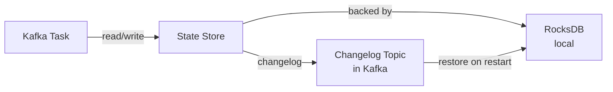
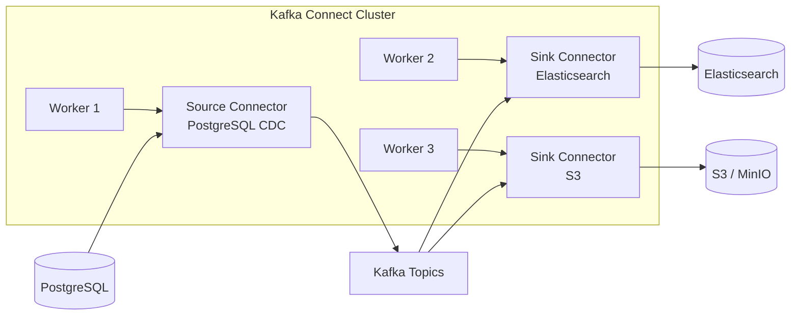
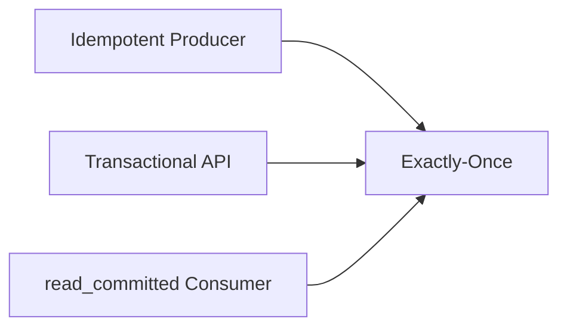

# Kafka: Advanced Features — Detailed Theory

## 1. Kafka Streams: DSL vs Processor API

Kafka Streams provides two API levels for building streaming applications.

### Streams DSL (high-level)

DSL is a declarative API built on top of the Processor API. It covers 90% of use cases and reads like a chain of transformations:

```java
StreamsBuilder builder = new StreamsBuilder();

KStream<String, Order> orders = builder.stream("orders");

KTable<Windowed<String>, Long> hourlyRevenue = orders
    .filter((key, order) -> order.getAmount() > 0)
    .mapValues(order -> order.getAmount())
    .groupByKey()
    .windowedBy(TimeWindows.ofSizeWithNoGrace(Duration.ofHours(1)))
    .reduce(Long::sum);

hourlyRevenue.toStream().to("hourly-revenue");
```

Each method is a topology operator. Kafka Streams builds a graph of operators and compiles it into a set of StreamTasks.

### Processor API (low-level)

Processor API gives full control over processing. Used when you need:
- Non-standard state store management
- Forwarding records to multiple downstream nodes
- Fine-grained control over punctuators (periodic time-based operations)

```java
class RevenueProcessor implements Processor<String, Long, String, String> {
    private ProcessorContext<String, String> context;
    private KeyValueStore<String, Long> store;

    @Override
    public void init(ProcessorContext<String, String> context) {
        this.context = context;
        this.store = context.getStateStore("revenue-store");

        // Punctuator — called every 60 seconds by wall clock time
        context.schedule(Duration.ofSeconds(60), PunctuationType.WALL_CLOCK_TIME, ts -> {
            // emit aggregated results
        });
    }

    @Override
    public void process(Record<String, Long> record) {
        Long current = store.get(record.key());
        Long updated = (current == null ? 0L : current) + record.value();
        store.put(record.key(), updated);
        // forward only when threshold is reached
        if (updated > 10_000L) {
            context.forward(record.withValue("HIGH_REVENUE:" + updated));
        }
    }
}
```

---

## 2. Windowing in Kafka Streams

Windowing allows aggregating data over a time interval. Kafka Streams supports 4 window types.

### Tumbling Windows (fixed non-overlapping)

Fixed size, records fall into exactly one window.

```
Timeline: ──────────────────────────────────────────────►
Windows:   [00:00─01:00)[01:00─02:00)[02:00─03:00)
Record t=00:30 → falls into first window
Record t=01:15 → falls into second window
```

```java
.windowedBy(TimeWindows.ofSizeWithNoGrace(Duration.ofMinutes(60)))
```

✅ Ideal for: hourly/daily reports, billing.

### Hopping Windows (overlapping)

Fixed size + step. A record can fall into multiple windows.

```
Window 1: [00:00─01:00)
Window 2: [00:30─01:30)   ← overlaps
Window 3: [01:00─02:00)

Record t=00:45 → falls into Window 1 AND Window 2
```

```java
.windowedBy(TimeWindows.ofSizeWithNoGrace(Duration.ofMinutes(60))
    .advanceBy(Duration.ofMinutes(30)))
```

✅ Ideal for: rolling averages, trending topics.

### Sliding Windows

Window is defined by the distance between two records. A window is created for each pair of records.

```java
.windowedBy(SlidingWindows.ofTimeDifferenceWithNoGrace(Duration.ofMinutes(5)))
```

✅ Ideal for: anomaly detection, fraud detection (N transactions in 5 minutes).

### Session Windows

Window groups activity with gaps. If the time between events exceeds inactivityGap — a new session starts.

```
User activity:
click(10:00) click(10:02) click(10:03) ──── gap 20min ──── click(10:25)
└──────────── Session 1 ────────────┘                    └─ Session 2 ─┘
```

```java
.windowedBy(SessionWindows.ofInactivityGapWithNoGrace(Duration.ofMinutes(10)))
```

✅ Ideal for: user sessions, network connection analysis.

---

## 3. State Stores and RocksDB

### What is a State Store

Kafka Streams is a stateful processor. For aggregations, joins, and deduplication, state needs to be stored locally.



By default, State Store is **RocksDB** (a disk-based key-value store developed by Facebook/Meta). RocksDB was chosen because:
- Works with data larger than RAM
- LSM-tree structure — fast writes
- Data compression (Snappy/LZ4/Zstd)
- Supports range key iteration

### In-Memory State Store

For small data volumes, In-Memory store can be used:

```java
Materialized.<String, Long, KeyValueStore<Bytes, byte[]>>as("counts-store")
    .withKeySerde(Serdes.String())
    .withValueSerde(Serdes.Long())
    .withLoggingEnabled(Collections.emptyMap())  // changelog
```

⚠️ Data is lost on restart — restored from changelog topic.

### Interactive Queries

State stores can be queried from outside the application! This turns Kafka Streams into an embedded database:

```java
// Get ReadOnlyKeyValueStore
ReadOnlyKeyValueStore<String, Long> store =
    streams.store(StoreQueryParameters.fromNameAndType(
        "counts-store",
        QueryableStoreTypes.keyValueStore()
    ));

Long count = store.get("user:123");

// Range query
KeyValueIterator<String, Long> range = store.range("user:100", "user:200");
```

For distributed interactive queries, a discovery mechanism is needed: each instance knows which partitions it has — and can redirect the query to the right node via `streams.metadataForKey(...)`.

---

## 4. Kafka Connect

### Connect Architecture



Connect Workers run in distributed mode — tasks are automatically distributed across workers. Configuration is stored in Kafka topics (`connect-configs`, `connect-offsets`, `connect-status`).

### Single Message Transforms (SMT)

SMT — lightweight message transformations without a separate application:

```json
{
  "name": "jdbc-source",
  "config": {
    "connector.class": "io.confluent.connect.jdbc.JdbcSourceConnector",
    "connection.url": "jdbc:postgresql://db:5432/mydb",
    "table.whitelist": "orders",
    "mode": "timestamp",
    "timestamp.column.name": "updated_at",
    "transforms": "flatten,addField",
    "transforms.flatten.type": "org.apache.kafka.connect.transforms.Flatten$Value",
    "transforms.addField.type": "org.apache.kafka.connect.transforms.InsertField$Value",
    "transforms.addField.static.field": "source",
    "transforms.addField.static.value": "postgres"
  }
}
```

Popular SMTs:
- `ExtractField` — extract a field from a structure
- `ReplaceField` — add/remove/rename fields
- `MaskField` — mask sensitive data (PII)
- `TimestampConverter` — convert timestamp format
- `Tombstone` — turn records into tombstones

---

## 5. Schema Registry and Serialization Formats

### Why Schema Registry is Needed

Problem: Producer writes data in Avro format. Consumer needs to know the schema for deserialization. If the schema changes without coordination — the Consumer breaks.

Schema Registry solves this centrally:

```
Producer               Schema Registry          Consumer
   │                         │                     │
   ├─ register schema ──────►│                     │
   │◄─ schema_id: 42 ────────┤                     │
   │                         │                     │
   ├─ [magic byte][id=42][data] ──────────────────►│
   │                         │                     │
   │                         │◄─ GET /schemas/42 ──┤
   │                         ├─ schema ───────────►│
   │                         │                     ├─ deserialize
```

The first byte of the message is a magic byte (0x0). The next 4 bytes are the schema ID.

### Compatibility Modes

**BACKWARD** (default):
- New consumers read old data
- Allowed: add a field with default, remove a field
- Not allowed: remove a field without default, change type

**FORWARD**:
- Old consumers read new data
- Opposite of BACKWARD

**FULL**:
- Both BACKWARD and FORWARD simultaneously
- Strictest constraints

**NONE**:
- Compatibility not checked (dangerous in production)

### Serialization Format Comparison

| Format | Size | Speed | Schema Evolution | Human-readable |
|--------|--------|----------|-----------------|----------------|
| JSON | Large | Slow | No | ✅ |
| Avro | Compact | Fast | Excellent | ❌ |
| Protobuf | Very compact | Very fast | Excellent | ❌ |
| JSON Schema | Large | Slow | Good | ✅ |

💡 Avro is the de-facto standard in the Kafka ecosystem thanks to native Schema Registry integration.

---

## 6. Log Compaction: Algorithm Details

### How the Cleaner Thread Works

Log compaction is a background process that runs periodically:

```
Before compaction (one partition):
Segment 1: [user:1 v1][user:2 v1][user:1 v2][user:3 v1]
Segment 2: [user:2 v2][user:1 v3][user:4 v1][user:3 NULL←tombstone]
Segment 3: [user:5 v1][user:2 v3]  ← active (tail), not compacted

After compaction:
Segment:   [user:1 v3][user:2 v3][user:4 v1][user:5 v1]
                                              ↑ user:3 deleted (tombstone)
```

Key configurations:

```properties
# Enable compaction for a topic
log.cleanup.policy=compact

# Or mixed mode (both compaction and retention)
log.cleanup.policy=compact,delete

# Minimum "dirtiness" before compaction (50% duplicates)
log.cleaner.min.cleanable.ratio=0.5

# How long to keep tombstones after compaction
log.cleaner.delete.retention.ms=86400000  # 1 day

# Minimum lag before compaction (protects hot topics)
log.cleaner.min.compaction.lag.ms=0
```

⚠️ **Important**: the active segment (last one) is never compacted! This is the "tail" of the log. Compaction only works with "head" — closed segments.

### Tombstone Records

```java
// Producer: delete a key from a compacted topic
producer.send(new ProducerRecord<>("user-profiles", "user:123", null));
//                                                              ^^^ null value = tombstone
```

A tombstone stays in the log until:
1. `delete.retention.ms` passes after compaction
2. Compaction runs (tombstone is removed from the compacted log)

A consumer with an offset "in the future" relative to a tombstone will never see the deleted record.

### Use Cases for Compacted Topics

- **Changelog topics** for Kafka Streams state stores
- **User profiles** — current user state
- **Product catalog** — current prices and attributes
- **Configuration store** — etcd-like on top of Kafka
- **Event sourcing snapshots** — last known entity state

---

## 7. Exactly-Once Semantics: Internal Mechanics

### Three Components of EOS

Exactly-once in Kafka is a combination of three mechanisms:



### 1. Idempotent Producer

Without idempotence, retry can produce duplicates:

```
Producer → Broker: [seq=1, data=A]  ✅ written
Broker → Producer: network failed (no ACK)
Producer → Broker: [seq=1, data=A]  ← retry
Broker: already saw seq=1 → reject (duplicate)
```

Producer gets a `producer_id` (PID) and `epoch` from the broker. Each message has a monotonically increasing sequence number. The broker rejects duplicates.

```properties
enable.idempotence=true
acks=all  # required
retries=2147483647  # maximum
max.in.flight.requests.per.connection=5  # max 5 with idempotence
```

### 2. Transactional Producer API

```java
Properties props = new Properties();
props.put("transactional.id", "order-processor-1");  // unique ID
props.put("enable.idempotence", "true");

KafkaProducer<String, String> producer = new KafkaProducer<>(props);

// Initialization (registration with Transaction Coordinator)
producer.initTransactions();

try {
    producer.beginTransaction();

    // Atomic write to multiple topics
    producer.send(new ProducerRecord<>("payments", key, paymentData));
    producer.send(new ProducerRecord<>("inventory", key, inventoryData));
    producer.send(new ProducerRecord<>("audit-log", key, auditData));

    // If consumer needs to commit offset atomically with produce:
    producer.sendOffsetsToTransaction(offsets, consumerGroupMetadata);

    producer.commitTransaction();

} catch (ProducerFencedException | OutOfOrderSequenceException e) {
    // Cannot recover — close the producer
    producer.close();
} catch (KafkaException e) {
    // Abort the transaction
    producer.abortTransaction();
}
```

### 3. The __transaction_state Topic

Transaction Coordinator — the broker responsible for managing transactions. Determined by the formula:

```
partition = hash(transactional.id) % transaction.state.log.num.partitions
coordinator = leader of __transaction_state partition
```

Transaction lifecycle in `__transaction_state`:

```
EMPTY → ONGOING → PREPARE_COMMIT → COMMITTED
              ↘ PREPARE_ABORT → DEAD
```

### 4. Zombie Fencing

What happens when a producer restarts with the same `transactional.id`:

```
Producer v1: beginTransaction() → gets epoch=1
// crash
Producer v2: initTransactions() → broker increments epoch → epoch=2
Producer v1: resumes → tries to write with epoch=1
Broker: epoch=1 < current epoch=2 → ProducerFencedException
```

Epoch guarantees that only ONE producer instance with a given transactional.id is active at a time.

### Read Committed on the Consumer

```java
Properties consumerProps = new Properties();
consumerProps.put("isolation.level", "read_committed");
// Alternative: "read_uncommitted" (default)
```

With `read_committed`, the consumer sees:
- All non-transactional messages
- Only COMMITTED transactional messages
- Does NOT see ABORTED and ONGOING transactions

LSO (Last Stable Offset) — the maximum offset a consumer with `read_committed` can retrieve. LSO = min(first open transaction offset, LEO). This means a long transaction blocks consumer progress.

---

## 8. Kafka Connect: Converters and Transforms

### Converters

A converter transforms data between Kafka format (bytes) and Connect internal format (Connect Schema + Java objects).

```properties
# Worker-level configuration
key.converter=io.confluent.connect.avro.AvroConverter
key.converter.schema.registry.url=http://registry:8081
value.converter=io.confluent.connect.avro.AvroConverter
value.converter.schema.registry.url=http://registry:8081
```

Available converters:
- `JsonConverter` — JSON with optional schema
- `AvroConverter` — Avro via Schema Registry
- `ProtobufConverter` — Protobuf via Schema Registry
- `StringConverter` — strings without schema
- `ByteArrayConverter` — raw bytes

### Dead Letter Queue for Connect

On deserialization/transformation errors, Connect can send "bad" messages to a DLQ topic:

```json
{
  "errors.tolerance": "all",
  "errors.deadletterqueue.topic.name": "dlq-connector-errors",
  "errors.deadletterqueue.topic.replication.factor": 3,
  "errors.deadletterqueue.context.headers.enable": true
}
```

DLQ headers contain full error context: connector name, task id, stage (CONVERTER/TRANSFORMATION), error class + message.

---

## 9. Kafka Streams Performance

### Parallelism and Tasks

Kafka Streams divides work into **Stream Tasks**:
- Number of tasks = max(partitions) of the source topic
- Each task processes a strictly defined set of partitions
- Tasks are distributed across threads and application instances

```properties
# Number of threads in one instance
num.stream.threads=4

# Buffer for consumption
buffered.records.per.partition=1000

# Commit interval for state stores
commit.interval.ms=30000

# Rebalance check interval
poll.ms=100
```

### Standby Replicas

For fast failover, "warm" copies of state stores can be maintained:

```properties
# Number of standby replicas for each state store
num.standby.replicas=1
```

Standby replica continuously consumes the changelog topic — on primary instance failover, the standby already has current state and can take load almost instantly.

---

## 10. Advanced Monitoring

### Key Kafka Streams Metrics

```
# JMX MBeans for monitoring
kafka.streams:type=stream-metrics,client-id=*
  ├── commit-latency-avg    # commit latency (target: < 100ms)
  ├── poll-latency-avg      # poll latency
  └── process-rate          # records per second

kafka.streams:type=stream-task-metrics,client-id=*,task-id=*
  ├── process-latency-avg   # processing latency per task
  └── record-e2e-latency    # end-to-end latency (Kafka 2.6+)

kafka.streams:type=stream-state-metrics,client-id=*,task-id=*,store-name=*
  ├── put-rate              # state store write rate
  └── get-rate              # state store read rate
```

### Key Transaction Metrics

```
kafka.producer:type=producer-metrics,client-id=*
  ├── txn-abort-rate        # aborted transaction rate
  ├── txn-commit-rate       # committed transaction rate
  └── txn-duration-avg      # average transaction duration

# Warning signs:
# txn-abort-rate > 0   → check producer logs
# txn-duration-avg > 1000ms → risk of blocking LSO consumers
```

---

## Common Mistakes

### ❌ Mistake 1: Incorrect time management in Streams

```java
// Bad: using wall clock time for event-time windowing
TimeWindows.ofSizeWithNoGrace(Duration.ofHours(1))

// Good: specify grace period for late-arriving records
TimeWindows.ofSizeAndGrace(Duration.ofHours(1), Duration.ofMinutes(15))
```

Late records that arrive after the window closes but before the grace period expires — are processed correctly. After the grace period — they are discarded.

### ❌ Mistake 2: One transactional.id for multiple instances

```java
// Bad: both instances with the same transactional.id
// First one starts, second gets ProducerFencedException immediately
props.put("transactional.id", "my-processor");  // in both instances

// Good: unique ID per instance
props.put("transactional.id", "my-processor-" + instanceId);
```

### ❌ Mistake 3: Compacted topic + retention

```properties
// Bad: only delete policy — all old data will be removed
log.cleanup.policy=delete
log.retention.hours=24

// Good: for materialized view use only compact
log.cleanup.policy=compact

# Or both for time-bounded compacted topic
log.cleanup.policy=compact,delete
log.retention.ms=604800000  # 7 days
```

### ❌ Mistake 4: Interactive queries without handling StoreQueryException

```java
// Bad: query during rebalance will fail
Long count = store.get(key);

// Good: handle InvalidStateStoreException
try {
    ReadOnlyKeyValueStore<String, Long> store =
        streams.store(StoreQueryParameters.fromNameAndType(...));
    return store.get(key);
} catch (InvalidStateStoreException e) {
    // Store in process of rebalance/restore
    throw new ServiceUnavailableException("State store not ready");
}
```

### ❌ Mistake 5: Long transaction blocking consumers

```java
// Bad: transaction open for several minutes
producer.beginTransaction();
// long operation — 10 minutes
Thread.sleep(600_000);
producer.commitTransaction();
// All read_committed consumers are blocked for 10 minutes!

// Good: short transactions, one batch = one transaction
for (List<Record> batch : records.batches()) {
    producer.beginTransaction();
    processBatch(batch);
    producer.commitTransaction();
}
```
