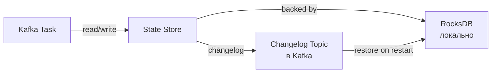
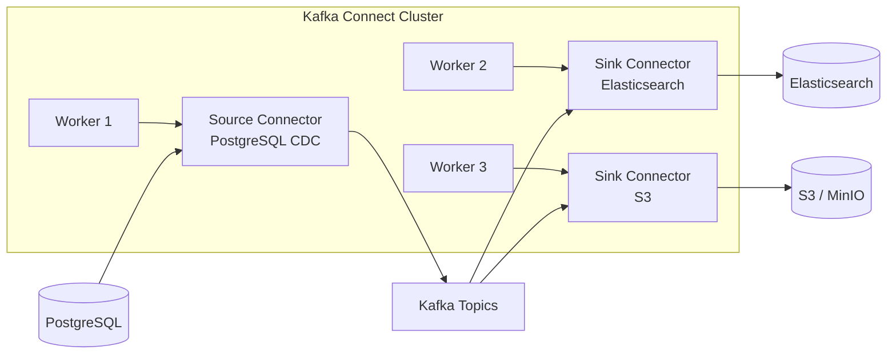
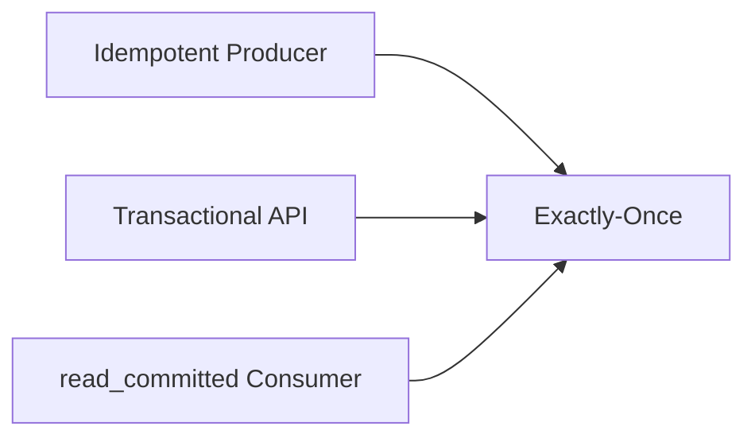

# Kafka: продвинутые возможности — подробная теория

## 1. Kafka Streams: DSL vs Processor API

Kafka Streams предоставляет два уровня API для построения потоковых приложений.

### Streams DSL (высокоуровневый)

DSL — декларативный API, построенный поверх Processor API. Он покрывает 90% use cases и читается как цепочка трансформаций:

```java
StreamsBuilder builder = new StreamsBuilder();

KStream<String, Order> orders = builder.stream("orders");

KTable<Windowed<String>, Long> hourlyRevenue = orders
    .filter((key, order) -> order.getAmount() > 0)
    .mapValues(order -> order.getAmount())
    .groupByKey()
    .windowedBy(TimeWindows.ofSizeWithNoGrace(Duration.ofHours(1)))
    .reduce(Long::sum);

hourlyRevenue.toStream().to("hourly-revenue");
```

Каждый метод — оператор топологии. Kafka Streams строит граф операторов и компилирует его в набор StreamTasks.

### Processor API (низкоуровневый)

Processor API даёт полный контроль над обработкой. Используется когда нужно:
- Нестандартное управление state store
- Пробрасывать записи в несколько downstream-нод
- Тонкий контроль над punctuators (периодические операции по времени)

```java
class RevenueProcessor implements Processor<String, Long, String, String> {
    private ProcessorContext<String, String> context;
    private KeyValueStore<String, Long> store;

    @Override
    public void init(ProcessorContext<String, String> context) {
        this.context = context;
        this.store = context.getStateStore("revenue-store");

        // Punctuator — вызывается каждые 60 секунд по wall clock time
        context.schedule(Duration.ofSeconds(60), PunctuationType.WALL_CLOCK_TIME, ts -> {
            // emit aggregated results
        });
    }

    @Override
    public void process(Record<String, Long> record) {
        Long current = store.get(record.key());
        Long updated = (current == null ? 0L : current) + record.value();
        store.put(record.key(), updated);
        // forward только при достижении порога
        if (updated > 10_000L) {
            context.forward(record.withValue("HIGH_REVENUE:" + updated));
        }
    }
}
```

---

## 2. Windowing в Kafka Streams

Windowing позволяет агрегировать данные за временной интервал. Kafka Streams поддерживает 4 типа окон.

### Tumbling Windows (скользящие неперекрывающиеся)

Фиксированный размер, записи попадают ровно в одно окно.

```
Timeline: ──────────────────────────────────────────────►
Окна:      [00:00─01:00)[01:00─02:00)[02:00─03:00)
Запись t=00:30 → попадает в первое окно
Запись t=01:15 → попадает во второе окно
```

```java
.windowedBy(TimeWindows.ofSizeWithNoGrace(Duration.ofMinutes(60)))
```

✅ Идеально для: почасовые/суточные отчёты, billing.

### Hopping Windows (перекрывающиеся)

Фиксированный размер + шаг. Запись может попасть в несколько окон.

```
Окно 1: [00:00─01:00)
Окно 2: [00:30─01:30)   ← overlaps
Окно 3: [01:00─02:00)

Запись t=00:45 → попадает в Окно 1 И Окно 2
```

```java
.windowedBy(TimeWindows.ofSizeWithNoGrace(Duration.ofMinutes(60))
    .advanceBy(Duration.ofMinutes(30)))
```

✅ Идеально для: скользящее среднее, trending topics.

### Sliding Windows

Окно определяется расстоянием между двумя записями. Окно создаётся для каждой пары записей.

```java
.windowedBy(SlidingWindows.ofTimeDifferenceWithNoGrace(Duration.ofMinutes(5)))
```

✅ Идеально для: обнаружение аномалий, fraud detection (N транзакций за 5 минут).

### Session Windows

Окно группирует активность с перерывами. Если между событиями прошло больше inactivityGap — новая сессия.

```
Активность пользователя:
click(10:00) click(10:02) click(10:03) ──── gap 20min ──── click(10:25)
└──────────── Session 1 ────────────┘                    └─ Session 2 ─┘
```

```java
.windowedBy(SessionWindows.ofInactivityGapWithNoGrace(Duration.ofMinutes(10)))
```

✅ Идеально для: user sessions, network connection analysis.

---

## 3. State Stores и RocksDB

### Что такое State Store

Kafka Streams — stateful обработчик. Для агрегаций, join-ов и дедупликации нужно хранить состояние локально.



По умолчанию State Store — это **RocksDB** (key-value хранилище на диске, разработано Facebook/Meta). RocksDB выбран потому что:
- Работает с данными больше RAM
- LSM-tree структура — быстрая запись
- Компрессия данных (Snappy/LZ4/Zstd)
- Поддержка итерации по диапазону ключей

### In-Memory State Store

Для небольших объёмов данных можно использовать In-Memory store:

```java
Materialized.<String, Long, KeyValueStore<Bytes, byte[]>>as("counts-store")
    .withKeySerde(Serdes.String())
    .withValueSerde(Serdes.Long())
    .withLoggingEnabled(Collections.emptyMap())  // changelog
```

⚠️ Данные теряются при рестарте — восстанавливаются из changelog topic.

### Interactive Queries

State stores можно запрашивать извне приложения! Это превращает Kafka Streams в embedded database:

```java
// Получить ReadOnlyKeyValueStore
ReadOnlyKeyValueStore<String, Long> store =
    streams.store(StoreQueryParameters.fromNameAndType(
        "counts-store",
        QueryableStoreTypes.keyValueStore()
    ));

Long count = store.get("user:123");

// Диапазонный запрос
KeyValueIterator<String, Long> range = store.range("user:100", "user:200");
```

Для распределённых interactive queries нужен discovery-механизм: каждый экземпляр знает, какие партиции у него — и может перенаправить запрос нужному узлу через `streams.metadataForKey(...)`.

---

## 4. Kafka Connect

### Архитектура Connect



Connect Workers работают в distributed mode — задачи (Tasks) распределяются по воркерам автоматически. Конфигурация хранится в Kafka-топиках (`connect-configs`, `connect-offsets`, `connect-status`).

### Single Message Transforms (SMT)

SMT — легковесные трансформации сообщений без отдельного приложения:

```json
{
  "name": "jdbc-source",
  "config": {
    "connector.class": "io.confluent.connect.jdbc.JdbcSourceConnector",
    "connection.url": "jdbc:postgresql://db:5432/mydb",
    "table.whitelist": "orders",
    "mode": "timestamp",
    "timestamp.column.name": "updated_at",
    "transforms": "flatten,addField",
    "transforms.flatten.type": "org.apache.kafka.connect.transforms.Flatten$Value",
    "transforms.addField.type": "org.apache.kafka.connect.transforms.InsertField$Value",
    "transforms.addField.static.field": "source",
    "transforms.addField.static.value": "postgres"
  }
}
```

Популярные SMT:
- `ExtractField` — извлечь поле из структуры
- `ReplaceField` — добавить/удалить/переименовать поля
- `MaskField` — маскировать чувствительные данные (PII)
- `TimestampConverter` — конвертировать формат timestamp
- `Tombstone` — превращать записи в tombstone

---

## 5. Schema Registry и форматы сериализации

### Зачем нужен Schema Registry

Проблема: Producer пишет данные в Avro-формате. Consumer должен знать схему для десериализации. Если схема меняется без согласования — Consumer ломается.

Schema Registry решает это централизованно:

```
Producer               Schema Registry          Consumer
   │                         │                     │
   ├─ register schema ──────►│                     │
   │◄─ schema_id: 42 ────────┤                     │
   │                         │                     │
   ├─ [magic byte][id=42][data] ──────────────────►│
   │                         │                     │
   │                         │◄─ GET /schemas/42 ──┤
   │                         ├─ schema ───────────►│
   │                         │                     ├─ deserialize
```

Первый байт сообщения — magic byte (0x0). Следующие 4 байта — schema ID.

### Режимы совместимости

**BACKWARD** (по умолчанию):
- Новые потребители читают старые данные
- Можно: добавить поле с default, удалить поле
- Нельзя: удалить поле без default, изменить тип

**FORWARD**:
- Старые потребители читают новые данные
- Обратное от BACKWARD

**FULL**:
- И BACKWARD, и FORWARD одновременно
- Самые строгие ограничения

**NONE**:
- Совместимость не проверяется (опасно в продакшене)

### Сравнение форматов сериализации

| Формат | Размер | Скорость | Эволюция схемы | Human-readable |
|--------|--------|----------|-----------------|----------------|
| JSON | Большой | Медленно | Нет | ✅ |
| Avro | Компактный | Быстро | Отличная | ❌ |
| Protobuf | Очень компактный | Очень быстро | Отличная | ❌ |
| JSON Schema | Большой | Медленно | Хорошая | ✅ |

💡 Avro — де-факто стандарт в Kafka-экосистеме благодаря нативной интеграции с Schema Registry.

---

## 6. Log Compaction: детали алгоритма

### Как работает Cleaner Thread

Log compaction — фоновый процесс, который выполняется periodically:

```
До compaction (один partition):
Segment 1: [user:1 v1][user:2 v1][user:1 v2][user:3 v1]
Segment 2: [user:2 v2][user:1 v3][user:4 v1][user:3 NULL←tombstone]
Segment 3: [user:5 v1][user:2 v3]  ← active (tail), не compacted

После compaction:
Segment:   [user:1 v3][user:2 v3][user:4 v1][user:5 v1]
                                              ↑ user:3 удалён (tombstone)
```

Ключевые конфигурации:

```properties
# Включить compaction для топика
log.cleanup.policy=compact

# Или смешанный режим (и compaction, и retention)
log.cleanup.policy=compact,delete

# Минимальная "загрязнённость" перед compaction (50% дубликатов)
log.cleaner.min.cleanable.ratio=0.5

# Как долго хранить tombstone после compaction
log.cleaner.delete.retention.ms=86400000  # 1 day

# Минимальный lag перед compaction (защита hot topics)
log.cleaner.min.compaction.lag.ms=0
```

⚠️ **Важно**: active segment (последний) никогда не compacted! Это "tail" лога. Compaction работает только с "head" — закрытыми сегментами.

### Tombstone records

```java
// Producer: удалить ключ из compacted topic
producer.send(new ProducerRecord<>("user-profiles", "user:123", null));
//                                                              ^^^ null value = tombstone
```

Tombstone хранится в логе до тех пор, пока:
1. Не пройдёт `delete.retention.ms` после compaction
2. Не пройдёт compaction (tombstone удаляется из compacted лога)

Consumer с offset в "будущем" относительно tombstone никогда не увидит удалённую запись.

### Use cases для Compacted Topics

- **Changelog topics** для Kafka Streams state stores
- **User profiles** — актуальное состояние пользователя
- **Product catalog** — текущие цены и атрибуты
- **Configuration store** — аналог etcd на основе Kafka
- **Event sourcing snapshots** — последнее известное состояние сущности

---

## 7. Exactly-Once Semantics: внутренняя механика

### Три компонента EOS

Exactly-once в Kafka — это комбинация трёх механизмов:



### 1. Idempotent Producer

Без идемпотентности при retry может получиться дублирование:

```
Producer → Broker: [seq=1, data=A]  ✅ записано
Broker → Producer: сеть упала (нет ACK)
Producer → Broker: [seq=1, data=A]  ← retry
Broker: seq=1 уже видел → отклонить (дубликат)
```

Producer получает `producer_id` (PID) и `epoch` от брокера. Каждое сообщение имеет monotonically increasing sequence number. Брокер отклоняет дубликаты.

```properties
enable.idempotence=true
acks=all  # обязательно
retries=2147483647  # максимум
max.in.flight.requests.per.connection=5  # максимум 5 с idempotence
```

### 2. Transactional Producer API

```java
Properties props = new Properties();
props.put("transactional.id", "order-processor-1");  // уникальный ID
props.put("enable.idempotence", "true");

KafkaProducer<String, String> producer = new KafkaProducer<>(props);

// Инициализация (регистрация в Transaction Coordinator)
producer.initTransactions();

try {
    producer.beginTransaction();

    // Атомарная запись в несколько топиков
    producer.send(new ProducerRecord<>("payments", key, paymentData));
    producer.send(new ProducerRecord<>("inventory", key, inventoryData));
    producer.send(new ProducerRecord<>("audit-log", key, auditData));

    // Если consumer-у нужно зафиксировать offset атомарно с produce:
    producer.sendOffsetsToTransaction(offsets, consumerGroupMetadata);

    producer.commitTransaction();

} catch (ProducerFencedException | OutOfOrderSequenceException e) {
    // Невозможно восстановиться — закрыть producer
    producer.close();
} catch (KafkaException e) {
    // Отмена транзакции
    producer.abortTransaction();
}
```

### 3. __transaction_state топик

Transaction Coordinator — это брокер, ответственный за управление транзакциями. Определяется по формуле:

```
partition = hash(transactional.id) % transaction.state.log.num.partitions
coordinator = leader of __transaction_state partition
```

Жизненный цикл транзакции в `__transaction_state`:

```
EMPTY → ONGOING → PREPARE_COMMIT → COMMITTED
              ↘ PREPARE_ABORT → DEAD
```

### 4. Zombie Fencing

Что происходит при перезапуске producer с тем же `transactional.id`:

```
Producer v1: beginTransaction() → получает epoch=1
// crash
Producer v2: initTransactions() → брокер инкрементирует epoch → epoch=2
Producer v1: возобновляется → пытается write с epoch=1
Broker: epoch=1 < current epoch=2 → ProducerFencedException
```

Epoch гарантирует, что только ОДИН экземпляр producer с данным transactional.id активен одновременно.

### Read Committed на Consumer-е

```java
Properties consumerProps = new Properties();
consumerProps.put("isolation.level", "read_committed");
// Альтернатива: "read_uncommitted" (по умолчанию)
```

При `read_committed` consumer видит:
- Все некрнтранзакционные сообщения
- Только COMMITTED транзакционные сообщения
- Не видит ABORTED и ONGOING транзакции

LSO (Last Stable Offset) — максимальный offset, который consumer с `read_committed` может получить. LSO = min(first open transaction offset, LEO). Это означает, что долгая транзакция блокирует прогресс consumer-а.

---

## 8. Kafka Connect: конвертеры и трансформации

### Конвертеры (Converters)

Конвертер преобразует данные между форматом Kafka (bytes) и внутренним форматом Connect (Connect Schema + Java objects).

```properties
# Worker-level конфигурация
key.converter=io.confluent.connect.avro.AvroConverter
key.converter.schema.registry.url=http://registry:8081
value.converter=io.confluent.connect.avro.AvroConverter
value.converter.schema.registry.url=http://registry:8081
```

Доступные конвертеры:
- `JsonConverter` — JSON с опциональной схемой
- `AvroConverter` — Avro через Schema Registry
- `ProtobufConverter` — Protobuf через Schema Registry
- `StringConverter` — строки без схемы
- `ByteArrayConverter` — сырые байты

### Dead Letter Queue для Connect

При ошибке десериализации/трансформации Connect может отправлять "битые" сообщения в DLQ-топик:

```json
{
  "errors.tolerance": "all",
  "errors.deadletterqueue.topic.name": "dlq-connector-errors",
  "errors.deadletterqueue.topic.replication.factor": 3,
  "errors.deadletterqueue.context.headers.enable": true
}
```

Заголовки в DLQ содержат полный контекст ошибки: connector name, task id, stage (CONVERTER/TRANSFORMATION), error class + message.

---

## 9. Производительность Kafka Streams

### Параллелизм и задачи

Kafka Streams делит работу на **Stream Tasks**:
- Количество задач = max(partitions) топика-источника
- Каждая задача обрабатывает строго определённый набор партиций
- Задачи распределяются по thread-ам и экземплярам приложения

```properties
# Количество потоков в одном экземпляре
num.stream.threads=4

# Буфер для потребления
buffered.records.per.partition=1000

# Commit interval для state stores
commit.interval.ms=30000

# Интервал проверки состояния rebalance
poll.ms=100
```

### Standby Replicas

Для быстрого failover можно держать "тёплые" копии state stores:

```properties
# Количество standby replicas для каждого state store
num.standby.replicas=1
```

Standby реплика постоянно потребляет changelog topic — при failover основного экземпляра standby уже имеет актуальное состояние и может принять нагрузку почти мгновенно.

---

## 10. Мониторинг продвинутых возможностей

### Ключевые метрики Kafka Streams

```
# JMX MBeans для мониторинга
kafka.streams:type=stream-metrics,client-id=*
  ├── commit-latency-avg    # задержка commit (target: < 100ms)
  ├── poll-latency-avg      # задержка poll
  └── process-rate          # записей в секунду

kafka.streams:type=stream-task-metrics,client-id=*,task-id=*
  ├── process-latency-avg   # задержка обработки на задачу
  └── record-e2e-latency    # end-to-end задержка (Kafka 2.6+)

kafka.streams:type=stream-state-metrics,client-id=*,task-id=*,store-name=*
  ├── put-rate              # скорость записи в state store
  └── get-rate              # скорость чтения из state store
```

### Ключевые метрики транзакций

```
kafka.producer:type=producer-metrics,client-id=*
  ├── txn-abort-rate        # частота aborted транзакций
  ├── txn-commit-rate       # частота committed транзакций
  └── txn-duration-avg      # средняя длительность транзакции

# Настораживающие симптомы:
# txn-abort-rate > 0   → проверить логи producer-а
# txn-duration-avg > 1000ms → риск блокировки LSO consumer-ов
```

---

## Частые ошибки

### ❌ Ошибка 1: Неправильное управление временем в Streams

```java
// Плохо: используется wall clock time для event-time windowing
TimeWindows.ofSizeWithNoGrace(Duration.ofHours(1))

// Хорошо: указать grace period для late-arriving records
TimeWindows.ofSizeAndGrace(Duration.ofHours(1), Duration.ofMinutes(15))
```

Late records, пришедшие после закрытия окна и до истечения grace period — обрабатываются корректно. После grace period — отбрасываются.

### ❌ Ошибка 2: Один transactional.id для нескольких экземпляров

```java
// Плохо: оба экземпляра с одним transactional.id
// Первый запустится, второй получит ProducerFencedException немедленно
props.put("transactional.id", "my-processor");  // в обоих экземплярах

// Хорошо: уникальный ID per instance
props.put("transactional.id", "my-processor-" + instanceId);
```

### ❌ Ошибка 3: Compacted topic + retention

```properties
# Плохо: только delete policy — все старые данные удалятся
log.cleanup.policy=delete
log.retention.hours=24

# Хорошо: для materialized view используй только compact
log.cleanup.policy=compact

# Или оба для time-bounded compacted topic
log.cleanup.policy=compact,delete
log.retention.ms=604800000  # 7 дней
```

### ❌ Ошибка 4: Interactive queries без обработки StoreQueryException

```java
// Плохо: запрос во время rebalance упадёт
Long count = store.get(key);

// Хорошо: обработать InvalidStateStoreException
try {
    ReadOnlyKeyValueStore<String, Long> store =
        streams.store(StoreQueryParameters.fromNameAndType(...));
    return store.get(key);
} catch (InvalidStateStoreException e) {
    // Store в процессе rebalance/restore
    throw new ServiceUnavailableException("State store not ready");
}
```

### ❌ Ошибка 5: Долгая транзакция блокирует consumer-ов

```java
// Плохо: транзакция открыта на несколько минут
producer.beginTransaction();
// долгая операция — 10 минут
Thread.sleep(600_000);
producer.commitTransaction();
// Все read_committed consumer-ы заблокированы на 10 минут!

// Хорошо: короткие транзакции, один batch = одна транзакция
for (List<Record> batch : records.batches()) {
    producer.beginTransaction();
    processBatch(batch);
    producer.commitTransaction();
}
```
