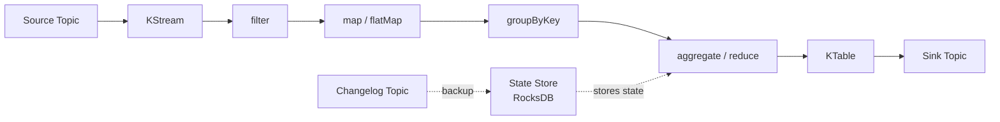
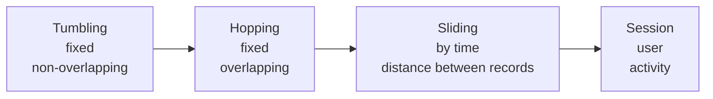
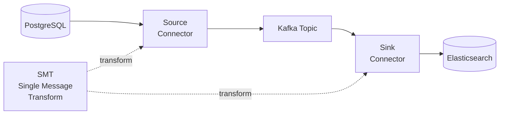
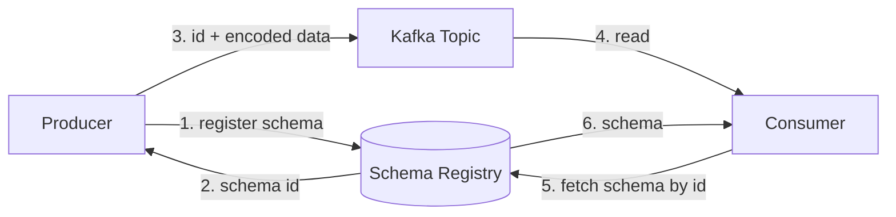
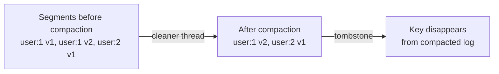
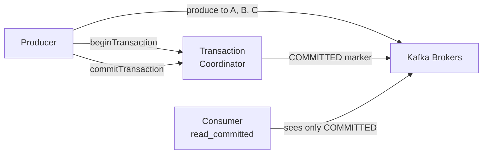

# Level 10: Kafka — Advanced Features

## Kafka Streams

Kafka Streams is a library for processing data directly within Kafka topics. No separate cluster needed: the application itself is the streaming processor.

**KStream** — infinite stream of events. Each record is an independent event.
**KTable** — materialized view: only the latest value for each key. Behaves like a DB table.

### Windowed Aggregations

💡 Windowing only works with groupBy + aggregate operations.

---

## KStream vs KTable

| Characteristic | KStream | KTable |
|---------------|---------|--------|
| Semantics | Event stream | Update table |
| Duplicate keys | All records | Latest only |
| Join with KStream | stream-stream join | stream-table join |
| Analogy | INSERT | UPSERT |

---

## Kafka Connect

Ready-made framework for integration with external systems without code.

**Source Connector** — reads data from an external system, writes to Kafka.
**Sink Connector** — reads from Kafka, writes to an external system.

---

## Schema Registry

Stores message schemas (Avro, JSON Schema, Protobuf) and ensures compatibility.

Compatibility modes: **BACKWARD** (new schema reads old data), **FORWARD**, **FULL**.

---

## Log Compaction

Kafka stores only the **latest** value for each key. Tombstone (null value) = deletion.

---

## Exactly-Once Semantics

Three levels of guarantees: at-most-once, at-least-once, exactly-once.

⚠️ Requires: `transactional.id`, `enable.idempotence=true`, consumer `isolation.level=read_committed`.
