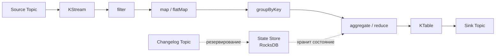
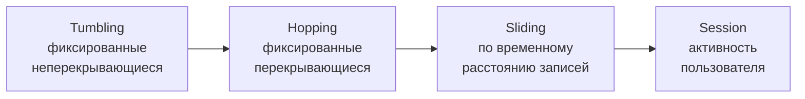
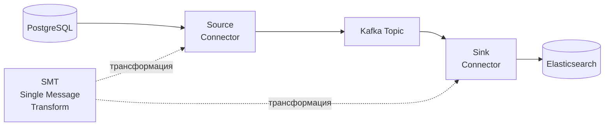
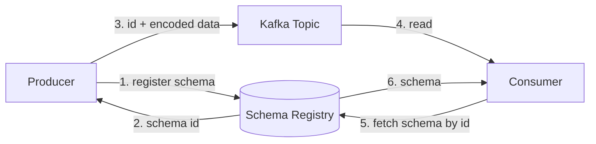
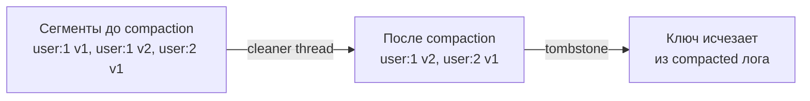
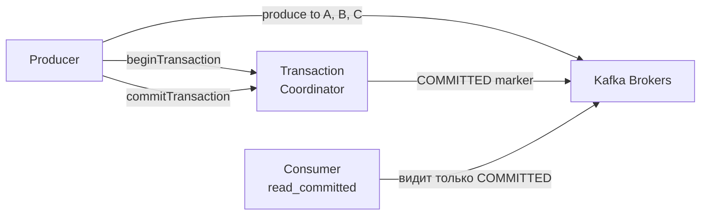

# Уровень 10: Kafka — продвинутые возможности

## Kafka Streams

Kafka Streams — библиотека для обработки данных прямо внутри Kafka-топиков. Никакого отдельного кластера не нужно: приложение само является потоковым процессором.

**KStream** — бесконечный поток событий. Каждая запись — независимое событие.
**KTable** — материализованное представление: только последнее значение для каждого ключа. Ведёт себя как таблица БД.

### Оконные агрегации

💡 Windowing работает только с операциями groupBy + aggregate.

---

## KStream vs KTable

| Характеристика | KStream | KTable |
|---------------|---------|--------|
| Семантика | Поток событий | Таблица обновлений |
| Дубликаты ключей | Все записи | Только последняя |
| Join с KStream | stream-stream join | stream-table join |
| Аналогия | INSERT | UPSERT |

---

## Kafka Connect

Готовый фреймворк для интеграции с внешними системами без кода.

**Source Connector** — читает данные из внешней системы, пишет в Kafka.
**Sink Connector** — читает из Kafka, пишет во внешнюю систему.

---

## Schema Registry

Хранит схемы сообщений (Avro, JSON Schema, Protobuf) и обеспечивает совместимость.

Режимы совместимости: **BACKWARD** (новая схема читает старые данные), **FORWARD**, **FULL**.

---

## Log Compaction

Kafka хранит только **последнее** значение для каждого ключа. Tombstone (null value) = удаление.

---

## Exactly-Once Semantics

Три уровня гарантий: at-most-once, at-least-once, exactly-once.

⚠️ Requires: `transactional.id`, `enable.idempotence=true`, consumer `isolation.level=read_committed`.
