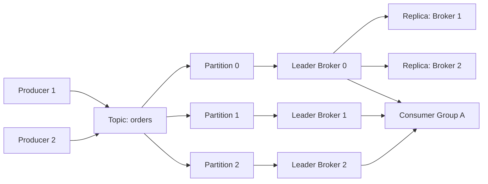
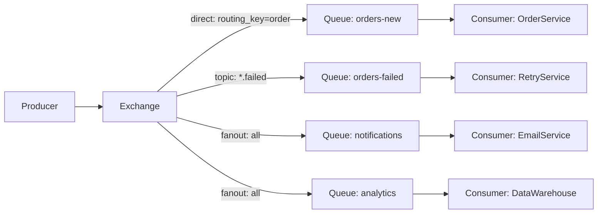
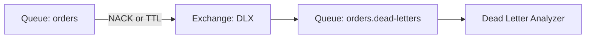
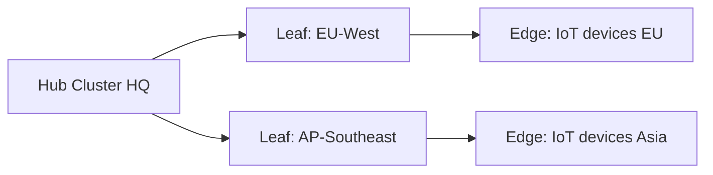
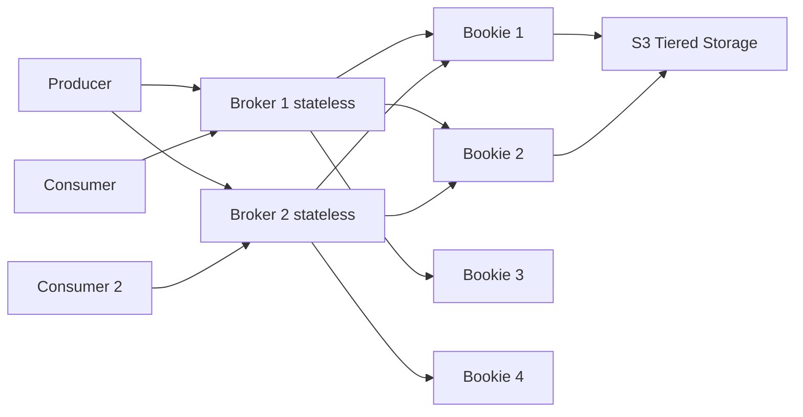
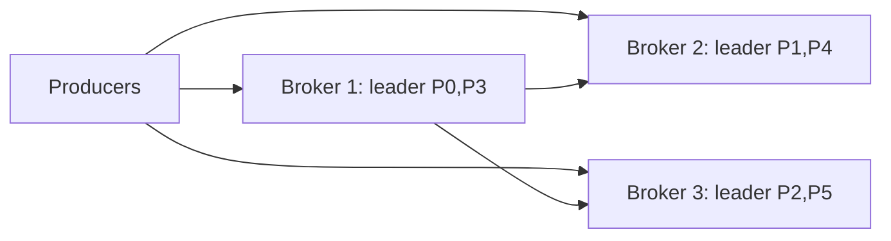
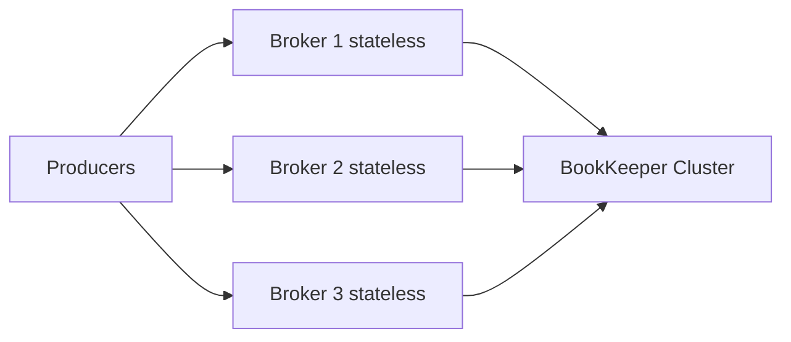
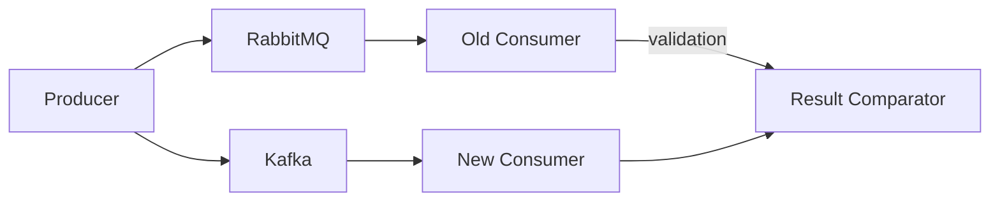

# Level 11: Detailed Message Broker Comparison

## Introduction: why comparison is hard

Choosing a broker is one of the most important architectural decisions in distributed systems. The problem is that each broker was created to solve specific tasks, and each has its own "comfort zone".

📌 **The main mistake**: choosing a broker by popularity or by "what Google/Netflix uses". The right question is — "what problem are we solving?"

---

## 1. Apache Kafka: distributed commit log

### Architectural idea

Kafka was created at LinkedIn for collecting activity events (page views, clicks, user actions). Key insight: if you store messages not as a queue (delete after delivery), but as a **log** — you can re-read them.



### How log segments work

Each partition is a set of **segments** (files on disk). Each segment = `.log` (data) + `.index` (offset → position index) + `.timeindex` (time index).

```
partition-0/
├── 00000000000000000000.log      # segment with offset 0
├── 00000000000000000000.index
├── 00000000000000000000.timeindex
├── 00000000000001234567.log      # next segment
└── ...
```

💡 **Key optimization**: Kafka uses the Linux **page cache**. Reads and writes go through page cache (RAM), giving memory speed with sequential access. Zero-copy (`sendfile` system call) allows sending data from page cache directly to the network socket, bypassing user space copying.

### Producer: acks and linger

```python
# Producer configuration for maximum throughput
producer = KafkaProducer(
    bootstrap_servers=['kafka:9092'],
    acks='all',          # wait for confirmation from all ISR
    linger_ms=5,         # wait 5ms to accumulate batch
    batch_size=65536,    # 64KB batch
    compression_type='lz4',
    max_in_flight_requests_per_connection=5,
)

# Configuration for minimum latency
producer_fast = KafkaProducer(
    acks=1,              # leader only
    linger_ms=0,         # don't wait
    batch_size=1,
)
```

### Consumer: Consumer Group and offsets

```python
from kafka import KafkaConsumer

consumer = KafkaConsumer(
    'orders',
    bootstrap_servers=['kafka:9092'],
    group_id='payment-service',       # Consumer Group ID
    auto_offset_reset='earliest',     # start from beginning if no offset
    enable_auto_commit=False,         # manage offsets manually
    max_poll_records=500,
)

for message in consumer:
    process(message.value)
    consumer.commit()  # save offset only after processing
```

### ISR (In-Sync Replicas) and guarantees

**ISR** — list of replicas synchronized with the leader. With `acks=all`, the producer receives confirmation only after all ISR replicas have written the message.

```
Leader: offset 1000 ✅
Replica 1: offset 1000 ✅  ← ISR
Replica 2: offset 998  ⚠️  ← lagging, may drop out of ISR
Replica 3: OFFLINE     ❌  ← not in ISR
```

### KRaft: Kafka without ZooKeeper

Since version 3.x, Kafka is transitioning to a built-in Raft protocol (KRaft). The metadata partition `__cluster_metadata` is stored within Kafka itself.

✅ KRaft advantages: no separate ZooKeeper cluster, faster failover, support for 10M+ partitions.

### Operational complexity

- Minimum production cluster: 3 brokers + (previously ZooKeeper, now built-in)
- Monitoring: JMX metrics, Kafka Exporter for Prometheus
- Management: Kafka Connect, Schema Registry, ksqlDB — separate services
- Disk: SSD or RAID HDD with XFS/ext4

---

## 2. RabbitMQ: smart broker with flexible routing

### Exchange routing model

RabbitMQ implements the **AMQP 0-9-1** model: Producer → Exchange → Queue → Consumer.



Exchange types:
- **direct** — exact routing key match
- **fanout** — send to all bound queues
- **topic** — pattern with `*` (one word) and `#` (multiple words)
- **headers** — routing by message headers

```python
# Declare exchange and queue
channel.exchange_declare('orders', 'topic', durable=True)
channel.queue_declare('orders-failed', durable=True)
channel.queue_bind(
    exchange='orders',
    queue='orders-failed',
    routing_key='*.failed',  # any prefix, suffix .failed
)

# Publish
channel.basic_publish(
    exchange='orders',
    routing_key='payment.failed',
    body=json.dumps(event),
    properties=pika.BasicProperties(
        delivery_mode=2,  # persistent
        content_type='application/json',
    )
)
```

### Quorum Queues vs Classic Queues

**Classic Queues** — old format, master/mirror replication. Not recommended for production.

**Quorum Queues** — new format, based on Raft. Recommended for reliability.

```python
channel.queue_declare(
    'payments',
    durable=True,
    arguments={
        'x-queue-type': 'quorum',         # Quorum Queue
        'x-dead-letter-exchange': 'dlx',  # Dead Letter Exchange
        'x-message-ttl': 3600000,         # TTL 1 hour
    }
)
```

### Dead Letter Exchange (DLX)



### RPC pattern

RabbitMQ is great for request/reply (RPC):

```python
# Client: send request and wait for response
result_queue = channel.queue_declare('', exclusive=True)  # temporary queue
correlation_id = str(uuid.uuid4())

channel.basic_publish(
    exchange='',
    routing_key='rpc_queue',
    body=json.dumps(request),
    properties=pika.BasicProperties(
        reply_to=result_queue.method.queue,
        correlation_id=correlation_id,
    )
)
```

### Performance

RabbitMQ is written in **Erlang** (OTP framework), which provides:
- Lightweight processes (like goroutines), hundreds of thousands simultaneously
- Soft real-time with predictable latency
- Hot code reload without service stop
- Built-in fault tolerance (supervisor trees)

Bottlenecks:
- Classic queues: Mnesia (built-in Erlang DB) — bottleneck at high loads
- Quorum queues are slower than classic for small loads but more reliable
- Memory pressure: when heap fills up, the broker starts throttling

---

## 3. NATS: minimalism and speed

### Core NATS: fire and forget

NATS was designed for low latency and simplicity. The protocol is text-based:

```
# Publisher
PUB orders.created 45
{"orderId":"123","total":99.99}

# Subscriber
SUB orders.* 1
MSG orders.created 1 45
{"orderId":"123","total":99.99}
```

Subject-based routing with wildcards:
- `orders.*` — one level (`orders.created`, `orders.updated`)
- `orders.>` — all nested (`orders.items.added`, `orders.payment.failed`)

```go
nc, _ := nats.Connect("nats://localhost:4222")

// Subscribe
nc.Subscribe("orders.*", func(msg *nats.Msg) {
    fmt.Printf("Received: %s\n", msg.Data)
    msg.Respond([]byte("ok")) // for request/reply
})

// Publish
nc.Publish("orders.created", []byte(`{"orderId":"123"}`))

// Request/Reply
reply, _ := nc.Request("orders.created", data, 2*time.Second)
```

### NATS JetStream: persistence on top of Core NATS

JetStream adds:
- **Streams** — persistent logs with retention policy
- **Consumers** — named groups with offset tracking
- **Key-Value Store** — on top of streams
- **Object Store** — for large files

```go
js, _ := nc.JetStream()

// Create stream
js.AddStream(&nats.StreamConfig{
    Name:     "ORDERS",
    Subjects: []string{"orders.*"},
    MaxAge:   7 * 24 * time.Hour,
    Storage:  nats.FileStorage,
    Replicas: 3,
})

// Push-based consumer
js.Subscribe("orders.*", func(msg *nats.Msg) {
    process(msg)
    msg.Ack()
}, nats.Durable("payment-service"))

// Pull-based consumer
sub, _ := js.PullSubscribe("orders.*", "analytics")
msgs, _ := sub.Fetch(10, nats.MaxWait(time.Second))
```

### Leaf Nodes for geo-distribution



Leaf nodes — lightweight cluster extensions for edge deployments. Messages can flow between leaf and hub transparently.

---

## 4. Redis Streams: streaming without a new service

### Data model

Redis Stream is a special data type in Redis. Each element has an auto-generated ID in `timestamp-sequence` format.

```
XADD orders * orderId 123 status new total 99.99
# Returns: "1699123456789-0"

XADD orders * orderId 124 status new total 149.00
# Returns: "1699123456790-0"
```

### Consumer Groups

```bash
# Create consumer group
XGROUP CREATE orders payment-group $ MKSTREAM

# Read new messages (> = unread only)
XREADGROUP GROUP payment-group consumer-1 COUNT 10 STREAMS orders >

# Acknowledge processing
XACK orders payment-group 1699123456789-0

# View pending (stuck) messages
XPENDING orders payment-group - + 10

# Reclaim a stuck message (claim)
XCLAIM orders payment-group consumer-2 60000 1699123456789-0
```

### Stream size limiting

```bash
# Add with automatic trimming (approximately 1000 elements)
XADD orders MAXLEN ~ 1000 * field value

# Exact limit (without ~)
XADD orders MAXLEN 1000 * field value
```

### When Redis Streams is the right choice

✅ Redis is already used as cache or session store
✅ Moderate load (< 500K msg/s)
✅ Need consumer groups with ACK
✅ Want to avoid a new service

❌ Need high throughput (> 1M msg/s)
❌ Data is critically important (Redis in-memory can lose data on restart without RDB/AOF)
❌ Need to store for months

---

## 5. Apache Pulsar: compute/storage separation

### Architectural uniqueness

Pulsar separates brokers (stateless compute) and storage (Apache BookKeeper). This solves a key Kafka problem: when adding a broker, partition rebalance is needed.



**Broker** — only routes, doesn't store data.
**Bookie** — stores ledgers (WAL files). Each segment is written to a quorum of bookies.

### BookKeeper and WAL

BookKeeper uses **Write-Ahead Log** (WAL):
1. Producer writes to broker
2. Broker writes to a quorum of bookies (usually 2 of 3)
3. After quorum confirmation — ACK to producer
4. Data is read from bookies, not from broker

```python
client = pulsar.Client('pulsar://localhost:6650')

# Producer with exactly-once (idempotent)
producer = client.create_producer(
    'persistent://public/default/orders',
    producer_name='order-producer',  # for deduplication
    send_timeout_millis=30000,
)

producer.send(
    b'{"orderId": "123"}',
    properties={'content-type': 'application/json'},
)

# Consumer with different subscription types
consumer = client.subscribe(
    'persistent://public/default/orders',
    subscription_name='payment-service',
    subscription_type=pulsar.ConsumerType.Shared,
)
```

### Subscription types

```
Exclusive:   [P0] → Consumer A (only one consumer)
Shared:      [P0, P1, P2] → Consumer A, B, C (round-robin)
Failover:    [P0] → Consumer A (primary), Consumer B (backup)
Key_Shared:  [key=user-1] → Consumer A always
             [key=user-2] → Consumer B always
```

### Tiered Storage

```yaml
# broker.conf
managedLedgerDefaultEnsembleSize: 2
managedLedgerDefaultWriteQuorum: 2
managedLedgerDefaultAckQuorum: 2

# Offload to S3 after 7 days
managedLedgerOffloadDriver: aws-s3
s3ManagedLedgerOffloadBucket: pulsar-offload
managedLedgerOffloadThresholdInBytes: 10737418240  # 10GB
managedLedgerOffloadDeletionLagInMillis: 604800000 # 7 days
```

---

## 6. Push vs Pull: in-depth analysis

### Pull (Kafka, Redis Streams, NATS JetStream pull)

Consumer controls its own read speed:

```
Consumer: "Give me the next 100 messages" → Broker
Broker:   "Here are 100 messages"          → Consumer
Consumer: [processes]
Consumer: "Give me another 100 messages"   → Broker
```

✅ Natural backpressure — if consumer can't keep up, it simply doesn't request
✅ Consumer manages its own state (offset)
✅ Easy to do batch processing
❌ Polling overhead — if no messages, long polling is needed

### Push (RabbitMQ, NATS Core, Pulsar by default)

Broker actively sends messages:

```
Broker: "Here's a message!" → Consumer (prefetch limit = 10)
Consumer: [processes]
Consumer: ACK → Broker
Broker: "Here's the next!" → Consumer
```

✅ Low latency — message is delivered instantly
✅ Broker knows consumer state
❌ Needs prefetch limit for backpressure
❌ Risk of slow consumer overload

---

## 7. Ordering guarantees

### Global ordering — an illusion

In most brokers, there is **no global ordering** at scale. Only **partitioned/local** ordering exists.

| Broker | Ordering guarantee |
|---|---|
| Kafka | Strict ordering within partition |
| RabbitMQ | FIFO within queue (with one consumer) |
| NATS JetStream | Ordering within stream by subject |
| Redis Streams | Global ordering (monotonic ID) |
| Pulsar | Ordering within partition |

⚠️ **RabbitMQ + multiple consumers**: with prefetch > 1 and multiple consumers, ordering is broken. For strict ordering, one queue + one consumer is needed.

### Kafka key-based ordering

```python
# All events for user-123 go to the same partition
producer.send(
    'user-events',
    key=b'user-123',  # hash(key) % num_partitions
    value=json.dumps(event).encode()
)
```

---

## 8. Persistence: how data is stored on disk

### Kafka: Log-structured storage

```
Sequential writes → OS page cache → periodic fsync
Read: page cache → zero-copy sendfile → network
```

Configuration:
```properties
log.flush.interval.messages=10000  # fsync every 10K messages
log.flush.interval.ms=1000         # or every second
log.retention.hours=168            # store 7 days
log.segment.bytes=1073741824       # 1GB segment
```

### RabbitMQ: Mnesia + queue files

Classic queues store data in two places:
- Metadata (exchange, queue, binding) — in Mnesia (built-in Erlang DB)
- Message bodies — in separate files (`msg_store_persistent`, `msg_store_transient`)

### Redis: RDB + AOF

```
RDB (snapshot): periodically saves the entire dataset
AOF (append-only file): every command is written
```

```bash
# redis.conf
save 900 1      # save if >= 1 change in 900 sec
save 300 10     # save if >= 10 changes in 300 sec
appendonly yes  # enable AOF
appendfsync everysec  # fsync once per second
```

### BookKeeper: WAL with quorum

```
Producer → Broker → Journal (WAL, sequential write) → Ledger storage
                         ↓
                 Ack after quorum (W out of E bookies)
```

E = Ensemble size (how many bookies store data)
W = Write quorum (how many must confirm)
A = Ack quorum (how many needed for producer response)

---

## 9. Scalability: how each broker scales

### Kafka



Kafka scaling = increasing **partitions** and **brokers**. Partition is the unit of parallelism. Maximum consumers in a group = number of partitions.

❌ Partitions cannot be reduced. Adding a broker requires rebalance.

### Pulsar (advantage)



Brokers and BookKeeper scale **independently**. Adding a broker — instant, no data rebalance.

---

## 10. Protocols

| Broker | Protocol | Port |
|---|---|---|
| Kafka | Kafka binary (TCP) | 9092 (plain), 9093 (TLS) |
| RabbitMQ | AMQP 0-9-1 | 5672 (plain), 5671 (TLS) |
| RabbitMQ | MQTT | 1883, 8883 |
| RabbitMQ | STOMP | 61613 |
| NATS | NATS text/binary | 4222 |
| Redis | RESP3 | 6379 |
| Pulsar | Pulsar binary | 6650, 6651 (TLS) |
| Pulsar | Kafka protocol compat | 9092 |

---

## 11. Client ecosystems

### Kafka

```
Java (official): org.apache.kafka:kafka-clients
Python: confluent-kafka-python, kafka-python
Go: confluent-kafka-go, sarama, franz-go
Node.js: kafkajs
Rust: rdkafka
Schema Registry: Avro, Protobuf, JSON Schema
```

### RabbitMQ

```
Java: com.rabbitmq:amqp-client, Spring AMQP
Python: pika, aio-pika (asyncio)
Go: amqp091-go
Node.js: amqplib
.NET: RabbitMQ.Client
```

### NATS

```
Go: nats.go (official)
Python: nats-py
Java: jnats
Node.js: nats.js
Rust: nats-async
```

---

## 12. Managed Cloud offerings

| Broker | Cloud Managed | Features |
|---|---|---|
| Kafka | Amazon MSK | AWS-native, IAM auth |
| Kafka | Confluent Cloud | Full ecosystem (Schema Registry, ksqlDB) |
| Kafka | Aiven for Kafka | Multi-cloud |
| RabbitMQ | CloudAMQP | Easy start, free tier |
| RabbitMQ | Amazon MQ | AWS-managed |
| NATS | Synadia Cloud | Official NATS-as-a-Service |
| Redis | Redis Cloud | Redis Enterprise |
| Pulsar | StreamNative Cloud | Official Pulsar-as-a-Service |
| Pulsar | Aiven for Apache Pulsar | Multi-cloud |

---

## 13. Operational complexity

### Deployment simplicity (from simple to complex)

```
Redis Streams     → docker run redis (already there)
NATS JetStream    → single binary, no dependencies
RabbitMQ          → docker or Helm, needs cluster for HA
Kafka             → brokers + KRaft metadata quorum
Apache Pulsar     → brokers + bookies + ZooKeeper/etcd
```

### Monitoring

**Kafka**: JMX → kafka-exporter → Prometheus → Grafana
Key metrics: `consumer_lag`, `under_replicated_partitions`, `request_latency_avg`

**RabbitMQ**: built-in Management UI (port 15672), prometheus plugin
Key metrics: `queue_messages`, `deliver_rate`, `memory`, `disk_free`

**NATS**: `/varz`, `/connz`, NATS Surveyor
Key metrics: `slow_consumers`, `msgs_in`, `msgs_out`

---

## 14. Migration strategies

### Kafka → Pulsar

Pulsar supports **Kafka Protocol Compatibility** — Kafka clients connect without changes:

```yaml
# broker.conf
kafkaListeners: PLAINTEXT://0.0.0.0:9092
kafkaAdvertisedListeners: PLAINTEXT://pulsar-broker:9092
```

### RabbitMQ → Kafka

```
1. Dual write: producer writes to RabbitMQ AND Kafka
2. Gradually switch consumers to Kafka
3. Disable RabbitMQ
```

### Zero-downtime migration pattern



---

## 15. Benchmark methodology

Public benchmarks should be read critically:

⚠️ **Important variables**:
- Hardware (NVMe vs HDD, 10GbE vs 1GbE)
- Batch size (1 msg vs 1000 msg per batch)
- Message size (100B vs 1MB)
- Replication factor (1 vs 3)
- Durability settings (acks=1 vs acks=all, fsync or not)
- Compression (none vs lz4 vs snappy)
- Network topology (single machine vs datacenter vs cross-AZ)

### How to read benchmark results

```
Claimed: "RabbitMQ: 1M msg/s"
Questions:
  - message size? (100B or 1KB?)
  - persistent? (yes/no)
  - replication? (single node?)
  - producer confirms? (yes/no)
  - network? (localhost?)
```

### Comparison in equal conditions (3 replicas, 1KB, acks=all)

| Broker | Throughput | P99 Latency |
|---|---|---|
| Kafka | 800K msg/s | 12ms |
| Pulsar | 750K msg/s | 10ms |
| NATS JetStream | 450K msg/s | 5ms |
| Redis Streams | 120K msg/s | 3ms |
| RabbitMQ (quorum) | 45K msg/s | 8ms |

---

## 16. Decision Matrix: full table

| Requirement | Kafka | RabbitMQ | NATS | Redis Streams | Pulsar |
|---|---|---|---|---|---|
| Throughput > 1M/s | ✅ | ❌ | ✅ (core) | ❌ | ✅ |
| Sub-ms latency | ❌ | ✅ | ✅ | ✅ | ❌ |
| Message replay | ✅ | ❌ | ✅ (JS) | ✅ | ✅ |
| Complex routing | ❌ | ✅✅ | ❌ | ❌ | ❌ |
| RPC pattern | ❌ | ✅✅ | ✅ | ❌ | ❌ |
| Priority queues | ❌ | ✅ | ❌ | ❌ | ❌ |
| Geo-replication | 🟡 | 🟡 | ✅ | ❌ | ✅✅ |
| Tiered storage | ❌ | ❌ | ❌ | ❌ | ✅✅ |
| Exactly-once | ✅ | ❌ | ✅ (JS) | ❌ | ✅ |
| Zero dependencies | ❌ | ❌ | ✅ | 🟡 | ❌ |
| Schema evolution | ✅✅ | 🟡 | 🟡 | ❌ | ✅ |
| Stream processing | ✅✅ | ❌ | ❌ | ❌ | 🟡 |
| IoT / edge | ❌ | ✅ | ✅✅ | ❌ | ❌ |
| Multi-tenant | 🟡 | 🟡 | 🟡 | ❌ | ✅✅ |

---

## 17. When to choose what: final cheat sheet

**Apache Kafka** — first choice when:
- Need high throughput (500K+ msg/s)
- Event sourcing or audit log
- Stream processing (Kafka Streams, Flink)
- Data needed for months
- Replay is required

**RabbitMQ** — first choice when:
- Complex routing (topic patterns, headers)
- Work queues with priority
- RPC / request-reply
- Dead letter queues
- Small volumes but rich semantics

**NATS JetStream** — first choice when:
- Minimal operational complexity
- IoT, edge, embedded
- Microservices mesh
- Need persistence + simplicity

**Redis Streams** — first choice when:
- Redis is already in the stack
- Moderate throughput (< 500K msg/s)
- Simple integration without a new service
- Activity feeds, notifications

**Apache Pulsar** — first choice when:
- Multi-region, geo-distribution out of the box
- Tiered storage (hot/warm/cold data)
- Mixed queue + streaming workloads
- Multi-tenant SaaS platform
- Independent compute and storage scaling
