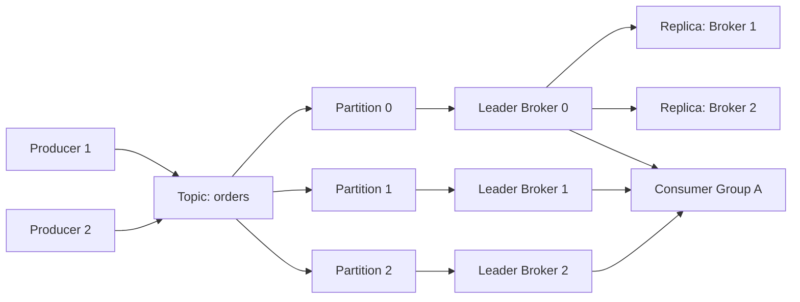
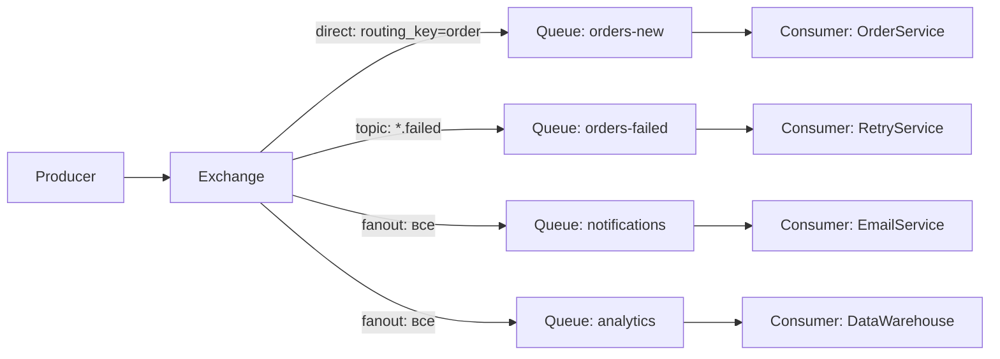
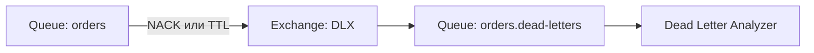
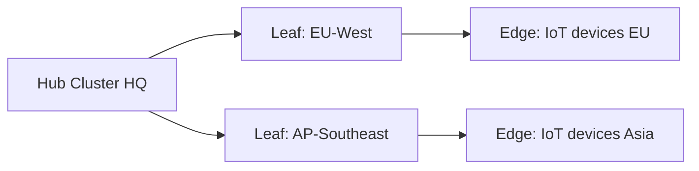
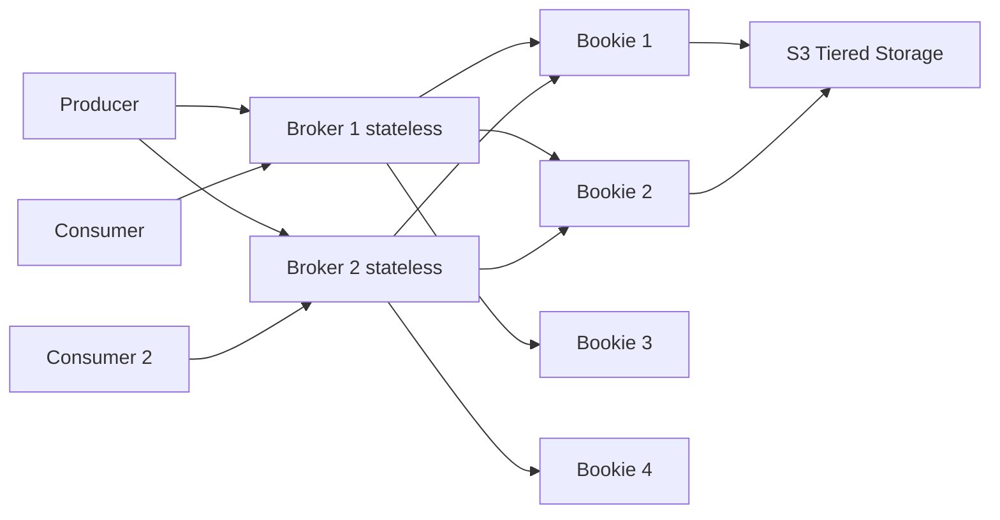
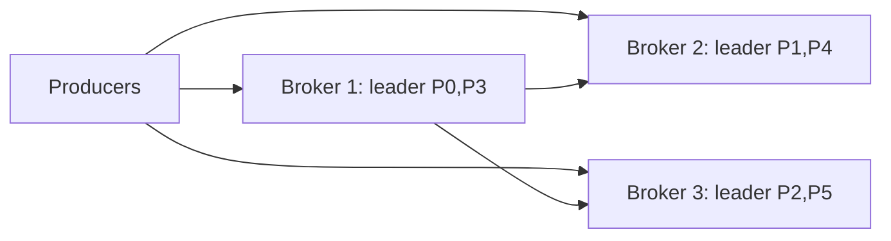
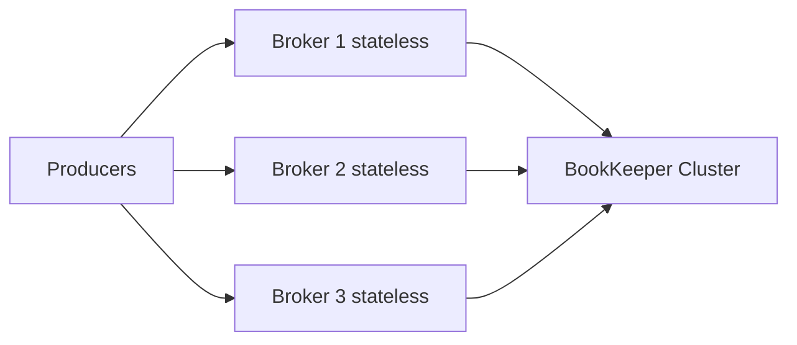
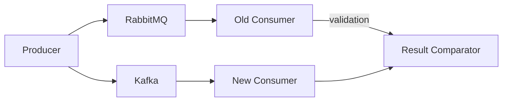

# Уровень 11: Подробное сравнение брокеров сообщений

## Введение: почему сравнение сложно

Выбор брокера — одно из самых важных архитектурных решений в распределённых системах. Проблема в том, что каждый брокер создавался для решения конкретных задач, и у каждого есть своя "зона комфорта".

📌 **Главная ошибка**: выбирать брокер по popularity или по тому, "что используют в Google/Netflix". Правильный вопрос — "какую проблему мы решаем?"

---

## 1. Apache Kafka: распределённый commit log

### Архитектурная идея

Kafka придумали в LinkedIn для сбора activity events (просмотры страниц, клики, действия пользователей). Ключевая инсайт: если хранить сообщения не как очередь (удалять после доставки), а как **лог** — можно читать их повторно.



### Как устроен log-сегмент

Каждая партиция — это набор **сегментов** (файлов на диске). Каждый сегмент = `.log` (данные) + `.index` (индекс offset → позиция) + `.timeindex` (индекс времени).

```
partition-0/
├── 00000000000000000000.log      # сегмент с offset 0
├── 00000000000000000000.index
├── 00000000000000000000.timeindex
├── 00000000000001234567.log      # следующий сегмент
└── ...
```

💡 **Ключевая оптимизация**: Kafka использует **page cache** Linux. Запись и чтение идут через page cache (ОЗУ), что даёт скорость оперативной памяти при последовательном доступе. Zero-copy (системный вызов `sendfile`) позволяет отправить данные из page cache напрямую в сетевой сокет, минуя копирование в user space.

### Производитель: acks и linger

```python
# Конфигурация producer для максимального throughput
producer = KafkaProducer(
    bootstrap_servers=['kafka:9092'],
    acks='all',          # ждать подтверждения от всех ISR
    linger_ms=5,         # ждать 5ms для накопления batch
    batch_size=65536,    # 64KB batch
    compression_type='lz4',
    max_in_flight_requests_per_connection=5,
)

# Конфигурация для минимальной latency
producer_fast = KafkaProducer(
    acks=1,              # только leader
    linger_ms=0,         # не ждать
    batch_size=1,
)
```

### Потребитель: Consumer Group и смещения

```python
from kafka import KafkaConsumer

consumer = KafkaConsumer(
    'orders',
    bootstrap_servers=['kafka:9092'],
    group_id='payment-service',       # Consumer Group ID
    auto_offset_reset='earliest',     # начать с начала, если нет offset
    enable_auto_commit=False,         # управлять offset вручную
    max_poll_records=500,
)

for message in consumer:
    process(message.value)
    consumer.commit()  # сохранить offset только после обработки
```

### ISR (In-Sync Replicas) и гарантии

**ISR** — список реплик, синхронизированных с лидером. При `acks=all` producer получает подтверждение только после того, как все реплики из ISR записали сообщение.

```
Leader: offset 1000 ✅
Replica 1: offset 1000 ✅  ← ISR
Replica 2: offset 998  ⚠️  ← отстаёт, может выпасть из ISR
Replica 3: OFFLINE     ❌  ← не в ISR
```

### KRaft: Kafka без ZooKeeper

С версии 3.x Kafka переходит на встроенный Raft-протокол (KRaft). Metadata-раздел `__cluster_metadata` хранится в самой Kafka.

✅ Преимущества KRaft: нет отдельного ZooKeeper кластера, быстрее failover, поддержка 10M+ партиций.

### Операционная сложность

- Минимальный production кластер: 3 брокера + (ранее ZooKeeper, теперь встроено)
- Monitoring: JMX метрики, Kafka Exporter для Prometheus
- Управление: Kafka Connect, Schema Registry, ksqlDB — отдельные сервисы
- Disk: SSD или RAID HDD с XFS/ext4

---

## 2. RabbitMQ: умный брокер с гибкой маршрутизацией

### Exchange routing model

RabbitMQ реализует модель **AMQP 0-9-1**: Producer → Exchange → Queue → Consumer.



Типы Exchange:
- **direct** — точное совпадение routing key
- **fanout** — отправить всем привязанным очередям
- **topic** — паттерн с `*` (одно слово) и `#` (несколько слов)
- **headers** — маршрутизация по заголовкам сообщения

```python
# Объявление exchange и queue
channel.exchange_declare('orders', 'topic', durable=True)
channel.queue_declare('orders-failed', durable=True)
channel.queue_bind(
    exchange='orders',
    queue='orders-failed',
    routing_key='*.failed',  # любой префикс, суффикс .failed
)

# Публикация
channel.basic_publish(
    exchange='orders',
    routing_key='payment.failed',
    body=json.dumps(event),
    properties=pika.BasicProperties(
        delivery_mode=2,  # persistent
        content_type='application/json',
    )
)
```

### Quorum Queues vs Classic Queues

**Classic Queues** — старый формат, master/mirror репликация. Не рекомендуются для production.

**Quorum Queues** — новый формат, основан на Raft. Рекомендуемый вариант для надёжности.

```python
channel.queue_declare(
    'payments',
    durable=True,
    arguments={
        'x-queue-type': 'quorum',         # Quorum Queue
        'x-dead-letter-exchange': 'dlx',  # Dead Letter Exchange
        'x-message-ttl': 3600000,         # TTL 1 час
    }
)
```

### Dead Letter Exchange (DLX)



### RPC pattern

RabbitMQ отлично подходит для request/reply (RPC):

```python
# Client: отправить запрос и ждать ответ
result_queue = channel.queue_declare('', exclusive=True)  # временная очередь
correlation_id = str(uuid.uuid4())

channel.basic_publish(
    exchange='',
    routing_key='rpc_queue',
    body=json.dumps(request),
    properties=pika.BasicProperties(
        reply_to=result_queue.method.queue,
        correlation_id=correlation_id,
    )
)
```

### Производительность

RabbitMQ написан на **Erlang** (OTP framework), что даёт:
- Лёгкие процессы (аналог goroutine), сотни тысяч одновременно
- Soft real-time с предсказуемой latency
- Hot code reload без остановки сервиса
- Встроенная отказоустойчивость (supervisor trees)

Узкие места:
- Classic queues: Mnesia (встроенная БД Erlang) — bottleneck при высоких нагрузках
- Quorum queues медленнее classic для малых нагрузок, но надёжнее
- Memory pressure: при заполнении heap broker начинает throttling

---

## 3. NATS: минимализм и скорость

### Core NATS: fire and forget

NATS разработан для низкой latency и простоты. Протокол текстовый:

```
# Publisher
PUB orders.created 45
{"orderId":"123","total":99.99}

# Subscriber
SUB orders.* 1
MSG orders.created 1 45
{"orderId":"123","total":99.99}
```

Subject-based routing с wildcards:
- `orders.*` — один уровень (`orders.created`, `orders.updated`)
- `orders.>` — все вложенные (`orders.items.added`, `orders.payment.failed`)

```go
nc, _ := nats.Connect("nats://localhost:4222")

// Subscribe
nc.Subscribe("orders.*", func(msg *nats.Msg) {
    fmt.Printf("Получено: %s\n", msg.Data)
    msg.Respond([]byte("ok")) // для request/reply
})

// Publish
nc.Publish("orders.created", []byte(`{"orderId":"123"}`))

// Request/Reply
reply, _ := nc.Request("orders.created", data, 2*time.Second)
```

### NATS JetStream: persistence поверх Core NATS

JetStream добавляет:
- **Streams** — персистентные логи с retention policy
- **Consumers** — именованные группы с offset tracking
- **Key-Value Store** — поверх streams
- **Object Store** — для больших файлов

```go
js, _ := nc.JetStream()

// Создать stream
js.AddStream(&nats.StreamConfig{
    Name:     "ORDERS",
    Subjects: []string{"orders.*"},
    MaxAge:   7 * 24 * time.Hour,
    Storage:  nats.FileStorage,
    Replicas: 3,
})

// Push-based consumer
js.Subscribe("orders.*", func(msg *nats.Msg) {
    process(msg)
    msg.Ack()
}, nats.Durable("payment-service"))

// Pull-based consumer
sub, _ := js.PullSubscribe("orders.*", "analytics")
msgs, _ := sub.Fetch(10, nats.MaxWait(time.Second))
```

### Leaf Nodes для geo-distribution



Leaf nodes — лёгкие расширения кластера для edge deployments. Сообщения могут течь между leaf и hub прозрачно.

---

## 4. Redis Streams: streaming без нового сервиса

### Модель данных

Redis Stream — это специальный тип данных в Redis. Каждый элемент имеет auto-generated ID формата `timestamp-sequence`.

```
XADD orders * orderId 123 status new total 99.99
# Возвращает: "1699123456789-0"

XADD orders * orderId 124 status new total 149.00
# Возвращает: "1699123456790-0"
```

### Consumer Groups

```bash
# Создать consumer group
XGROUP CREATE orders payment-group $ MKSTREAM

# Читать новые сообщения (> = только непрочитанные)
XREADGROUP GROUP payment-group consumer-1 COUNT 10 STREAMS orders >

# Подтвердить обработку
XACK orders payment-group 1699123456789-0

# Посмотреть pending (застрявшие) сообщения
XPENDING orders payment-group - + 10

# Перезаявить застрявшее сообщение (claim)
XCLAIM orders payment-group consumer-2 60000 1699123456789-0
```

### Ограничение размера стрима

```bash
# Добавить с автоматическим trimming (примерно 1000 элементов)
XADD orders MAXLEN ~ 1000 * field value

# Точный limit (без ~)
XADD orders MAXLEN 1000 * field value
```

### Когда Redis Streams — правильный выбор

✅ Redis уже используется как cache или session store
✅ Нагрузка умеренная (< 500K msg/s)
✅ Нужен consumer group с ACK
✅ Хочется избежать нового сервиса

❌ Нужен высокий throughput (> 1M msg/s)
❌ Данные критически важны (Redis in-memory может потерять при рестарте без RDB/AOF)
❌ Нужно хранить месяцами

---

## 5. Apache Pulsar: compute/storage separation

### Архитектурная уникальность

Pulsar разделяет брокеры (stateless compute) и хранилище (Apache BookKeeper). Это решает ключевую проблему Kafka: при добавлении брокера нужен rebalance партиций.



**Broker** — только маршрутизирует, не хранит данные.
**Bookie** — хранит ledgers (WAL-файлы). Каждый сегмент записывается в кворум bookies.

### BookKeeper и WAL

BookKeeper использует **Write-Ahead Log** (WAL):
1. Producer пишет в broker
2. Broker записывает в кворум bookies (обычно 2 из 3)
3. После подтверждения от кворума — ACK producer
4. Данные читаются из bookies, не из broker

```python
client = pulsar.Client('pulsar://localhost:6650')

# Producer с exactly-once (idempotent)
producer = client.create_producer(
    'persistent://public/default/orders',
    producer_name='order-producer',  # для деduplication
    send_timeout_millis=30000,
)

producer.send(
    b'{"orderId": "123"}',
    properties={'content-type': 'application/json'},
)

# Consumer с разными типами подписки
consumer = client.subscribe(
    'persistent://public/default/orders',
    subscription_name='payment-service',
    subscription_type=pulsar.ConsumerType.Shared,
)
```

### Типы подписок

```
Exclusive:   [P0] → Consumer A (только один consumer)
Shared:      [P0, P1, P2] → Consumer A, B, C (round-robin)
Failover:    [P0] → Consumer A (primary), Consumer B (резерв)
Key_Shared:  [key=user-1] → Consumer A всегда
             [key=user-2] → Consumer B всегда
```

### Tiered Storage

```yaml
# broker.conf
managedLedgerDefaultEnsembleSize: 2
managedLedgerDefaultWriteQuorum: 2
managedLedgerDefaultAckQuorum: 2

# Offload в S3 через 7 дней
managedLedgerOffloadDriver: aws-s3
s3ManagedLedgerOffloadBucket: pulsar-offload
managedLedgerOffloadThresholdInBytes: 10737418240  # 10GB
managedLedgerOffloadDeletionLagInMillis: 604800000 # 7 дней
```

---

## 6. Push vs Pull: глубокий анализ

### Pull (Kafka, Redis Streams, NATS JetStream pull)

Потребитель сам контролирует скорость чтения:

```
Consumer: "Дай мне следующие 100 сообщений" → Broker
Broker:   "Вот 100 сообщений"               → Consumer
Consumer: [обрабатывает]
Consumer: "Дай мне ещё 100 сообщений"       → Broker
```

✅ Естественный backpressure — если consumer не успевает, просто не запрашивает
✅ Consumer управляет своим состоянием (offset)
✅ Легко сделать batch processing
❌ Polling overhead — если сообщений нет, нужен long polling

### Push (RabbitMQ, NATS Core, Pulsar по умолчанию)

Брокер активно отправляет сообщения:

```
Broker: "Вот сообщение!" → Consumer (prefetch limit = 10)
Consumer: [обрабатывает]
Consumer: ACK → Broker
Broker: "Вот следующее!" → Consumer
```

✅ Малая latency — сообщение доставляется мгновенно
✅ Брокер знает о состоянии consumer
❌ Нужен prefetch limit для backpressure
❌ Риск перегрузки slow consumer

---

## 7. Ordering guarantees

### Глобальный порядок — иллюзия

В большинстве брокеров **глобального порядка нет** при масштабировании. Есть только **партиционный/локальный** порядок.

| Брокер | Гарантия порядка |
|---|---|
| Kafka | Строгий порядок внутри партиции |
| RabbitMQ | FIFO внутри очереди (при одном consumer) |
| NATS JetStream | Порядок внутри stream по subject |
| Redis Streams | Глобальный порядок (monotonic ID) |
| Pulsar | Порядок внутри партиции |

⚠️ **RabbitMQ + multiple consumers**: при prefetch > 1 и нескольких consumers порядок нарушается. Для строгого порядка нужна одна очередь + один consumer.

### Kafka key-based ordering

```python
# Все события для user-123 пойдут в одну партицию
producer.send(
    'user-events',
    key=b'user-123',  # hash(key) % num_partitions
    value=json.dumps(event).encode()
)
```

---

## 8. Persistence: как данные хранятся на диске

### Kafka: Log-structured storage

```
Sequential writes → OS page cache → periodic fsync
Чтение: page cache → zero-copy sendfile → network
```

Конфигурация:
```properties
log.flush.interval.messages=10000  # fsync каждые 10K сообщений
log.flush.interval.ms=1000         # или каждую секунду
log.retention.hours=168            # хранить 7 дней
log.segment.bytes=1073741824       # сегмент 1GB
```

### RabbitMQ: Mnesia + файлы очередей

Classic queues хранят данные в двух местах:
- Metadata (exchange, queue, binding) — в Mnesia (встроенная Erlang DB)
- Тела сообщений — в отдельных файлах (`msg_store_persistent`, `msg_store_transient`)

### Redis: RDB + AOF

```
RDB (snapshot): периодически сохраняет весь датасет
AOF (append-only file): каждая команда записывается
```

```bash
# redis.conf
save 900 1      # save если >= 1 изменение за 900 сек
save 300 10     # save если >= 10 изменений за 300 сек
appendonly yes  # включить AOF
appendfsync everysec  # fsync раз в секунду
```

### BookKeeper: WAL с кворумом

```
Producer → Broker → Journal (WAL, sequential write) → Ledger storage
                         ↓
                 Ack после кворума (W из E bookies)
```

E = Ensemble size (сколько bookies хранят данные)
W = Write quorum (сколько должны подтвердить)
A = Ack quorum (сколько нужно для ответа producer)

---

## 9. Scalability: как каждый брокер масштабируется

### Kafka



Масштабирование Kafka = увеличение количества **партиций** и **брокеров**. Партиция — единица параллелизма. Максимум consumers в группе = количество партиций.

❌ Уменьшить партиции нельзя. При добавлении брокера нужен rebalance.

### Pulsar (преимущество)



Brokers и BookKeeper масштабируются **независимо**. Добавить broker — мгновенно, без rebalance данных.

---

## 10. Протоколы

| Брокер | Протокол | Порт |
|---|---|---|
| Kafka | Kafka binary (TCP) | 9092 (plain), 9093 (TLS) |
| RabbitMQ | AMQP 0-9-1 | 5672 (plain), 5671 (TLS) |
| RabbitMQ | MQTT | 1883, 8883 |
| RabbitMQ | STOMP | 61613 |
| NATS | NATS text/binary | 4222 |
| Redis | RESP3 | 6379 |
| Pulsar | Pulsar binary | 6650, 6651 (TLS) |
| Pulsar | Kafka protocol compat | 9092 |

---

## 11. Клиентские экосистемы

### Kafka

```
Java (официальный): org.apache.kafka:kafka-clients
Python: confluent-kafka-python, kafka-python
Go: confluent-kafka-go, sarama, franz-go
Node.js: kafkajs
Rust: rdkafka
Schema Registry: Avro, Protobuf, JSON Schema
```

### RabbitMQ

```
Java: com.rabbitmq:amqp-client, Spring AMQP
Python: pika, aio-pika (asyncio)
Go: amqp091-go
Node.js: amqplib
.NET: RabbitMQ.Client
```

### NATS

```
Go: nats.go (официальный)
Python: nats-py
Java: jnats
Node.js: nats.js
Rust: nats-async
```

---

## 12. Managed Cloud offerings

| Брокер | Cloud Managed | Особенности |
|---|---|---|
| Kafka | Amazon MSK | AWS-native, IAM auth |
| Kafka | Confluent Cloud | Полная экосистема (Schema Registry, ksqlDB) |
| Kafka | Aiven for Kafka | Multi-cloud |
| RabbitMQ | CloudAMQP | Простой старт, бесплатный tier |
| RabbitMQ | Amazon MQ | AWS-managed |
| NATS | Synadia Cloud | Официальный NATS-as-a-Service |
| Redis | Redis Cloud | Redis Enterprise |
| Pulsar | StreamNative Cloud | Официальный Pulsar-as-a-Service |
| Pulsar | Aiven for Apache Pulsar | Multi-cloud |

---

## 13. Операционная сложность

### Простота деплоя (от простого к сложному)

```
Redis Streams     → docker run redis (уже есть)
NATS JetStream    → один бинарник, нет зависимостей
RabbitMQ          → docker или Helm, нужен кластер для HA
Kafka             → брокеры + KRaft metadata quorum
Apache Pulsar     → brokers + bookies + ZooKeeper/etcd
```

### Мониторинг

**Kafka**: JMX → kafka-exporter → Prometheus → Grafana
Ключевые метрики: `consumer_lag`, `under_replicated_partitions`, `request_latency_avg`

**RabbitMQ**: встроенный Management UI (порт 15672), prometheus plugin
Ключевые метрики: `queue_messages`, `deliver_rate`, `memory`, `disk_free`

**NATS**: `/varz`, `/connz`, NATS Surveyor
Ключевые метрики: `slow_consumers`, `msgs_in`, `msgs_out`

---

## 14. Стратегии миграции

### Kafka → Pulsar

Pulsar поддерживает **Kafka Protocol Compatibility** — Kafka-клиенты подключаются без изменений:

```yaml
# broker.conf
kafkaListeners: PLAINTEXT://0.0.0.0:9092
kafkaAdvertisedListeners: PLAINTEXT://pulsar-broker:9092
```

### RabbitMQ → Kafka

```
1. Двойная запись: producer пишет в RabbitMQ И Kafka
2. Постепенно переключаем consumers на Kafka
3. Отключаем RabbitMQ
```

### Zero-downtime migration pattern



---

## 15. Benchmark methodology

Публичные бенчмарки нужно читать критически:

⚠️ **Важные переменные**:
- Hardware (NVMe vs HDD, 10GbE vs 1GbE)
- Batch size (1 msg vs 1000 msg per batch)
- Message size (100B vs 1MB)
- Replication factor (1 vs 3)
- Durability settings (acks=1 vs acks=all, fsync или нет)
- Compression (none vs lz4 vs snappy)
- Network topology (одна машина vs датацентр vs cross-AZ)

### Как читать benchmark результаты

```
Заявлено: "RabbitMQ: 1M msg/s"
Вопросы:
  - message size? (100B или 1KB?)
  - persistent? (да/нет)
  - replication? (single node?)
  - producer confirms? (да/нет)
  - network? (localhost?)
```

### Сравнение в одинаковых условиях (3 реплики, 1KB, acks=all)

| Брокер | Throughput | P99 Latency |
|---|---|---|
| Kafka | 800K msg/s | 12ms |
| Pulsar | 750K msg/s | 10ms |
| NATS JetStream | 450K msg/s | 5ms |
| Redis Streams | 120K msg/s | 3ms |
| RabbitMQ (quorum) | 45K msg/s | 8ms |

---

## 16. Decision Matrix: полная таблица

| Требование | Kafka | RabbitMQ | NATS | Redis Streams | Pulsar |
|---|---|---|---|---|---|
| Throughput > 1M/s | ✅ | ❌ | ✅ (core) | ❌ | ✅ |
| Sub-ms latency | ❌ | ✅ | ✅ | ✅ | ❌ |
| Message replay | ✅ | ❌ | ✅ (JS) | ✅ | ✅ |
| Complex routing | ❌ | ✅✅ | ❌ | ❌ | ❌ |
| RPC pattern | ❌ | ✅✅ | ✅ | ❌ | ❌ |
| Priority queues | ❌ | ✅ | ❌ | ❌ | ❌ |
| Geo-replication | 🟡 | 🟡 | ✅ | ❌ | ✅✅ |
| Tiered storage | ❌ | ❌ | ❌ | ❌ | ✅✅ |
| Exactly-once | ✅ | ❌ | ✅ (JS) | ❌ | ✅ |
| Zero dependencies | ❌ | ❌ | ✅ | 🟡 | ❌ |
| Schema evolution | ✅✅ | 🟡 | 🟡 | ❌ | ✅ |
| Stream processing | ✅✅ | ❌ | ❌ | ❌ | 🟡 |
| IoT / edge | ❌ | ✅ | ✅✅ | ❌ | ❌ |
| Multi-tenant | 🟡 | 🟡 | 🟡 | ❌ | ✅✅ |

---

## 17. Когда что выбирать: финальная шпаргалка

**Apache Kafka** — первый выбор когда:
- Нужен высокий throughput (500K+ msg/s)
- Event sourcing или audit log
- Stream processing (Kafka Streams, Flink)
- Данные нужны месяцами
- Нужен replay

**RabbitMQ** — первый выбор когда:
- Сложная маршрутизация (topic patterns, headers)
- Work queues с priority
- RPC / request-reply
- Dead letter queues
- Небольшие объёмы, но богатая семантика

**NATS JetStream** — первый выбор когда:
- Минимальная операционная сложность
- IoT, edge, embedded
- Microservices mesh
- Нужны persistence + простота

**Redis Streams** — первый выбор когда:
- Redis уже в стеке
- Умеренный throughput (< 500K msg/s)
- Простая интеграция без нового сервиса
- Activity feeds, notifications

**Apache Pulsar** — первый выбор когда:
- Multi-region, geo-distribution из коробки
- Tiered storage (горячие/тёплые/холодные данные)
- Смешанные queue + streaming workloads
- Multi-tenant SaaS платформа
- Независимое масштабирование compute и storage
