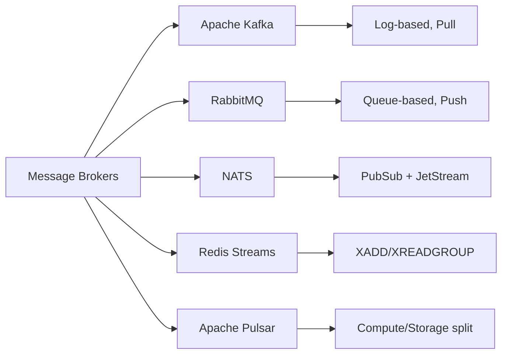
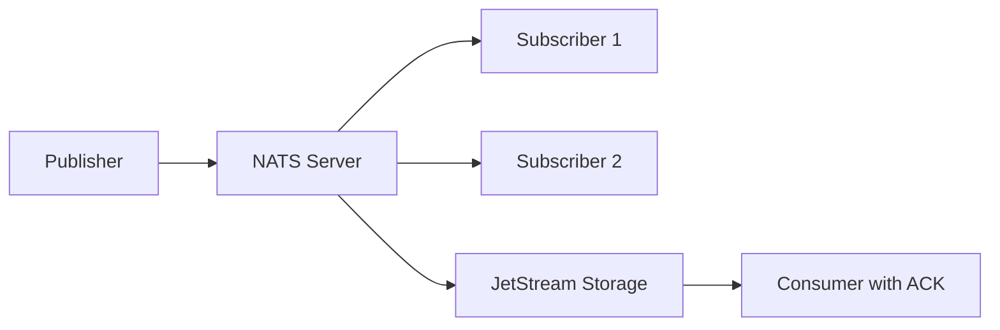
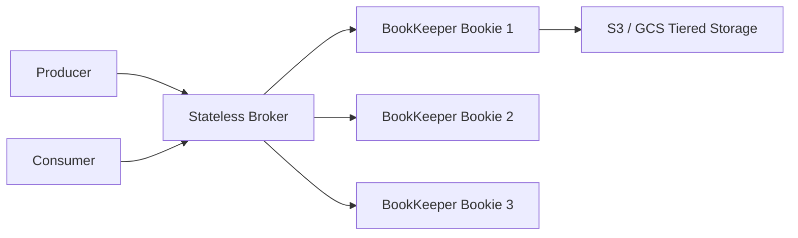

# Level 11: Message Broker Comparison

## Overview of five brokers

In the message broker ecosystem, there is no universal winner — each solves its task better than others. Understanding the differences between them is critical for making the right architectural choice.



---

## Kafka vs RabbitMQ: key architectural differences

### Storage model

**Kafka** is a **distributed commit log**. Messages are written to the end of the log and stored regardless of whether anyone has read them. Deletion happens by TTL (e.g., 7 days) or by size.

**RabbitMQ** is a **queue**. A message exists in the queue until the consumer acknowledges receipt (ACK). After ACK, the message is deleted.

```
Kafka:  [msg1][msg2][msg3][msg4][msg5] → log on disk, offset = 3
         ↑                             ↑
    old data                  new data

RabbitMQ: [msg3][msg4][msg5] → queue (msg1, msg2 already deleted after ACK)
              ↑
         consumer picks from here
```

### Push vs Pull

| | Kafka | RabbitMQ |
|---|---|---|
| Model | Pull — consumer reads itself | Push — broker sends |
| Broker role | "Dumb" broker, stores data | "Smart" broker, routes |
| Consumer role | "Smart" consumer, manages offset | "Dumb" consumer, receives by prefetch |
| Replay | ✅ Yes, just change offset | ❌ No, message is deleted |
| Backpressure | Consumer controls its own speed | Configured via prefetch count |

💡 **Analogy**: Kafka — like YouTube (video is stored, watch when you want, can rewind). RabbitMQ — like a phone call (conversation is not recorded, missed it — lost it).

---

## NATS and NATS JetStream

**Core NATS** — a minimalist pub/sub with fire-and-forget model:
- Latency < 1ms
- At-most-once (if subscriber is offline — message is lost)
- Written in Go, single binary with no dependencies

**NATS JetStream** — an overlay on Core NATS with persistence:
- At-least-once and exactly-once
- Streams (persistent logs), Consumer groups
- Key-value store and Object store on top of streams



📌 **When to choose NATS**: IoT, edge deployments, control plane, services with minimal infrastructure.

---

## Redis Streams

Redis Streams is an append-only log inside Redis, similar to Kafka but simpler:

| Command | Purpose |
|---|---|
| `XADD stream * field val` | Add a message |
| `XREAD COUNT 10 STREAMS s 0` | Read from the beginning |
| `XREADGROUP GROUP g c STREAMS s >` | Consumer group, unread only |
| `XACK stream group id` | Acknowledge processing |
| `XPENDING stream group` | Pending (unACKed) messages |

✅ **Plus**: if Redis is already in the stack — no need for a separate service.
⚠️ **Minus**: single-threaded writes, MAXLEN for size limiting.

---

## Apache Pulsar: tiered storage and segments

Pulsar separates **compute** (stateless brokers) and **storage** (Apache BookKeeper):



**Tiered storage**: hot data — in BookKeeper (fast, expensive), cold data automatically moves to S3/GCS (slow, cheap).

Pulsar subscription types:
- **Exclusive** — one consumer, strict ordering
- **Shared** — round-robin across multiple consumers
- **Failover** — one active + standby
- **Key_Shared** — by key to a specific consumer

---

## Decision Matrix: when to choose what

| Criterion | Kafka | RabbitMQ | NATS | Redis Streams | Pulsar |
|---|---|---|---|---|---|
| Throughput | ★★★★★ | ★★★ | ★★★★ | ★★★ | ★★★★ |
| Latency | ★★★ | ★★★★ | ★★★★★ | ★★★★★ | ★★★★ |
| Replay | ✅ | ❌ | ✅ (JS) | ✅ | ✅ |
| Routing | ❌ | ✅✅ | ❌ | ❌ | ❌ |
| Ops complexity | High | Medium | Low | Low | Very high |
| Tiered storage | ❌ | ❌ | ❌ | ❌ | ✅ |
| Geo-replication | Complex | MirrorMaker | Leaf nodes | ❌ | ✅ |

**Selection rule**:
- Need high throughput + replay → **Kafka**
- Complex routing, RPC, work queues → **RabbitMQ**
- Minimal infrastructure, IoT → **NATS JetStream**
- Redis already exists → **Redis Streams**
- Geo-distribution, tiered storage → **Apache Pulsar**

---

## Benchmark: order of magnitude

| Broker | Throughput (msg/s) | P99 Latency |
|---|---|---|
| NATS (Core) | 10-20M | < 0.5ms |
| Kafka | 1-2M | 5-15ms |
| Redis Streams | 500K-1M | < 1ms |
| RabbitMQ | 100-300K | 1-5ms |
| Pulsar | 1M+ | 5-15ms |

⚠️ Actual numbers depend on hardware, batch size, replication factor, and configuration.
