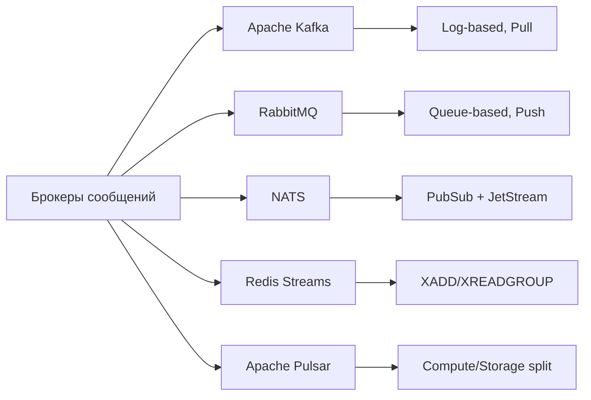
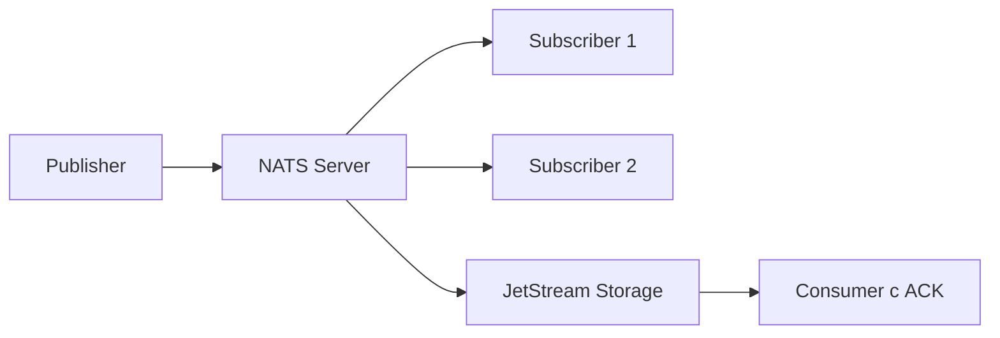
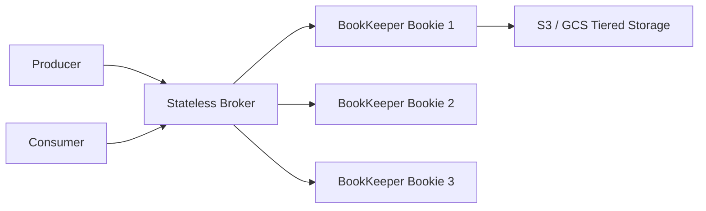

# Уровень 11: Сравнение брокеров сообщений

## Обзор пяти брокеров

В экосистеме брокеров сообщений нет универсального победителя — каждый решает свою задачу лучше других. Понимать различия между ними критически важно для правильного архитектурного выбора.



---

## Kafka vs RabbitMQ: ключевые архитектурные отличия

### Модель хранения

**Kafka** — это **распределённый commit log**. Сообщения записываются в конец лога и хранятся независимо от того, прочитал их кто-то или нет. Удаление происходит по TTL (например, 7 дней) или по размеру.

**RabbitMQ** — это **очередь**. Сообщение существует в очереди до тех пор, пока consumer не подтвердит получение (ACK). После ACK сообщение удаляется.

```
Kafka:  [msg1][msg2][msg3][msg4][msg5] → лог на диске, offset = 3
         ↑                             ↑
    старые данные           новые данные

RabbitMQ: [msg3][msg4][msg5] → очередь (msg1, msg2 уже удалены после ACK)
              ↑
         consumer забирает отсюда
```

### Push vs Pull

| | Kafka | RabbitMQ |
|---|---|---|
| Модель | Pull — consumer сам читает | Push — брокер отправляет |
| Роль брокера | "Тупой" брокер, хранит данные | "Умный" брокер, маршрутизирует |
| Роль consumer | "Умный" consumer, управляет offset | "Тупой" consumer, получает по prefetch |
| Replay | ✅ Да, достаточно изменить offset | ❌ Нет, сообщение удалено |
| Backpressure | Потребитель сам контролирует скорость | Настраивается через prefetch count |

💡 **Аналогия**: Kafka — как YouTube (видео хранится, смотришь когда хочешь, можно перемотать). RabbitMQ — как телефонный звонок (разговор не записывается, пропустил — потерял).

---

## NATS и NATS JetStream

**Core NATS** — минималистичный pub/sub с моделью fire-and-forget:
- Latency < 1ms
- At-most-once (если subscriber offline — сообщение теряется)
- Написан на Go, один бинарный файл без зависимостей

**NATS JetStream** — надстройка над Core NATS с persistence:
- At-least-once и exactly-once
- Streams (персистентные логи), Consumer groups
- Key-value store и Object store поверх streams



📌 **Когда выбирать NATS**: IoT, edge deployments, control plane, сервисы с минимальной инфраструктурой.

---

## Redis Streams

Redis Streams — это append-only лог внутри Redis, похожий на Kafka но попроще:

| Команда | Назначение |
|---|---|
| `XADD stream * field val` | Добавить сообщение |
| `XREAD COUNT 10 STREAMS s 0` | Читать с начала |
| `XREADGROUP GROUP g c STREAMS s >` | Consumer group, непрочитанные |
| `XACK stream group id` | Подтвердить обработку |
| `XPENDING stream group` | Зависшие (unACKed) сообщения |

✅ **Плюс**: если Redis уже в стеке — не нужен отдельный сервис.
⚠️ **Минус**: single-threaded writes, MAXLEN для ограничения размера.

---

## Apache Pulsar: tiered storage и segments

Pulsar разделяет **compute** (stateless brokers) и **storage** (Apache BookKeeper):



**Tiered storage**: горячие данные — в BookKeeper (быстро, дорого), холодные автоматически переезжают в S3/GCS (медленно, дёшево).

Типы подписок Pulsar:
- **Exclusive** — один consumer, строгий порядок
- **Shared** — round-robin по нескольким consumers
- **Failover** — один активный + резервный
- **Key_Shared** — по ключу к конкретному consumer

---

## Decision Matrix: когда что выбирать

| Критерий | Kafka | RabbitMQ | NATS | Redis Streams | Pulsar |
|---|---|---|---|---|---|
| Throughput | ★★★★★ | ★★★ | ★★★★ | ★★★ | ★★★★ |
| Latency | ★★★ | ★★★★ | ★★★★★ | ★★★★★ | ★★★★ |
| Replay | ✅ | ❌ | ✅ (JS) | ✅ | ✅ |
| Routing | ❌ | ✅✅ | ❌ | ❌ | ❌ |
| Ops complexity | Высокая | Средняя | Низкая | Низкая | Очень высокая |
| Tiered storage | ❌ | ❌ | ❌ | ❌ | ✅ |
| Geo-replication | Сложно | MirrorMaker | Leaf nodes | ❌ | ✅ |

**Правило выбора**:
- Нужен высокий throughput + replay → **Kafka**
- Сложная маршрутизация, RPC, work queues → **RabbitMQ**
- Минимум инфраструктуры, IoT → **NATS JetStream**
- Redis уже есть → **Redis Streams**
- Geo-distribution, tiered storage → **Apache Pulsar**

---

## Benchmark: порядок цифр

| Брокер | Throughput (msg/s) | P99 Latency |
|---|---|---|
| NATS (Core) | 10-20M | < 0.5ms |
| Kafka | 1-2M | 5-15ms |
| Redis Streams | 500K-1M | < 1ms |
| RabbitMQ | 100-300K | 1-5ms |
| Pulsar | 1M+ | 5-15ms |

⚠️ Реальные цифры зависят от hardware, batch size, replication factor и конфигурации.
