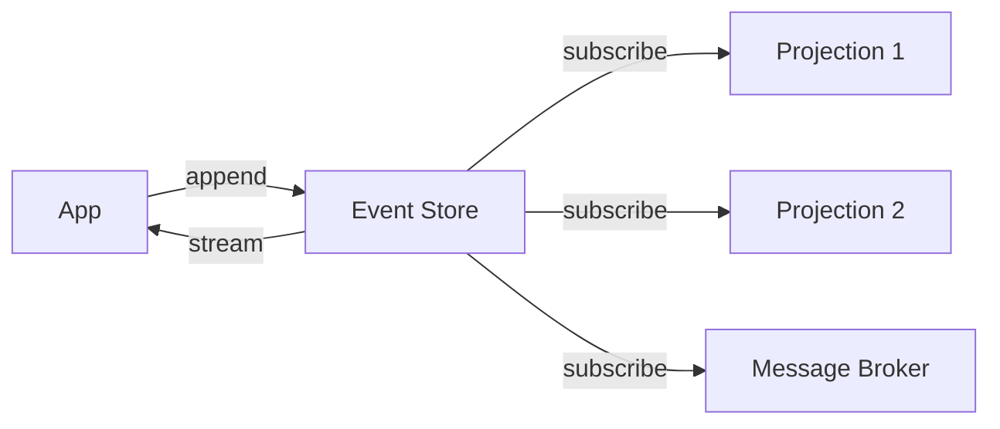
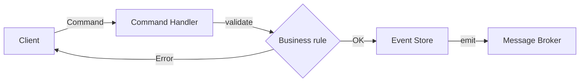
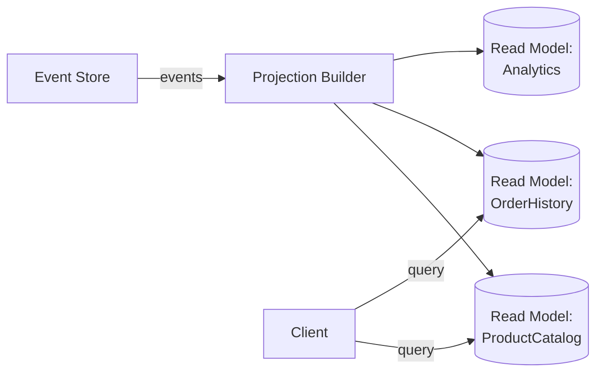
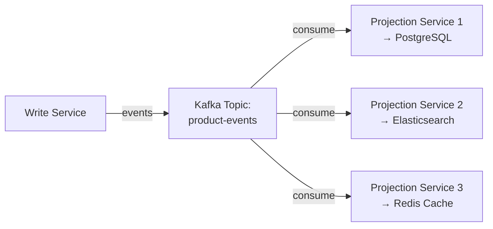
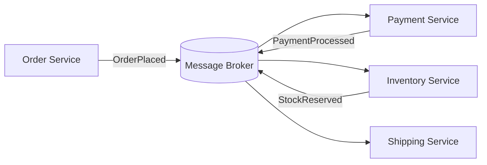
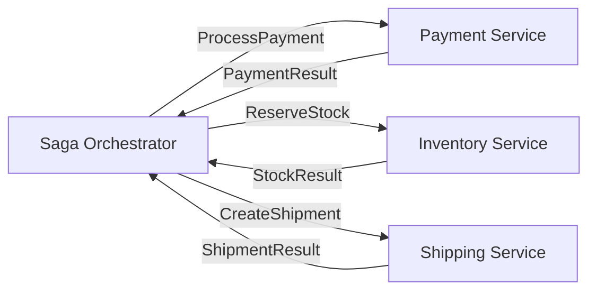

# Level 12: Event-Driven Architecture — Detailed Theory

## Why EDA?

Imagine an online store. A customer places an order — money needs to be deducted, product reserved, shipment created, email sent. If done synchronously in one transaction — any failure rolls back everything, and services are tightly coupled.

**Event-Driven Architecture** breaks this coupling: each step publishes an event, the next step reacts to it. Services no longer know about each other — they only know about events.

Analogy: it's the difference between a phone call (synchronous — both must be available) and email (asynchronous — sent, recipient will respond when they can).

---

## Part 1: Domain Events

Domain Event — a fact that happened in the business domain. Three key properties:

1. **Past tense** — `OrderPlaced`, not `PlaceOrder`. It already happened.
2. **Immutability** — an event cannot be edited. Only add a new one.
3. **Self-sufficiency** — the event contains everything needed to react to it.

```ts
// ❌ Anemic event — receiver needs to request data again
interface OrderPlaced {
  type: 'OrderPlaced'
  orderId: string
}

// ✅ Enriched event — Event-Carried State Transfer
interface OrderPlaced {
  // Metadata
  eventId: string         // UUID, idempotency
  type: 'OrderPlaced'
  occurredAt: number      // milliseconds since epoch
  aggregateId: string     // Aggregate ID
  aggregateVersion: number

  // Payload
  payload: {
    orderId: string
    customerId: string
    items: Array<{ productId: string; qty: number; price: number }>
    total: number
    currency: string
  }
}
```

### Event Notification vs Event-Carried State Transfer

Two event design styles:

**Event Notification** — minimal payload, receiver requests details itself:

```ts
// Notification event
{ type: 'OrderPlaced', orderId: 'ORD-001' }

// Receiver makes HTTP request:
const order = await orderService.getOrder('ORD-001')
```

Pro: small events. Con: additional network call, coupling to API.

**Event-Carried State Transfer** — everything needed in payload:

```ts
// Event with data
{ type: 'OrderPlaced', orderId: 'ORD-001', items: [...], total: 150 }

// Receiver works only with the event, no requests needed
```

Pro: receiver autonomy. Con: large events, data duplication.

📌 **Rule:** use ECST for events read by multiple consumers. Notification is suitable for point-to-point integrations.

---

## Part 2: Event Sourcing

### The idea

Instead of storing current state (`users` table with `email`, `name`, `updated_at`) — store a log of everything that happened:

```
AccountCreated    → { accountId: 'ACC-1', owner: 'Alice', balance: 0 }
MoneyDeposited    → { accountId: 'ACC-1', amount: 1000, source: 'salary' }
MoneyWithdrawn    → { accountId: 'ACC-1', amount: 200, reason: 'rent' }
MoneyDeposited    → { accountId: 'ACC-1', amount: 500, source: 'freelance' }
```

Current state — `reduce` over all events:
```ts
const state = events.reduce(applyEvent, null)
// state.balance = 1300
```

### Event Store

Event Store — a specialized DB for events. Main difference from a regular DB: append-only, no UPDATE/DELETE.



Implementations:
- **EventStoreDB** (Greg Young) — specialized ES DB, events as a first-class concept
- **Axon Server** — for Axon Framework (Java)
- **PostgreSQL** — `events` table with `aggregate_id`, `version`, `event_type`, `payload` (JSONB)
- **Kafka** — as Event Store with retention policy (compacted topics or infinite retention)

PostgreSQL schema example:
```sql
CREATE TABLE events (
  id           UUID PRIMARY KEY DEFAULT gen_random_uuid(),
  aggregate_id UUID NOT NULL,
  aggregate_type VARCHAR(100) NOT NULL,
  event_type   VARCHAR(100) NOT NULL,
  version      INTEGER NOT NULL,
  payload      JSONB NOT NULL,
  occurred_at  TIMESTAMPTZ NOT NULL DEFAULT NOW(),
  UNIQUE (aggregate_id, version)  -- optimistic lock
);
```

### Aggregate and state reconstruction

Aggregate — the boundary of transactional consistency. In DDD this is the Aggregate Root.

```ts
class Order {
  private uncommittedEvents: DomainEvent[] = []

  // State
  private id: string = ''
  private items: OrderItem[] = []
  private status: 'pending' | 'paid' | 'shipped' = 'pending'

  // Command processing — can throw an exception (business rule)
  addItem(item: OrderItem): void {
    if (this.status !== 'pending') {
      throw new Error('Cannot add items to non-pending order')
    }
    // Create event but DON'T change state directly
    this.apply(new ItemAdded({ orderId: this.id, item }))
  }

  // Apply event to state
  private apply(event: DomainEvent): void {
    this.uncommittedEvents.push(event)
    this.when(event)
  }

  // State mutation — only through when()
  private when(event: DomainEvent): void {
    switch (event.type) {
      case 'ItemAdded':
        this.items.push(event.payload.item)
        break
    }
  }

  // Restore from event history
  static fromHistory(events: DomainEvent[]): Order {
    const order = new Order()
    events.forEach(e => order.when(e))
    return order
  }

  getUncommittedEvents(): DomainEvent[] {
    return this.uncommittedEvents
  }
}
```

### Snapshots

Problem: if an aggregate has 10,000 events, state reconstruction is expensive.

Solution — snapshots: periodically save current state + version number.

```ts
interface Snapshot<T> {
  aggregateId: string
  version: number      // from which event the snapshot is
  state: T
  takenAt: number
}

async function loadAggregate(id: string): Promise<Order> {
  // 1. Get the latest snapshot
  const snapshot = await snapshotStore.getLatest(id)

  // 2. Load only events AFTER the snapshot
  const events = await eventStore.getFrom(id, snapshot?.version ?? 0)

  // 3. Apply events to snapshot state
  const order = snapshot
    ? Order.fromSnapshot(snapshot.state)
    : new Order()
  events.forEach(e => order.applyFromHistory(e))

  return order
}
```

When to create a snapshot: every N events (e.g., every 50), or by time.

### Upcasting: event schema evolution

Problem: event schemas change over time. Old events are stored in v1 format, new code expects v2.

**Upcasting** — transforming old events to the new format when reading:

```ts
interface EventV1 {
  type: 'UserRegistered'
  userId: string
  email: string
}

interface EventV2 {
  type: 'UserRegistered'
  version: 2
  userId: string
  email: string
  registrationSource: 'web' | 'mobile' | 'api'  // New field
}

// Upcaster: applied when loading old events
function upcastUserRegistered(event: EventV1): EventV2 {
  return {
    ...event,
    version: 2,
    registrationSource: 'web',  // Reasonable default
  }
}
```

---

## Part 3: CQRS

### Principle

Bertrand Meyer (Command-Query Separation): a method either changes state or returns data — but not both.

CQRS extends this to the architecture level:

```
Command → changes state → returns void or ID
Query → doesn't change state → returns data
```

### Write Side



Command structure:
```ts
interface CreateOrderCommand {
  // Identification
  commandId: string     // for idempotency
  type: 'CreateOrder'
  issuedAt: number

  // Data
  customerId: string
  items: Array<{ productId: string; qty: number }>
}

// Command handler — returns only ID, not data
async function handleCreateOrder(cmd: CreateOrderCommand): Promise<string> {
  // Idempotency: if we already processed this commandId — return orderId
  const existing = await idempotencyStore.get(cmd.commandId)
  if (existing) return existing.orderId

  // Load aggregate (or create new)
  const orderId = generateId()
  const order = new Order(orderId)
  order.create(cmd.customerId, cmd.items)

  // Save events
  await eventStore.save(order.getUncommittedEvents())
  await idempotencyStore.set(cmd.commandId, { orderId })

  return orderId
}
```

### Read Side: Projections

A projection is a read model built from events. It can be denormalized, optimized for a specific query.



Projection types:

**In-memory** — rebuilt on startup, suitable for small aggregates:
```ts
class ProductCatalogProjection {
  private catalog = new Map<string, CatalogItem>()

  handle(event: DomainEvent): void {
    switch (event.type) {
      case 'ProductCreated':
        this.catalog.set(event.productId, { ...event.payload, available: true })
        break
      case 'PriceUpdated':
        this.catalog.get(event.productId)!.price = event.price
        break
      case 'ProductDeactivated':
        this.catalog.delete(event.productId)
        break
    }
  }

  query(filter: CatalogFilter): CatalogItem[] {
    return Array.from(this.catalog.values()).filter(/* ... */)
  }
}
```

**Persistent** — stored in DB (PostgreSQL, Elasticsearch, Redis), survives restarts:
```sql
-- Read model table for catalog
CREATE TABLE product_catalog (
  product_id VARCHAR PRIMARY KEY,
  name VARCHAR NOT NULL,
  price DECIMAL NOT NULL,
  available BOOLEAN NOT NULL,
  category VARCHAR,
  -- Denormalized fields for fast search
  search_vector TSVECTOR,
  last_updated TIMESTAMPTZ
);
```

### CQRS with Kafka

Kafka is ideal for synchronizing write and read sides:



```ts
// Producer: publish event after save
await eventStore.append(event)
await kafka.producer().send({
  topic: 'product-events',
  messages: [{ key: event.aggregateId, value: JSON.stringify(event) }],
})

// Consumer: update read model
await kafka.consumer().run({
  eachMessage: async ({ message }) => {
    const event = JSON.parse(message.value!.toString())
    await catalogProjection.handle(event)
  },
})
```

### Materialized Views

In PostgreSQL, materialized views can be used as read models:

```sql
-- Materialized view for catalog
CREATE MATERIALIZED VIEW product_catalog AS
SELECT
  e.payload->>'productId' AS product_id,
  MAX(CASE WHEN e.event_type = 'ProductCreated' THEN e.payload->>'name' END) AS name,
  COALESCE(
    (SELECT (e2.payload->>'price')::DECIMAL
     FROM events e2
     WHERE e2.aggregate_id = e.aggregate_id
       AND e2.event_type = 'PriceUpdated'
     ORDER BY e2.version DESC LIMIT 1),
    (e.payload->>'price')::DECIMAL
  ) AS price
FROM events e
WHERE e.event_type = 'ProductCreated'
GROUP BY e.aggregate_id, e.payload->>'productId';

-- Refresh (periodically or by trigger):
REFRESH MATERIALIZED VIEW CONCURRENTLY product_catalog;
```

### Eventually Consistent Reads

⚠️ An important consequence of CQRS: after writing a command, the read model is not yet updated. This is eventual consistency.

```ts
// User created an order
const orderId = await commandBus.send(new CreateOrderCommand(...))

// Immediate read may not find the order:
const order = await orderQuery.getById(orderId)
// order === null  ← projection not yet updated!
```

Strategies:
1. **Optimistic UI** — show the result before confirmation from the read side
2. **Polling** — request with retry until it appears in the read model
3. **WebSocket/SSE** — server pushes the read model update to the client
4. **Synchronous projection** — read model updated in the same transaction (loses CQRS benefits but is simple)

---

## Part 4: Event Storming

Event Storming — a workshop for collaborative event system design. Created by Alberto Brandolini.

Format: team (developers + domain experts) for several hours with paper sticky notes.

Sticky note colors:
- **Orange** — Domain Events ("what happened")
- **Blue** — Commands ("what initiates the event")
- **Yellow** — Aggregates ("who processes commands")
- **Purple** — Policies ("if X happened → do Y")
- **Red** — Hot spots / open questions

```
[PlaceOrder] → {Order} → OrderPlaced (orange)
                              ↓ (policy: if OrderPlaced → process payment)
[ProcessPayment] → {Payment} → PaymentProcessed (orange)
                                    ↓ (policy: if PaymentProcessed → reserve stock)
[ReserveStock] → {Inventory} → StockReserved (orange)
```

---

## Part 5: Choreography vs Orchestration

### Choreography

Services communicate through events without a central coordinator. Each service knows: "if I see event X — I do Y and publish Z".



Implementation via RabbitMQ:
```ts
// Payment Service — subscribes to OrderPlaced
rabbitChannel.consume('order.placed', async (msg) => {
  const order = JSON.parse(msg.content.toString())
  const result = await paymentGateway.charge(order.customerId, order.total)

  // Publishes result
  await rabbitChannel.publish(
    'domain-events',
    'payment.processed',
    Buffer.from(JSON.stringify({ orderId: order.orderId, transactionId: result.id }))
  )
  rabbitChannel.ack(msg)
})
```

**Choreography pros:**
- No single point of failure
- Services are fully autonomous — can add new ones without changing existing ones
- Loose coupling — services know about events, not about each other
- Horizontal scaling of each service independently

**Choreography cons:**
- Hard to understand the full flow — it's "dissolved" across multiple services
- Compensating transactions are complex — need to add an event to cancel each step
- Cyclic event dependencies can lead to infinite loops
- Debugging requires distributed tracing

### Orchestration

A central component (Saga Orchestrator / Process Manager) explicitly manages the sequence of steps.



Implementation (simplified):
```ts
class OrderSagaOrchestrator {
  async execute(orderId: string): Promise<void> {
    const order = await orderRepo.findById(orderId)

    // Step 1: payment
    try {
      const payment = await paymentService.processPayment({
        customerId: order.customerId,
        amount: order.total,
      })
      await saga.recordStep('payment', payment.transactionId)
    } catch (err) {
      // Compensation: cancel order
      await orderService.cancelOrder(orderId, 'Payment failed')
      return
    }

    // Step 2: stock reservation
    try {
      await inventoryService.reserveStock(order.items)
      await saga.recordStep('inventory', 'reserved')
    } catch (err) {
      // Compensation: refund
      await paymentService.refund(saga.getStep('payment').data)
      await orderService.cancelOrder(orderId, 'Stock unavailable')
      return
    }

    // Step 3: shipping
    await shippingService.createShipment(orderId)
    await saga.complete()
  }
}
```

**Orchestration pros:**
- Entire flow visible in one place — easy debugging
- Compensation is straightforward — orchestrator knows all steps and can rollback in reverse order
- Easy to add retry logic, timeouts, conditional branches
- Tools (Temporal, Conductor) provide visualization out of the box

**Orchestration cons:**
- Orchestrator is a bottleneck and single point of failure (solved by clustering)
- Services know about the orchestrator — coupling
- Orchestrator can bloat into a "god component"

### Orchestration tools

**Temporal** (open source, Go/Java/TypeScript SDK):
```ts
// Workflow — this is the orchestrator
export async function orderFulfillmentWorkflow(orderId: string): Promise<void> {
  const payment = await executeActivity(processPayment, { orderId })
  const stock = await executeActivity(reserveStock, { orderId })
  await executeActivity(createShipment, { orderId, paymentId: payment.id, stockId: stock.id })
}
// Temporal automatically ensures durability, retry, timeout, versioning
```

**Netflix Conductor** — workflow engine based on JSON definitions, visual editor.

**AWS Step Functions** — managed service for orchestration in AWS.

---

## Part 6: Projection Patterns

### Catch-up Subscription

A projection can be rebuilt from scratch at any time — just replay all events from the Event Store:

```ts
async function rebuildProjection(): Promise<void> {
  await db.truncate('product_catalog')  // clear read model

  let position = 0
  while (true) {
    const events = await eventStore.readAll({ from: position, limit: 500 })
    if (events.length === 0) break

    for (const event of events) {
      await catalogProjection.handle(event)
    }
    position = events[events.length - 1].globalPosition + 1
  }
}
```

This is a powerful property: if the read model is corrupted or a new one is needed — just recreate. Events are immutable.

### Live + Catch-up

```ts
async function startProjection(): Promise<void> {
  // 1. Read lagging events up to current position
  const lastProcessed = await checkpointStore.get('catalog')
  await catchUp(lastProcessed)

  // 2. Switch to live subscription
  await eventStore.subscribe('catalog', async (event) => {
    await catalogProjection.handle(event)
    await checkpointStore.save('catalog', event.position)
  })
}
```

---

## ⚠️ Common beginner mistakes

### Mistake 1: events as commands

```ts
// ❌ "Event" with present tense verb — this is a command
{ type: 'SendEmail', to: 'user@example.com' }

// ✅ Event — fact in past tense
{ type: 'EmailSent', to: 'user@example.com', sentAt: Date.now() }
```

**Why it's a problem:** the "event" handler cannot refuse to process it — this violates the autonomy principle.

### Mistake 2: large aggregates

```ts
// ❌ Order contains everything: shipping, payment, customer
class Order {
  items: OrderItem[]
  customer: CustomerDetails
  payment: PaymentDetails
  shipment: ShipmentDetails
  reviews: Review[]
}

// ✅ Order — only what's needed for order invariants
class Order {
  items: OrderItem[]
  status: OrderStatus
  total: Money
  Everything else — in its own aggregates
}
```

**Why it's a problem:** huge aggregates → huge event streams → slow reconstruction, high chance of concurrent conflicts.

### Mistake 3: ignoring eventual consistency

```ts
// ❌ Read from read model immediately after command
await commandBus.send(new CreateProductCommand({ name: 'Widget' }))
const products = await productQuery.getAll()  // May not contain the new product!
renderProductList(products)  // User sees stale data

// ✅ Optimistic UI + confirmation via subscription
await commandBus.send(new CreateProductCommand({ name: 'Widget', tempId: 'tmp-1' }))
showOptimisticItem('tmp-1', 'Widget')  // Show immediately

// Confirm via WebSocket when projection updates
ws.on('product.created', ({ productId }) => {
  confirmOptimisticItem('tmp-1', productId)
})
```

### Mistake 4: CQRS everywhere

CQRS adds significant complexity: separate models, eventual consistency, infrastructure complexity.

```
CQRS is NOT needed if:
- Read and write load is roughly equal
- Read model == Write model (CRUD without complex logic)
- Team is small (up to 2-3 people)
- No clear performance requirements for the read side

CQRS IS needed if:
- Read >> Write load (typical for e-commerce)
- Fundamentally different read models needed (catalog, search, analytics)
- Event Sourcing is already in use
- Read side scaling is independent from write side
```

### Mistake 5: choreography without observability

```ts
// ❌ Publishing events without tracing
await broker.publish('order.placed', { orderId })

// ✅ Add correlation ID for distributed tracing
await broker.publish('order.placed', {
  orderId,
  correlationId: request.headers['x-correlation-id'] ?? generateId(),
  causationId: command.commandId,
  traceContext: opentelemetry.propagator.inject(),
})
```

Without `correlationId`, tracking an event's path through 5 services is impossible. Use OpenTelemetry + Jaeger/Zipkin.

---

## When to use what

| Pattern | When to apply |
|---|---|
| Domain Events | Always, as soon as there's business logic |
| Event Sourcing | Audit is critical; time-travel needed; finance, healthcare |
| CQRS | High read/write asymmetry; different read models needed |
| Choreography | Loosely coupled services; simple linear flows; flexibility over control |
| Orchestration | Complex transactions with compensation; long sagas; transparency over autonomy |

📌 **Practical advice:** start with Domain Events + choreography. Add CQRS, Event Sourcing, and orchestration only when specific problems arise that they solve.
