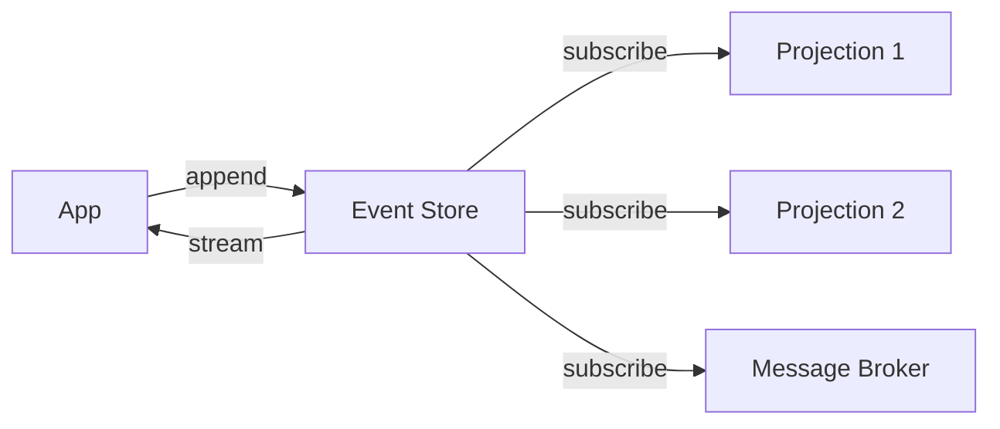
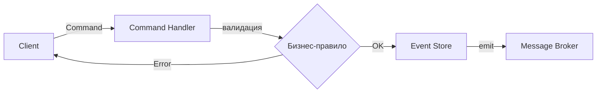
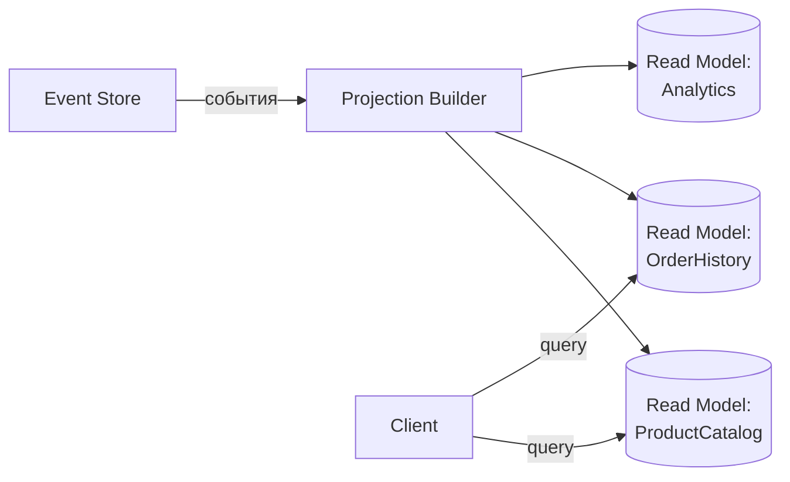
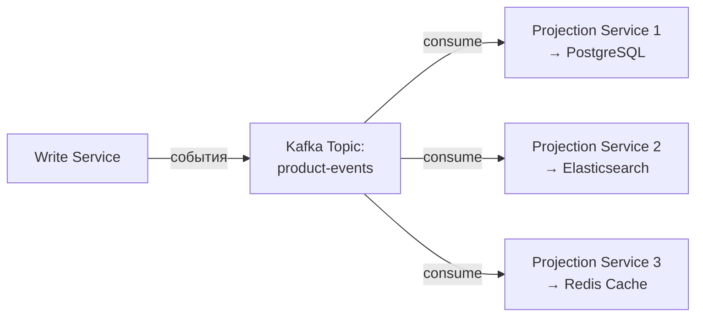
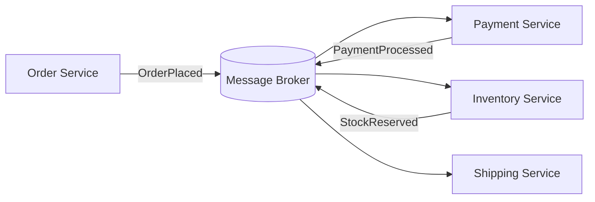
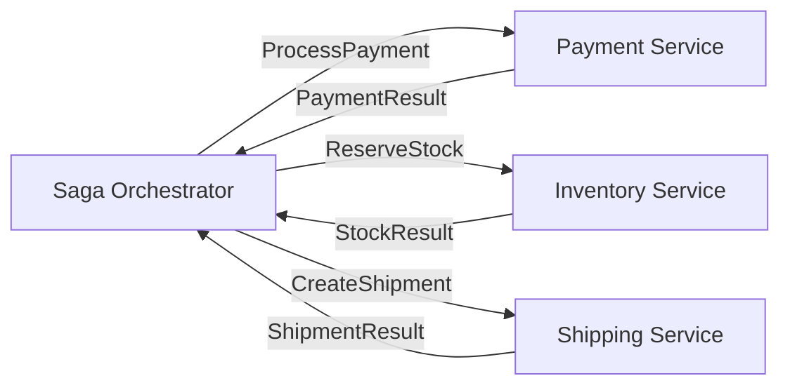

# Уровень 12: Event-Driven Architecture — Подробная теория

## Почему EDA?

Представьте интернет-магазин. Покупатель оформил заказ — нужно списать деньги, зарезервировать товар, создать отгрузку, отправить email. Если делать всё синхронно в одной транзакции — любой сбой роллбэкает всё, и сервисы жёстко связаны.

**Event-Driven Architecture** разрывает эту связь: каждый шаг публикует событие, следующий шаг реагирует на него. Сервисы больше не знают друг о друге — они знают только о событиях.

Аналогия: это как разница между телефонным звонком (синхронно — оба должны быть доступны) и электронной почтой (асинхронно — отправил, получатель ответит когда сможет).

---

## Часть 1: Domain Events

Domain Event — это факт, который произошёл в домене бизнеса. Три ключевых свойства:

1. **Прошедшее время** — `OrderPlaced`, не `PlaceOrder`. Это уже случилось.
2. **Неизменяемость** — событие нельзя отредактировать. Только добавить новое.
3. **Самодостаточность** — событие содержит всё нужное для реакции на него.

```ts
// ❌ Анемичное событие — получателю нужно снова запрашивать данные
interface OrderPlaced {
  type: 'OrderPlaced'
  orderId: string
}

// ✅ Обогащённое событие — Event-Carried State Transfer
interface OrderPlaced {
  // Метаданные
  eventId: string         // UUID, идемпотентность
  type: 'OrderPlaced'
  occurredAt: number      // milliseconds since epoch
  aggregateId: string     // ID агрегата
  aggregateVersion: number

  // Полезная нагрузка
  payload: {
    orderId: string
    customerId: string
    items: Array<{ productId: string; qty: number; price: number }>
    total: number
    currency: string
  }
}
```

### Event Notification vs Event-Carried State Transfer

Два стиля дизайна событий:

**Event Notification** — минимальный payload, получатель сам запрашивает детали:

```ts
// Событие-уведомление
{ type: 'OrderPlaced', orderId: 'ORD-001' }

// Получатель делает HTTP-запрос:
const order = await orderService.getOrder('ORD-001')
```

Плюс: маленькие события. Минус: дополнительный network call, coupling к API.

**Event-Carried State Transfer** — всё нужное в payload:

```ts
// Событие с данными
{ type: 'OrderPlaced', orderId: 'ORD-001', items: [...], total: 150 }

// Получатель работает только с событием, не делает запросов
```

Плюс: автономность получателей. Минус: большие события, дублирование данных.

📌 **Правило:** используйте ECST для событий, которые читают несколько потребителей. Notification подходит для точечных интеграций.

---

## Часть 2: Event Sourcing

### Идея

Вместо хранения текущего состояния (`users` таблица с `email`, `name`, `updated_at`) — храним журнал всего, что происходило:

```
AccountCreated    → { accountId: 'ACC-1', owner: 'Alice', balance: 0 }
MoneyDeposited    → { accountId: 'ACC-1', amount: 1000, source: 'salary' }
MoneyWithdrawn    → { accountId: 'ACC-1', amount: 200, reason: 'rent' }
MoneyDeposited    → { accountId: 'ACC-1', amount: 500, source: 'freelance' }
```

Текущее состояние — `reduce` по всем событиям:
```ts
const state = events.reduce(applyEvent, null)
// state.balance = 1300
```

### Event Store

Event Store — это специализированная БД для событий. Главное отличие от обычной БД: только добавление, никаких UPDATE/DELETE.



Реализации:
- **EventStoreDB** (Greg Young) — специализированная ES БД, события как первоклассная концепция
- **Axon Server** — для Axon Framework (Java)
- **PostgreSQL** — `events` таблица с `aggregate_id`, `version`, `event_type`, `payload` (JSONB)
- **Kafka** — как Event Store с retention policy (compacted topics или infinite retention)

Пример схемы PostgreSQL:
```sql
CREATE TABLE events (
  id           UUID PRIMARY KEY DEFAULT gen_random_uuid(),
  aggregate_id UUID NOT NULL,
  aggregate_type VARCHAR(100) NOT NULL,
  event_type   VARCHAR(100) NOT NULL,
  version      INTEGER NOT NULL,
  payload      JSONB NOT NULL,
  occurred_at  TIMESTAMPTZ NOT NULL DEFAULT NOW(),
  UNIQUE (aggregate_id, version)  -- оптимистичный лок
);
```

### Агрегат и реконструкция состояния

Агрегат — это граница транзакционной консистентности. В DDD это корень агрегата (Aggregate Root).

```ts
class Order {
  private uncommittedEvents: DomainEvent[] = []

  // Состояние
  private id: string = ''
  private items: OrderItem[] = []
  private status: 'pending' | 'paid' | 'shipped' = 'pending'

  // Обработка команды — может выбросить исключение (бизнес-правило)
  addItem(item: OrderItem): void {
    if (this.status !== 'pending') {
      throw new Error('Cannot add items to non-pending order')
    }
    // Создаём событие, но НЕ меняем состояние напрямую
    this.apply(new ItemAdded({ orderId: this.id, item }))
  }

  // Применение события к состоянию
  private apply(event: DomainEvent): void {
    this.uncommittedEvents.push(event)
    this.when(event)
  }

  // Мутация состояния — только через when()
  private when(event: DomainEvent): void {
    switch (event.type) {
      case 'ItemAdded':
        this.items.push(event.payload.item)
        break
    }
  }

  // Восстановление из истории событий
  static fromHistory(events: DomainEvent[]): Order {
    const order = new Order()
    events.forEach(e => order.when(e))
    return order
  }

  getUncommittedEvents(): DomainEvent[] {
    return this.uncommittedEvents
  }
}
```

### Снимки (Snapshots)

Проблема: если у агрегата 10 000 событий, реконструкция состояния дорогая.

Решение — снимки: сохраняем периодически текущее состояние + номер версии.

```ts
interface Snapshot<T> {
  aggregateId: string
  version: number      // с какого события снимок
  state: T
  takenAt: number
}

async function loadAggregate(id: string): Promise<Order> {
  // 1. Берём последний снимок
  const snapshot = await snapshotStore.getLatest(id)

  // 2. Загружаем только события ПОСЛЕ снимка
  const events = await eventStore.getFrom(id, snapshot?.version ?? 0)

  // 3. Применяем события к состоянию снимка
  const order = snapshot
    ? Order.fromSnapshot(snapshot.state)
    : new Order()
  events.forEach(e => order.applyFromHistory(e))

  return order
}
```

Когда создавать снимок: каждые N событий (например, каждые 50), или по времени.

### Upcasting: эволюция схемы событий

Проблема: схема событий меняется со временем. Старые события хранятся в формате v1, новый код ожидает v2.

**Upcasting** — трансформация старых событий в новый формат при чтении:

```ts
interface EventV1 {
  type: 'UserRegistered'
  userId: string
  email: string
}

interface EventV2 {
  type: 'UserRegistered'
  version: 2
  userId: string
  email: string
  registrationSource: 'web' | 'mobile' | 'api'  // Новое поле
}

// Upcaster: применяется при загрузке старых событий
function upcastUserRegistered(event: EventV1): EventV2 {
  return {
    ...event,
    version: 2,
    registrationSource: 'web',  // Разумное значение по умолчанию
  }
}
```

---

## Часть 3: CQRS

### Принцип

Bertrand Meyer (Command-Query Separation): метод либо изменяет состояние, либо возвращает данные — но не то и другое одновременно.

CQRS расширяет это до уровня архитектуры:

```
Команда (Command) → меняет состояние → возвращает void или ID
Запрос (Query) → не меняет состояние → возвращает данные
```

### Write Side



Структура команды:
```ts
interface CreateOrderCommand {
  // Идентификация
  commandId: string     // для идемпотентности
  type: 'CreateOrder'
  issuedAt: number

  // Данные
  customerId: string
  items: Array<{ productId: string; qty: number }>
}

// Command handler — возвращает только ID, не данные
async function handleCreateOrder(cmd: CreateOrderCommand): Promise<string> {
  // Идемпотентность: если уже обрабатывали этот commandId — возвращаем orderId
  const existing = await idempotencyStore.get(cmd.commandId)
  if (existing) return existing.orderId

  // Загружаем агрегат (или создаём новый)
  const orderId = generateId()
  const order = new Order(orderId)
  order.create(cmd.customerId, cmd.items)

  // Сохраняем события
  await eventStore.save(order.getUncommittedEvents())
  await idempotencyStore.set(cmd.commandId, { orderId })

  return orderId
}
```

### Read Side: проекции

Проекция — это read model, построенная из событий. Может быть денормализованной, оптимизированной под конкретный запрос.



Типы проекций:

**In-memory** — перестраивается при старте, подходит для небольших агрегатов:
```ts
class ProductCatalogProjection {
  private catalog = new Map<string, CatalogItem>()

  handle(event: DomainEvent): void {
    switch (event.type) {
      case 'ProductCreated':
        this.catalog.set(event.productId, { ...event.payload, available: true })
        break
      case 'PriceUpdated':
        this.catalog.get(event.productId)!.price = event.price
        break
      case 'ProductDeactivated':
        this.catalog.delete(event.productId)
        break
    }
  }

  query(filter: CatalogFilter): CatalogItem[] {
    return Array.from(this.catalog.values()).filter(/* ... */)
  }
}
```

**Persistent** — хранится в БД (PostgreSQL, Elasticsearch, Redis), переживает рестарты:
```sql
-- Таблица read model для каталога
CREATE TABLE product_catalog (
  product_id VARCHAR PRIMARY KEY,
  name VARCHAR NOT NULL,
  price DECIMAL NOT NULL,
  available BOOLEAN NOT NULL,
  category VARCHAR,
  -- Денормализованные поля для быстрого поиска
  search_vector TSVECTOR,
  last_updated TIMESTAMPTZ
);
```

### CQRS с Kafka

Kafka идеально подходит для синхронизации write и read sides:



```ts
// Producer: publish event after save
await eventStore.append(event)
await kafka.producer().send({
  topic: 'product-events',
  messages: [{ key: event.aggregateId, value: JSON.stringify(event) }],
})

// Consumer: update read model
await kafka.consumer().run({
  eachMessage: async ({ message }) => {
    const event = JSON.parse(message.value!.toString())
    await catalogProjection.handle(event)
  },
})
```

### Materialized Views

В PostgreSQL можно использовать материализованные представления как read models:

```sql
-- Материализованный вид для каталога
CREATE MATERIALIZED VIEW product_catalog AS
SELECT
  e.payload->>'productId' AS product_id,
  MAX(CASE WHEN e.event_type = 'ProductCreated' THEN e.payload->>'name' END) AS name,
  COALESCE(
    (SELECT (e2.payload->>'price')::DECIMAL
     FROM events e2
     WHERE e2.aggregate_id = e.aggregate_id
       AND e2.event_type = 'PriceUpdated'
     ORDER BY e2.version DESC LIMIT 1),
    (e.payload->>'price')::DECIMAL
  ) AS price
FROM events e
WHERE e.event_type = 'ProductCreated'
GROUP BY e.aggregate_id, e.payload->>'productId';

-- Обновление (периодически или по триггеру):
REFRESH MATERIALIZED VIEW CONCURRENTLY product_catalog;
```

### Eventually Consistent Reads

⚠️ Важное следствие CQRS: после записи команды read model ещё не обновлена. Это eventual consistency.

```ts
// Пользователь создал заказ
const orderId = await commandBus.send(new CreateOrderCommand(...))

// Немедленный read может не найти заказ:
const order = await orderQuery.getById(orderId)
// order === null  ← проекция ещё не обновилась!
```

Стратегии:
1. **Оптимистичный UI** — показываем результат до подтверждения от read side
2. **Polling** — запрашиваем с retry до появления в read model
3. **WebSocket/SSE** — сервер пушит обновление read model клиенту
4. **Синхронная проекция** — read model обновляется в той же транзакции (теряем преимущества CQRS, но просто)

---

## Часть 4: Event Storming

Event Storming — воркшоп для совместного проектирования событийной системы. Создан Alberto Brandolini.

Формат: команда (разработчики + эксперты домена) на несколько часов с бумажными стикерами.

Цвета стикеров:
- **Оранжевый** — Domain Events ("что произошло")
- **Синий** — команды ("что инициирует событие")
- **Жёлтый** — агрегаты ("кто обрабатывает команды")
- **Сиреневый** — политики ("если X произошло → делай Y")
- **Красный** — "горячие точки" / открытые вопросы

```
[PlaceOrder] → {Order} → OrderPlaced (orange)
                              ↓ (policy: if OrderPlaced → process payment)
[ProcessPayment] → {Payment} → PaymentProcessed (orange)
                                    ↓ (policy: if PaymentProcessed → reserve stock)
[ReserveStock] → {Inventory} → StockReserved (orange)
```

---

## Часть 5: Хореография vs Оркестрация

### Хореография

Сервисы общаются через события без центрального координатора. Каждый сервис знает: "если я вижу событие X — я делаю Y и публикую Z".



Реализация через RabbitMQ:
```ts
// Payment Service — подписывается на OrderPlaced
rabbitChannel.consume('order.placed', async (msg) => {
  const order = JSON.parse(msg.content.toString())
  const result = await paymentGateway.charge(order.customerId, order.total)

  // Публикует результат
  await rabbitChannel.publish(
    'domain-events',
    'payment.processed',
    Buffer.from(JSON.stringify({ orderId: order.orderId, transactionId: result.id }))
  )
  rabbitChannel.ack(msg)
})
```

**Плюсы хореографии:**
- Нет единой точки отказа
- Сервисы полностью автономны — можно добавить новый без изменения существующих
- Слабая связанность — сервисы знают только о событиях, не друг о друге
- Горизонтальное масштабирование каждого сервиса независимо

**Минусы хореографии:**
- Сложно понять полный поток — он "растворён" по нескольким сервисам
- Компенсирующие транзакции сложны — нужно добавлять событие для отмены каждого шага
- Циклические зависимости событий могут привести к бесконечным петлям
- Отладка требует distributed tracing

### Оркестрация

Центральный компонент (Saga Orchestrator / Process Manager) явно управляет последовательностью шагов.



Реализация (упрощённо):
```ts
class OrderSagaOrchestrator {
  async execute(orderId: string): Promise<void> {
    const order = await orderRepo.findById(orderId)

    // Шаг 1: оплата
    try {
      const payment = await paymentService.processPayment({
        customerId: order.customerId,
        amount: order.total,
      })
      await saga.recordStep('payment', payment.transactionId)
    } catch (err) {
      // Компенсация: отменить заказ
      await orderService.cancelOrder(orderId, 'Payment failed')
      return
    }

    // Шаг 2: резервирование
    try {
      await inventoryService.reserveStock(order.items)
      await saga.recordStep('inventory', 'reserved')
    } catch (err) {
      // Компенсация: вернуть деньги
      await paymentService.refund(saga.getStep('payment').data)
      await orderService.cancelOrder(orderId, 'Stock unavailable')
      return
    }

    // Шаг 3: отгрузка
    await shippingService.createShipment(orderId)
    await saga.complete()
  }
}
```

**Плюсы оркестрации:**
- Весь поток виден в одном месте — лёгкая отладка
- Компенсация прямолинейна — оркестратор знает все шаги и может откатить в обратном порядке
- Легко добавить retry-логику, timeout, условные ветки
- Инструменты (Temporal, Conductor) дают визуализацию прямо из коробки

**Минусы оркестрации:**
- Оркестратор — узкое место и единая точка отказа (решается кластеризацией)
- Сервисы знают об оркестраторе — coupling
- Оркестратор может раздуться и стать "god component"

### Инструменты для оркестрации

**Temporal** (open source, Go/Java/TypeScript SDK):
```ts
// Workflow — это и есть оркестратор
export async function orderFulfillmentWorkflow(orderId: string): Promise<void> {
  const payment = await executeActivity(processPayment, { orderId })
  const stock = await executeActivity(reserveStock, { orderId })
  await executeActivity(createShipment, { orderId, paymentId: payment.id, stockId: stock.id })
}
// Temporal автоматически обеспечивает durability, retry, timeout, versioning
```

**Netflix Conductor** — workflow engine на основе JSON-определений, визуальный редактор.

**AWS Step Functions** — managed service для оркестрации в AWS.

---

## Часть 6: Projection Patterns

### Catch-up Subscription

Проекция может быть пересоздана с нуля в любой момент — просто воспроизвести все события из Event Store:

```ts
async function rebuildProjection(): Promise<void> {
  await db.truncate('product_catalog')  // очищаем read model

  let position = 0
  while (true) {
    const events = await eventStore.readAll({ from: position, limit: 500 })
    if (events.length === 0) break

    for (const event of events) {
      await catalogProjection.handle(event)
    }
    position = events[events.length - 1].globalPosition + 1
  }
}
```

Это мощное свойство: если read model испорчена или нужна новая — просто пересоздаём. События неизменяемы.

### Live + Catch-up

```ts
async function startProjection(): Promise<void> {
  // 1. Читаем отставшие события до текущей позиции
  const lastProcessed = await checkpointStore.get('catalog')
  await catchUp(lastProcessed)

  // 2. Переключаемся на live-подписку
  await eventStore.subscribe('catalog', async (event) => {
    await catalogProjection.handle(event)
    await checkpointStore.save('catalog', event.position)
  })
}
```

---

## ⚠️ Типичные ошибки новичков

### Ошибка 1: события как команды

```ts
// ❌ "Событие" с глаголом в настоящем времени — это команда
{ type: 'SendEmail', to: 'user@example.com' }

// ✅ Событие — факт в прошедшем времени
{ type: 'EmailSent', to: 'user@example.com', sentAt: Date.now() }
```

**Почему это проблема:** обработчик "события" не может отказаться его обработать — это нарушает принцип автономности.

### Ошибка 2: большие агрегаты

```ts
// ❌ Order содержит всё: доставку, оплату, клиента
class Order {
  items: OrderItem[]
  customer: CustomerDetails
  payment: PaymentDetails
  shipment: ShipmentDetails
  reviews: Review[]
}

// ✅ Order — только то, что нужно для инвариантов заказа
class Order {
  items: OrderItem[]
  status: OrderStatus
  total: Money
  // Всё остальное — в своих агрегатах
}
```

**Почему это проблема:** огромные агрегаты → огромные event streams → медленная реконструкция, высокая вероятность конкурентных конфликтов.

### Ошибка 3: игнорирование eventual consistency

```ts
// ❌ После команды сразу читаем из read model
await commandBus.send(new CreateProductCommand({ name: 'Widget' }))
const products = await productQuery.getAll()  // Может не содержать новый товар!
renderProductList(products)  // Пользователь видит устаревшие данные

// ✅ Оптимистичный UI + confirmation через подписку
await commandBus.send(new CreateProductCommand({ name: 'Widget', tempId: 'tmp-1' }))
showOptimisticItem('tmp-1', 'Widget')  // Показываем сразу

// Подтверждаем через WebSocket когда проекция обновилась
ws.on('product.created', ({ productId }) => {
  confirmOptimisticItem('tmp-1', productId)
})
```

### Ошибка 4: CQRS везде

CQRS добавляет значительную сложность: отдельные модели, eventual consistency, сложность инфраструктуры.

```
Не нужен CQRS если:
- Нагрузка на чтение и запись примерно одинакова
- Read model == Write model (CRUD без сложной логики)
- Команда маленькая (до 2-3 человек)
- Нет чётких требований к производительности read side

Нужен CQRS если:
- Read >> Write по нагрузке (типично для e-commerce)
- Нужны принципиально разные read models (каталог, поиск, аналитика)
- Уже используется Event Sourcing
- Масштабирование read side независимо от write side
```

### Ошибка 5: хореография без observability

```ts
// ❌ Публикуем события без трассировки
await broker.publish('order.placed', { orderId })

// ✅ Добавляем correlation ID для распределённого трейсинга
await broker.publish('order.placed', {
  orderId,
  correlationId: request.headers['x-correlation-id'] ?? generateId(),
  causationId: command.commandId,
  traceContext: opentelemetry.propagator.inject(),
})
```

Без `correlationId` отследить путь события через 5 сервисов невозможно. Используйте OpenTelemetry + Jaeger/Zipkin.

---

## Когда что использовать

| Паттерн | Когда применять |
|---|---|
| Domain Events | Всегда, как только есть бизнес-логика |
| Event Sourcing | Аудит критичен; нужен time-travel; финансы, здравоохранение |
| CQRS | Высокая асимметрия read/write; нужны разные read models |
| Хореография | Слабосвязанные сервисы; простые линейные flows; гибкость важнее контроля |
| Оркестрация | Сложные транзакции с компенсацией; длинные saga; прозрачность важнее автономности |

📌 **Практический совет:** начинайте с Domain Events + хореографии. Добавляйте CQRS, Event Sourcing и оркестрацию только когда появятся конкретные проблемы, которые они решают.
