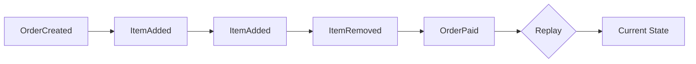
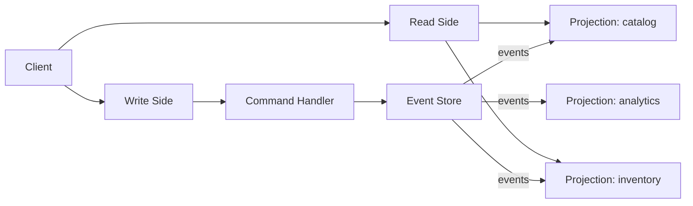
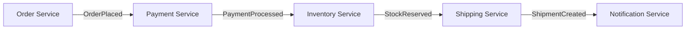
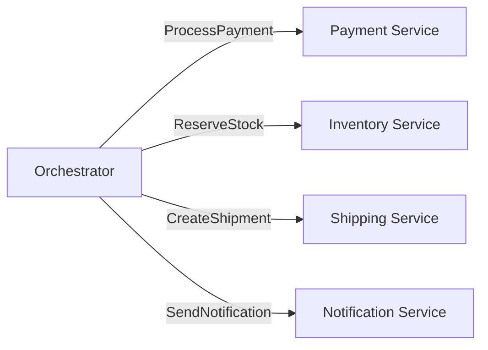

# Level 12: Event-Driven Architecture

## What is event-driven architecture?

Instead of direct calls between services — **events**. A service doesn't say "do this", it says "this happened". Other services react on their own.

Three key patterns are built on this idea: **Event Sourcing**, **CQRS**, and **Choreography vs Orchestration**.

---

## Event Sourcing: state as a stream of events

Instead of storing current state — store the entire history of events. Current state is the result of replaying all events from the beginning.



```ts
// Event — a fact that already happened. Immutable.
interface OrderCreated {
  type: 'OrderCreated'
  orderId: string
  customerId: string
  timestamp: number
}

// Apply event to state
function apply(state: OrderState | null, event: OrderEvent): OrderState {
  switch (event.type) {
    case 'OrderCreated':
      return { orderId: event.orderId, items: [], total: 0, status: 'pending' }
    case 'ItemAdded':
      return { ...state!, items: [...state!.items, event.item], total: state!.total + event.price }
    // ...
  }
}

// Current state = reduce over all events
const currentState = events.reduce(apply, null)
```

**What this gives:**
- Complete history of changes (audit log for free)
- Can "time travel" — reproduce state at any point in time
- Ideal for finance, bookings, inventory

⚠️ **Beginner mistake:** storing only current state with timestamps — this is not Event Sourcing. You need a sequence of immutable event-facts.

---

## CQRS: separating reads and writes

**Command Query Responsibility Segregation** — commands change state, queries read it. These are different models, optimized for their own tasks.



```ts
// Write side: validate command, create event
function handleCommand(cmd: CreateProductCommand): ProductCreatedEvent {
  if (productExists(cmd.productId)) throw new Error('Already exists')
  return { type: 'ProductCreated', ...cmd }
}

// Read side: projection for catalog (active items with price only)
function buildCatalog(events: Event[]): CatalogItem[] {
  return events
    .filter(e => e.type === 'ProductCreated' || e.type === 'PriceUpdated')
    .reduce(/* ... */, [])
}

// Read side: projection for inventory (stock levels, "low stock" signal)
function buildInventory(events: Event[]): InventoryItem[] { /* ... */ }
```

💡 **Key insight:** the same events feed several different read models. Each is optimized for its own use case.

---

## Choreography vs Orchestration

Two approaches to coordinating multiple services within a single business process.

### Choreography

Each service knows which events to react to and what to publish. No central coordinator.



### Orchestration

A central orchestrator (Saga Controller) explicitly commands each service.



| | Choreography | Orchestration |
|---|---|---|
| Coupling | Loose | Tighter |
| Debugging | Harder | Easier |
| Single point of failure | No | Orchestrator |
| Compensation | Difficult | Convenient |

---

## ⚠️ Common mistakes

**Mutating "events"** — an event already happened, it cannot be cancelled or changed. Don't name `UpdateUser` an event — that's a command.

```ts
// ❌ Not an event — a command:
{ type: 'UpdateUserEmail', newEmail: 'x@y.com' }

// ✅ Event — a fact:
{ type: 'UserEmailChanged', previousEmail: 'a@b.com', newEmail: 'x@y.com', changedAt: Date.now() }
```

**CQRS everywhere** — the pattern adds complexity. Justified when there's high read/write load asymmetry or when fundamentally different read models are needed.

**Choreography without monitoring** — the event flow is invisible. Without distributed tracing, tracking down a bug is nearly impossible.
