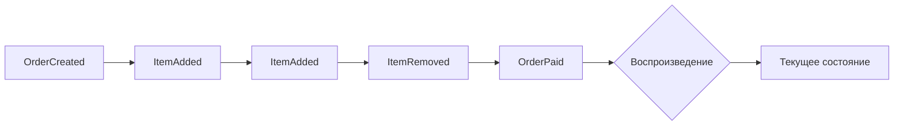
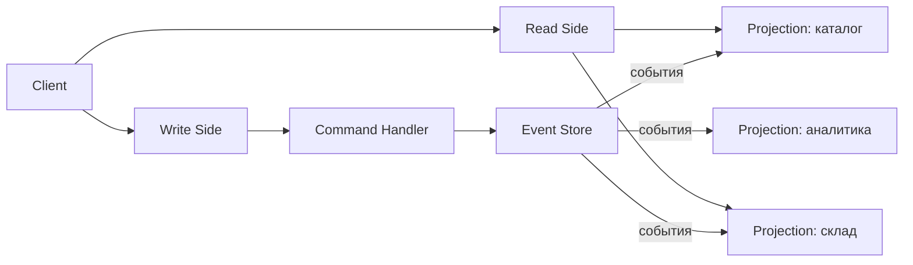
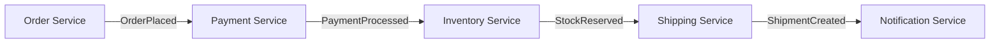
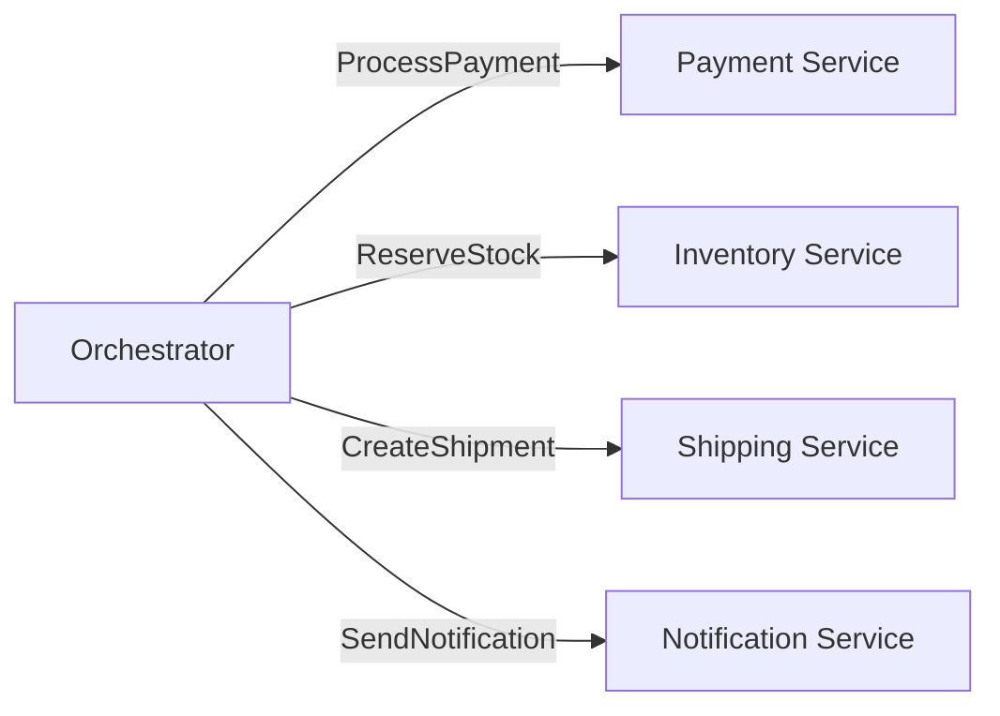

# Уровень 12: Event-Driven Architecture

## Что такое событийно-ориентированная архитектура?

Вместо прямых вызовов между сервисами — **события**. Сервис не говорит "сделай это", он говорит "это произошло". Остальные сервисы реагируют самостоятельно.

Три ключевых паттерна строятся на этой идее: **Event Sourcing**, **CQRS** и **Choreography vs Orchestration**.

---

## Event Sourcing: состояние как поток событий

Вместо хранения текущего состояния — храним всю историю событий. Текущее состояние — это результат воспроизведения всех событий с начала.



```ts
// Событие — факт, который уже произошёл. Неизменяемо.
interface OrderCreated {
  type: 'OrderCreated'
  orderId: string
  customerId: string
  timestamp: number
}

// Применяем событие к состоянию
function apply(state: OrderState | null, event: OrderEvent): OrderState {
  switch (event.type) {
    case 'OrderCreated':
      return { orderId: event.orderId, items: [], total: 0, status: 'pending' }
    case 'ItemAdded':
      return { ...state!, items: [...state!.items, event.item], total: state!.total + event.price }
    // ...
  }
}

// Текущее состояние = reduce по всем событиям
const currentState = events.reduce(apply, null)
```

**Что это даёт:**
- Полная история изменений (аудит-лог бесплатно)
- Можно "путешествовать во времени" — воспроизвести состояние на любой момент
- Идеально для финансов, бронирований, инвентаря

⚠️ **Ошибка новичка:** хранить только текущее состояние с временными метками — это не Event Sourcing. Нужна именно последовательность неизменяемых событий-фактов.

---

## CQRS: разделение чтения и записи

**Command Query Responsibility Segregation** — команды меняют состояние, запросы читают его. Это разные модели, оптимизированные для своих задач.



```ts
// Write side: валидируем команду, создаём событие
function handleCommand(cmd: CreateProductCommand): ProductCreatedEvent {
  if (productExists(cmd.productId)) throw new Error('Already exists')
  return { type: 'ProductCreated', ...cmd }
}

// Read side: проекция для каталога (только активные с ценой)
function buildCatalog(events: Event[]): CatalogItem[] {
  return events
    .filter(e => e.type === 'ProductCreated' || e.type === 'PriceUpdated')
    .reduce(/* ... */, [])
}

// Read side: проекция для склада (остатки, сигнал "мало товара")
function buildInventory(events: Event[]): InventoryItem[] { /* ... */ }
```

💡 **Ключевой инсайт:** одни и те же события питают несколько разных read models. Каждая оптимизирована под свой сценарий использования.

---

## Хореография vs Оркестрация

Два подхода к координации нескольких сервисов в рамках одного бизнес-процесса.

### Хореография

Каждый сервис знает, на какие события реагировать и что публиковать. Центрального координатора нет.



### Оркестрация

Центральный оркестратор (Saga Controller) явно командует каждым сервисом.



| | Хореография | Оркестрация |
|---|---|---|
| Связанность | Слабая | Сильнее |
| Отладка | Сложнее | Проще |
| Точка отказа | Нет | Оркестратор |
| Компенсация | Трудно | Удобно |

---

## ⚠️ Типичные ошибки

**Мутирующие "события"** — событие уже случилось, его нельзя отменить или изменить. Не называйте `UpdateUser` событием — это команда.

```ts
// ❌ Не событие — команда:
{ type: 'UpdateUserEmail', newEmail: 'x@y.com' }

// ✅ Событие — факт:
{ type: 'UserEmailChanged', previousEmail: 'a@b.com', newEmail: 'x@y.com', changedAt: Date.now() }
```

**CQRS везде** — паттерн добавляет сложность. Оправдан при высокой асимметрии нагрузок чтения/записи или когда нужны принципиально разные read models.

**Хореография без мониторинга** — поток событий невидим. Без distributed tracing отследить баг практически невозможно.
