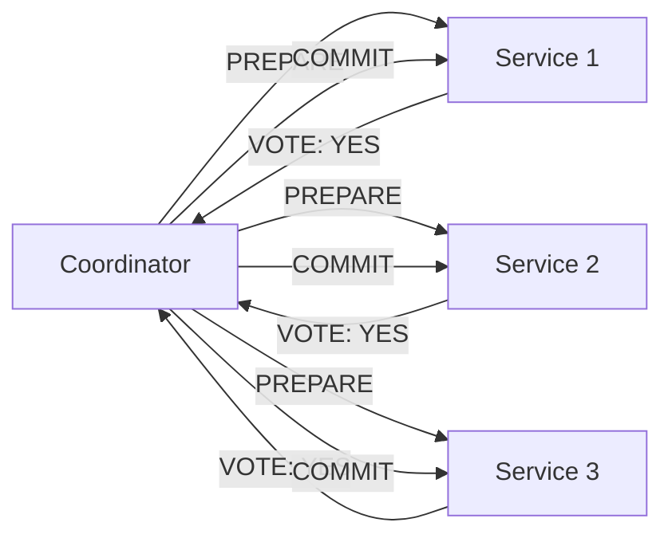
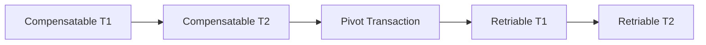
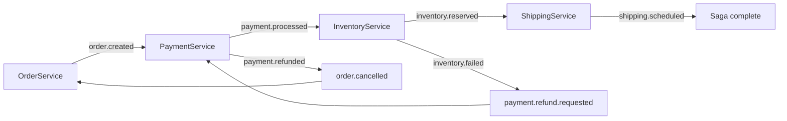
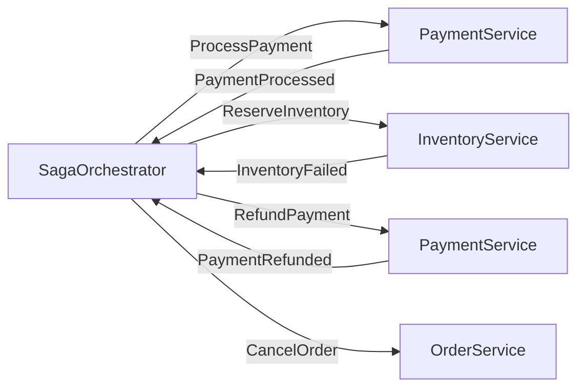

# Level 13: Saga Pattern — Detailed Theory

## 1. Why ACID doesn't work in microservices

Classic relational databases guarantee ACID: Atomicity, Consistency, Isolation, Durability. When all business logic lives in one database, this works great: BEGIN TRANSACTION → INSERT → UPDATE → COMMIT — and either everything is saved or nothing.

The problem arises when a business operation touches **multiple independent services with different databases**. The classic example — placing an order in an online store:

```
1. OrderService       → create order in PostgreSQL
2. PaymentService     → deduct money in billing DB
3. InventoryService   → reserve product in warehouse DB
4. ShippingService    → create delivery in logistics DB
```

If step 3 fails, steps 1 and 2 need to be rolled back. But each service has **its own DB**, and there's no unified rollback mechanism.

### ACID vs BASE

| Property | ACID | BASE |
|---|---|---|
| Full name | Atomicity, Consistency, Isolation, Durability | Basically Available, Soft state, Eventually consistent |
| Applicability | Monolith, one DB | Distributed systems |
| Consistency | Strict (immediate) | Eventual (over time) |
| Availability | Sacrificed for consistency | Priority |
| Example | PostgreSQL, MySQL | Kafka, DynamoDB, Cassandra |

In distributed systems, we agree on **BASE**: the system will _eventually_ reach a consistent state, but right now different parts may see different data.

---

## 2. Two-Phase Commit (2PC): why it doesn't fit

Two-phase commit is the classic solution for distributed transactions. Works in two phases:



**Phase 1 (Prepare/Voting):** coordinator sends PREPARE to all participants. Each participant checks if it can execute the transaction and responds YES or NO. The participant **locks the resource** until the final decision.

**Phase 2 (Commit/Rollback):** if everyone said YES — coordinator sends COMMIT. If even one said NO — ROLLBACK.

### Problems with 2PC

**1. Resource locks.** While participants wait for the coordinator's decision, resources are locked. In high-load systems, this is catastrophic — other transactions wait.

**2. Single point of failure.** What if the coordinator crashes after sending PREPARE but before sending COMMIT? All participants are locked forever, waiting for a decision that will never come.

**3. Participant uncertainty.** A participant sent YES, received COMMIT, but the network failed at the confirmation moment — it doesn't know if it committed. It must query the coordinator — but what if that's also unavailable?

**4. Poor scalability.** 2PC requires synchronous coordination. In systems with thousands of transactions per second, this is a bottleneck.

### 3PC: attempt to fix it

Three-phase commit adds an intermediate PRE-COMMIT phase to eliminate blocking on coordinator failure. But it still breaks on network splits (split-brain) — and is even harder to implement.

💡 **Conclusion**: neither 2PC nor 3PC is suitable for microservices. A different approach is needed.

---

## 3. Saga Pattern: history and idea

The Saga pattern was described in 1987 by Hector Garcia-Molina and Kenneth Salem in their paper ["Sagas"](https://www.cs.cornell.edu/andriola/saga_p249.pdf). The original idea was for **long transactions in a single DB** — for example, a booking transaction that lasts hours.

The idea is simple: **break a long transaction into a sequence of short local transactions**. Each local transaction is atomic on its own. If one fails — **compensating transactions** are triggered for all previous steps in reverse order.

```
Saga = T1, T2, T3, ..., Tn
     + C1, C2, C3, ..., C(n-1)  (compensations)
```

If Tk fails → C(k-1), C(k-2), ..., C1 are executed.

### Key difference from rollback

⚠️ **Saga is NOT a rollback!** A compensating transaction is a **new business operation** that semantically cancels the effect of the previous one.

```
T2 = "deduct $100 from card"
C2 = "refund $100 to card"  ← not a rollback, but a new refund
```

The difference is fundamental: a refund creates a new record in the transaction history, may require time, may itself fail and need a retry.

---

## 4. Transaction types in Saga

Garcia-Molina introduced three categories of transactions in Saga:



### Compensatable

Transactions that **can be semantically cancelled**. All steps before the Pivot transaction. For each such transaction Tk, there is a compensating Ck.

```typescript
// Compensatable: can be cancelled
async function reserveInventory(orderId: string, sku: string) {
  await db.update('inventory', { sku }, { reserved: +1 })
  await db.insert('saga_steps', { orderId, step: 'inventory', status: 'done' })
}

// Compensation: semantically cancels the reservation
async function releaseInventory(orderId: string, sku: string) {
  await db.update('inventory', { sku }, { reserved: -1 })
  await db.insert('saga_steps', { orderId, step: 'inventory_compensation', status: 'done' })
}
```

### Pivot (point of no return)

A transaction after which rollback is **impossible or impractical**. Classic example: shipping a physical package. Once the courier has picked up the product, you can't "rollback" the delivery — only create a return (which is another Saga).

📌 **Choosing the Pivot is a business decision**, not a technical one. The project manager should be involved in its definition.

### Retriable (guaranteed to complete)

Transactions after the Pivot that **don't require compensation** — they are guaranteed to complete (e.g., through retry). Usually these are side effects: sending email, writing analytics, updating cache.

```typescript
// Retriable: email will eventually arrive through retry, no compensation
async function sendConfirmationEmail(orderId: string, userEmail: string) {
  // retry with exponential backoff — will arrive sooner or later
  await emailService.send({ to: userEmail, template: 'order_confirmed', orderId })
}
```

---

## 5. Semantic Lock

One countermeasure against anomalies in Saga — **Semantic Lock**. The idea: while the Saga is running, we set a "in progress" flag on an object that another Saga might see.

```typescript
// When starting Saga — lock the order
await db.update('orders', { id: orderId }, { status: 'PROCESSING' })

// After success — remove the lock
await db.update('orders', { id: orderId }, { status: 'CONFIRMED' })

// On compensation — remove lock with cancellation
await db.update('orders', { id: orderId }, { status: 'CANCELLED' })
```

Another Saga seeing status 'PROCESSING' will know that an operation is in progress and will wait for completion or deny.

---

## 6. Choreography

In the Choreography pattern, **there is no central coordinator**. Each service knows what to do when it receives an event. It does its work and publishes a new event — the next service reacts to it.



### Implementation with Kafka

```typescript
// PaymentService: listens to order.created, publishes payment.processed
consumer.subscribe({ topic: 'order.created' })

consumer.run({
  eachMessage: async ({ message }) => {
    const order = JSON.parse(message.value.toString())

    try {
      await paymentService.charge(order.userId, order.amount)

      // Success: publish next event
      await producer.send({
        topic: 'payment.processed',
        messages: [{ value: JSON.stringify({ orderId: order.id, amount: order.amount }) }]
      })
    } catch (error) {
      // Error: publish compensating event
      await producer.send({
        topic: 'payment.failed',
        messages: [{ value: JSON.stringify({ orderId: order.id, reason: error.message }) }]
      })
    }
  }
})
```

### Implementation with RabbitMQ

```typescript
// Exchange: saga.events (topic exchange)
// Routing keys: order.*, payment.*, inventory.*, shipping.*

await channel.assertExchange('saga.events', 'topic', { durable: true })

// OrderService publishes event
await channel.publish('saga.events', 'order.created',
  Buffer.from(JSON.stringify(order)))

// PaymentService subscribes to the needed routing key
await channel.bindQueue('payment.queue', 'saga.events', 'order.created')
await channel.bindQueue('payment.compensation.queue', 'saga.events', 'order.compensation.#')
```

### Pros and cons of Choreography

**Pros:**
- No single point of failure
- Loose coupling — services don't know about each other, only about events
- Easy to add a new service (just subscribe to an event)
- Scales well

**Cons:**
- Hard to trace the full flow — need distributed tracing tools
- Harder to test — need to run multiple services
- Saga logic is spread across multiple services
- Cyclic dependencies can arise accidentally
- Hard to guarantee compensation order

**When to use:** small number of participants (2-4), service teams are independent, loose coupling is more important than observability.

---

## 7. Orchestration

In the Orchestration pattern, there is a **central orchestrator (Saga Execution Coordinator, SEC)**. It knows all steps, sends commands to services, and waits for responses. Services know nothing about the Saga — they just process commands.



### Saga Execution Coordinator (SEC)

SEC is a stateful service (or state machine) that stores the current state of each Saga:

```typescript
type SagaState = 'STARTED' | 'PAYMENT_PROCESSING' | 'INVENTORY_RESERVING'
               | 'SHIPPING_SCHEDULING' | 'COMPLETED'
               | 'COMPENSATING' | 'ROLLED_BACK'

interface SagaInstance {
  sagaId: string
  orderId: string
  state: SagaState
  completedSteps: string[]
  startedAt: Date
  updatedAt: Date
}
```

### Implementation with RabbitMQ (command/reply pattern)

```typescript
// Orchestrator sends commands to command queue
// Services reply to reply queue

class OrderSagaOrchestrator {
  async startSaga(order: Order) {
    const sagaId = generateId()
    await this.db.saveSaga({ sagaId, orderId: order.id, state: 'STARTED' })

    // Step 1: process payment
    await this.sendCommand('payment.commands', {
      type: 'ProcessPayment',
      sagaId,
      orderId: order.id,
      amount: order.amount
    })

    await this.db.updateSaga(sagaId, { state: 'PAYMENT_PROCESSING' })
  }

  async handleReply(reply: SagaReply) {
    const saga = await this.db.getSaga(reply.sagaId)

    switch (reply.type) {
      case 'PaymentProcessed':
        // Step 2: reserve inventory
        await this.sendCommand('inventory.commands', {
          type: 'ReserveInventory',
          sagaId: saga.sagaId,
          orderId: saga.orderId,
          items: reply.items
        })
        await this.db.updateSaga(saga.sagaId, {
          state: 'INVENTORY_RESERVING',
          completedSteps: [...saga.completedSteps, 'payment']
        })
        break

      case 'InventoryFailed':
        // Start compensation
        await this.compensate(saga)
        break

      case 'PaymentRefunded':
        await this.db.updateSaga(saga.sagaId, { state: 'ROLLED_BACK' })
        break
    }
  }

  private async compensate(saga: SagaInstance) {
    await this.db.updateSaga(saga.sagaId, { state: 'COMPENSATING' })

    // Compensate in reverse order
    for (const step of [...saga.completedSteps].reverse()) {
      if (step === 'payment') {
        await this.sendCommand('payment.commands', {
          type: 'RefundPayment',
          sagaId: saga.sagaId,
          orderId: saga.orderId
        })
      }
    }
  }
}
```

### Pros and cons of Orchestration

**Pros:**
- Centralized logic — easy to understand the full flow
- Easier to test — can test the orchestrator in isolation
- Explicit Saga state management
- Easy to add logging and monitoring in one place
- Simpler to implement compensation

**Cons:**
- Orchestrator is a single point of failure (solved by replication)
- Tight coupling between orchestrator and services
- Orchestrator can become a god object
- Requires persistent state storage

**When to use:** complex flows with more than 4-5 steps, full observability needed, business logic should be centralized.

---

## 8. Idempotency in Saga

Idempotency is a key requirement for Saga steps. In distributed systems, messages can be delivered **more than once** (at-least-once delivery). If a step is not idempotent, repeated processing will create a duplicate effect.

### Bad implementation example

```typescript
// ❌ Not idempotent: each call deducts money
async function processPayment(orderId: string, amount: number) {
  await bankApi.charge(userId, amount)  // DANGEROUS!
}
```

### Good implementation example

```typescript
// ✅ Idempotent: repeated call doesn't create duplicates
async function processPayment(orderId: string, amount: number) {
  // Check: have we already processed this orderId?
  const existing = await db.findPayment({ orderId })
  if (existing) {
    console.log(`Payment for ${orderId} already processed, skipping`)
    return existing
  }

  // First save intent (outbox pattern)
  await db.insertPayment({ orderId, amount, status: 'PROCESSING' })

  try {
    const result = await bankApi.charge(userId, amount)
    await db.updatePayment({ orderId }, { status: 'COMPLETED', transactionId: result.id })
    return result
  } catch (error) {
    await db.updatePayment({ orderId }, { status: 'FAILED', error: error.message })
    throw error
  }
}
```

### Idempotency via unique key

Another approach — **idempotency key** at the database level:

```sql
CREATE TABLE payments (
  id          UUID PRIMARY KEY DEFAULT gen_random_uuid(),
  order_id    UUID NOT NULL UNIQUE,  -- unique key!
  amount      DECIMAL NOT NULL,
  status      VARCHAR(20) NOT NULL,
  created_at  TIMESTAMP DEFAULT NOW()
);
-- Repeated insert with the same order_id → unique constraint violation → catch and ignore
```

```typescript
try {
  await db.insert('payments', { orderId, amount, status: 'COMPLETED' })
} catch (error) {
  if (error.code === '23505') {  // unique_violation in PostgreSQL
    return  // already processed, ignore
  }
  throw error
}
```

---

## 9. Storing Saga state

Saga state must be **persisted in a DB** to survive service restarts.

### Table structure

```sql
CREATE TABLE saga_instances (
  saga_id         UUID PRIMARY KEY,
  saga_type       VARCHAR(100) NOT NULL,     -- 'OrderSaga'
  state           VARCHAR(50) NOT NULL,       -- 'PAYMENT_PROCESSING'
  payload         JSONB NOT NULL,             -- all saga data
  completed_steps JSONB DEFAULT '[]',         -- ['payment', 'inventory']
  created_at      TIMESTAMP DEFAULT NOW(),
  updated_at      TIMESTAMP DEFAULT NOW(),
  version         INTEGER DEFAULT 1           -- for optimistic locking
);
```

### Optimistic locking for safe updates

```typescript
async function updateSagaState(sagaId: string, newState: string, expectedVersion: number) {
  const result = await db.query(`
    UPDATE saga_instances
    SET state = $1, version = version + 1, updated_at = NOW()
    WHERE saga_id = $2 AND version = $3
    RETURNING *
  `, [newState, sagaId, expectedVersion])

  if (result.rowCount === 0) {
    throw new Error('Concurrent modification detected — retry')
  }
  return result.rows[0]
}
```

---

## 10. Saga with Kafka

Kafka is especially well suited for **Choreography Saga** thanks to its log-based architecture.

### Topics and partitions

```
Topics:
  order.commands         ← OrderService commands
  order.events           ← OrderService events
  payment.commands       ← PaymentService commands
  payment.events         ← PaymentService events
  inventory.commands     ← InventoryService commands
  inventory.events       ← InventoryService events
```

### Key: partitioning by orderId

To ensure all events of one Saga are processed sequentially, use orderId as the partition key:

```typescript
await producer.send({
  topic: 'payment.commands',
  messages: [{
    key: orderId,  // ← same orderId always lands in the same partition
    value: JSON.stringify(command)
  }]
})
```

### Compensation topics

```typescript
// On success
await producer.send({ topic: 'payment.events', messages: [{ key: orderId, value: JSON.stringify({ type: 'PaymentProcessed', orderId, amount }) }] })

// On error — publish to compensation topic
await producer.send({ topic: 'payment.compensation', messages: [{ key: orderId, value: JSON.stringify({ type: 'PaymentFailed', orderId, reason }) }] })
```

---

## 11. Saga with RabbitMQ

RabbitMQ is well suited for **Orchestration Saga** thanks to direct queues and Request/Reply pattern.

### Command/Reply Pattern

```
Exchanges:
  saga.commands (direct)  ← orchestrator → services
  saga.replies  (direct)  ← services → orchestrator

Queues:
  payment.commands   ← ProcessPayment, RefundPayment
  inventory.commands ← ReserveInventory, ReleaseInventory
  saga.replies       ← PaymentProcessed, PaymentRefunded, InventoryFailed...
```

```typescript
// Orchestrator sends a command
await channel.publish('saga.commands', 'payment', Buffer.from(JSON.stringify({
  type: 'ProcessPayment',
  sagaId,
  replyTo: 'saga.replies',  // where to reply
  correlationId: sagaId     // for response matching
})))

// PaymentService processes and replies
const { content, properties } = msg
const command = JSON.parse(content.toString())

// ...processing...

await channel.publish('saga.replies', '', Buffer.from(JSON.stringify({
  type: 'PaymentProcessed',
  sagaId: command.sagaId
})), {
  correlationId: properties.correlationId
})
```

---

## 12. Saga Frameworks

No need to implement Saga from scratch. There are ready-made frameworks:

### MassTransit (C#)

MassTransit — a popular .NET framework with Saga support via Automatonymous:

```csharp
public class OrderSaga : MassTransitStateMachine<OrderSagaState>
{
    public State PaymentProcessing { get; private set; }
    public State InventoryReserving { get; private set; }
    public State Completed { get; private set; }
    public State Compensating { get; private set; }

    public OrderSaga()
    {
        InstanceState(x => x.CurrentState);

        Initially(
            When(OrderCreated)
                .Then(ctx => ctx.Saga.OrderId = ctx.Message.OrderId)
                .PublishAsync(ctx => ctx.Init<ProcessPayment>(new { ctx.Saga.OrderId }))
                .TransitionTo(PaymentProcessing)
        );

        During(PaymentProcessing,
            When(PaymentProcessed)
                .PublishAsync(ctx => ctx.Init<ReserveInventory>(new { ctx.Saga.OrderId }))
                .TransitionTo(InventoryReserving),
            When(PaymentFailed)
                .TransitionTo(Compensating)
        );
    }
}
```

### Temporal

Temporal — a modern platform for reliable workflows. Saga is expressed as normal code:

```typescript
// Temporal: Saga as normal async/await code
export async function orderSagaWorkflow(order: Order): Promise<void> {
  const compensations: Array<() => Promise<void>> = []

  try {
    // Step 1
    await processPayment(order.id, order.amount)
    compensations.push(() => refundPayment(order.id, order.amount))

    // Step 2
    await reserveInventory(order.id, order.items)
    compensations.push(() => releaseInventory(order.id, order.items))

    // Step 3
    await scheduleShipping(order.id)
    // shipping — pivot, no compensation

  } catch (error) {
    // Compensation in reverse order
    for (const compensate of compensations.reverse()) {
      await compensate()
    }
    throw error
  }
}
```

### Netflix Conductor

Conductor — workflow engine from Netflix. Saga is described as JSON:

```json
{
  "name": "order_saga",
  "tasks": [
    { "name": "process_payment", "taskReferenceName": "payment_ref", "type": "SIMPLE" },
    { "name": "reserve_inventory", "taskReferenceName": "inventory_ref", "type": "SIMPLE" },
    { "name": "schedule_shipping", "taskReferenceName": "shipping_ref", "type": "SIMPLE" }
  ],
  "failureWorkflow": "order_compensation_workflow"
}
```

### Framework comparison

| Framework | Language | Transport | Approach | Complexity |
|---|---|---|---|---|
| MassTransit | C# | RabbitMQ, Kafka, AzureSB | Orchestration | Medium |
| NServiceBus | C# | RabbitMQ, Kafka, SQL | Orchestration | High |
| Axon Framework | Java | Axon Server | Choreography + Orchestration | High |
| Temporal | Go/Java/TS | Own | Workflow (Orchestration) | Medium |
| Netflix Conductor | Java | Any | Orchestration (DSL) | Medium |

---

## 13. Testing Saga

### Testing Choreography

```typescript
// Unit test: service publishes the correct event
describe('PaymentService', () => {
  it('publishes payment.processed on success', async () => {
    const mockProducer = { send: jest.fn() }
    const service = new PaymentService(mockProducer)

    await service.handleOrderCreated({ orderId: '123', amount: 100 })

    expect(mockProducer.send).toHaveBeenCalledWith({
      topic: 'payment.processed',
      messages: [expect.objectContaining({ value: expect.stringContaining('"orderId":"123"') })]
    })
  })
})
```

### Testing Orchestration

```typescript
// Integration test: orchestrator correctly reacts to events
describe('OrderSagaOrchestrator', () => {
  it('sends RefundPayment after InventoryFailed', async () => {
    const orchestrator = new OrderSagaOrchestrator(db, messageBus)
    const sagaId = await orchestrator.startSaga(testOrder)

    // Simulate PaymentService response
    await orchestrator.handleReply({ type: 'PaymentProcessed', sagaId, amount: 100 })

    // Simulate InventoryService error
    await orchestrator.handleReply({ type: 'InventoryFailed', sagaId, reason: 'Out of stock' })

    // Orchestrator must initiate refund
    const sentCommands = messageBus.getSentCommands()
    expect(sentCommands).toContainEqual(
      expect.objectContaining({ type: 'RefundPayment', sagaId })
    )
  })
})
```

---

## 14. Anti-patterns

### 1. Global state in Choreography

```typescript
// ❌ Bad: service stores global state about the saga
class PaymentService {
  private pendingOrders = new Map<string, OrderData>()  // doesn't scale!
}
```

```typescript
// ✅ Good: state in DB, service is stateless
async function handleOrderCreated(event: OrderCreated) {
  await db.insert('payment_saga', { orderId: event.orderId, status: 'PENDING' })
}
```

### 2. Compensations without idempotency

```typescript
// ❌ Double refund on repeated message
async function refundPayment(orderId: string) {
  await bankApi.refund(orderId, amount)  // can execute twice!
}
```

```typescript
// ✅ Check before executing
async function refundPayment(orderId: string) {
  if (await db.existsRefund(orderId)) return
  await bankApi.refund(orderId, amount)
  await db.saveRefund(orderId)
}
```

### 3. Skipping Pivot transaction

```typescript
// ❌ Adding compensation for an action that can't be rolled back
const steps = [
  { action: createOrder, compensation: cancelOrder },
  { action: processPayment, compensation: refundPayment },
  { action: shipPhysicalGoods }  // PIVOT — cannot compensate!
]
```

### 4. Long-running Saga

```typescript
// ❌ Saga open for hours — resources locked, state stale
```

**Solution:** break into shorter Sagas, use timeouts, set up alerting for long-running Sagas.

### 5. Missing monitoring

```typescript
// ❌ Saga crashed, nobody noticed — orders stuck in "PROCESSING"
```

Always set up alerts for: Saga stuck in one state too long, high compensation rate, Saga failures.

---

## Summary: when to choose what

| Criterion | Choreography | Orchestration |
|---|---|---|
| Participants | 2-4 | 5+ |
| Coupling | Loose | Tighter |
| Observability | Harder (needs tracing) | Easier (centralized) |
| Compensation | Complex | Simple |
| Failure handling | Each service handles own | Orchestrator coordinates |
| Adding steps | Just subscribe to events | Modify orchestrator |

**Rule of thumb:** start with Choreography for simple flows. Move to Orchestration when the flow becomes complex or you need full observability.
