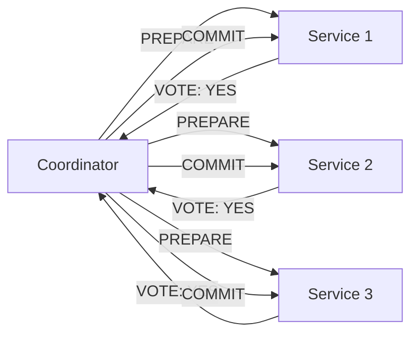
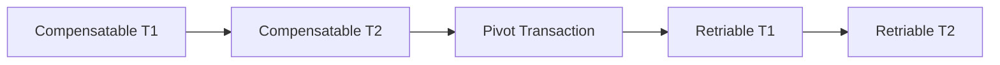
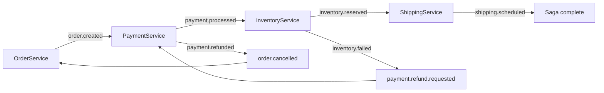
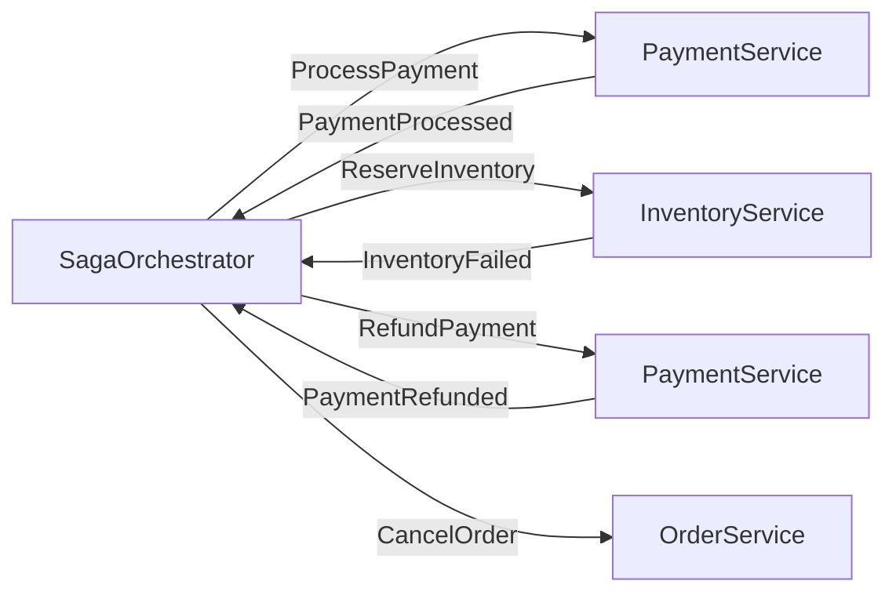

# Уровень 13: Паттерн Saga — подробная теория

## 1. Почему ACID не работает в микросервисах

Классические реляционные базы данных гарантируют ACID: Atomicity, Consistency, Isolation, Durability. Когда вся бизнес-логика живёт в одной базе, это работает отлично: BEGIN TRANSACTION → INSERT → UPDATE → COMMIT — и либо всё сохранилось, либо ничего.

Проблема возникает, когда бизнес-операция затрагивает **несколько независимых сервисов с разными базами данных**. Классический пример — оформление заказа в интернет-магазине:

```
1. OrderService       → создать заказ в PostgreSQL
2. PaymentService     → списать деньги в billing-БД
3. InventoryService   → зарезервировать товар в warehouse-БД
4. ShippingService    → создать доставку в logistics-БД
```

Если шаг 3 падает, нужно откатить шаги 1 и 2. Но у каждого сервиса **своя БД**, и никакого единого механизма отката нет.

### ACID vs BASE

| Свойство | ACID | BASE |
|---|---|---|
| Полное название | Atomicity, Consistency, Isolation, Durability | Basically Available, Soft state, Eventually consistent |
| Применимость | Монолит, одна БД | Распределённые системы |
| Согласованность | Жёсткая (сразу) | Eventual (через время) |
| Доступность | Жертвует ради согласованности | Приоритет |
| Пример | PostgreSQL, MySQL | Kafka, DynamoDB, Cassandra |

В распределённых системах мы соглашаемся на **BASE**: система _в конечном счёте_ придёт в согласованное состояние, но прямо сейчас разные части могут видеть разные данные.

---

## 2. Двухфазный коммит (2PC): почему он не подходит

Двухфазный коммит — классическое решение для распределённых транзакций. Работает в двух фазах:



**Фаза 1 (Prepare/Voting):** координатор отправляет всем участникам PREPARE. Каждый участник проверяет, может ли он выполнить транзакцию, и отвечает YES или NO. При этом участник **блокирует ресурс** до получения финального решения.

**Фаза 2 (Commit/Rollback):** если все ответили YES — координатор отправляет COMMIT. Если хоть один ответил NO — ROLLBACK.

### Проблемы 2PC

**1. Блокировки ресурсов.** Пока участники ждут решения координатора, ресурсы заблокированы. В высоконагруженных системах это катастрофа — другие транзакции ждут.

**2. Одна точка отказа.** Что если координатор упал после отправки PREPARE, но до отправки COMMIT? Все участники залочены навсегда и ждут решения, которое никогда не придёт.

**3. Неопределённость участника.** Участник отправил YES, получил COMMIT, но сеть лопнула в момент подтверждения — не знает, закоммитил ли он. Вынужден запросить координатора — а вдруг тот тоже недоступен?

**4. Плохая масштабируемость.** 2PC требует синхронной координации. В системах с тысячами транзакций в секунду это узкое место.

### 3PC: попытка исправить

Трёхфазный коммит добавляет промежуточную фазу PRE-COMMIT чтобы устранить блокировку при отказе координатора. Но он всё равно ломается при сетевых разрывах (split-brain) — и при этом ещё сложнее в реализации.

💡 **Вывод**: ни 2PC, ни 3PC не подходят для микросервисов. Нужен другой подход.

---

## 3. Паттерн Saga: история и идея

Паттерн Saga был описан в 1987 году Гектором Гарсиа-Молиной (Hector Garcia-Molina) и Кеннетом Салемом (Kenneth Salem) в их работе ["Sagas"](https://www.cs.cornell.edu/andriola/saga_p249.pdf). Оригинальная идея была для **длинных транзакций в одной БД** — например, транзакция бронирования, которая длится часами.

Идея простая: **разбить длинную транзакцию на последовательность коротких локальных транзакций**. Каждая локальная транзакция атомарна сама по себе. Если какая-то падает — запускаются **компенсирующие транзакции** для всех предыдущих шагов в обратном порядке.

```
Saga = T1, T2, T3, ..., Tn
     + C1, C2, C3, ..., C(n-1)  (компенсации)
```

Если Tk падает → выполняется C(k-1), C(k-2), ..., C1.

### Ключевое отличие от rollback

⚠️ **Saga — это НЕ rollback!** Компенсирующая транзакция — это **новая бизнес-операция**, которая семантически отменяет эффект предыдущей.

```
T2 = "списать $100 с карты"
C2 = "вернуть $100 на карту"  ← не откат, а новый refund
```

Разница принципиальная: refund создаёт новую запись в истории транзакций, может потребовать времени, может сам упасть и потребовать ретрай.

---

## 4. Типы транзакций в Saga

Garcia-Molina ввёл три категории транзакций в Saga:



### Compensatable (компенсируемые)

Транзакции, которые **можно семантически отменить**. Все шаги до Pivot-транзакции. Для каждой такой транзакции Tk есть компенсирующая Ck.

```typescript
// Compensatable: можно отменить
async function reserveInventory(orderId: string, sku: string) {
  await db.update('inventory', { sku }, { reserved: +1 })
  await db.insert('saga_steps', { orderId, step: 'inventory', status: 'done' })
}

// Compensation: семантически отменяет резервирование
async function releaseInventory(orderId: string, sku: string) {
  await db.update('inventory', { sku }, { reserved: -1 })
  await db.insert('saga_steps', { orderId, step: 'inventory_compensation', status: 'done' })
}
```

### Pivot (точка невозврата)

Транзакция, после которой откат **невозможен или нецелесообразен**. Классический пример: отправка физического груза. После того как курьер забрал товар, нельзя "откатить" доставку — только создать возврат (что является другой Saga).

📌 **Выбор Pivot — бизнес-решение**, а не техническое. Проект-менеджер должен участвовать в его определении.

### Retriable (гарантированно выполнимые)

Транзакции после Pivot, которые **не требуют компенсации** — они гарантированно выполнятся (например, через ретрай). Обычно это side effects: отправить email, записать аналитику, обновить кэш.

```typescript
// Retriable: email всегда дойдёт через ретрай, компенсации нет
async function sendConfirmationEmail(orderId: string, userEmail: string) {
  // retry with exponential backoff — рано или поздно дойдёт
  await emailService.send({ to: userEmail, template: 'order_confirmed', orderId })
}
```

---

## 5. Semantic Lock (семантическая блокировка)

Один из контрмер против аномалий в Saga — **Semantic Lock**. Суть: пока Saga выполняется, устанавливаем флаг "в процессе" на объект, который может видеть другая Saga.

```typescript
// При запуске Saga — блокируем заказ
await db.update('orders', { id: orderId }, { status: 'PROCESSING' })

// После успеха — снимаем блокировку
await db.update('orders', { id: orderId }, { status: 'CONFIRMED' })

// При компенсации — снимаем блокировку с отменой
await db.update('orders', { id: orderId }, { status: 'CANCELLED' })
```

Другая Saga, видя статус 'PROCESSING', будет знать, что операция в процессе и дождётся завершения или откажет.

---

## 6. Choreography: хореография

В Choreography-паттерне **нет центрального координатора**. Каждый сервис знает, что делать, когда получает событие. Он выполняет свою работу и публикует новое событие — следующий сервис реагирует на него.



### Реализация с Kafka

```typescript
// PaymentService: слушает order.created, публикует payment.processed
consumer.subscribe({ topic: 'order.created' })

consumer.run({
  eachMessage: async ({ message }) => {
    const order = JSON.parse(message.value.toString())
    
    try {
      await paymentService.charge(order.userId, order.amount)
      
      // Успех: публикуем следующее событие
      await producer.send({
        topic: 'payment.processed',
        messages: [{ value: JSON.stringify({ orderId: order.id, amount: order.amount }) }]
      })
    } catch (error) {
      // Ошибка: публикуем компенсирующее событие
      await producer.send({
        topic: 'payment.failed',
        messages: [{ value: JSON.stringify({ orderId: order.id, reason: error.message }) }]
      })
    }
  }
})
```

### Реализация с RabbitMQ

```typescript
// Exchange: saga.events (topic exchange)
// Routing keys: order.*, payment.*, inventory.*, shipping.*

await channel.assertExchange('saga.events', 'topic', { durable: true })

// OrderService публикует событие
await channel.publish('saga.events', 'order.created', 
  Buffer.from(JSON.stringify(order)))

// PaymentService подписывается на нужный routing key
await channel.bindQueue('payment.queue', 'saga.events', 'order.created')
await channel.bindQueue('payment.compensation.queue', 'saga.events', 'order.compensation.#')
```

### Плюсы и минусы Choreography

**Плюсы:**
- Нет единой точки отказа
- Слабая связанность — сервисы не знают друг о друге, только о событиях
- Легко добавить новый сервис (просто подпишется на событие)
- Хорошо масштабируется

**Минусы:**
- Сложно отследить весь поток — нужны distributed tracing инструменты
- Сложнее тестировать — нужно поднимать несколько сервисов
- Логика саги размазана по нескольким сервисам
- Цикличные зависимости могут возникнуть случайно
- Сложно гарантировать порядок компенсаций

**Когда использовать:** небольшое количество участников (2-4), команды сервисов независимы, слабая связанность важнее чем наблюдаемость.

---

## 7. Orchestration: оркестрация

В Orchestration-паттерне есть **центральный оркестратор (Saga Execution Coordinator, SEC)**. Он знает обо всех шагах, отправляет команды сервисам и ждёт ответов. Сервисы ничего не знают о Saga — они просто обрабатывают команды.



### Saga Execution Coordinator (SEC)

SEC — это stateful сервис (или state machine), который хранит текущее состояние каждой Saga:

```typescript
type SagaState = 'STARTED' | 'PAYMENT_PROCESSING' | 'INVENTORY_RESERVING' 
               | 'SHIPPING_SCHEDULING' | 'COMPLETED' 
               | 'COMPENSATING' | 'ROLLED_BACK'

interface SagaInstance {
  sagaId: string
  orderId: string
  state: SagaState
  completedSteps: string[]
  startedAt: Date
  updatedAt: Date
}
```

### Реализация с RabbitMQ (command/reply pattern)

```typescript
// Orchestrator отправляет команды в command queue
// Сервисы отвечают в reply queue

class OrderSagaOrchestrator {
  async startSaga(order: Order) {
    const sagaId = generateId()
    await this.db.saveSaga({ sagaId, orderId: order.id, state: 'STARTED' })
    
    // Шаг 1: обработать платёж
    await this.sendCommand('payment.commands', {
      type: 'ProcessPayment',
      sagaId,
      orderId: order.id,
      amount: order.amount
    })
    
    await this.db.updateSaga(sagaId, { state: 'PAYMENT_PROCESSING' })
  }
  
  async handleReply(reply: SagaReply) {
    const saga = await this.db.getSaga(reply.sagaId)
    
    switch (reply.type) {
      case 'PaymentProcessed':
        // Шаг 2: зарезервировать инвентарь
        await this.sendCommand('inventory.commands', {
          type: 'ReserveInventory',
          sagaId: saga.sagaId,
          orderId: saga.orderId,
          items: reply.items
        })
        await this.db.updateSaga(saga.sagaId, { 
          state: 'INVENTORY_RESERVING',
          completedSteps: [...saga.completedSteps, 'payment']
        })
        break
        
      case 'InventoryFailed':
        // Начать компенсацию
        await this.compensate(saga)
        break
        
      case 'PaymentRefunded':
        await this.db.updateSaga(saga.sagaId, { state: 'ROLLED_BACK' })
        break
    }
  }
  
  private async compensate(saga: SagaInstance) {
    await this.db.updateSaga(saga.sagaId, { state: 'COMPENSATING' })
    
    // Компенсируем в обратном порядке
    for (const step of [...saga.completedSteps].reverse()) {
      if (step === 'payment') {
        await this.sendCommand('payment.commands', {
          type: 'RefundPayment',
          sagaId: saga.sagaId,
          orderId: saga.orderId
        })
      }
    }
  }
}
```

### Плюсы и минусы Orchestration

**Плюсы:**
- Централизованная логика — легко понять весь поток
- Легче тестировать — можно тестировать оркестратор изолированно
- Явное управление состоянием Saga
- Легко добавить логирование и мониторинг в одном месте
- Проще реализовать компенсацию

**Минусы:**
- Оркестратор — единая точка отказа (решается репликацией)
- Тесная связь между оркестратором и сервисами
- Оркестратор может стать god object
- Требует постоянного хранилища состояния

**Когда использовать:** сложные потоки с более чем 4-5 шагами, нужна полная наблюдаемость, бизнес-логика должна быть сосредоточена в одном месте.

---

## 8. Идемпотентность в Saga

Идемпотентность — ключевое требование к шагам Saga. В распределённых системах сообщения могут быть доставлены **более одного раза** (at-least-once delivery). Если шаг не идемпотентен, повторная обработка создаст дублирующий эффект.

### Пример плохой реализации

```typescript
// ❌ Не идемпотентно: каждый вызов списывает деньги
async function processPayment(orderId: string, amount: number) {
  await bankApi.charge(userId, amount)  // ОПАСНО!
}
```

### Пример хорошей реализации

```typescript
// ✅ Идемпотентно: повторный вызов не создаёт дубликат
async function processPayment(orderId: string, amount: number) {
  // Проверяем: уже обрабатывали этот orderId?
  const existing = await db.findPayment({ orderId })
  if (existing) {
    console.log(`Payment for ${orderId} already processed, skipping`)
    return existing
  }
  
  // Сначала сохраняем намерение (outbox pattern)
  await db.insertPayment({ orderId, amount, status: 'PROCESSING' })
  
  try {
    const result = await bankApi.charge(userId, amount)
    await db.updatePayment({ orderId }, { status: 'COMPLETED', transactionId: result.id })
    return result
  } catch (error) {
    await db.updatePayment({ orderId }, { status: 'FAILED', error: error.message })
    throw error
  }
}
```

### Идемпотентность через уникальный ключ

Другой подход — **idempotency key** на уровне базы данных:

```sql
CREATE TABLE payments (
  id          UUID PRIMARY KEY DEFAULT gen_random_uuid(),
  order_id    UUID NOT NULL UNIQUE,  -- уникальный ключ!
  amount      DECIMAL NOT NULL,
  status      VARCHAR(20) NOT NULL,
  created_at  TIMESTAMP DEFAULT NOW()
);
-- Повторная вставка с тем же order_id → уникальное ограничение → ошибка → ловим и игнорируем
```

```typescript
try {
  await db.insert('payments', { orderId, amount, status: 'COMPLETED' })
} catch (error) {
  if (error.code === '23505') {  // unique_violation в PostgreSQL
    return  // уже обработано, игнорируем
  }
  throw error
}
```

---

## 9. Хранение состояния Saga

Состояние Saga должно **сохраняться в БД**, чтобы пережить перезапуск сервиса.

### Структура таблицы

```sql
CREATE TABLE saga_instances (
  saga_id         UUID PRIMARY KEY,
  saga_type       VARCHAR(100) NOT NULL,     -- 'OrderSaga'
  state           VARCHAR(50) NOT NULL,       -- 'PAYMENT_PROCESSING'
  payload         JSONB NOT NULL,             -- все данные саги
  completed_steps JSONB DEFAULT '[]',         -- ['payment', 'inventory']
  created_at      TIMESTAMP DEFAULT NOW(),
  updated_at      TIMESTAMP DEFAULT NOW(),
  version         INTEGER DEFAULT 1           -- для оптимистичной блокировки
);
```

### Optimistic locking для безопасных обновлений

```typescript
async function updateSagaState(sagaId: string, newState: string, expectedVersion: number) {
  const result = await db.query(`
    UPDATE saga_instances
    SET state = $1, version = version + 1, updated_at = NOW()
    WHERE saga_id = $2 AND version = $3
    RETURNING *
  `, [newState, sagaId, expectedVersion])
  
  if (result.rowCount === 0) {
    throw new Error('Concurrent modification detected — retry')
  }
  return result.rows[0]
}
```

---

## 10. Saga с Kafka

Kafka особенно хорошо подходит для **Choreography Saga** благодаря своей log-based архитектуре.

### Топики и партиции

```
Topics:
  order.commands         ← команды OrderService
  order.events           ← события OrderService
  payment.commands       ← команды PaymentService
  payment.events         ← события PaymentService
  inventory.commands     ← команды InventoryService
  inventory.events       ← события InventoryService
```

### Ключевое: партиционирование по orderId

Чтобы все события одной Saga обрабатывались последовательно, используем orderId как ключ партиции:

```typescript
await producer.send({
  topic: 'payment.commands',
  messages: [{
    key: orderId,  // ← один orderId всегда попадает в одну партицию
    value: JSON.stringify(command)
  }]
})
```

### Компенсирующие топики

```typescript
// При успехе
await producer.send({ topic: 'payment.events', messages: [{ key: orderId, value: JSON.stringify({ type: 'PaymentProcessed', orderId, amount }) }] })

// При ошибке — публикуем в compensation topic
await producer.send({ topic: 'payment.compensation', messages: [{ key: orderId, value: JSON.stringify({ type: 'PaymentFailed', orderId, reason }) }] })
```

---

## 11. Saga с RabbitMQ

RabbitMQ хорошо подходит для **Orchestration Saga** благодаря прямым очередям и паттерну Request/Reply.

### Command/Reply Pattern

```
Exchanges:
  saga.commands (direct)  ← оркестратор → сервисы
  saga.replies  (direct)  ← сервисы → оркестратор

Queues:
  payment.commands   ← ProcessPayment, RefundPayment
  inventory.commands ← ReserveInventory, ReleaseInventory
  saga.replies       ← PaymentProcessed, PaymentRefunded, InventoryFailed...
```

```typescript
// Оркестратор отправляет команду
await channel.publish('saga.commands', 'payment', Buffer.from(JSON.stringify({
  type: 'ProcessPayment',
  sagaId,
  replyTo: 'saga.replies',  // куда ответить
  correlationId: sagaId     // для сопоставления ответа
})))

// PaymentService обрабатывает и отвечает
const { content, properties } = msg
const command = JSON.parse(content.toString())

// ...обработка...

await channel.publish('saga.replies', '', Buffer.from(JSON.stringify({
  type: 'PaymentProcessed',
  sagaId: command.sagaId
})), {
  correlationId: properties.correlationId
})
```

---

## 12. Фреймворки для Saga

Не нужно реализовывать Saga с нуля. Есть готовые фреймворки:

### MassTransit (C#)

MassTransit — популярный фреймворк для .NET с поддержкой Saga через Automatonymous:

```csharp
public class OrderSaga : MassTransitStateMachine<OrderSagaState>
{
    public State PaymentProcessing { get; private set; }
    public State InventoryReserving { get; private set; }
    public State Completed { get; private set; }
    public State Compensating { get; private set; }

    public OrderSaga()
    {
        InstanceState(x => x.CurrentState);

        Initially(
            When(OrderCreated)
                .Then(ctx => ctx.Saga.OrderId = ctx.Message.OrderId)
                .PublishAsync(ctx => ctx.Init<ProcessPayment>(new { ctx.Saga.OrderId }))
                .TransitionTo(PaymentProcessing)
        );

        During(PaymentProcessing,
            When(PaymentProcessed)
                .PublishAsync(ctx => ctx.Init<ReserveInventory>(new { ctx.Saga.OrderId }))
                .TransitionTo(InventoryReserving),
            When(PaymentFailed)
                .TransitionTo(Compensating)
        );
    }
}
```

### Temporal

Temporal — современная платформа для надёжных workflows. Saga выражается как обычный код:

```typescript
// Temporal: Saga как обычный async/await код
export async function orderSagaWorkflow(order: Order): Promise<void> {
  const compensations: Array<() => Promise<void>> = []
  
  try {
    // Шаг 1
    await processPayment(order.id, order.amount)
    compensations.push(() => refundPayment(order.id, order.amount))
    
    // Шаг 2
    await reserveInventory(order.id, order.items)
    compensations.push(() => releaseInventory(order.id, order.items))
    
    // Шаг 3
    await scheduleShipping(order.id)
    // shipping — pivot, no compensation
    
  } catch (error) {
    // Компенсация в обратном порядке
    for (const compensate of compensations.reverse()) {
      await compensate()
    }
    throw error
  }
}
```

### Netflix Conductor

Conductor — workflow engine от Netflix. Saga описывается как JSON:

```json
{
  "name": "order_saga",
  "tasks": [
    { "name": "process_payment", "taskReferenceName": "payment_ref", "type": "SIMPLE" },
    { "name": "reserve_inventory", "taskReferenceName": "inventory_ref", "type": "SIMPLE" },
    { "name": "schedule_shipping", "taskReferenceName": "shipping_ref", "type": "SIMPLE" }
  ],
  "failureWorkflow": "order_compensation_workflow"
}
```

### Сравнение фреймворков

| Фреймворк | Язык | Транспорт | Подход | Сложность |
|---|---|---|---|---|
| MassTransit | C# | RabbitMQ, Kafka, AzureSB | Orchestration | Средняя |
| NServiceBus | C# | RabbitMQ, Kafka, SQL | Orchestration | Высокая |
| Axon Framework | Java | Axon Server | Choreography + Orchestration | Высокая |
| Temporal | Go/Java/TS | Own | Workflow (Orchestration) | Средняя |
| Netflix Conductor | Java | Любой | Orchestration (DSL) | Средняя |

---

## 13. Тестирование Saga

### Тестирование Choreography

```typescript
// Unit test: сервис публикует правильное событие
describe('PaymentService', () => {
  it('publishes payment.processed on success', async () => {
    const mockProducer = { send: jest.fn() }
    const service = new PaymentService(mockProducer)
    
    await service.handleOrderCreated({ orderId: '123', amount: 100 })
    
    expect(mockProducer.send).toHaveBeenCalledWith({
      topic: 'payment.processed',
      messages: [expect.objectContaining({ value: expect.stringContaining('"orderId":"123"') })]
    })
  })
  
  it('publishes payment.failed on insufficient funds', async () => {
    const mockProducer = { send: jest.fn() }
    const mockBank = { charge: jest.fn().mockRejectedValue(new Error('Insufficient funds')) }
    const service = new PaymentService(mockProducer, mockBank)
    
    await service.handleOrderCreated({ orderId: '123', amount: 100 })
    
    expect(mockProducer.send).toHaveBeenCalledWith(
      expect.objectContaining({ topic: 'payment.failed' })
    )
  })
})
```

### Тестирование Orchestration

```typescript
// Integration test: оркестратор правильно реагирует на события
describe('OrderSagaOrchestrator', () => {
  it('sends RefundPayment after InventoryFailed', async () => {
    const orchestrator = new OrderSagaOrchestrator(db, messageBus)
    const sagaId = await orchestrator.startSaga(testOrder)
    
    // Имитируем ответ PaymentService
    await orchestrator.handleReply({ type: 'PaymentProcessed', sagaId, amount: 100 })
    
    // Имитируем ошибку InventoryService
    await orchestrator.handleReply({ type: 'InventoryFailed', sagaId, reason: 'Out of stock' })
    
    // Оркестратор должен инициировать возврат
    const sentCommands = messageBus.getSentCommands()
    expect(sentCommands).toContainEqual(
      expect.objectContaining({ type: 'RefundPayment', sagaId })
    )
  })
})
```

### Contract testing

```typescript
// Контрактный тест: убеждаемся что PaymentService принимает правильный формат команды
test('PaymentService contract: ProcessPayment', () => {
  const command = {
    type: 'ProcessPayment',
    sagaId: 'uuid-here',
    orderId: 'order-123',
    amount: 99.99,
    currency: 'USD'
  }
  
  expect(() => ProcessPaymentSchema.parse(command)).not.toThrow()
})
```

---

## 14. Anti-patterns

### 1. Глобальный state в Choreography

```typescript
// ❌ Плохо: сервис хранит глобальное состояние о саге
class PaymentService {
  private pendingOrders = new Map<string, OrderData>()  // не масштабируется!
  
  async handleOrderCreated(event: OrderCreated) {
    this.pendingOrders.set(event.orderId, event)  // ОПАСНО
    ...
  }
}
```

```typescript
// ✅ Хорошо: состояние — в БД, сервис stateless
async function handleOrderCreated(event: OrderCreated) {
  await db.insert('payment_saga', { orderId: event.orderId, status: 'PENDING' })
  ...
}
```

### 2. Компенсации без идемпотентности

```typescript
// ❌ Двойной возврат при повторном получении сообщения
async function refundPayment(orderId: string) {
  await bankApi.refund(orderId, amount)  // может выполниться дважды!
}
```

```typescript
// ✅ Проверка перед выполнением
async function refundPayment(orderId: string) {
  if (await db.existsRefund(orderId)) return
  await bankApi.refund(orderId, amount)
  await db.saveRefund(orderId)
}
```

### 3. Пропуск Pivot transaction

```typescript
// ❌ Добавляем компенсацию для действия, которое нельзя откатить
const steps = [
  { action: createOrder, compensation: cancelOrder },
  { action: processPayment, compensation: refundPayment },
  { action: sendPhysicalGoods, compensation: cancelGoods },  // НЕЛЬЗЯ! Товар уже отправлен
]
```

```typescript
// ✅ Правильно: после отправки товара — pivot, компенсации нет
// Если что-то пошло не так после pivot — создаём новую Saga для возврата
```

### 4. Слишком большая Saga

```typescript
// ❌ 15 шагов в одной Saga — слишком сложно
const giantSaga = [
  createOrder, validateUser, checkFraud, processPayment,
  applyDiscount, updateLoyalty, reserveInventory, scheduleWarehouse,
  createShipment, notifyCarrier, sendEmail, updateAnalytics,
  updateRecommendations, archiveOldOrders, cleanupTempData
]
```

Правило: **одна Saga = одна бизнес-транзакция**. Если Saga разрослась — разбить на несколько.

### 5. Не обрабатывать ошибки в компенсациях

```typescript
// ❌ Что если компенсация сама упала?
async function compensate(sagaId: string) {
  await refundPayment(sagaId)  // а вдруг упало?
  await releaseInventory(sagaId)  // до сюда не дошли!
}
```

```typescript
// ✅ Каждая компенсация — с ретраями и независимая
async function compensate(sagaId: string, completedSteps: string[]) {
  for (const step of completedSteps.reverse()) {
    await retry(
      () => compensationHandlers[step](sagaId),
      { maxAttempts: 5, delay: 1000 }
    )
  }
}
```

---

## ⚠️ Частые ошибки начинающих

### Ошибка 1: Путают Saga с ACID rollback

❌ Думают, что Saga "откатывает" транзакции как `ROLLBACK` в SQL.

Почему это проблема: в ACID-rollback данные возвращаются в исходное состояние атомарно. В Saga компенсация — это **новая операция**, которая может занять время, провалиться и потребовать ретраев. Между выполнением шага и его компенсацией другие сервисы могут увидеть промежуточное состояние.

✅ Правильное понимание: Saga обеспечивает **eventual consistency** — система придёт в согласованное состояние, но не мгновенно.

---

### Ошибка 2: Не делают компенсации идемпотентными

❌ Плохо:
```typescript
async function refundPayment(orderId: string) {
  await bankApi.createRefund({ orderId, amount: order.amount })
  // Если брокер доставит сообщение дважды — два возврата!
}
```

Почему это проблема: at-least-once delivery в Kafka/RabbitMQ гарантирует, что сообщение будет доставлено **хотя бы один раз**. Дубликаты возможны.

✅ Хорошо:
```typescript
async function refundPayment(orderId: string) {
  const existing = await db.findRefund(orderId)
  if (existing) return  // уже выполнено — идемпотентно
  
  const refund = await bankApi.createRefund({ orderId, amount: order.amount })
  await db.saveRefund({ orderId, refundId: refund.id })
}
```

---

### Ошибка 3: Компенсируют Retriable транзакции

❌ Плохо:
```typescript
// Пытаемся "откатить" отправку email
async function undoSendEmail(orderId: string) {
  await emailService.deleteEmail(orderId)  // email уже прочитан пользователем!
}
```

Почему это проблема: Retriable транзакции (после Pivot) не имеют смысловой компенсации. Email уже прочитан, аналитика уже записана. Компенсация технически бессмысленна.

✅ Правильно: определить Pivot явно. Все шаги после Pivot — Retriable, без компенсации. При ошибке после Pivot — создать отдельную бизнес-сагу для исправления ситуации.

---

### Ошибка 4: Хранить состояние Saga в памяти

❌ Плохо:
```typescript
class SagaOrchestrator {
  private sagas = new Map<string, SagaInstance>()  // потеряется при перезапуске!
}
```

Почему это проблема: оркестратор может перезапуститься, Docker container может умереть. Все активные саги потеряются, компенсация не выполнится.

✅ Хорошо: всегда сохранять состояние Saga в персистентное хранилище (PostgreSQL, Redis с AOF) **до** отправки команды следующему шагу.

---

### Ошибка 5: Игнорировать Semantic Lock

❌ Плохо: две параллельные Saga читают одинаковые данные и видят устаревшее состояние.

✅ Хорошо:
```typescript
// Установить флаг "в процессе" при старте Saga
await db.update('orders', { id: orderId }, { status: 'PROCESSING' })

// Другая операция увидит PROCESSING и либо подождёт, либо откажет с понятной ошибкой
```
