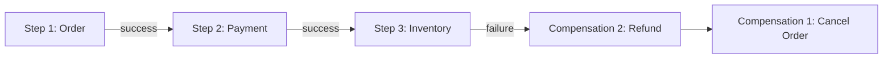
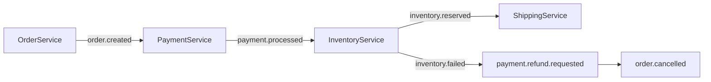
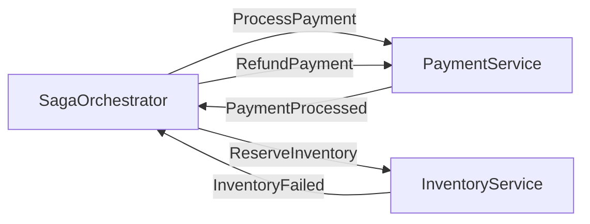
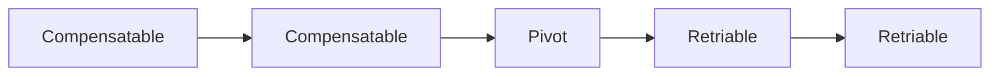

# Level 13: Saga Pattern

## The problem of distributed transactions

In a microservice architecture, one business scenario touches multiple services.
Imagine placing an order: you need to deduct money, reserve the product, and create a delivery —
all in different services with different databases. How do you guarantee consistency if one step fails?

The classic solution — **two-phase commit (2PC)** — doesn't work in microservices:
it requires a global coordinator, blocks resources, and catastrophically reduces availability.

```
Step 1: All participants say "ready" (PREPARE)
Step 2: Coordinator says "commit" or "rollback"
```

Problem: if the coordinator crashes between steps — resources are locked forever.

## The Saga Pattern

**Saga** is a sequence of local transactions where each transaction publishes
an event or sends a command to the next participant. If one step fails —
**compensating transactions** are executed for all previously completed steps.



Saga doesn't roll back transactions (like ACID), but **compensates** for already committed changes.

## Two implementation approaches

### Choreography

Services react to events on their own — there is no central coordinator.



**Pros:** no single point of failure, loose coupling.
**Cons:** hard to trace the full flow, logic spread across services.

### Orchestration

A central orchestrator sends commands to services and waits for responses.



**Pros:** centralized control, single place for saga business logic.
**Cons:** orchestrator can become a bottleneck, tighter coupling.

## Compensating transactions

Compensation is not a rollback. It's a new transaction that semantically cancels the effect of the previous one.

| Action | Compensation |
|---|---|
| Create order | Cancel order |
| Deduct money | Refund money |
| Reserve product | Release reservation |
| Create delivery | Cancel delivery |

A compensating transaction must be **idempotent** — repeated invocation should not
create duplicate refunds or double cancellations.

## Transaction types in Saga

- **Compensatable** — can be compensated (all steps before pivot)
- **Pivot** — point of no return; once passed, rollback is impossible
- **Retriable** — don't require compensation (executed after pivot, guaranteed to succeed)



## Saga with Kafka and RabbitMQ

**Kafka:** each service writes to a topic, the next reads from it.
Compensating events — separate topics or routing keys.

**RabbitMQ (Choreography):**

```
exchange: saga.events
  → payment.requested  → PaymentService queue
  → payment.completed  → InventoryService queue
  → payment.failed     → OrderService queue (compensation)
```

**RabbitMQ (Orchestration):**

```
exchange: saga.commands (direct)
  → payment.process    → PaymentService
  → inventory.reserve  → InventoryService
exchange: saga.replies (direct)
  → payment.processed  → Orchestrator
  → inventory.failed   → Orchestrator
```

## ⚠️ Common beginner mistakes

**Confusing compensation with rollback**

❌ Bad: thinking Saga rolls back a transaction like SQL ROLLBACK.
No — compensation is a new business transaction that can take time and also fail.

**Not making compensations idempotent**

❌ Bad:
```typescript
// Refund money every time the command is received
async function refundPayment(orderId: string) {
  await chargeCard(-amount) // twice!
}
```

✅ Good:
```typescript
async function refundPayment(orderId: string) {
  const existing = await db.findRefund(orderId)
  if (existing) return // already done
  await chargeCard(-amount)
  await db.saveRefund(orderId)
}
```

**Forgetting about pivot transaction**

❌ Bad: trying to compensate steps after the point of no return.
After sending a physical product, you can't "rollback" delivery — only create a return.

💡 Principle: compensating transactions execute in **strictly reverse** order of steps.
