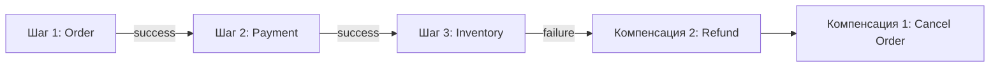
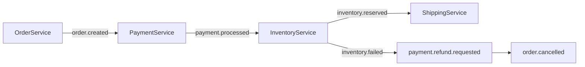
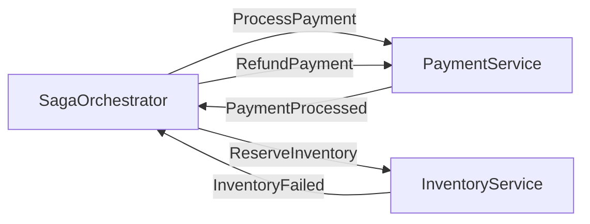
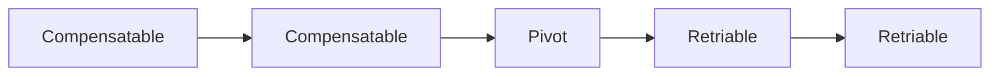

# Уровень 13: Паттерн Saga

## Проблема распределённых транзакций

В микросервисной архитектуре один бизнес-сценарий затрагивает несколько сервисов.
Представь оформление заказа: нужно списать деньги, зарезервировать товар и создать доставку —
и всё это в разных сервисах с разными базами данных. Как гарантировать согласованность, если один из шагов упадёт?

Классическое решение — **двухфазный коммит (2PC)** — не работает в микросервисах:
он требует глобального координатора, блокирует ресурсы и катастрофически снижает доступность.

```
Шаг 1: Все участники говорят "готов" (PREPARE)
Шаг 2: Координатор говорит "commit" или "rollback"
```

Проблема: если координатор упал между шагами — ресурсы заблокированы навсегда.

## Паттерн Saga

**Saga** — это последовательность локальных транзакций, где каждая транзакция публикует
событие или отправляет команду следующему участнику. Если один шаг падает — выполняются
**компенсирующие транзакции** для всех уже выполненных шагов.



Saga не откатывает транзакции (как ACID), а **компенсирует** уже зафиксированные изменения.

## Два подхода к реализации

### Choreography (Хореография)

Сервисы реагируют на события самостоятельно — нет центрального координатора.



**Плюсы:** нет единой точки отказа, слабая связанность.
**Минусы:** сложно отследить весь поток, логика размазана по сервисам.

### Orchestration (Оркестрация)

Центральный оркестратор отправляет команды сервисам и ждёт ответов.



**Плюсы:** централизованный контроль, единое место для бизнес-логики саги.
**Минусы:** оркестратор может стать узким местом, выше связанность.

## Компенсирующие транзакции

Компенсация — это не rollback. Это новая транзакция, которая семантически отменяет эффект предыдущей.

| Действие | Компенсация |
|---|---|
| Создать заказ | Отменить заказ |
| Списать деньги | Вернуть деньги (refund) |
| Зарезервировать товар | Снять резервирование |
| Создать доставку | Отменить доставку |

Компенсирующая транзакция должна быть **идемпотентной** — повторный вызов не должен
создавать дубликаты возвратов или двойных отмен.

## Типы транзакций в Saga

- **Compensatable** — могут быть компенсированы (все шаги до pivot)
- **Pivot** — точка невозврата; если прошла — rollback невозможен
- **Retriable** — не требуют компенсации (выполняются после pivot, гарантированно успешны)



## Saga с Kafka и RabbitMQ

**Kafka:** каждый сервис пишет в топик, следующий читает из него.
Компенсирующие события — отдельные топики или routing key.

**RabbitMQ (Choreography):**

```
exchange: saga.events
  → payment.requested  → PaymentService queue
  → payment.completed  → InventoryService queue
  → payment.failed     → OrderService queue (compensation)
```

**RabbitMQ (Orchestration):**

```
exchange: saga.commands (direct)
  → payment.process    → PaymentService
  → inventory.reserve  → InventoryService
exchange: saga.replies (direct)
  → payment.processed  → Orchestrator
  → inventory.failed   → Orchestrator
```

## ⚠️ Частые ошибки начинающих

**Путают компенсацию с rollback**

❌ Плохо: думать, что Saga отменяет транзакцию как в SQL ROLLBACK.
Нет — компенсация это новая бизнес-транзакция, которая может занять время и тоже упасть.

**Не делают компенсации идемпотентными**

❌ Плохо:
```typescript
// Вернуть деньги каждый раз при получении команды
async function refundPayment(orderId: string) {
  await chargeCard(-amount) // дважды!
}
```

✅ Хорошо:
```typescript
async function refundPayment(orderId: string) {
  const existing = await db.findRefund(orderId)
  if (existing) return // уже выполнено
  await chargeCard(-amount)
  await db.saveRefund(orderId)
}
```

**Забывают про pivot transaction**

❌ Плохо: пытаться компенсировать шаги после точки невозврата.
После отправки физического товара нельзя "откатить" доставку — только создать возврат.

💡 Принцип: компенсирующие транзакции выполняются в **строго обратном** порядке шагов.
