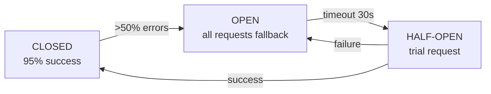

# Level 14: Reliability Patterns — Detailed Theory

## Introduction: why reliability is not optional

In an ideal world, a message is sent exactly once, immediately processed, and never lost.
In the real world, there are:

- **Network failures** — packets are lost, connections drop
- **Service overload** — consumer can't keep up, returns 503
- **Corrupted data** — invalid JSON, null in a required field, wrong format
- **Code bugs** — NullPointerException, division by zero, wrong business logic
- **Broker rebalancing** — Kafka rebalancing, RabbitMQ reconnect

Each of these can lead to duplication, loss, or "stuck" messages.
Reliability patterns solve these problems systematically.

---

## Part 1: Retry Patterns

### Error classification: where to start

Before retrying, understand the error. Not all errors deserve a retry.

**Transient errors** — the situation will fix itself:
- Network timeout
- HTTP 503 Service Unavailable
- Database deadlock / lock timeout
- Rate limiting (HTTP 429)
- Temporary downstream service unavailability

**Permanent errors** — retry is pointless:
- HTTP 400 Bad Request (data is wrong)
- HTTP 404 Not Found (resource doesn't exist)
- JsonParseException (corrupt JSON)
- NullPointerException on a required field
- Business validation error

```typescript
// Classification in code
function isRetryable(error: Error): boolean {
  if (error instanceof NetworkError) return true
  if (error instanceof HttpError) {
    return error.status === 503 || error.status === 429 || error.status >= 500
  }
  if (error instanceof ValidationError) return false
  if (error instanceof ParseError) return false
  return false // when in doubt — don't retry
}
```

### Simple Retry

The simplest strategy: retry N times with a fixed pause.

```typescript
async function simpleRetry<T>(
  fn: () => Promise<T>,
  maxAttempts: number,
  delay: number
): Promise<T> {
  for (let attempt = 1; attempt <= maxAttempts; attempt++) {
    try {
      return await fn()
    } catch (error) {
      if (attempt === maxAttempts) throw error
      await sleep(delay)
    }
  }
  throw new Error('Unreachable')
}
```

**Problem:** with many clients, they all retry simultaneously at the same interval.
This is called **Thundering Herd** — a herd of elephants simultaneously trying one door.

### Exponential Backoff

Delay grows exponentially: `delay = baseDelay * multiplier^(attempt - 1)`.

```typescript
function calcExponentialDelay(
  attempt: number,
  baseDelay: number,
  multiplier: number,
  maxDelay: number = 60_000
): number {
  const delay = baseDelay * Math.pow(multiplier, attempt - 1)
  return Math.min(delay, maxDelay) // cap — prevent infinite growth
}
```

**Cap (delay ceiling)** is mandatory — without it, with many attempts the delay
becomes absurd (hours, days).

### Jitter: fighting the Thundering Herd

All three strategies suffer from one problem: with 1000 clients, they all retry
simultaneously. Jitter adds randomness:

**Full Jitter** — completely random delay in range [0, calculatedDelay]:

```typescript
function fullJitter(delay: number): number {
  return Math.random() * delay
}
```

✅ Best for reducing server load — no client synchronization.
❌ Average delay is less than without jitter — sometimes the client waits very little.

**Equal Jitter** — half fixed, half random:

```typescript
function equalJitter(delay: number): number {
  const half = delay / 2
  return half + Math.random() * half
}
```

✅ Guarantees a minimum delay, but still scatters clients over time.

### Circuit Breaker + Retry combo

Retry alone can make things worse: if a service is "dying", 1000 clients
start flooding it with retries. **Circuit Breaker** tracks the error percentage
and temporarily "disconnects" all requests to the unhealthy service.



💡 Combination: Circuit Breaker checks the service state, Retry with Backoff handles
individual attempts. If CB is open — no Retry needed, go straight to DLQ or fallback.

---

## Part 2: Idempotency and Deduplication

### Why idempotency is needed

In systems with at-least-once delivery (RabbitMQ, Kafka by default), one message
can be processed multiple times:

1. Consumer processed the message but crashed before sending ack
2. Broker considers the message undelivered and sends it again
3. Consumer processes the same message again

Without protection, this leads to: double charges, duplicate emails, double orders.

**Idempotent operation** — an operation whose result is the same after one or N repeated calls:

```typescript
// NOT idempotent
async function incrementCounter(userId: string) {
  await db.query('UPDATE users SET counter = counter + 1 WHERE id = $1', [userId])
}

// Idempotent
async function setCounterToFive(userId: string) {
  await db.query('UPDATE users SET counter = 5 WHERE id = $1', [userId])
}
```

### Idempotency Key: the main strategy

Each message gets a unique identifier. Before processing, we check
if we've seen this ID before.

**Key generation strategies:**

```typescript
// UUID v4 — completely random
const messageId = uuidv4()

// UUID v7 — lexicographically sortable (monotonically increasing)
// Better for databases with B-Tree indexes
const messageId = uuidv7()

// Deterministic key from content (UUID v5 / SHA-256)
// Same content = same key
const messageId = createHash('sha256')
  .update(`${orderId}:${amount}:${timestamp}`)
  .digest('hex')
  .slice(0, 32)
```

### Storage for deduplication store

**In-Memory Set** — suitable for a single node, not persistent:

```typescript
const seenIds = new Set<string>()

function isDuplicate(id: string): boolean {
  if (seenIds.has(id)) return true
  seenIds.add(id)
  return false
}
```

**Redis with TTL** — standard production solution:

```typescript
async function isDuplicate(id: string, ttl = 86400): Promise<boolean> {
  const result = await redis.set(`dedup:${id}`, '1', 'EX', ttl, 'NX')
  return result === null // null = key already existed = duplicate
}
```

**PostgreSQL with UNIQUE constraint** — transactional guarantee:

```sql
CREATE TABLE processed_messages (
  message_id VARCHAR(64) PRIMARY KEY,
  processed_at TIMESTAMP DEFAULT NOW()
);

-- On processing:
INSERT INTO processed_messages (message_id)
VALUES ($1)
ON CONFLICT (message_id) DO NOTHING
RETURNING message_id;
-- If NULL returned — it's a duplicate
```

### Bloom Filter for scalable deduplication

At very high message volumes, storing all IDs in Redis is expensive.
**Bloom Filter** — a probabilistic data structure with possible false positives but no false negatives.

```
Bloom Filter says "not seen" → definitely not seen (proceed)
Bloom Filter says "seen"     → probably seen (check in Redis)
```

💡 Bloom Filter saves 90%+ Redis queries under high traffic.

---

## Part 3: Poison Messages and Dead Letter Queue

### What is a poison message

**Poison message** — a message that the consumer cannot process due to a permanent error,
independent of temporary factors.

Typical causes:
- Corrupt JSON or XML
- Null in a required field
- Reference to a non-existent resource
- Business invariant violation
- Schema incompatibility (schema evolution)

If not isolated, the poison message will loop in the queue forever,
consuming resources and blocking normal messages.

### Detection: delivery count header

Brokers and consumers maintain a delivery attempt counter. RabbitMQ sets
`x-delivery-count` in headers on each nack/requeue.

```typescript
function onMessage(msg: ConsumeMessage, channel: Channel) {
  const deliveryCount = (msg.properties.headers?.['x-delivery-count'] as number) ?? 0

  if (deliveryCount >= MAX_DELIVERY_COUNT) {
    // This is a poison message — send to DLQ
    forwardToDLQ(msg)
    channel.ack(msg) // acknowledge the original message
    return
  }

  try {
    processMessage(msg)
    channel.ack(msg)
  } catch (error) {
    if (isRetryable(error)) {
      channel.nack(msg, false, true) // requeue = true
    } else {
      // Straight to DLQ without retry
      forwardToDLQ(msg)
      channel.ack(msg)
    }
  }
}
```

### Quarantine strategies

**Strategy 1: Dead Letter Exchange (RabbitMQ native)**

```typescript
// When creating the queue
channel.assertQueue('orders.main', {
  arguments: {
    'x-dead-letter-exchange': 'orders.dlx',
    'x-dead-letter-routing-key': 'orders.dead',
    'x-max-delivery-count': 3,
    'x-message-ttl': 300_000, // 5 minutes max in queue
  }
})
```

**Strategy 2: Manual forwarding (more control)**

```typescript
async function forwardToDLQ(msg: ConsumeMessage) {
  const enrichedMsg = {
    originalPayload: msg.content.toString(),
    originalQueue: 'orders.main',
    failedAt: new Date().toISOString(),
    deliveryCount: msg.properties.headers?.['x-delivery-count'],
    error: lastError?.message,
  }
  channel.publish('', 'orders.dlq', Buffer.from(JSON.stringify(enrichedMsg)))
}
```

**Strategy 3: Quarantine zone (separate queue + pauses)**

Poison messages go to quarantine, not the final DLQ. From quarantine, they can
be reprocessed after code fix or data cleanup.

### DLQ monitoring and replay

**Monitoring** — DLQ must be under alerts. Message accumulation in DLQ = lost business data.

**Replay** — after a code fix, messages from DLQ can be resent:

```typescript
async function replayDLQ(dlqName: string, targetQueue: string, limit = 100) {
  let replayed = 0
  while (replayed < limit) {
    const msg = await channel.get(dlqName, { noAck: false })
    if (!msg) break

    const wrapper = JSON.parse(msg.content.toString())
    const originalPayload = Buffer.from(wrapper.originalPayload)

    channel.sendToQueue(targetQueue, originalPayload, {
      headers: { 'x-replayed-from-dlq': dlqName }
    })

    channel.ack(msg)
    replayed++
  }
  console.log(`Replayed ${replayed} messages from DLQ`)
}
```

---

## Part 4: Error Classification and Graceful Degradation

### Full error classification

```typescript
enum ErrorCategory {
  TRANSIENT_NETWORK = 'transient_network',
  TRANSIENT_OVERLOAD = 'transient_overload',
  RATE_LIMITED = 'rate_limited',
  INVALID_DATA = 'invalid_data',
  BUSINESS_RULE = 'business_rule',
  NOT_FOUND = 'not_found',
  DOWNSTREAM_DEAD = 'downstream_dead',
}
```

### Graceful Degradation

The system should degrade gradually, not crash completely.

```typescript
async function getProductPrice(productId: string): Promise<number> {
  try {
    return await pricingService.getPrice(productId)
  } catch (error) {
    // Graceful degradation: fallback to cache
    const cached = await cache.get(`price:${productId}`)
    if (cached) return cached.price

    // Second level: default price
    const fallbackPrice = await db.getLastKnownPrice(productId)
    if (fallbackPrice) return fallbackPrice

    // Critical failure: can't show price
    throw new ServiceDegradedError('Pricing service unavailable')
  }
}
```

---

## ⚠️ Common beginner mistakes

**1. Retrying on permanent errors**

❌ Bad: retrying 404 Not Found — the resource won't appear from retries.

✅ Good: check error type, send to DLQ immediately for permanent errors.

**2. No cap on delay**

❌ Bad: `attempt=20: delay = 1 * 2^19 = 524288 seconds ≈ 6 days`

✅ Good: `Math.min(baseDelay * Math.pow(2, attempt), 60_000)` — max 60s.

**3. Non-atomic Idempotency Key with processing**

❌ Bad: race condition — two consumers can pass the check simultaneously.

✅ Good: `SET NX` — atomic operation.

**4. Ignoring DLQ**

❌ Bad: configured DLQ and forgot about it.

✅ Good: monitoring + alerts + runbook for replay.

**5. No jitter with many instances**

❌ Bad: 100 instances all wait exactly 2 seconds and attack the service simultaneously.

✅ Good: equal jitter — `delay / 2 + Math.random() * (delay / 2)`.

---

## Practice: full reliable consumer implementation

```typescript
class ReliableConsumer {
  private readonly seenIds = new Set<string>()
  private readonly circuitBreaker = new CircuitBreaker()

  async consume(msg: ConsumeMessage, channel: Channel) {
    const messageId = msg.properties.messageId
    const deliveryCount = msg.properties.headers?.['x-delivery-count'] ?? 0

    // 1. Deduplication check
    if (messageId && this.seenIds.has(messageId)) {
      console.log(`Duplicate message ${messageId}, skipping`)
      channel.ack(msg)
      return
    }

    // 2. Poison message detection
    if (deliveryCount >= MAX_DELIVERY_COUNT) {
      await this.sendToDLQ(msg, 'max_delivery_count_exceeded')
      channel.ack(msg)
      return
    }

    // 3. Processing with Circuit Breaker
    try {
      await this.circuitBreaker.call(() => this.processMessage(msg))
      if (messageId) this.seenIds.add(messageId)
      channel.ack(msg)
    } catch (error) {
      if (!isRetryable(error)) {
        await this.sendToDLQ(msg, error.message)
        channel.ack(msg)
        return
      }
      // Temporary error — requeue for retry
      channel.nack(msg, false, deliveryCount < MAX_DELIVERY_COUNT)
    }
  }
}
```

💡 Key principle: reliability is multi-layered defense. Each layer (retry, dedup, DLQ)
solves its own task, and together they create a system that survives in real-world conditions.
