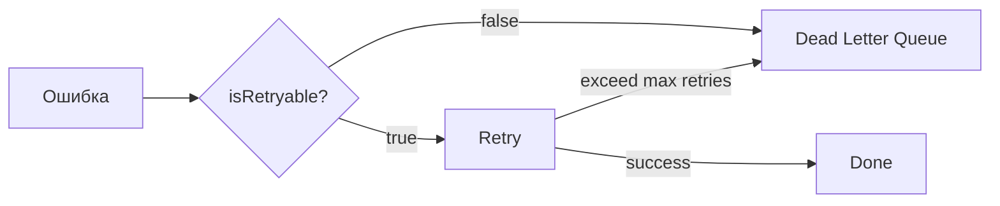
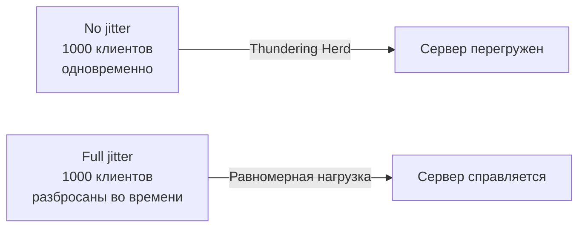
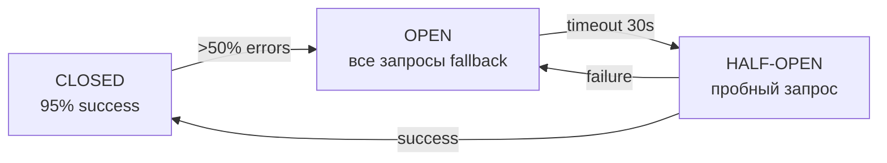
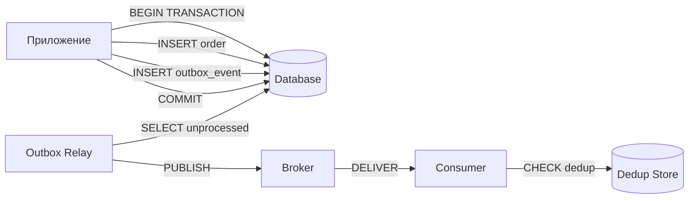
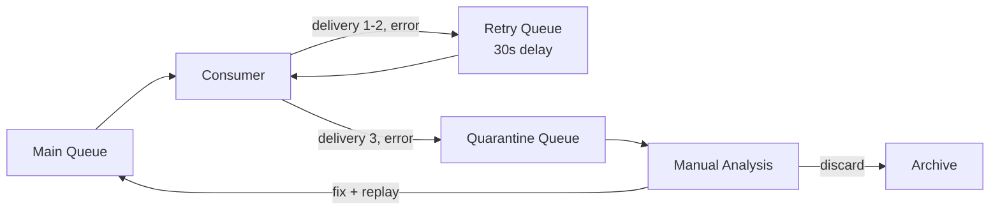
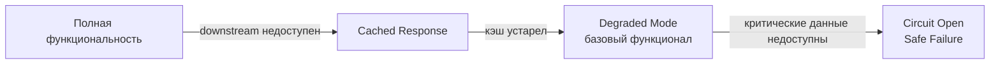

# Уровень 14: Паттерны надёжности — подробная теория

## Введение: почему надёжность — это не опция

В идеальном мире сообщение отправляется ровно один раз, сразу обрабатывается и никогда не теряется.
В реальном мире существуют:

- **Сетевые сбои** — пакеты теряются, соединения обрываются
- **Перегрузка сервисов** — consumer не успевает обрабатывать, возвращает 503
- **Битые данные** — невалидный JSON, null в обязательном поле, неверный формат
- **Баги в коде** — NullPointerException, деление на ноль, неверная бизнес-логика
- **Перебалансировка брокера** — Kafka rebalancing, RabbitMQ reconnect

Каждая из этих ситуаций может привести к дублированию, потере или "зависанию" сообщений.
Паттерны надёжности решают эти проблемы системно.

---

## Часть 1: Retry паттерны

### Классификация ошибок: с чего начать

Прежде чем делать retry, нужно понять природу ошибки. Не все ошибки заслуживают повтора.

**Transient (временные) ошибки** — ситуация исправится сама:
- Сетевой таймаут
- HTTP 503 Service Unavailable
- Database deadlock / lock timeout
- Rate limiting (HTTP 429)
- Временная недоступность downstream сервиса

**Permanent (постоянные) ошибки** — повтор бессмысленен:
- HTTP 400 Bad Request (данные неверны)
- HTTP 404 Not Found (ресурса нет)
- JsonParseException (битый JSON)
- NullPointerException на обязательном поле
- Ошибка бизнес-валидации

```typescript
// Классификация в коде
function isRetryable(error: Error): boolean {
  if (error instanceof NetworkError) return true
  if (error instanceof HttpError) {
    return error.status === 503 || error.status === 429 || error.status >= 500
  }
  if (error instanceof ValidationError) return false
  if (error instanceof ParseError) return false
  return false // при сомнении — не делаем retry
}
```



### Simple Retry

Самая простая стратегия: повторить N раз с фиксированной паузой.

```typescript
async function simpleRetry<T>(
  fn: () => Promise<T>,
  maxAttempts: number,
  delay: number
): Promise<T> {
  for (let attempt = 1; attempt <= maxAttempts; attempt++) {
    try {
      return await fn()
    } catch (error) {
      if (attempt === maxAttempts) throw error
      await sleep(delay)
    }
  }
  throw new Error('Unreachable')
}
```

**Проблема:** при многих клиентах все начинают повторять одновременно через одинаковый интервал.
Это называется **Thundering Herd** — стадо слонов одновременно ломится в одну дверь.

### Linear Backoff

Задержка растёт линейно: `delay = baseDelay * attempt`.

```
Попытка 1: 1s
Попытка 2: 2s
Попытка 3: 3s
Попытка 4: 4s
```

Лучше, чем simple retry, но недостаточно для высоконагруженных систем.

### Exponential Backoff

Задержка растёт по экспоненте: `delay = baseDelay * multiplier^(attempt - 1)`.

```typescript
function calcExponentialDelay(
  attempt: number,
  baseDelay: number,
  multiplier: number,
  maxDelay: number = 60_000
): number {
  const delay = baseDelay * Math.pow(multiplier, attempt - 1)
  return Math.min(delay, maxDelay) // cap — не даём расти бесконечно
}
```

```
baseDelay=1000ms, multiplier=2:
Попытка 1: 1000ms
Попытка 2: 2000ms
Попытка 3: 4000ms
Попытка 4: 8000ms
Попытка 5: 16000ms
```

**Cap (потолок задержки)** обязателен — без него при большом числе попыток задержка
становится абсурдной (часы, дни).

### Polynomial Backoff

Задержка растёт как степень попытки: `delay = baseDelay * attempt^power`.
Менее агрессивен, чем экспоненциальный при `power < multiplier`.

```typescript
const delay = baseDelay * Math.pow(attempt, 2) // power=2 — квадратичный
```

### Jitter: борьба с Thundering Herd

Все три стратегии страдают от одной проблемы: при 1000 клиентах они все повторяют
одновременно. Jitter добавляет случайность:

**Full Jitter** — полностью случайная задержка в диапазоне [0, calculatedDelay]:

```typescript
function fullJitter(delay: number): number {
  return Math.random() * delay
}
```

✅ Лучший вариант для снижения нагрузки на сервер — нет синхронизации между клиентами.
❌ Средняя задержка меньше, чем без jitter — иногда клиент ждёт очень мало.

**Equal Jitter** — половина фиксированная, половина случайная:

```typescript
function equalJitter(delay: number): number {
  const half = delay / 2
  return half + Math.random() * half
}
```

✅ Гарантирует минимальную задержку, но всё равно разбрасывает клиентов во времени.

**Decorrelated Jitter** — AWS рекомендует этот вариант:

```typescript
function decorrelatedJitter(
  prevDelay: number,
  baseDelay: number,
  maxDelay: number
): number {
  return Math.min(maxDelay, Math.random() * (prevDelay * 3 - baseDelay) + baseDelay)
}
```



### Circuit Breaker + Retry комбо

Retry сам по себе может усугубить ситуацию: если сервис "умирает", 1000 клиентов
начинают его заваливать повторами. **Circuit Breaker** отслеживает процент ошибок
и временно "отключает" все запросы к нездоровому сервису.



```typescript
class CircuitBreaker {
  private state: 'CLOSED' | 'OPEN' | 'HALF_OPEN' = 'CLOSED'
  private failureCount = 0
  private lastFailureTime = 0

  async call<T>(fn: () => Promise<T>): Promise<T> {
    if (this.state === 'OPEN') {
      if (Date.now() - this.lastFailureTime > 30_000) {
        this.state = 'HALF_OPEN'
      } else {
        throw new Error('Circuit breaker is OPEN')
      }
    }

    try {
      const result = await fn()
      this.onSuccess()
      return result
    } catch (error) {
      this.onFailure()
      throw error
    }
  }

  private onSuccess() {
    this.failureCount = 0
    this.state = 'CLOSED'
  }

  private onFailure() {
    this.failureCount++
    this.lastFailureTime = Date.now()
    if (this.failureCount >= 5) this.state = 'OPEN'
  }
}
```

💡 Комбинация: Circuit Breaker проверяет состояние сервиса, Retry с Backoff обрабатывает
конкретные попытки. Если CB открыт — Retry не нужен, сразу в DLQ или fallback.

---

## Часть 2: Idempotency и дедупликация

### Зачем нужна идемпотентность

В системах с at-least-once доставкой (RabbitMQ, Kafka по умолчанию) одно сообщение
может обработаться несколько раз:

1. Consumer обработал сообщение, но упал до отправки ack
2. Breker считает сообщение недоставленным и отправляет снова
3. Consumer снова обрабатывает то же самое сообщение

Без защиты это приводит к: двойным списаниям, дублированным email, двойным заказам.

**Идемпотентная операция** — операция, результат которой одинаков при одном и N повторных вызовах:

```typescript
// НЕ идемпотентно
async function incrementCounter(userId: string) {
  await db.query('UPDATE users SET counter = counter + 1 WHERE id = $1', [userId])
}

// Идемпотентно
async function setCounterToFive(userId: string) {
  await db.query('UPDATE users SET counter = 5 WHERE id = $1', [userId])
}
```

### Idempotency Key: основная стратегия

Каждое сообщение получает уникальный идентификатор. Перед обработкой проверяем,
не видели ли мы этот ID раньше.

**Стратегии генерации ключей:**

```typescript
// UUID v4 — полностью случайный
import { v4 as uuidv4 } from 'uuid'
const messageId = uuidv4() // '550e8400-e29b-41d4-a716-446655440000'

// UUID v7 — лексикографически сортируемый (монотонно возрастающий)
// Лучше для баз данных с B-Tree индексами
const messageId = uuidv7()

// Детерминированный ключ из содержимого (UUID v5 / SHA-256)
// Одинаковое содержимое = одинаковый ключ
import { createHash } from 'crypto'
const messageId = createHash('sha256')
  .update(`${orderId}:${amount}:${timestamp}`)
  .digest('hex')
  .slice(0, 32)

// Snowflake ID (Twitter/Discord подход)
// 64-bit: timestamp (41 bit) + machine_id (10 bit) + sequence (12 bit)
// Гарантирует уникальность без координации между нодами
```

### Хранилища для deduplication store

**In-Memory Set** — подходит для одной ноды, не персистентно:

```typescript
const seenIds = new Set<string>()

function isDuplicate(id: string): boolean {
  if (seenIds.has(id)) return true
  seenIds.add(id)
  return false
}
```

**Redis с TTL** — стандартное production решение:

```typescript
async function isDuplicate(id: string, ttl = 86400): Promise<boolean> {
  const result = await redis.set(`dedup:${id}`, '1', 'EX', ttl, 'NX')
  return result === null // null = ключ уже существовал = дубликат
}
```

**PostgreSQL с UNIQUE constraint** — транзакционная гарантия:

```sql
CREATE TABLE processed_messages (
  message_id VARCHAR(64) PRIMARY KEY,
  processed_at TIMESTAMP DEFAULT NOW()
);

-- При обработке:
INSERT INTO processed_messages (message_id)
VALUES ($1)
ON CONFLICT (message_id) DO NOTHING
RETURNING message_id;
-- Если вернуло NULL — это дубликат
```

### Bloom Filter для масштабируемой дедупликации

При очень большом объёме сообщений хранить все ID в Redis накладно.
**Bloom Filter** — вероятностная структура данных с возможными false positive, но без false negative.

```
Bloom Filter говорит "не видели" → точно не видели (пропускаем)
Bloom Filter говорит "видели"    → скорее всего видели (проверяем в Redis)
```

```typescript
import { BloomFilter } from 'bloom-filters'

const bloomFilter = BloomFilter.create(1_000_000, 0.01) // 1M элементов, 1% false positive

async function isDuplicate(id: string): Promise<boolean> {
  // Сначала быстрая проверка в памяти
  if (!bloomFilter.has(id)) {
    bloomFilter.add(id)
    return false // точно новое
  }
  // Только если bloom говорит "видели" — идём в Redis
  return redis.exists(`dedup:${id}`)
}
```

💡 Bloom Filter экономит 90%+ запросов к Redis при высоком трафике.

### Outbox + Deduplication комбо

Паттерн **Outbox** гарантирует атомарность: событие записывается в БД вместе с бизнес-транзакцией,
потом асинхронно публикуется в брокер. Это уже создаёт уникальный ID (primary key записи).



Outbox гарантирует at-least-once публикацию, дедупликация на consumer-е гарантирует
exactly-once processing.

---

## Часть 3: Poison Messages и Dead Letter Queue

### Что такое poison message

**Poison message (отравленное сообщение)** — сообщение, которое consumer не может
обработать из-за постоянной ошибки, не зависящей от временных факторов.

Типичные причины:
- Битый JSON или XML
- Null в обязательном поле
- Ссылка на несуществующий ресурс
- Нарушение бизнес-инварианта
- Несовместимость схемы (schema evolution)

Если не изолировать poison message — оно будет зацикливаться в очереди вечно,
потребляя ресурсы и блокируя нормальные сообщения.

### Обнаружение: delivery count header

Брокеры и consumer-ы ведут счётчик попыток доставки. RabbitMQ устанавливает
`x-delivery-count` в заголовках при каждом nack/requeue.

```typescript
interface ConsumeMessageHeaders {
  'x-delivery-count'?: number
  'x-death'?: XDeath[]
}

function onMessage(msg: ConsumeMessage, channel: Channel) {
  const deliveryCount = (msg.properties.headers?.['x-delivery-count'] as number) ?? 0

  if (deliveryCount >= MAX_DELIVERY_COUNT) {
    // Это poison message — отправляем в DLQ
    forwardToDLQ(msg)
    channel.ack(msg) // подтверждаем оригинальное сообщение
    return
  }

  try {
    processMessage(msg)
    channel.ack(msg)
  } catch (error) {
    if (isRetryable(error)) {
      channel.nack(msg, false, true) // requeue = true
    } else {
      // Сразу в DLQ без retry
      forwardToDLQ(msg)
      channel.ack(msg)
    }
  }
}
```

### Стратегии карантина

**Стратегия 1: Dead Letter Exchange (RabbitMQ native)**

```typescript
// При создании очереди
channel.assertQueue('orders.main', {
  arguments: {
    'x-dead-letter-exchange': 'orders.dlx',
    'x-dead-letter-routing-key': 'orders.dead',
    'x-max-delivery-count': 3,
    'x-message-ttl': 300_000, // 5 минут максимум в очереди
  }
})

channel.assertExchange('orders.dlx', 'direct')
channel.assertQueue('orders.dead')
channel.bindQueue('orders.dead', 'orders.dlx', 'orders.dead')
```

**Стратегия 2: Manual forwarding (больше контроля)**

```typescript
async function forwardToDLQ(msg: ConsumeMessage) {
  const enrichedMsg = {
    originalPayload: msg.content.toString(),
    originalQueue: 'orders.main',
    failedAt: new Date().toISOString(),
    deliveryCount: msg.properties.headers?.['x-delivery-count'],
    error: lastError?.message,
  }
  channel.publish('', 'orders.dlq', Buffer.from(JSON.stringify(enrichedMsg)))
}
```

**Стратегия 3: Quarantine zone (отдельная очередь + паузы)**

Poison messages попадают в карантин, а не в финальную DLQ. Из карантина их можно
переобработать после фикса кода или очистки данных.



### DLQ мониторинг и переобработка

**Мониторинг** — DLQ должна быть под алертами. Накопление сообщений в DLQ = потеря бизнес-данных.

```typescript
// Prometheus метрика
const dlqDepthGauge = new Gauge({
  name: 'rabbitmq_dlq_depth',
  help: 'Number of messages in Dead Letter Queue',
  labelNames: ['queue'],
})

async function monitorDLQ() {
  const queueInfo = await rabbitMQAdmin.getQueue('orders.dead')
  dlqDepthGauge.labels({ queue: 'orders.dead' }).set(queueInfo.messages)

  if (queueInfo.messages > DLQ_ALERT_THRESHOLD) {
    await alerting.fire('DLQ_DEPTH_HIGH', queueInfo)
  }
}
```

**Переобработка (replay)** — после фикса кода можно переотправить сообщения из DLQ:

```typescript
async function replayDLQ(dlqName: string, targetQueue: string, limit = 100) {
  let replayed = 0
  while (replayed < limit) {
    const msg = await channel.get(dlqName, { noAck: false })
    if (!msg) break

    // Парсим enriched wrapper
    const wrapper = JSON.parse(msg.content.toString())
    const originalPayload = Buffer.from(wrapper.originalPayload)

    // Публикуем в основную очередь
    channel.sendToQueue(targetQueue, originalPayload, {
      headers: { 'x-replayed-from-dlq': dlqName }
    })

    channel.ack(msg)
    replayed++
  }
  console.log(`Replayed ${replayed} messages from DLQ`)
}
```

---

## Часть 4: Error Classification и Graceful Degradation

### Классификация ошибок (полная)

```typescript
enum ErrorCategory {
  // Retry без изменений
  TRANSIENT_NETWORK = 'transient_network',
  TRANSIENT_OVERLOAD = 'transient_overload',
  TRANSIENT_LOCK = 'transient_lock',

  // Retry с задержкой (rate limiting)
  RATE_LIMITED = 'rate_limited',

  // Прямо в DLQ
  INVALID_DATA = 'invalid_data',
  BUSINESS_RULE = 'business_rule',
  NOT_FOUND = 'not_found',

  // Circuit breaker + DLQ
  DOWNSTREAM_DEAD = 'downstream_dead',
}

function classifyError(error: Error): ErrorCategory {
  if (error instanceof NetworkTimeoutError) return ErrorCategory.TRANSIENT_NETWORK
  if (error instanceof ServiceUnavailableError) return ErrorCategory.TRANSIENT_OVERLOAD
  if (error instanceof RateLimitError) return ErrorCategory.RATE_LIMITED
  if (error instanceof ValidationError) return ErrorCategory.INVALID_DATA
  if (error instanceof NotFoundError) return ErrorCategory.NOT_FOUND
  // По умолчанию — пробуем retry, но осторожно
  return ErrorCategory.TRANSIENT_NETWORK
}
```

### Graceful Degradation

Система должна деградировать постепенно, а не падать полностью.



```typescript
async function getProductPrice(productId: string): Promise<number> {
  try {
    return await pricingService.getPrice(productId)
  } catch (error) {
    // Graceful degradation: fallback на кэш
    const cached = await cache.get(`price:${productId}`)
    if (cached) return cached.price

    // Второй уровень деградации: дефолтная цена
    const fallbackPrice = await db.getLastKnownPrice(productId)
    if (fallbackPrice) return fallbackPrice

    // Критический сбой: не можем показать цену
    throw new ServiceDegradedError('Pricing service unavailable')
  }
}
```

---

## ⚠️ Частые ошибки начинающих

**1. Retry на постоянные ошибки**

❌ Плохо:
```typescript
// Пробуем 5 раз получить несуществующий ресурс
for (let i = 0; i < 5; i++) {
  try {
    await api.getOrder(orderId) // 404 Not Found
  } catch {
    await sleep(1000 * i)
  }
}
```

Почему плохо: ресурс не появится от повторов. Мы зря тратим время и нагружаем сервис.

✅ Хорошо:
```typescript
try {
  await api.getOrder(orderId)
} catch (error) {
  if (error.status === 404) throw error // не retry, сразу в DLQ
  await retryWithBackoff(() => api.getOrder(orderId))
}
```

**2. Отсутствие cap на задержку**

❌ Плохо:
```typescript
// attempt=20: delay = 1 * 2^19 = 524288 секунд ≈ 6 дней
const delay = baseDelay * Math.pow(2, attempt)
```

✅ Хорошо:
```typescript
const delay = Math.min(baseDelay * Math.pow(2, attempt), 60_000) // max 60s
```

**3. Не делать Idempotency Key атомарным с обработкой**

❌ Плохо:
```typescript
// Race condition: два consumer могут пройти проверку одновременно
const seen = await redis.exists(`dedup:${id}`)
if (!seen) {
  // другой consumer тоже дошёл сюда!
  await processMessage(msg)
  await redis.set(`dedup:${id}`, '1')
}
```

✅ Хорошо:
```typescript
// SET NX — атомарная операция
const acquired = await redis.set(`dedup:${id}`, '1', 'EX', 86400, 'NX')
if (acquired === null) return // дубликат
await processMessage(msg)
```

**4. Игнорировать DLQ**

❌ Плохо:
```typescript
// Настроили DLQ и забыли про неё
channel.assertQueue('orders.dead') // никто не читает, никто не алертит
```

Почему плохо: через неделю в DLQ 10,000 необработанных заказов, бизнес потерял деньги.

✅ Хорошо:
```typescript
// Мониторинг + алерты + runbook для replay
setInterval(monitorDLQ, 30_000)
// Алерт если DLQ.depth > 10
// Runbook: как фиксить и переотправлять
```

**5. Нет jitter при многих инстансах**

❌ Плохо:
```typescript
// 100 инстансов все ждут ровно 2 секунды и атакуют сервис одновременно
await sleep(baseDelay * Math.pow(2, attempt))
```

✅ Хорошо:
```typescript
const delay = baseDelay * Math.pow(2, attempt)
const jittered = delay / 2 + Math.random() * (delay / 2) // equal jitter
await sleep(jittered)
```

---

## Практика: полная реализация надёжного consumer

```typescript
class ReliableConsumer {
  private readonly seenIds = new Set<string>()
  private readonly circuitBreaker = new CircuitBreaker()

  async consume(msg: ConsumeMessage, channel: Channel) {
    const messageId = msg.properties.messageId
    const deliveryCount = msg.properties.headers?.['x-delivery-count'] ?? 0

    // 1. Deduplication check
    if (messageId && this.seenIds.has(messageId)) {
      console.log(`Duplicate message ${messageId}, skipping`)
      channel.ack(msg)
      return
    }

    // 2. Poison message detection
    if (deliveryCount >= MAX_DELIVERY_COUNT) {
      await this.sendToDLQ(msg, 'max_delivery_count_exceeded')
      channel.ack(msg)
      return
    }

    // 3. Processing with Circuit Breaker
    try {
      await this.circuitBreaker.call(() => this.processMessage(msg))

      // 4. Mark as seen after successful processing
      if (messageId) this.seenIds.add(messageId)
      channel.ack(msg)
    } catch (error) {
      if (!isRetryable(error)) {
        await this.sendToDLQ(msg, error.message)
        channel.ack(msg)
        return
      }
      // Временная ошибка — requeue для retry
      channel.nack(msg, false, deliveryCount < MAX_DELIVERY_COUNT)
    }
  }

  private async processMessage(msg: ConsumeMessage) {
    const body = JSON.parse(msg.content.toString())
    await businessLogic.handle(body)
  }

  private async sendToDLQ(msg: ConsumeMessage, reason: string) {
    const enriched = {
      originalPayload: msg.content.toString(),
      reason,
      failedAt: new Date().toISOString(),
    }
    channel.sendToQueue('orders.dlq', Buffer.from(JSON.stringify(enriched)))
  }
}
```

💡 Ключевой принцип: надёжность — это многоуровневая защита. Каждый уровень (retry, dedup, DLQ)
решает свою задачу, и вместе они дают систему, которая выживает в реальных условиях.
