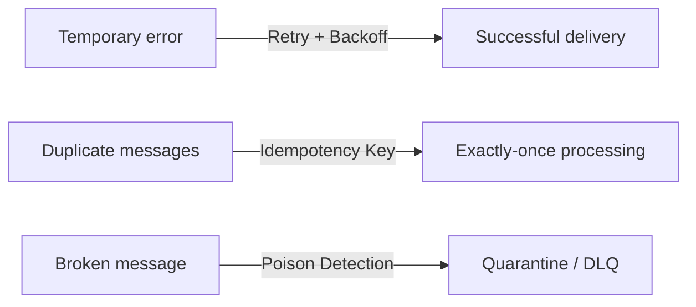
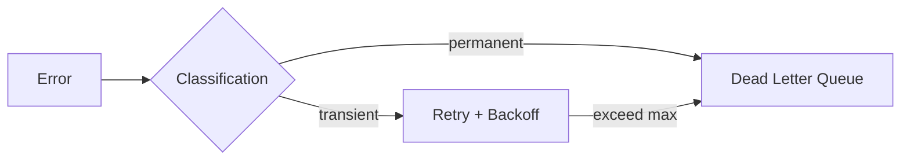
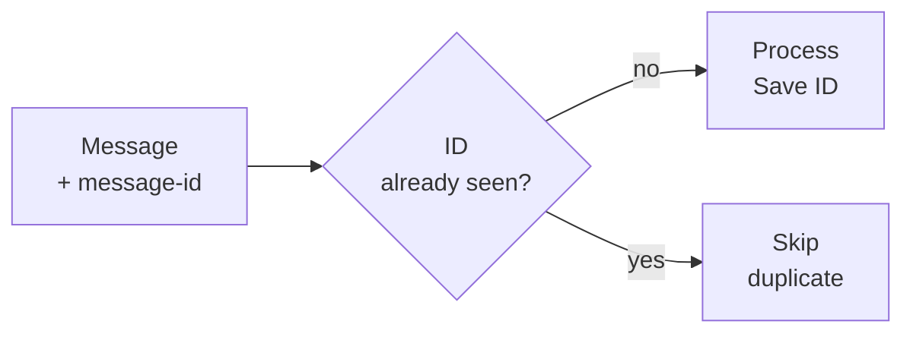
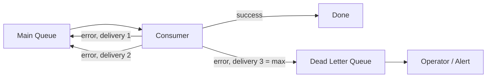
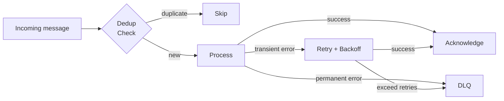

# Level 14: Reliability Patterns

## The unreliable delivery problem

Message brokers operate in distributed systems where failures are inevitable: networks drop,
services get overloaded, corrupted data arrives. Without special patterns, one temporary error
can lead to message loss or, conversely, infinite retries that overwhelm the system.

Three key problems and their solutions:



---

## Retry with Exponential Backoff

When a request fails, don't retry immediately — this creates a request storm and further
overloads the service. **Exponential Backoff** increases the delay between attempts exponentially.

```
Attempt 1: immediately
Attempt 2: +1s
Attempt 3: +2s
Attempt 4: +4s
Attempt 5: +8s  → DLQ
```

Delay formula: `delay = baseDelay * multiplier^(attempt - 1)`

```typescript
// baseDelay=1s, multiplier=2
attempt 1: 1 * 2^0 = 1s
attempt 2: 1 * 2^1 = 2s
attempt 3: 1 * 2^2 = 4s
attempt 4: 1 * 2^3 = 8s
```

**Jitter** adds randomness to the delay so multiple clients don't retry simultaneously:

```typescript
// Full jitter — random value in range [0, delay]
const jitteredDelay = Math.random() * delay

// Equal jitter — half fixed, half random
const jitteredDelay = delay / 2 + Math.random() * (delay / 2)
```

**Error classification** determines whether retry should even be attempted:

| Error type | Example | Retry? |
|---|---|---|
| Transient (temporary) | 503, network timeout, lock | Yes |
| Permanent | 400 Bad Request, 404, parse error | No |



⚠️ **Mistake:** retrying on 400 Bad Request. Data won't change — retries are pointless.

---

## Idempotency: message deduplication

In a distributed system, a message can arrive twice: due to retry, partition rebalancing,
or a crash at the moment of acknowledgment. **Idempotency** guarantees that repeated
processing of the same message creates no side effects.

The solution is an **Idempotency Key**: a unique identifier for each message, stored
in a deduplication store (Redis, PostgreSQL, Bloom Filter).



```typescript
// Simple implementation via Set (in-memory)
const seenIds = new Set<string>()

function processMessage(msg: Message) {
  if (seenIds.has(msg.id)) {
    console.log('Duplicate, skipping:', msg.id)
    return
  }
  seenIds.add(msg.id)
  handleBusiness(msg)
}
```

💡 In real systems, Redis with TTL is used so the storage doesn't grow indefinitely:

```
SET dedup:{message-id} 1 EX 86400  // TTL = 24 hours
```

⚠️ **Mistake:** skipping deduplication, relying on exactly-once broker guarantees.
RabbitMQ doesn't guarantee exactly-once out of the box; Kafka only guarantees it within one
producer when idempotent producer is enabled.

---

## Poison Messages and Dead Letter Queue

**Poison message** — a message that repeatedly causes errors during processing:
corrupt JSON, null in a required field, non-existent ID. Retry doesn't help — data won't change.

If not isolated, such a message will block the queue indefinitely.

**Dead Letter Queue (DLQ)** — a special queue for messages that couldn't be processed.



Detection mechanism — **delivery count header**: the broker or consumer increments a counter
on each failed attempt. Once the counter reaches `maxDeliveries` — the message goes to DLQ.

In RabbitMQ this is configured via `x-max-delivery-count` and `x-dead-letter-exchange`.

```typescript
// Check delivery count on the consumer side
function onMessage(msg: ConsumeMessage) {
  const deliveryCount = msg.properties.headers?.['x-delivery-count'] ?? 0
  if (deliveryCount >= MAX_DELIVERIES) {
    sendToDLQ(msg)
    channel.ack(msg)
    return
  }
  try {
    process(msg)
    channel.ack(msg)
  } catch {
    channel.nack(msg, false, true) // requeue
  }
}
```

⚠️ **Mistake:** not monitoring DLQ. Messages in DLQ are an alarm signal requiring immediate
attention. Without alerts, they accumulate silently and business events are lost.

---

## How the patterns connect



💡 All three patterns work together: Retry handles transient failures, Idempotency protects
against re-processing during retry, and DLQ isolates unfixable errors.
