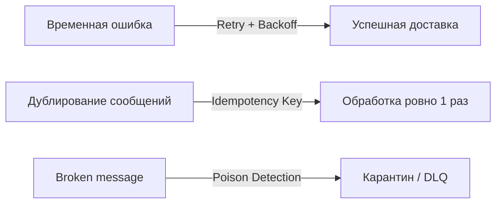
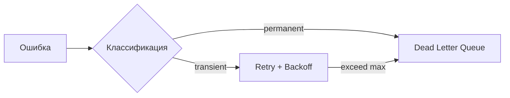
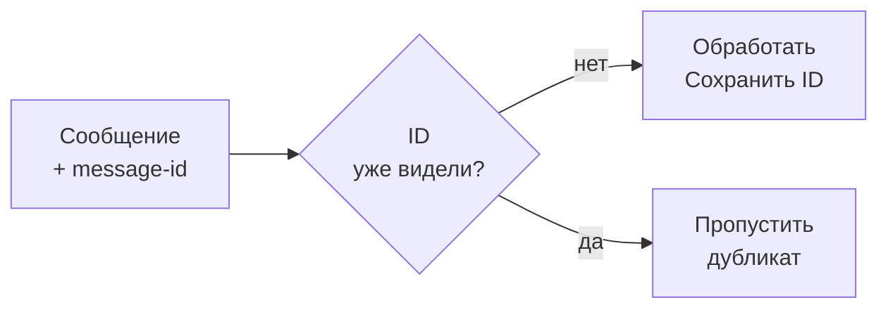
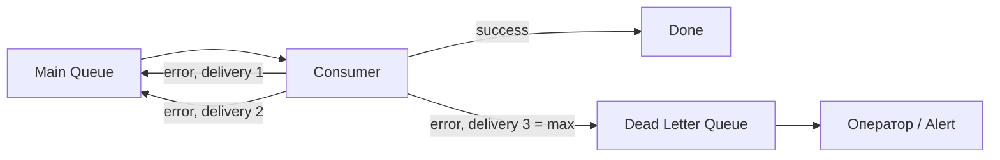
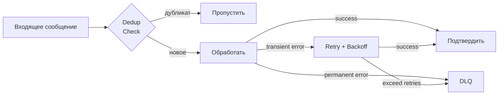

# Уровень 14: Паттерны надёжности

## Проблема ненадёжной доставки

Брокеры сообщений работают в распределённых системах, где сбои неизбежны: сеть падает,
сервисы перегружаются, данные приходят битыми. Без специальных паттернов одна временная ошибка
может привести к потере сообщений или, наоборот, к бесконечным повторам, которые перегружают систему.

Три ключевых проблемы и их решения:



---

## Retry с Exponential Backoff

Когда запрос падает, не стоит сразу повторять — это создаёт шторм запросов и ещё сильнее
перегружает сервис. **Exponential Backoff** увеличивает задержку между попытками по экспоненте.

```
Попытка 1: немедленно
Попытка 2: +1s
Попытка 3: +2s
Попытка 4: +4s
Попытка 5: +8s  → DLQ
```

Формула задержки: `delay = baseDelay * multiplier^(attempt - 1)`

```typescript
// baseDelay=1s, multiplier=2
attempt 1: 1 * 2^0 = 1s
attempt 2: 1 * 2^1 = 2s
attempt 3: 1 * 2^2 = 4s
attempt 4: 1 * 2^3 = 8s
```

**Jitter** добавляет случайность к задержке, чтобы несколько клиентов не повторяли одновременно:

```typescript
// Full jitter — случайное значение в диапазоне [0, delay]
const jitteredDelay = Math.random() * delay

// Equal jitter — половина фиксированная, половина случайная
const jitteredDelay = delay / 2 + Math.random() * (delay / 2)
```

**Классификация ошибок** определяет, стоит ли вообще делать retry:

| Тип ошибки | Пример | Retry? |
|---|---|---|
| Transient (временная) | 503, network timeout, lock | Да |
| Permanent (постоянная) | 400 Bad Request, 404, parse error | Нет |



⚠️ **Ошибка:** делать retry на 400 Bad Request. Данные не изменятся — повторы бессмысленны.

---

## Idempotency: дедупликация сообщений

В распределённой системе сообщение может прийти дважды: из-за retry, перебалансировки
партиций или сбоя в момент подтверждения. **Idempotency** гарантирует, что повторная
обработка одного и того же сообщения не создаёт побочных эффектов.

Решение — **Idempotency Key**: уникальный идентификатор каждого сообщения, хранящийся
в deduplications store (Redis, PostgreSQL, Bloom Filter).



```typescript
// Простая реализация через Set (в памяти)
const seenIds = new Set<string>()

function processMessage(msg: Message) {
  if (seenIds.has(msg.id)) {
    console.log('Duplicate, skipping:', msg.id)
    return
  }
  seenIds.add(msg.id)
  handleBusiness(msg)
}
```

💡 В реальных системах используют Redis с TTL, чтобы хранилище не росло бесконечно:

```
SET dedup:{message-id} 1 EX 86400  // TTL = 24 часа
```

⚠️ **Ошибка:** не делать дедупликацию, полагаясь на exactly-once гарантии брокера.
RabbitMQ не гарантирует exactly-once из коробки; Kafka гарантирует только в рамках одного
producer-а при включённом idempotent producer.

---

## Poison Messages и Dead Letter Queue

**Poison message** — сообщение, которое раз за разом вызывает ошибку при обработке:
битый JSON, null в обязательном поле, несуществующий ID. Retry не помогает — данные не изменятся.

Если не изолировать такое сообщение, оно будет блокировать очередь бесконечно.

**Dead Letter Queue (DLQ)** — специальная очередь для сообщений, которые не удалось обработать.



Механизм обнаружения — **delivery count header**: брокер или consumer инкрементирует счётчик
при каждой неудачной попытке. Как только счётчик достигает `maxDeliveries` — сообщение уходит в DLQ.

В RabbitMQ это настраивается через `x-max-delivery-count` и `x-dead-letter-exchange`.

```typescript
// Проверка delivery count на стороне consumer
function onMessage(msg: ConsumeMessage) {
  const deliveryCount = msg.properties.headers?.['x-delivery-count'] ?? 0
  if (deliveryCount >= MAX_DELIVERIES) {
    sendToDLQ(msg)
    channel.ack(msg)
    return
  }
  try {
    process(msg)
    channel.ack(msg)
  } catch {
    channel.nack(msg, false, true) // requeue
  }
}
```

⚠️ **Ошибка:** не мониторить DLQ. Сообщения в DLQ — сигнал тревоги, требующий немедленного
внимания. Без алертов они накапливаются молча, и бизнес-события теряются.

---

## Связь паттернов



💡 Все три паттерна работают вместе: Retry обрабатывает временные сбои, Idempotency защищает
от повторной обработки при retry, а DLQ изолирует неисправимые ошибки.
