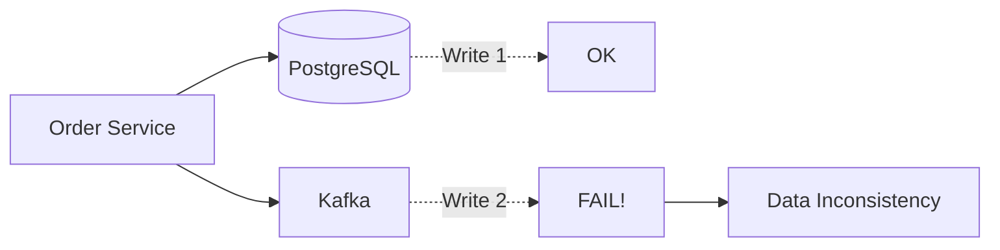
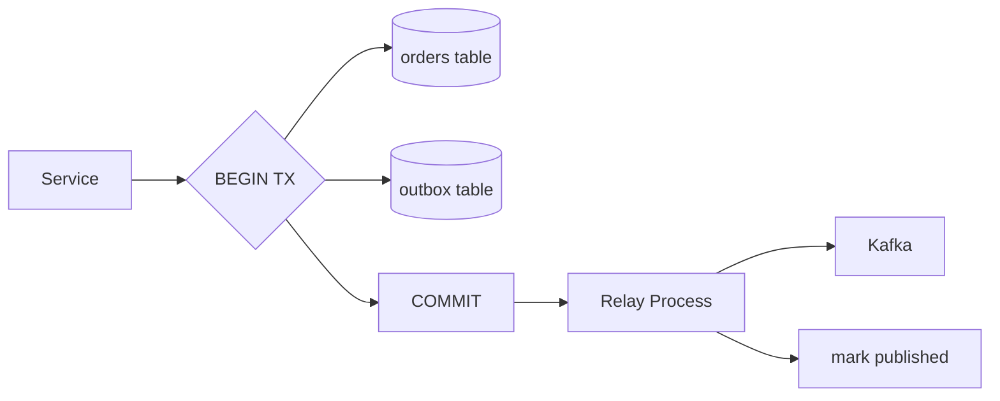
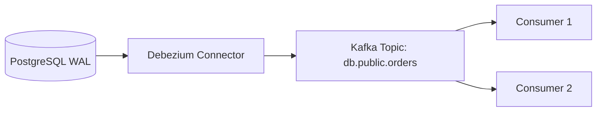
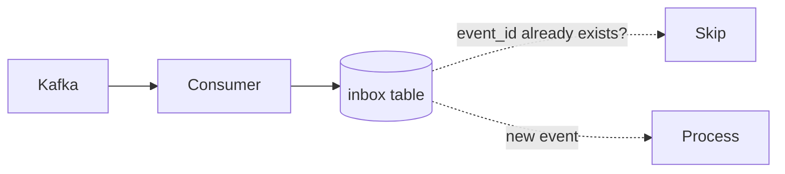

# Level 15: Exactly-Once and Transactional Outbox

## The Dual Write Problem

When a service must simultaneously update a database **and** publish an event to a broker, a classic trap arises: two independent resources cannot participate in one atomic operation.



📌 **If one of the two fails** — data diverges. DB knows about the order, the broker doesn't. Downstream services (email, inventory) won't receive the event.

### Why 2PC doesn't save us

Two-phase commit (2PC) between DB and broker is technically possible, but:
- Kafka doesn't support XA transactions
- Performance degrades
- Coordinator becomes a single point of failure

---

## Transactional Outbox Pattern

Solution: write the event **in the same DB transaction** as the main data, into a special `outbox` table.



Atomicity is ensured by the DBMS. The Relay process delivers events asynchronously — with **at-least-once** guarantee.

### Outbox Table

```sql
CREATE TABLE outbox (
  id          UUID PRIMARY KEY DEFAULT gen_random_uuid(),
  event_type  TEXT NOT NULL,
  payload     JSONB NOT NULL,
  status      TEXT DEFAULT 'pending',  -- pending | published
  created_at  TIMESTAMPTZ DEFAULT NOW()
);
```

### Relay Options

| Method | Description | Pro | Con |
|---|---|---|---|
| Polling Publisher | SELECT WHERE status='pending' | Simple to implement | DB load, latency |
| Log-based (CDC) | Reads WAL directly | No DB load, real-time | Needs Debezium/Maxwell |

---

## Change Data Capture (CDC)

CDC captures changes from WAL (PostgreSQL) or binlog (MySQL) and streams them as events to Kafka.



### Debezium event envelope

```json
{
  "op": "u",
  "before": { "id": 1, "amount": 100 },
  "after":  { "id": 1, "amount": 150 },
  "source": { "lsn": "0/1ABC", "table": "orders", "ts_ms": 1712345678000 }
}
```

Operations: `c` (create), `u` (update), `d` (delete), `r` (read/snapshot).

---

## Idempotent Consumer (Inbox Pattern)

Outbox guarantees at-least-once — so duplicates are possible. The consumer must be idempotent.



📌 **Idempotency**: processing one event twice produces the same result as processing it once.

---

## ⚠️ Common mistakes

**❌ Publishing an event before committing the transaction**
```typescript
// Wrong: event goes out before commit
await db.query('INSERT INTO orders ...')
await kafka.send('OrderCreated', event) // if TX rolls back — event is already sent!
await db.commit()
```

**✅ Correct: event in the same transaction**
```typescript
await db.transaction(async tx => {
  await tx.query('INSERT INTO orders ...')
  await tx.query('INSERT INTO outbox ...') // in the same TX
}) // commit — now relay can publish
```

**❌ Not handling duplicates at the consumer**
```typescript
// Wrong: redelivery → double charge
await chargeCard(event.orderId, event.amount)
```

**✅ Check idempotency key**
```typescript
const already = await db.query('SELECT 1 FROM inbox WHERE event_id = $1', [event.id])
if (already.rows.length > 0) return // already processed
await chargeCard(event.orderId, event.amount)
await db.query('INSERT INTO inbox (event_id) VALUES ($1)', [event.id])
```
