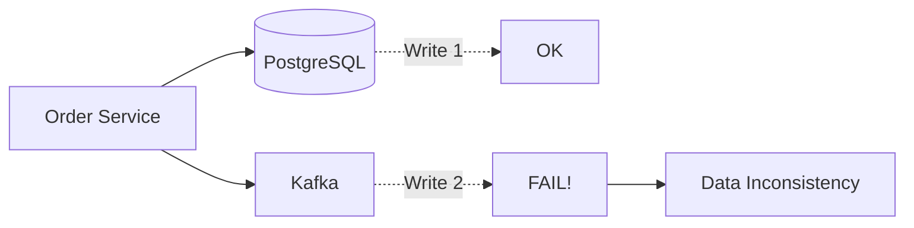
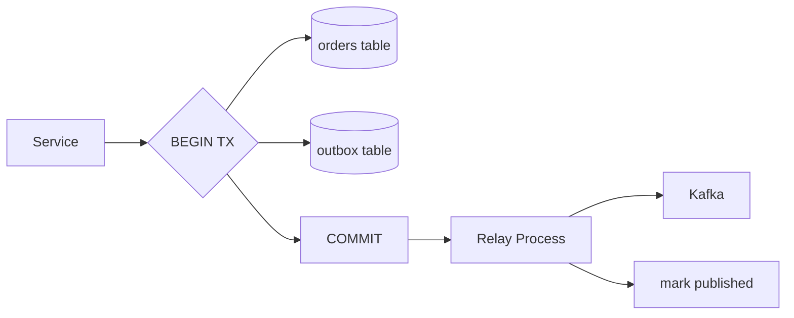
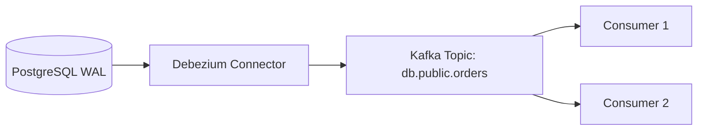
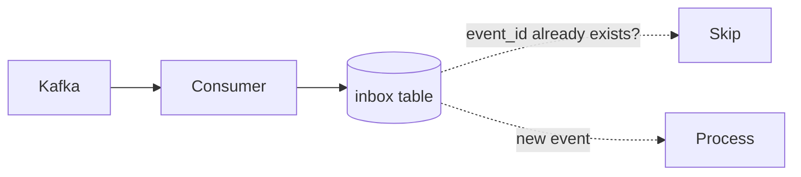

# Уровень 15: Exactly-Once и Transactional Outbox

## Проблема двойной записи (Dual Write Problem)

Когда сервис должен одновременно обновить базу данных **и** опубликовать событие в брокер, возникает классическая ловушка: два независимых ресурса не могут участвовать в одной атомарной операции.



📌 **Если упадёт один из двух** — данные расходятся. DB знает о заказе, брокер — нет. Downstream-сервисы (email, inventory) не получат событие.

### Почему 2PC не спасает

Двухфазный коммит (2PC) между DB и broker технически возможен, но:
- Kafka не поддерживает XA-транзакции
- Производительность деградирует
- Coordinator становится точкой отказа

---

## Transactional Outbox Pattern

Решение: записать событие **в той же DB-транзакции** что и основные данные, в специальную таблицу `outbox`.



Атомарность обеспечивает СУБД. Relay-процесс доставляет события асинхронно — с гарантией **at-least-once**.

### Таблица outbox

```sql
CREATE TABLE outbox (
  id          UUID PRIMARY KEY DEFAULT gen_random_uuid(),
  event_type  TEXT NOT NULL,
  payload     JSONB NOT NULL,
  status      TEXT DEFAULT 'pending',  -- pending | published
  created_at  TIMESTAMPTZ DEFAULT NOW()
);
```

### Варианты Relay

| Метод | Описание | Плюс | Минус |
|---|---|---|---|
| Polling Publisher | SELECT WHERE status='pending' | Просто реализовать | Нагрузка на DB, задержка |
| Log-based (CDC) | Читает WAL напрямую | Нет нагрузки на DB, реального времени | Нужен Debezium/Maxwell |

---

## Change Data Capture (CDC)

CDC захватывает изменения из WAL (PostgreSQL) или binlog (MySQL) и стримит их как события в Kafka.



### Debezium event envelope

```json
{
  "op": "u",
  "before": { "id": 1, "amount": 100 },
  "after":  { "id": 1, "amount": 150 },
  "source": { "lsn": "0/1ABC", "table": "orders", "ts_ms": 1712345678000 }
}
```

Операции: `c` (create), `u` (update), `d` (delete), `r` (read/snapshot).

---

## Idempotent Consumer (Inbox Pattern)

Outbox гарантирует at-least-once — значит дубликаты возможны. Consumer должен быть идемпотентным.



📌 **Идемпотентность**: обработка одного события дважды даёт тот же результат, что и один раз.

---

## ⚠️ Частые ошибки

**❌ Публикация события до коммита транзакции**
```typescript
// Неправильно: событие уходит до коммита
await db.query('INSERT INTO orders ...')
await kafka.send('OrderCreated', event) // если TX откатится — событие уже ушло!
await db.commit()
```

**✅ Правильно: событие в той же транзакции**
```typescript
await db.transaction(async tx => {
  await tx.query('INSERT INTO orders ...')
  await tx.query('INSERT INTO outbox ...') // в той же TX
}) // commit — теперь relay может публиковать
```

**❌ Не обрабатывать дубликаты у consumer**
```typescript
// Неправильно: повторная доставка → двойное списание
await chargeCard(event.orderId, event.amount)
```

**✅ Проверять idempotency key**
```typescript
const already = await db.query('SELECT 1 FROM inbox WHERE event_id = $1', [event.id])
if (already.rows.length > 0) return // уже обработали
await chargeCard(event.orderId, event.amount)
await db.query('INSERT INTO inbox (event_id) VALUES ($1)', [event.id])
```
