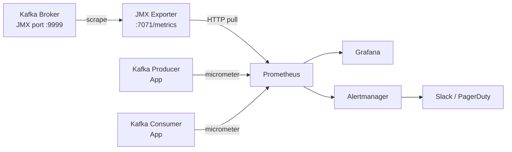
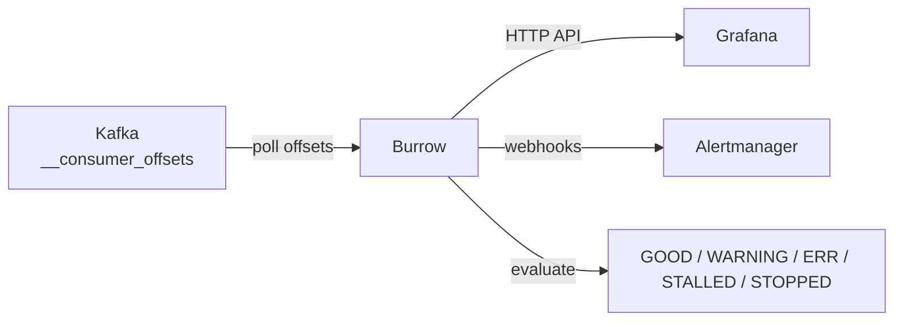
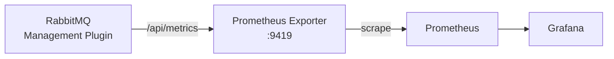
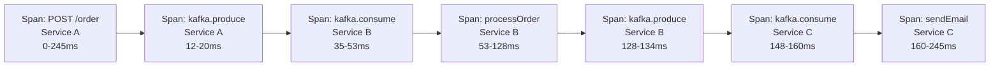
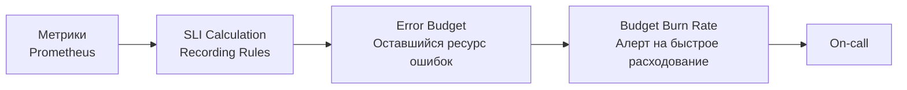

# Уровень 16: Наблюдаемость и мониторинг (подробно)

## Почему observability важнее monitoring

Классический **monitoring** отвечает на вопрос "всё ли работает?" с заранее известными метриками. **Observability** отвечает на вопрос "почему сломалось?" — в том числе для сценариев, о которых не думали при разработке.

В контексте messaging систем это особенно важно: брокер — асинхронный посредник. Когда платёж не прошёл, как понять — он застрял в очереди? Упал consumer? Неверный формат сообщения? Без observability ответ требует часов расследования по логам.

---

## Метрики с Prometheus и JMX Exporter

### Архитектура сбора метрик Kafka



JMX Exporter — Java-агент, который транслирует JMX MBeans в формат Prometheus. Запускается вместе с Kafka-брокером через флаг `-javaagent`.

### Конфигурация JMX Exporter (kafka.yml)

```yaml
lowercaseOutputName: true
lowercaseOutputLabelNames: true
rules:
  # Consumer Lag
  - pattern: 'kafka.consumer<type=consumer-fetch-manager-metrics, client-id=(.+), topic=(.+), partition=(.+)><>records-lag'
    name: kafka_consumer_records_lag
    labels:
      client_id: "$1"
      topic: "$2"
      partition: "$3"

  # UnderReplicatedPartitions
  - pattern: 'kafka.server<type=ReplicaManager, name=UnderReplicatedPartitions><>Value'
    name: kafka_server_under_replicated_partitions

  # BytesInPerSec
  - pattern: 'kafka.server<type=BrokerTopicMetrics, name=BytesInPerSec><>OneMinuteRate'
    name: kafka_server_bytes_in_per_sec
```

---

## Kafka Metrics Deep Dive

### Consumer Lag — главная операционная метрика

Consumer Lag = Log-End Offset (LEO) − Current Committed Offset

```
Producer пишет:    [msg1][msg2][msg3][msg4][msg5]  ← LEO = 5
Consumer прочитал: [msg1][msg2][msg3]               ← Committed = 3
                                      ^^^^^^^^
                                      LAG = 2
```

Lag измеряется отдельно для каждой **партиции**. Суммарный lag группы = сумма лагов по всем партициям.

#### Инструмент Burrow

Burrow (LinkedIn) — специализированный сервис для мониторинга consumer lag. В отличие от просто числового порога, Burrow анализирует **тренд**: lag стабилен, растёт или сокращается.



Состояния Burrow:
- **GOOD** — lag стабилен или сокращается
- **WARNING** — lag растёт, но consumer читает
- **ERR** — lag резко растёт
- **STALLED** — consumer читает, но lag не уменьшается (обработка слишком медленная)
- **STOPPED** — consumer перестал коммитить оффсеты

### UnderReplicatedPartitions

Количество партиций, у которых реплик меньше, чем задано в `replication.factor`. В норме всегда **0**.

```
✅ UnderReplicatedPartitions = 0  → всё нормально
⚠️ UnderReplicatedPartitions > 0  → один из брокеров упал или сеть нестабильна
```

Если это значение ненулевое — данные могут быть потеряны при последующем сбое лидера.

### RequestsPerSec и BytesInPerSec / BytesOutPerSec

```
BytesInPerSec  — пропускная способность входящего трафика (producer → broker)
BytesOutPerSec — пропускная способность исходящего трафика (broker → consumer)
RequestsPerSec — количество запросов (Produce, Fetch, Metadata) в секунду
```

Резкий рост RequestsPerSec при стабильном BytesInPerSec — признак частых малых сообщений (batch size слишком маленький у producer).

### ActiveControllerCount

В кластере Kafka всегда должен быть ровно **один** controller. Если значение 0 — кластер не имеет controller и не принимает новые партиции. Если > 1 — split brain.

---

## RabbitMQ Metrics

### Архитектура сбора метрик RabbitMQ



RabbitMQ Management Plugin предоставляет HTTP API и встроенный Prometheus-эндпоинт начиная с версии 3.8.

### Queue Depth (глубина очереди)

```
rabbitmq_queue_messages_total — общее число сообщений в очереди
rabbitmq_queue_messages_ready — готовы к доставке consumer
rabbitmq_queue_messages_unacked — доставлены consumer, но не подтверждены
```

Высокое `messages_unacked` при нулевом `messages_ready` — consumer получает сообщения, но не отвечает ACK (обработка зависла или consumer упал после получения).

### Message Rates

```
rabbitmq_queue_messages_published_total — скорость публикации (msg/s)
rabbitmq_queue_messages_delivered_total — скорость доставки (msg/s)
rabbitmq_queue_messages_acked_total     — скорость подтверждений (msg/s)
```

В установившемся состоянии `published_rate ≈ delivered_rate ≈ acked_rate`. Расхождение — признак проблемы.

### Connection Count и Memory

```
rabbitmq_connections — активных TCP-соединений
rabbitmq_process_resident_memory_bytes — память процесса RabbitMQ
```

Неконтролируемый рост `rabbitmq_connections` — признак утечки соединений в приложениях (не закрывают connection после работы).

---

## Distributed Tracing с OpenTelemetry

### Концепции

**Trace** — полное дерево обработки одного запроса, от входа в систему до выхода. Идентифицируется `trace_id`.

**Span** — один логический шаг внутри trace. Имеет:
- `span_id` — уникальный ID шага
- `parent_span_id` — ID родительского шага
- `start_time`, `end_time`
- Атрибуты (теги): `http.method`, `messaging.system`, `db.statement`
- Статус: OK / ERROR



### OpenTelemetry SDK

OpenTelemetry — стандарт де-факто для observability. Поддерживает все три столпа (metrics, logs, traces).

```typescript
import { NodeTracerProvider } from '@opentelemetry/sdk-trace-node'
import { KafkaJsInstrumentation } from '@opentelemetry/instrumentation-kafkajs'
import { Resource } from '@opentelemetry/resources'

const provider = new NodeTracerProvider({
  resource: new Resource({ 'service.name': 'order-service' }),
})

// Автоматическая инструментация KafkaJS — spans создаются автоматически
provider.register()
registerInstrumentations({
  instrumentations: [new KafkaJsInstrumentation()],
})
```

При автоинструментации KafkaJS span создаётся при каждом `producer.send()` и каждом `consumer.run()`.

---

## Trace Context Propagation в Kafka-сообщениях

Проблема: HTTP-запросы передают контекст через headers автоматически. В Kafka producer и consumer разделены — нет автоматического "канала" для trace context.

Решение: **W3C TraceContext** — стандарт передачи контекста через поле `traceparent`.

### Формат traceparent

```
traceparent: 00-4bf92f3577b34da6a3ce929d0e0e4736-00f067aa0ba902b7-01
              ^  ^^^^^^^^^^^^^^^^^^^^^^^^^^^^^^^^ ^^^^^^^^^^^^^^^^ ^^
              v  trace-id (16 bytes hex)          span-id (8 bytes) flags
```

### Propagation при publish

```typescript
import { propagation, context } from '@opentelemetry/api'

async function publishOrder(order: Order) {
  const headers: Record<string, string> = {}

  // Инжектируем trace context в headers
  propagation.inject(context.active(), headers)

  await producer.send({
    topic: 'orders',
    messages: [{
      key: order.id,
      value: JSON.stringify(order),
      headers, // { traceparent: '00-abc123...-def456...-01' }
    }],
  })
}
```

### Extraction при consume

```typescript
import { propagation, context } from '@opentelemetry/api'
import { ROOT_CONTEXT } from '@opentelemetry/api'

consumer.run({
  eachMessage: async ({ message }) => {
    // Извлекаем trace context из headers
    const parentContext = propagation.extract(ROOT_CONTEXT, message.headers ?? {})

    // Запускаем span в контексте родительского trace
    return context.with(parentContext, async () => {
      const span = tracer.startSpan('processOrder')
      try {
        await processOrder(JSON.parse(message.value!.toString()))
        span.setStatus({ code: SpanStatusCode.OK })
      } catch (err) {
        span.recordException(err as Error)
        span.setStatus({ code: SpanStatusCode.ERROR })
      } finally {
        span.end()
      }
    })
  },
})
```

---

## Correlation ID Pattern

Более простая альтернатива полному distributed tracing — **Correlation ID**. Один UUID, который пробрасывается через все сервисы в заголовках сообщений и логах.

```typescript
interface MessageHeaders {
  correlationId: string
  causationId: string   // ID события, вызвавшего это
  timestamp: string
}

// Producer
const headers: MessageHeaders = {
  correlationId: incomingCorrelationId ?? uuid(),
  causationId: currentEventId,
  timestamp: new Date().toISOString(),
}

// В каждом log-стейтменте
logger.info('Processing order', { correlationId, orderId })
```

Преимущество: минимальные зависимости. Недостаток: нет timing information — нельзя построить waterfall-диаграмму.

---

## Grafana Dashboards

### Рекомендуемые панели для Kafka

```
Row: Broker Health
  ├── UnderReplicatedPartitions (должно быть 0)
  ├── ActiveControllerCount (должно быть 1)
  └── BytesInPerSec / BytesOutPerSec

Row: Producer
  ├── record-send-rate (записей/сек по топикам)
  ├── request-latency-avg (средняя задержка produce)
  └── record-error-rate (ошибки продюсирования)

Row: Consumer
  ├── Consumer Lag по группам (heatmap)
  ├── fetch-rate (запросов fetch/сек)
  └── records-consumed-rate
```

### Рекомендуемые панели для RabbitMQ

```
Row: Queue Health
  ├── Queue Depth (топ-10 очередей по глубине)
  ├── Unacked Messages
  └── Consumers per Queue

Row: Throughput
  ├── Publish Rate vs Deliver Rate
  └── Ack Rate

Row: Infrastructure
  ├── Connections Count
  └── Memory Usage
```

---

## Alerting Strategies и Runbooks

### Примеры правил Prometheus (Kafka)

```yaml
groups:
  - name: kafka-alerts
    rules:
      # Consumer lag — warning
      - alert: KafkaConsumerLagWarning
        expr: kafka_consumer_records_lag > 500
        for: 5m
        labels:
          severity: warning
        annotations:
          summary: "Consumer lag growing: {{ $labels.consumer_group }}/{{ $labels.topic }}"
          runbook: "https://wiki/runbooks/kafka-consumer-lag"

      # Consumer lag — critical
      - alert: KafkaConsumerLagCritical
        expr: kafka_consumer_records_lag > 2000
        for: 3m
        labels:
          severity: critical
        annotations:
          summary: "CRITICAL consumer lag: {{ $labels.consumer_group }}"

      # Брокер без реплик
      - alert: KafkaUnderReplicatedPartitions
        expr: kafka_server_under_replicated_partitions > 0
        for: 1m
        labels:
          severity: critical
        annotations:
          summary: "Under-replicated partitions detected"
```

### Runbook: Consumer Lag Growing

Алерт `KafkaConsumerLagWarning` — порядок действий:

1. Проверить `consumer_group` из labels — какая группа отстаёт?
2. `kafka-consumer-groups.sh --describe --group <name>` — посмотреть лаг по партициям
3. Проверить метрики приложения: CPU, heap, GC паузы consumer-инстансов
4. Посмотреть логи consumer на ошибки обработки
5. Если consumer здоровы — возможно, рост produce rate. Рассмотреть масштабирование группы

---

## SLI/SLO для Messaging Systems

**SLI (Service Level Indicator)** — измеримый показатель качества сервиса.

**SLO (Service Level Objective)** — целевое значение SLI.

| SLI | Пример SLO |
|---|---|
| End-to-end latency (produce → consume) | P99 < 500ms за rolling 30 дней |
| Consumer Lag | < 1000 msgs 99.9% времени |
| Message loss rate | 0 потерянных сообщений |
| Availability брокера | 99.95% uptime |



Ключевая идея: алертить не на нарушение порога, а на **скорость расходования error budget**. Если за 1 час сожгли 5% месячного бюджета — что-то сильно не так.

---

## ⚠️ Частые ошибки начинающих

### ❌ Алерт без `for` — срабатывает на кратковременные пики

```yaml
# Плохо: любой всплеск lag вызовет алерт
alert: ConsumerLagCritical
expr: kafka_consumer_records_lag > 1000
```

Кратковременный пик lag при burst трафика — абсолютно нормален. Алерт без временного окна будет "wolf crying".

```yaml
# Хорошо: только если lag держится 3+ минуты
alert: ConsumerLagCritical
expr: kafka_consumer_records_lag > 1000
for: 3m
```

### ❌ Нет trace context в Kafka-headers

```typescript
// Плохо: теряем трейс на границе Kafka
await producer.send({
  topic: 'orders',
  messages: [{ value: JSON.stringify(order) }],
  // нет headers с traceparent
})
```

Трейс Service A заканчивается на produce. Service B начинает новый трейс. Невозможно связать запрос end-to-end.

```typescript
// Хорошо: пробрасываем context
const headers: Record<string, string> = {}
propagation.inject(context.active(), headers)
await producer.send({ topic: 'orders', messages: [{ value: JSON.stringify(order), headers }] })
```

### ❌ Мониторинг только broker, но не consumer

Если consumer упал — брокер выглядит здоровым. Lag растёт молча.

```yaml
# Отдельный алерт: consumer не коммитит оффсеты
alert: ConsumerGroupStopped
expr: changes(kafka_consumer_committed_offset[10m]) == 0
for: 10m
```

### ❌ Слишком много алертов — alert fatigue

10 firing-алертов одновременно → дежурный игнорирует все. Лучше иметь 3 хорошо откалиброванных алерта, чем 30 шумных.

✅ Правило: каждый алерт должен требовать **действия человека**. Если на алерт можно не реагировать — он не нужен.

### ❌ Графики без контекста

Отдельный график "Consumer Lag" бесполезен без сопоставления с "Produce Rate". Рост lag при росте produce rate — нормально. Рост lag при стабильном produce rate — проблема.
