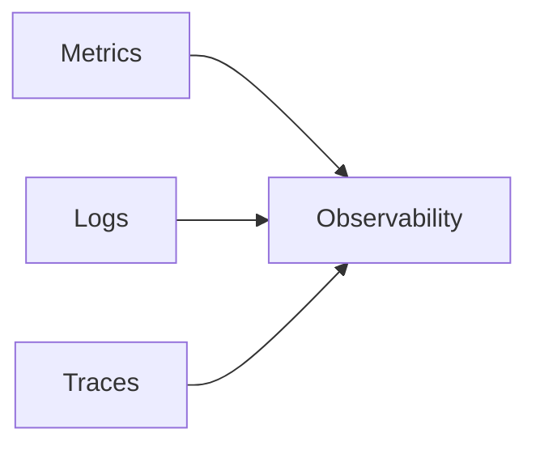
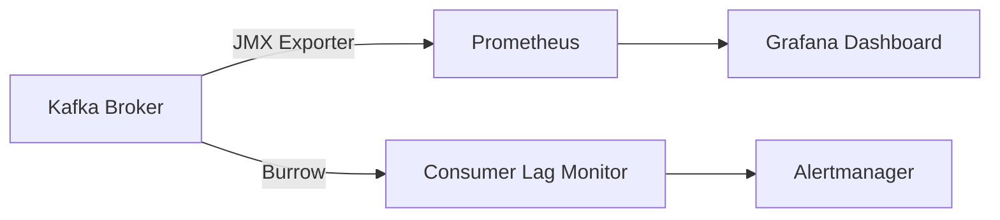
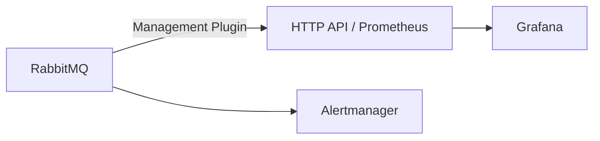
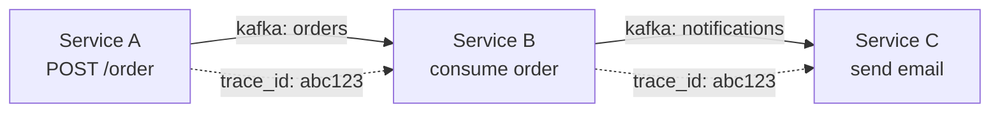

# Level 16: Observability and Monitoring

## Three pillars of observability

Observability — the ability to understand the internal state of a system from its external outputs. In distributed systems, three pillars are recognized:



| Pillar | What it provides | Example tool |
|---|---|---|
| Metrics | Aggregated numbers over a period | Prometheus + Grafana |
| Logs | Detailed events | ELK Stack, Loki |
| Traces | Request path across services | Jaeger, Zipkin, Tempo |

---

## Kafka: key metrics



### Consumer Lag — the main metric

**Consumer Lag** = Log-End Offset − Committed Offset

Shows how many messages a consumer is behind the producer. Growing lag is a sign of consumer overload or processing issues.

| State | Value | Action |
|---|---|---|
| OK | lag < 500 | Monitor |
| GROWING | 500–2000 | Investigate |
| CRITICAL | > 2000 | Alert, scale up |

Other important Kafka metrics:
- `UnderReplicatedPartitions` — partitions without sufficient replicas (should be 0)
- `BytesInPerSec` / `BytesOutPerSec` — broker throughput
- `RequestsPerSec` — number of requests to the broker

---

## RabbitMQ: key metrics



| Metric | What it measures | Normal |
|---|---|---|
| `queue.messages` | Queue depth | Depends on load |
| `queue.messages_ready` | Ready for delivery | Close to 0 in normal operation |
| `queue.consumers` | Number of active consumers | > 0 |
| `deliver_rate` | Message delivery speed | Matches publish_rate |
| `connections` | Active TCP connections | Monitor for leaks |

---

## Distributed Tracing and Correlation IDs

Tracing — a tool for observing a request's path across multiple services.



**Trace ID** — unique identifier for the entire chain. Passed in message headers.

**Span** — one processing step. Each span has a `parentId`, allowing reconstruction of the call tree.

The standard for passing tracing context — **W3C TraceContext** (`traceparent` header).

---

## Alerting: strategies

Good alerting is not "notify about every spike", but "wake someone up only for a real problem".

| Rule | Description |
|---|---|
| Threshold alerts | `lag > 2000` for 5 minutes |
| Rate-of-change | Lag growing at > 100 msg/s |
| Absence alerts | Consumer hasn't committed offsets > 10 min |
| SLO violations | Error rate > 1% over the last hour |

💡 Separate **warning** (team should investigate) and **critical** (immediate action needed, wake the on-call).

---

## ⚠️ Common mistakes

**❌ Alerting on every lag spike without averaging window**

A short-term lag peak is normal. Constant growth is a problem. Always use `for: 5m` or equivalent.

**✅ Alert triggers only on sustained threshold breach**

```yaml
alert: ConsumerLagCritical
expr: kafka_consumer_lag > 2000
for: 5m
```

**❌ No trace context in Kafka messages**

Without `trace_id` in headers, it's impossible to link a span in Service A with a span in Service B.

**✅ Pass `traceparent` in headers of every Kafka message**
