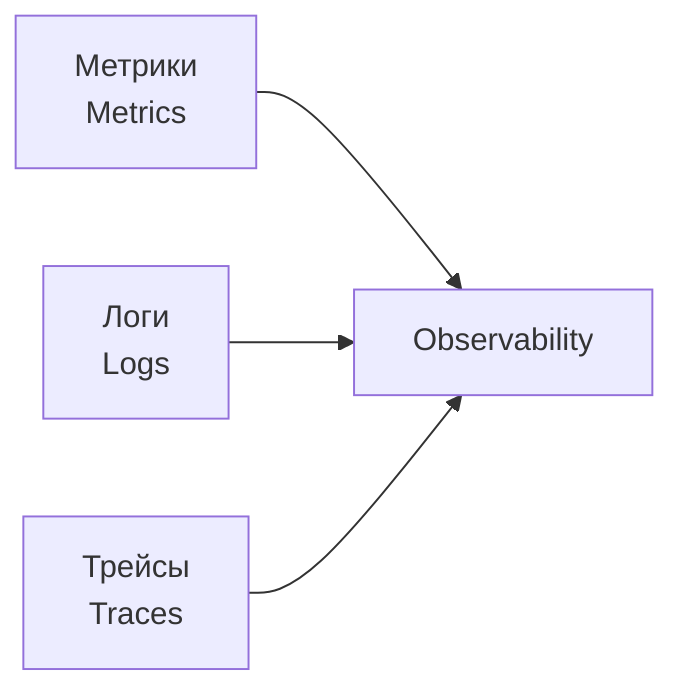
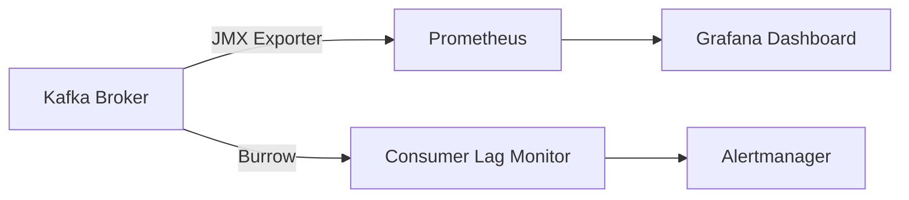
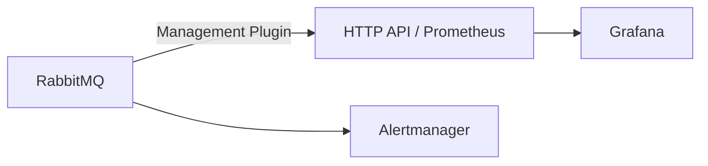
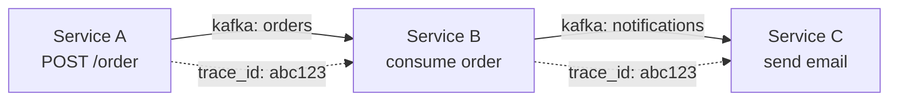

# Уровень 16: Наблюдаемость и мониторинг

## Три столпа наблюдаемости

Observability — способность понять внутреннее состояние системы по её внешним выходным данным. В distributed systems принято выделять три столпа:



| Столп | Что даёт | Пример инструмента |
|---|---|---|
| Метрики | Агрегированные числа за период | Prometheus + Grafana |
| Логи | Детализированные события | ELK Stack, Loki |
| Трейсы | Путь запроса через сервисы | Jaeger, Zipkin, Tempo |

---

## Kafka: ключевые метрики



### Consumer Lag — главная метрика

**Consumer Lag** = Log-End Offset − Committed Offset

Показывает, на сколько сообщений consumer отстаёт от producer. Растущий lag — признак перегрузки consumer или проблем с обработкой.

| Состояние | Значение | Действие |
|---|---|---|
| OK | lag < 500 | Мониторинг |
| GROWING | 500–2000 | Расследование |
| CRITICAL | > 2000 | Алерт, масштабирование |

Другие важные метрики Kafka:
- `UnderReplicatedPartitions` — партиции без достаточного числа реплик (должно быть 0)
- `BytesInPerSec` / `BytesOutPerSec` — пропускная способность брокера
- `RequestsPerSec` — количество запросов к брокеру

---

## RabbitMQ: ключевые метрики



| Метрика | Что измеряет | Норма |
|---|---|---|
| `queue.messages` | Глубина очереди | Зависит от нагрузки |
| `queue.messages_ready` | Готовые к доставке | Близко к 0 при нормальной работе |
| `queue.consumers` | Число активных consumer | > 0 |
| `deliver_rate` | Скорость доставки сообщений | Соответствует publish_rate |
| `connections` | Активных TCP-соединений | Контролировать утечки |

---

## Distributed Tracing и Correlation IDs

Трейсинг — инструмент для наблюдения за путём запроса через несколько сервисов.



**Trace ID** — уникальный идентификатор всей цепочки. Пробрасывается в заголовках сообщений.

**Span** — один шаг обработки. У каждого span есть `parentId`, позволяющий восстановить дерево вызовов.

Стандарт для передачи контекста трейсинга — **W3C TraceContext** (`traceparent` заголовок).

---

## Alerting: стратегии

Хороший алертинг — это не "оповестить о каждом всплеске", а "разбудить человека только при реальной проблеме".

| Правило | Описание |
|---|---|
| Пороговые алерты | `lag > 2000` в течение 5 минут |
| Rate-of-change | Lag растёт со скоростью > 100 msg/s |
| Absence алерты | Consumer не коммитит оффсеты > 10 мин |
| SLO-нарушения | Error rate > 1% за последний час |

💡 Разделяйте **warning** (команда должна расследовать) и **critical** (нужно немедленное действие, будим дежурного).

---

## ⚠️ Частые ошибки

**❌ Алерт на каждый всплеск lag без окна усреднения**

Кратковременный пик lag — норма. Постоянный рост — проблема. Всегда используйте `for: 5m` или эквивалент.

**✅ Алерт срабатывает только при устойчивом превышении порога**

```yaml
alert: ConsumerLagCritical
expr: kafka_consumer_lag > 2000
for: 5m
```

**❌ Нет трейс-контекста в Kafka-сообщениях**

Без `trace_id` в headers невозможно связать span в Service A со span в Service B.

**✅ Пробрасывать `traceparent` в headers каждого Kafka-сообщения**
