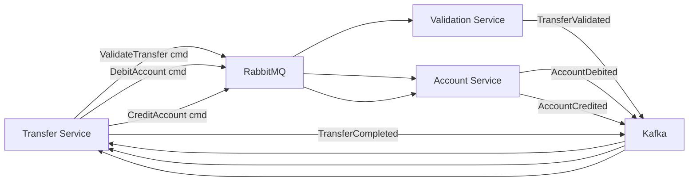

# Level 17: Real-World Architectures — Detailed Theory

## How big companies came to Kafka

### LinkedIn: the birthplace of Kafka

In 2010, LinkedIn faced a classic problem: dozens of services exchanged data through point-to-point integrations. The "everyone with everyone" scheme gave O(n²) dependencies. Jay Kreps and the team came up with a solution — a unified event bus with a persistent log.

Key LinkedIn insight: **a log is the most fundamental data structure**. All system state changes can be represented as an ordered sequence of records.

### Netflix: Kafka at planetary scale

Netflix processes **~1.3 trillion** events per day. Kafka is used for:
- **Chukwa pipeline**: telemetry from 300+ microservices
- **Keystone pipeline**: real-time viewing events for recommendations
- **Fink**: stream processing for anomaly detection

Netflix architectural decision: **active replication between regions** via mirror topics.

**Lessons from Netflix:**
- Schemaless messages — a source of pain at scale: move to Avro + Schema Registry
- Consumer lag — the main health metric: set up alerts before an incident occurs
- Different SLOs for different topics: telemetry allows loss, payment events do not

### Uber: Kafka + microservice choreography

Uber moved from orchestration to choreography: instead of a central coordinator, each service reacts to events.

**Schemaless** — Uber's early mistake: initially all topics wrote JSON without contracts. After several incidents (downstream service broken due to JSON structure change), they moved to Protocol Buffers with a schema registry.

---

## E-Commerce: detailed architecture

### Hybrid model: commands via RabbitMQ, events via Kafka

**RabbitMQ for commands** — because:
- Command is addressed to a specific recipient (routing key `payment.process`)
- DLQ needed on PaymentService error
- Prioritization needed: VIP orders processed first
- Command is "one-time" — not needed after processing

**Kafka for events** — because:
- `PaymentCompleted` is interesting to OrderService, NotificationService, AnalyticsService, AuditService simultaneously
- Audit log needed for financial reporting (7 year retention)
- Analytics service needs to be able to re-read history
- Scale: thousands of events per second during peak periods

### CQRS in e-commerce context

Write-side works with normalized PostgreSQL. Read-side uses denormalized projections in Redis (cart, active orders) and Elasticsearch (order history search). Kafka connects them asynchronously.

---

## CQRS + Event Sourcing in practice

### Event Sourcing: state as a log

Instead of storing current order state, store **all events** that happened to it:

```typescript
type OrderEvent =
  | { type: 'OrderCreated'; orderId: string; amount: number; userId: string }
  | { type: 'PaymentProcessed'; orderId: string; txnId: string }
  | { type: 'ItemsReserved'; orderId: string; items: Item[] }
  | { type: 'OrderShipped'; orderId: string; trackingId: string }
  | { type: 'OrderCancelled'; orderId: string; reason: string }

function rebuildOrder(events: OrderEvent[]): Order {
  return events.reduce((state, event) => {
    switch (event.type) {
      case 'OrderCreated': return { ...state, status: 'created', amount: event.amount }
      case 'PaymentProcessed': return { ...state, status: 'paid' }
      case 'OrderShipped': return { ...state, status: 'shipped' }
      case 'OrderCancelled': return { ...state, status: 'cancelled' }
      default: return state
    }
  }, {} as Order)
}
```

💡 **Kafka as Event Store**: topic `order-events` with partition key = `orderId` — this is already Event Sourcing. Kafka preserves the full log, you can "rewind" and recalculate order state from scratch.

### Snapshots

If the log grows to thousands of events — full replay becomes slow. Solution: periodically save a snapshot of current state.

---

## Logging pipeline: Filebeat → Kafka → Logstash → Elasticsearch

### Why Kafka in the logging pipeline

Without Kafka: `Services → Logstash → Elasticsearch`

Problems: during peak load, Logstash can't parse fast enough, Elasticsearch is overloaded, logs are lost.

With Kafka: Kafka buffers — if Logstash slows down, logs accumulate in the topic and are processed when possible. No losses.

---

## Metrics pipeline: Kafka → InfluxDB / Prometheus

Stream aggregation via Kafka Streams: computing p50/p95/p99 latency in a sliding window directly in the topic, without additional services.

---

## Notification system

### Fan-out via Kafka

One `OrderConfirmed` event → multiple notification channels:

```typescript
// Producer: OrderService publishes one event
await kafka.send('notification-events', {
  key: userId,
  value: { type: 'OrderConfirmed', orderId, userId, channels: ['email', 'push'], data: { amount, itemCount } }
})

// Consumer: NotificationService reads and routes by channels
consumer.on('message', async (event) => {
  const { channels, data } = event
  await Promise.all(channels.map(ch => dispatch(ch, data)))
})
```

---

## Payment processing with Saga

Inter-service "money transfer" transaction requires a 5-step saga:



### Compensation actions on error

If `CreditAccount` fails — need to compensate `DebitAccount`:

```typescript
class TransferSaga {
  async compensate(transfer: Transfer, failedAt: Error) {
    if (transfer.state >= 'debited') {
      await rabbit.publish('account.commands', 'ReverseDebit', {
        accountId: transfer.fromAccountId, amount: transfer.amount, transferId: transfer.id,
      })
    }
    await kafka.send('transfer-events', { type: 'TransferFailed', transferId: transfer.id, reason: failedAt.message })
  }
}
```

---

## Monolith migration: Strangler Fig

Strangler Fig — gradual replacement of a monolith with microservices through an event layer.

Steps:
1. CDC from monolith DB to Kafka (read monolith data without touching code)
2. New service subscribes to Kafka events
3. Redirect part of traffic to the new service via API Gateway
4. Monolith gradually becomes read-only for migrated domains

---

## Anti-patterns in production

### Anti-pattern 1: God Topic

❌ One topic "all-events" for all system events
✅ Separate topic per domain: order-events, payment-events, inventory-events

### Anti-pattern 2: Synchronous request via broker

❌ Request-Reply via Kafka — anti-pattern. Kafka is not for this. Use REST/gRPC for synchronous requests.

### Anti-pattern 3: Ignoring consumer lag

If a consumer is lagging — it's a symptom of a problem, not normal. An alert should trigger before lag exceeds the acceptable processing time (SLA).

### Anti-pattern 4: RabbitMQ instead of Kafka for IoT

❌ 50,000 devices → RabbitMQ → data analysis
   Problem: no replay, no data retention, throughput insufficient

✅ 50,000 devices → Kafka → ML pipeline
   Solution: replay for retraining, partition by device_id, 30-day retention

---

## Capacity Planning

### Kafka: resource estimation

```
Throughput = messages/sec × message_size_bytes
Disk per broker = throughput × retention_days × 86400 / replication_factor

Example:
- 10,000 msg/sec × 1KB = 10 MB/sec
- 10 MB/sec × 7 days × 86400 sec / 3 (replication) = ~2TB per broker
```

### Partition count formula

```
partitions = max(throughput_target / throughput_per_partition, consumer_count)

Empirically: throughput_per_partition ≈ 10MB/sec (producer) and 50MB/sec (consumer)
```

---

## Architecture selection: decision matrix

| Scenario | Recommendation | Required patterns |
|----------|-------------|----------------------|
| E-commerce (orders, payments) | Hybrid (RabbitMQ + Kafka) | Saga, Outbox, DLQ, Fan-out, Priority Queue |
| IoT telemetry | Kafka / Pulsar | Competing Consumers, Event Sourcing |
| Financial transfers | RabbitMQ / Hybrid | Saga, DLQ, Outbox, Priority Queue, CQRS |
| Centralized logging | Kafka | Competing Consumers |
| Notification system | RabbitMQ (or Kafka if fan-out) | Fan-out, DLQ |
| Real-time analytics | Kafka | Kafka Streams, Event Sourcing |
| Simple tasks (email, resizing) | RabbitMQ | DLQ, Competing Consumers |

---

## ⚠️ Common beginner mistakes

**❌ Starting architecture with broker selection**

Wrong question: "Kafka or RabbitMQ?"
Right question: "What does the system need?
- Need replay? → Kafka
- Need complex routing? → RabbitMQ
- Need both? → Hybrid or Pulsar"

**❌ Ignoring retention during design**

❌ Creating a topic without retention — defaults to 7 days
✅ Explicitly set retention to business requirements

**❌ One consumer group for different tasks**

❌ Analytics and Billing read from the same consumer group → both tasks compete for partitions, independence is broken
✅ Separate consumer group for each task

**❌ Schema evolution without backward compatibility**

❌ Changing event schema — breaking all consumers
✅ Backward-compatible change: keep old fields, add new ones as optional
