# Уровень 17: Реальные архитектуры — подробная теория

## Как большие компании пришли к Kafka

### LinkedIn: место рождения Kafka

В 2010 году LinkedIn столкнулся с классической проблемой: десятки сервисов обменивались данными через точечные интеграции. Схема "каждый с каждым" давала O(n²) зависимостей. Джей Крепс и команда придумали решение — единая шина событий с персистентным логом.

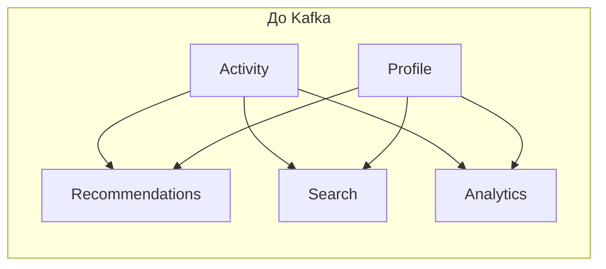

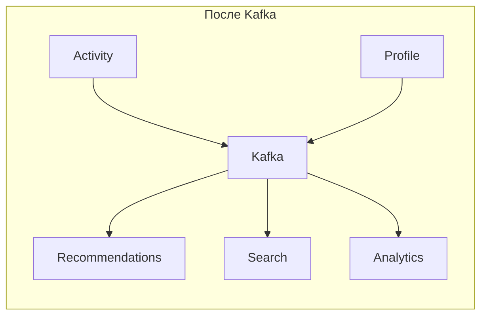

📌 Ключевое открытие LinkedIn: **лог — это самая фундаментальная структура данных**. Все изменения состояния системы можно представить как упорядоченную последовательность записей.

---

### Netflix: Kafka на планетарном масштабе

Netflix обрабатывает **~1.3 триллиона** событий в день. Kafka используется для:

- **Chukwa pipeline**: телеметрия от 300+ микросервисов
- **Keystone pipeline**: реальные события просмотра для рекомендаций
- **Fink**: потоковая обработка для детекции аномалий

Архитектурное решение Netflix: **активная репликация между регионами** через mirror-топики.

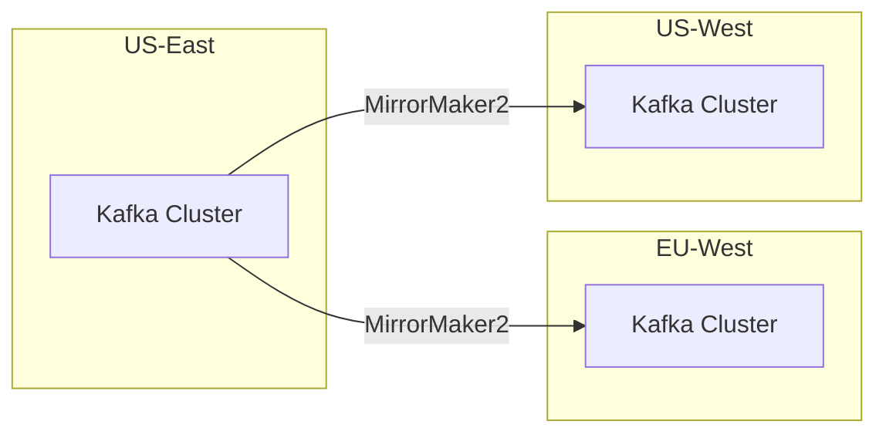

**Уроки Netflix:**
- Schemaless-сообщения — источник боли на масштабе: перейди на Avro + Schema Registry
- Consumer lag — главная метрика здоровья: настрой алерты до того, как случится инцидент
- Разные SLO для разных топиков: телеметрия допускает потери, события оплаты — нет

---

### Uber: Kafka + микросервисная хореография

Uber перешёл от оркестрации к хореографии: вместо центрального координатора каждый сервис реагирует на события.

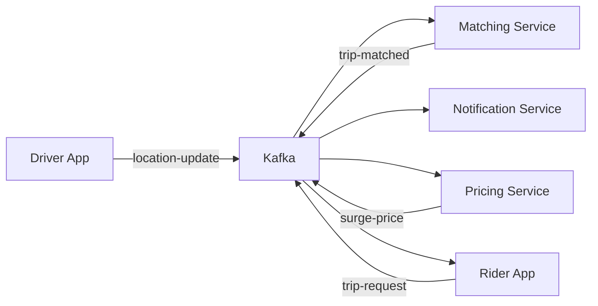

**Schemaless** — ранняя ошибка Uber: сначала все топики писали JSON без контракта. После нескольких инцидентов (поломка downstream-сервиса из-за смены структуры JSON) перешли на Protocol Buffers с реестром схем.

---

## E-Commerce: детальная архитектура

### Гибридная модель: команды через RabbitMQ, события через Kafka

Полная схема платформы:

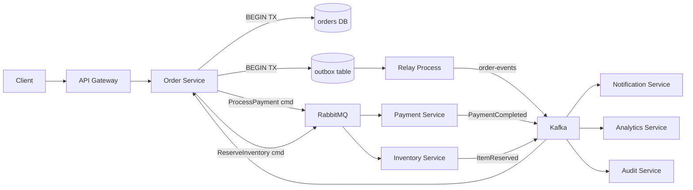

### Почему именно такое разделение

**RabbitMQ для команд** — потому что:
- Команда адресована конкретному получателю (routing key `payment.process`)
- Нужен DLQ при ошибке PaymentService
- Нужна приоритизация: VIP-заказы обрабатываются раньше
- Команда "одноразовая" — после обработки она не нужна

**Kafka для событий** — потому что:
- `PaymentCompleted` интересен OrderService, NotificationService, AnalyticsService, AuditService одновременно
- Нужен аудит-лог для финансовой отчётности (retention 7 лет)
- Analytics-сервис должен иметь возможность перечитать историю
- Масштаб: тысячи событий в секунду в пиковые периоды

### CQRS в контексте e-commerce

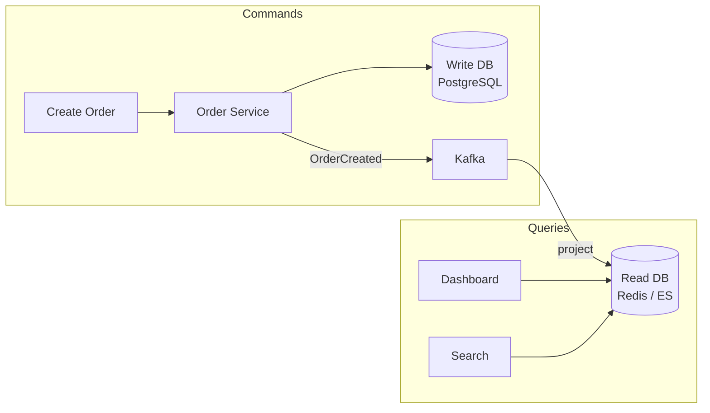

Write-side работает с нормализованной PostgreSQL. Read-side использует денормализованные проекции в Redis (корзина, активные заказы) и Elasticsearch (поиск по истории заказов). Kafka связывает их асинхронно.

---

## CQRS + Event Sourcing на практике

### Event Sourcing: состояние как лог

Вместо хранения текущего состояния заказа храним **все события**, которые с ним происходили:

```typescript
// Традиционный подход — снимок состояния
interface Order {
  id: string
  status: 'created' | 'paid' | 'shipped' | 'cancelled'
  amount: number
}

// Event Sourcing — лог событий
type OrderEvent =
  | { type: 'OrderCreated'; orderId: string; amount: number; userId: string }
  | { type: 'PaymentProcessed'; orderId: string; txnId: string }
  | { type: 'ItemsReserved'; orderId: string; items: Item[] }
  | { type: 'OrderShipped'; orderId: string; trackingId: string }
  | { type: 'OrderCancelled'; orderId: string; reason: string }

// Восстановление состояния через reduce
function rebuildOrder(events: OrderEvent[]): Order {
  return events.reduce((state, event) => {
    switch (event.type) {
      case 'OrderCreated': return { ...state, status: 'created', amount: event.amount }
      case 'PaymentProcessed': return { ...state, status: 'paid' }
      case 'OrderShipped': return { ...state, status: 'shipped' }
      case 'OrderCancelled': return { ...state, status: 'cancelled' }
      default: return state
    }
  }, {} as Order)
}
```

💡 **Kafka как Event Store**: топик `order-events` с partition key = `orderId` — это уже Event Sourcing. Kafka сохраняет полный лог, можно "перемотать" и пересчитать состояние заказа с нуля.

### Снимки (Snapshots)

Если лог вырастает до тысяч событий — восстановление через full replay становится медленным. Решение: периодически сохранять снимок текущего состояния.

```typescript
interface OrderSnapshot {
  orderId: string
  state: Order
  lastEventOffset: number  // Kafka offset
  createdAt: Date
}

// Восстановление с snapshot
async function loadOrder(orderId: string): Promise<Order> {
  const snapshot = await snapshotStore.latest(orderId)
  const events = await kafka.readFrom(
    `order-events`,
    snapshot?.lastEventOffset ?? 0
  )
  const base = snapshot?.state ?? {}
  return rebuildOrder([base, ...events])
}
```

---

## Конвейер логирования: Filebeat → Kafka → Logstash → Elasticsearch

### Зачем Kafka в logging pipeline

Без Kafka:

```
Services → Logstash → Elasticsearch
```

Проблемы: при пиковой нагрузке Logstash не успевает парсить, Elasticsearch перегружен, логи теряются.

С Kafka:

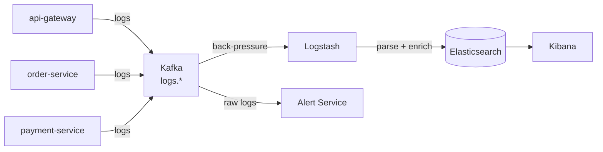

Kafka буферизует: если Logstash тормозит, логи накапливаются в топике и обрабатываются когда есть возможность. Никаких потерь.

### Структура топиков

```
logs.api-gateway         partition 0-2  (по http method)
logs.order-service       partition 0-2  (по orderId)
logs.payment-service     partition 0-2  (по txnId)
logs.inventory-service   partition 0-1
logs.notification-service partition 0-1
```

### Конфигурация Filebeat

```yaml
# filebeat.yml
filebeat.inputs:
  - type: log
    paths: ['/var/log/app/*.log']
    fields:
      service: order-service
      env: production

output.kafka:
  hosts: ['kafka:9092']
  topic: 'logs.%{[fields.service]}'
  partition.round_robin:
    reachable_only: false
  required_acks: 1
  codec.json:
    pretty: false
```

### Logstash pipeline

```ruby
input {
  kafka {
    bootstrap_servers => "kafka:9092"
    topics_pattern => "logs\\..*"
    group_id => "logstash-consumer"
    codec => json
  }
}

filter {
  grok {
    match => { "message" => "%{TIMESTAMP_ISO8601:timestamp} %{LOGLEVEL:level} %{GREEDYDATA:msg}" }
  }
  date {
    match => ["timestamp", "ISO8601"]
  }
}

output {
  elasticsearch {
    hosts => ["elasticsearch:9200"]
    index => "logs-%{[fields][service]}-%{+YYYY.MM.dd}"
  }
}
```

---

## Конвейер метрик: Kafka → InfluxDB / Prometheus

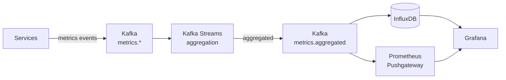

Потоковая агрегация через Kafka Streams: считаем p50/p95/p99 latency в скользящем окне прямо в топике, без дополнительных сервисов.

```typescript
// Kafka Streams: подсчёт ошибок по сервису за 1 минуту
const errorStream = builder
  .stream<string, MetricEvent>('metrics.errors')
  .filter((key, value) => value.level === 'ERROR')
  .groupByKey()
  .windowedBy(TimeWindows.ofSizeWithNoGrace(Duration.ofMinutes(1)))
  .count()
  .toStream()
  .to('metrics.error-counts')
```

---

## Система уведомлений

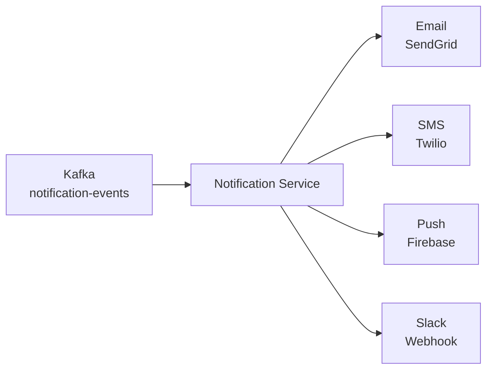

### Fan-out через Kafka

Одно событие `OrderConfirmed` → несколько каналов уведомлений:

```typescript
// Producer: OrderService публикует одно событие
await kafka.send('notification-events', {
  key: userId,
  value: {
    type: 'OrderConfirmed',
    orderId,
    userId,
    channels: ['email', 'push'],  // или читать из user preferences
    data: { amount, itemCount }
  }
})

// Consumer: NotificationService читает и роутит по каналам
consumer.on('message', async (event) => {
  const { channels, data } = event
  await Promise.all(channels.map(ch => dispatch(ch, data)))
})
```

---

## Платёжная обработка с Saga

Межсервисная транзакция "перевод денег" требует саги из 5 шагов:

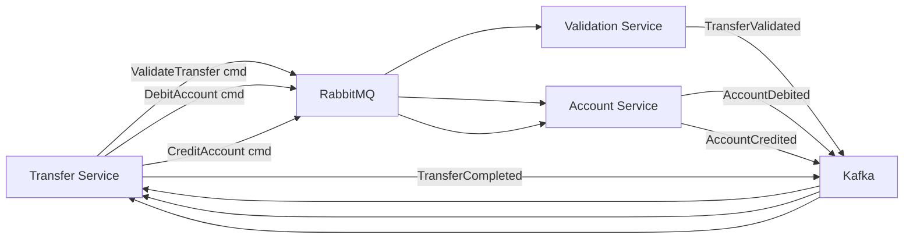

### Compensation actions при ошибке

Если `CreditAccount` упал — нужно компенсировать `DebitAccount`:

```typescript
// Orchestrated Saga через RabbitMQ
class TransferSaga {
  async execute(transfer: Transfer) {
    try {
      await this.validate(transfer)
      await this.debitSource(transfer)
      await this.creditTarget(transfer)
      await this.complete(transfer)
    } catch (error) {
      await this.compensate(transfer, error)
    }
  }

  async compensate(transfer: Transfer, failedAt: Error) {
    if (transfer.state >= 'debited') {
      // Отменяем дебет
      await rabbit.publish('account.commands', 'ReverseDebit', {
        accountId: transfer.fromAccountId,
        amount: transfer.amount,
        transferId: transfer.id,
      })
    }
    await kafka.send('transfer-events', {
      type: 'TransferFailed',
      transferId: transfer.id,
      reason: failedAt.message,
    })
  }
}
```

---

## Миграция с монолита: Strangler Fig

Strangler Fig — постепенная замена монолита микросервисами через событийный слой.

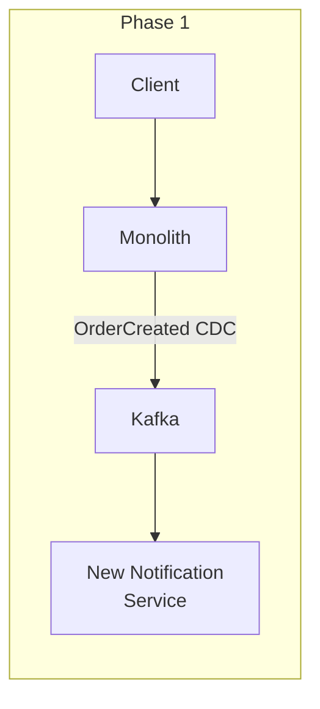

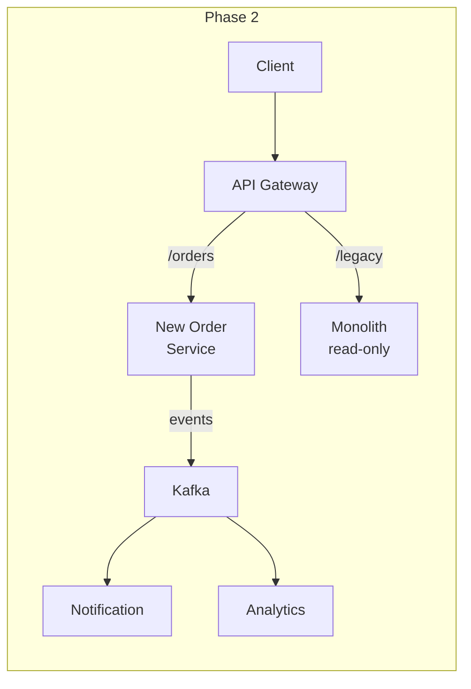

Шаги:
1. CDC из монолитной БД в Kafka (читаем данные монолита, не трогая код)
2. Новый сервис подписывается на Kafka-события
3. Перенаправляем часть трафика на новый сервис через API Gateway
4. Монолит постепенно становится read-only для мигрированных доменов

---

## Антипаттерны в продакшне

### Антипаттерн 1: God Topic

```
❌ Один топик "all-events" для всех событий системы
✅ Отдельный топик на домен: order-events, payment-events, inventory-events
```

God Topic делает невозможным независимое масштабирование consumer-групп и нарушает изоляцию доменов.

### Антипаттерн 2: Синхронный запрос через брокер

```typescript
// ❌ Request-Reply через Kafka — антипаттерн
await kafka.send('get-user-balance', { requestId, userId })
const response = await waitForReply(requestId, timeout=5000)
// Kafka не для этого. Используй REST/gRPC для синхронных запросов.

// ✅ Асинхронная реакция на события
consumer.on('UserBalanceRequested', async (event) => {
  const balance = await accountsDb.getBalance(event.userId)
  await kafka.send('user-balance-response', { requestId: event.requestId, balance })
})
```

### Антипаттерн 3: Игнорирование consumer lag

Если consumer отстаёт — это симптом проблемы, не норма. Алерт должен срабатывать до того, как lag превысит допустимое время обработки (SLA).

```yaml
# alertmanager rule
- alert: KafkaConsumerLagHigh
  expr: kafka_consumer_group_lag > 10000
  for: 2m
  annotations:
    summary: "Consumer {{ $labels.group }} отстаёт на {{ $value }} сообщений"
```

### Антипаттерн 4: RabbitMQ вместо Kafka для IoT

```
❌ 50,000 устройств → RabbitMQ → анализ данных
   Проблема: нет replay, нет удержания данных, не хватает throughput

✅ 50,000 устройств → Kafka → ML pipeline
   Решение: replay для переобучения, partition по device_id, retention 30 дней
```

---

## Capacity Planning

### Kafka: оценка необходимых ресурсов

```
Throughput = messages/sec × message_size_bytes
Disk per broker = throughput × retention_days × 86400 / replication_factor

Пример:
- 10,000 msg/sec × 1KB = 10 MB/sec
- 10 MB/sec × 7 дней × 86400 сек / 3 (replication) = ~2TB per broker
```

### Формула числа партиций

```
partitions = max(throughput_target / throughput_per_partition, consumer_count)

Эмпирически: throughput_per_partition ≈ 10MB/sec (producer) и 50MB/sec (consumer)
```

### RabbitMQ: оценка ресурсов

```
Memory per message ≈ message_size + ~1KB overhead
Рекомендация: memory_limit = RAM × 0.4 (по умолчанию)
При превышении: flow control останавливает producers
```

---

## Выбор архитектуры: матрица решений

| Сценарий | Рекомендация | Обязательные паттерны |
|----------|-------------|----------------------|
| E-commerce (заказы, оплата) | Гибрид (RabbitMQ + Kafka) | Saga, Outbox, DLQ, Fan-out, Priority Queue |
| IoT телеметрия | Kafka / Pulsar | Competing Consumers, Event Sourcing |
| Финансовые переводы | RabbitMQ / Гибрид | Saga, DLQ, Outbox, Priority Queue, CQRS |
| Централизованное логирование | Kafka | Competing Consumers |
| Система уведомлений | RabbitMQ (или Kafka если fan-out) | Fan-out, DLQ |
| Аналитика реального времени | Kafka | Kafka Streams, Event Sourcing |
| Простые задачи (email, resizing) | RabbitMQ | DLQ, Competing Consumers |

---

## ⚠️ Частые ошибки начинающих

**❌ Начинать архитектуру с выбора брокера**
```
Неправильный вопрос: "Kafka или RabbitMQ?"
Правильный вопрос: "Что именно нужно системе?
  - Нужен replay? → Kafka
  - Нужен сложный routing? → RabbitMQ
  - Нужно и то, и другое? → Гибрид или Pulsar"
```

**❌ Игнорировать retention при проектировании**
```typescript
// ❌ Создаём топик без retention — берётся дефолт 7 дней
await admin.createTopics({ topics: [{ topic: 'order-events' }] })

// ✅ Явно задаём retention под требования бизнеса
await admin.createTopics({
  topics: [{
    topic: 'order-events',
    configEntries: [
      { name: 'retention.ms', value: String(365 * 24 * 60 * 60 * 1000) }, // 1 год
    ]
  }]
})
```

**❌ Один consumer group для разных задач**
```typescript
// ❌ Analytics и Billing читают из одной consumer group
// → обе задачи конкурируют за партиции, нарушается независимость

// ✅ Отдельная consumer group для каждой задачи
const analyticsConsumer = kafka.consumer({ groupId: 'analytics-service' })
const billingConsumer = kafka.consumer({ groupId: 'billing-service' })
```

**❌ Schema evolution без обратной совместимости**
```typescript
// ❌ Меняем схему события — ломаем всех consumer
interface OrderCreated { orderId: string; amount: number }
// → Убираем поле amount, добавляем totalCents
interface OrderCreated { orderId: string; totalCents: number }  // сломали consumer!

// ✅ Обратно совместимое изменение
interface OrderCreated {
  orderId: string
  amount: number       // оставляем для старых consumer
  totalCents?: number  // добавляем новое поле опциональным
}
```
