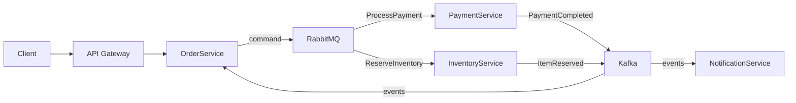
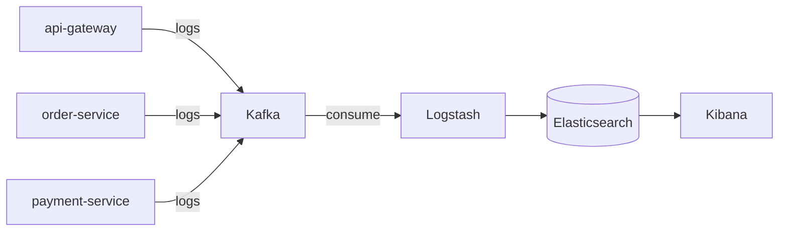
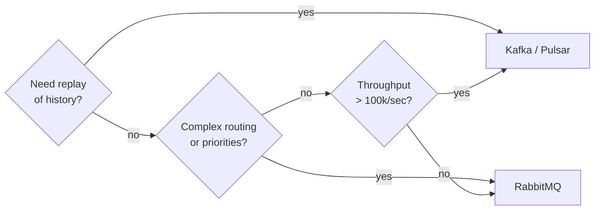

# Level 17: Real-World Architectures

## Hybrid approach: RabbitMQ for commands, Kafka for events

In real systems, a single broker is rarely used for everything. Mature teams combine tools based on their strengths.



📌 **Rule**: RabbitMQ delivers **commands** (what needs to be done) to exactly one recipient. Kafka stores **events** (what happened) — any service can subscribe and replay history.

---

## E-Commerce: order processing

Full order path in a hybrid architecture:

| Step | Sender | Receiver | Broker | Message type |
|-----|-------------|------------|--------|---------------|
| 1 | Client | API Gateway | HTTP | POST /orders |
| 2 | API Gateway | OrderService | HTTP | CreateOrder |
| 3 | OrderService | PaymentService | RabbitMQ | ProcessPayment (command) |
| 4 | PaymentService | Kafka | Kafka | PaymentCompleted (event) |
| 5 | OrderService | InventoryService | RabbitMQ | ReserveInventory (command) |
| 6 | InventoryService | Kafka | Kafka | ItemReserved (event) |
| 7 | Kafka | NotificationService | Kafka | SendEmail (event) |

💡 **Why this way?** Commands are routed via RabbitMQ with priorities (VIP vs regular), DLQ on errors. Events are written to Kafka as an immutable audit log.

---

## Centralized logging: ELK + Kafka

Kafka solves a classic ELK stack problem: Logstash can't handle peak loads directly.



Each service writes to its own topic `logs.<service-name>`. Logstash — a single consumer, parses, enriches, and puts into Elasticsearch. Kibana — search and dashboard interface.

**Partitioning by service** ensures log ordering within one service and parallel processing across services.

---

## Architecture selection process

When designing a system, answer the key questions:



| Characteristic | RabbitMQ | Kafka | Hybrid |
|----------------|----------|-------|--------|
| Throughput | ~50k/sec | >1M/sec | both |
| Event replay | no | yes (up to N days) | via Kafka |
| Routing | flexible (exchanges) | by partition key | by purpose |
| Latency | ~1ms | ~5-10ms | depends |
| Exactly-once | publisher confirms | idempotent producer | more complex |
| Complexity | low | high | high |

---

## ⚠️ Common mistakes

**❌ Using Kafka for everything, including simple commands**
```typescript
// Wrong: overloading Kafka with trivial commands
await kafka.send('send-email-commands', { to: 'user@example.com', subject: '...' })
// Consumer reads millions of such messages, retention = 7 days, no space left
```

**✅ Simple commands — to RabbitMQ, events — to Kafka**
```typescript
// Commands (one-off, delivery to specific service matters) → RabbitMQ
await rabbit.publish('notifications.commands', 'SendEmail', payload)

// Events (historical log, multiple consumers) → Kafka
await kafka.send('order-events', { type: 'OrderCompleted', orderId })
```

**❌ One topic/queue for all services in logging**
```typescript
// Wrong: all services write to one topic
await kafka.send('all-logs', { service: 'api-gateway', message: '...' })
// No isolation, impossible to scale Consumers independently
```

**✅ Separate topic per service, partitioning by level**
```typescript
// Correct: topic per service
await kafka.send(`logs.${serviceName}`, { level, message, traceId })
```
