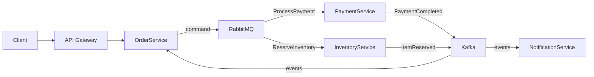
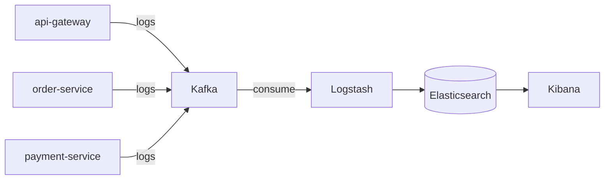
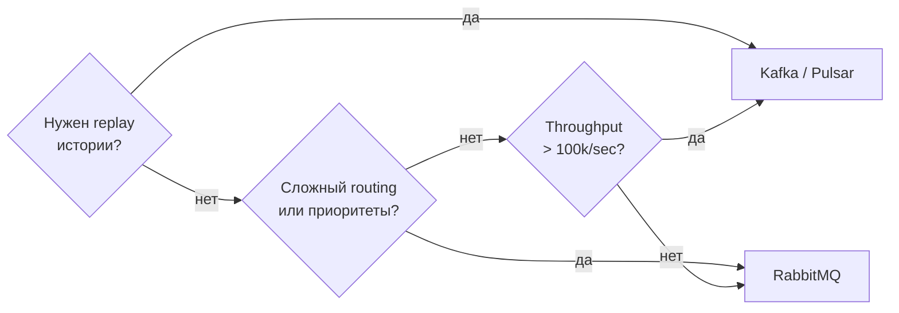

# Уровень 17: Реальные архитектуры

## Гибридный подход: RabbitMQ для команд, Kafka для событий

В реальных системах редко используют один брокер на все случаи жизни. Зрелые команды комбинируют инструменты по их сильным сторонам.



📌 **Правило**: RabbitMQ доставляет **команды** (что нужно сделать) точно одному получателю. Kafka хранит **события** (что произошло) — любой сервис может подписаться и воспроизвести историю.

---

## E-Commerce: обработка заказа

Полный путь заказа в гибридной архитектуре:

| Шаг | Отправитель | Получатель | Брокер | Тип сообщения |
|-----|-------------|------------|--------|---------------|
| 1 | Client | API Gateway | HTTP | POST /orders |
| 2 | API Gateway | OrderService | HTTP | CreateOrder |
| 3 | OrderService | PaymentService | RabbitMQ | ProcessPayment (команда) |
| 4 | PaymentService | Kafka | Kafka | PaymentCompleted (событие) |
| 5 | OrderService | InventoryService | RabbitMQ | ReserveInventory (команда) |
| 6 | InventoryService | Kafka | Kafka | ItemReserved (событие) |
| 7 | Kafka | NotificationService | Kafka | SendEmail (событие) |

💡 **Почему именно так?** Команды маршрутизируются через RabbitMQ с приоритетами (VIP vs обычные), DLQ при ошибках. События пишутся в Kafka как неизменяемый аудит-лог.

---

## Централизованное логирование: ELK + Kafka

Kafka решает классическую проблему ELK-стека: Logstash не справляется с пиковой нагрузкой напрямую.



Каждый сервис пишет в свой топик `logs.<service-name>`. Logstash — единственный consumer, парсит, обогащает и кладёт в Elasticsearch. Kibana — интерфейс поиска и дашбордов.

**Партицирование по сервису** обеспечивает порядок логов в рамках одного сервиса и параллельную обработку между сервисами.

---

## Процесс выбора архитектуры

При проектировании системы отвечай на ключевые вопросы:



| Характеристика | RabbitMQ | Kafka | Гибрид |
|----------------|----------|-------|--------|
| Throughput | ~50k/sec | >1M/sec | оба |
| Replay событий | нет | да (до N дней) | через Kafka |
| Routing | гибкий (exchanges) | по partition key | по назначению |
| Latency | ~1ms | ~5-10ms | зависит |
| Exactly-once | publisher confirms | idempotent producer | сложнее |
| Сложность | низкая | высокая | высокая |

---

## ⚠️ Частые ошибки

**❌ Kafka для всего подряд, включая простые команды**
```typescript
// Неправильно: перегружаем Kafka тривиальными командами
await kafka.send('send-email-commands', { to: 'user@example.com', subject: '...' })
// Consumer читает миллионы таких сообщений, retention = 7 дней, места нет
```

**✅ Простые команды — в RabbitMQ, события — в Kafka**
```typescript
// Команды (разовые, важна доставка конкретному сервису) → RabbitMQ
await rabbit.publish('notifications.commands', 'SendEmail', payload)

// События (исторический лог, несколько consumer) → Kafka
await kafka.send('order-events', { type: 'OrderCompleted', orderId })
```

**❌ Один топик/очередь для всех сервисов в логировании**
```typescript
// Неправильно: все сервисы пишут в один топик
await kafka.send('all-logs', { service: 'api-gateway', message: '...' })
// Нет изоляции, невозможно масштабировать Consumer независимо
```

**✅ Отдельный топик на сервис, партицирование по уровню**
```typescript
// Правильно: топик на сервис
await kafka.send(`logs.${serviceName}`, { level, message, traceId })
```
