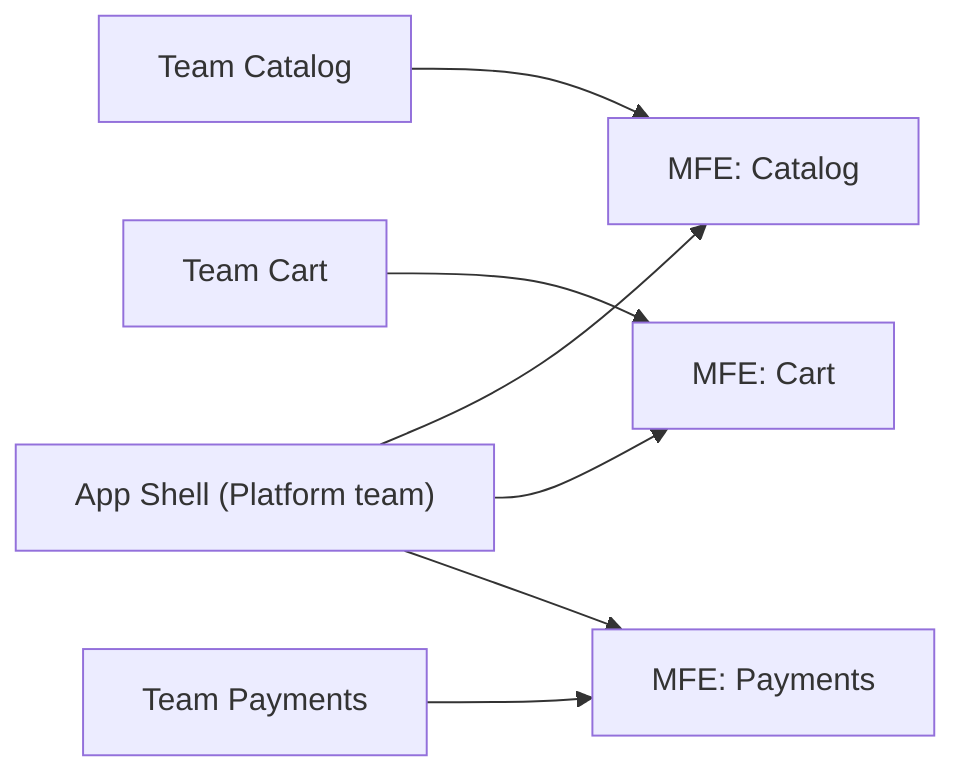
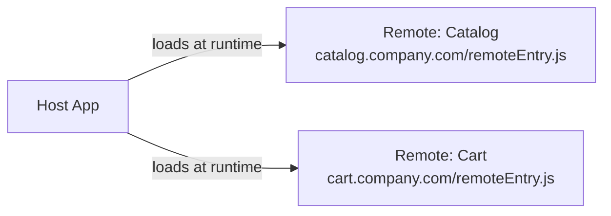
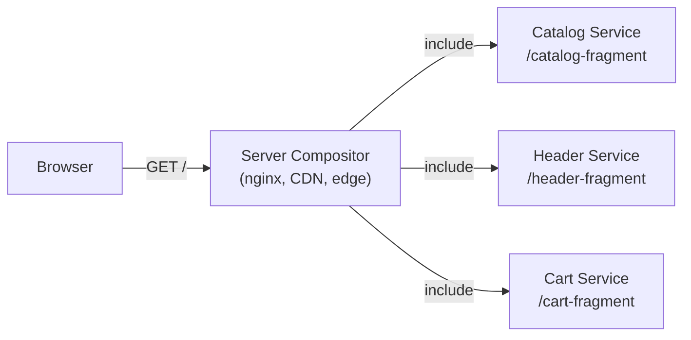

# Why Micro-Frontends — In-Depth Theory

## How the Monolith Dies Slowly

A monolithic frontend rarely becomes a problem in a single moment. It degrades gradually — and that's exactly why it's hard to catch the moment when it's time to change something.

Here's the typical path:

**Phase 1. Startup (1-2 developers).** One repo, one bundle, everything is simple. CI takes 3 minutes. Deploy is a button press.

**Phase 2. Growth (5-10 people).** The repo has grown. CI — 15 minutes. Sometimes someone breaks the shared layout with a merge. Still manageable.

**Phase 3. Scale (3+ teams, 20+ developers).** CI — 40 minutes. Before every release — a "freeze" on Friday and manual testing. The Catalog team can't ship a critical fix because the Payments team hasn't finished their feature yet.

This is called **deploy coupling** — when the fate of one deploy depends on the readiness of others.

---

## Conway's Law and Frontend Architecture

In 1967, Melvin Conway formulated: "organizations which design systems are constrained to produce designs which are copies of the communication structures of these organizations."

If three teams work in one repository — sooner or later their code will become as intertwined as their Slack conversations. MFEs are a way to make the system architecture consciously align with the team structure.



Each team owns its MFE end-to-end — from code to deploy.

---

## Integration Approaches: Detailed Breakdown

### Build-time Integration

All MFEs are bundled into a single bundle at build time. Technically, these are just npm packages or workspace dependencies.

```
host package.json:
  "dependencies": {
    "@company/catalog-mfe": "^2.1.0",
    "@company/cart-mfe": "^1.8.0"
  }
```

**Pros:** maximum performance, no runtime overhead, static type analysis works natively.

**Cons:** to deploy an update to one MFE, you need to rebuild and deploy the host. Deploy independence is an illusion.

**When it works:** small teams that want code modularity but not deploy independence.

---

### Runtime Integration (Module Federation)

Webpack Module Federation (or vite-plugin-federation) allows loading someone else's code right at runtime.



The Host doesn't know the remote version in advance — it loads it at the moment the page is opened. The Catalog team deployed a new version — the user gets it without rebuilding the host.

**Pros:** true deploy independence.

**Cons:** complexity of managing versions of shared dependencies (e.g., React must be a singleton), runtime errors if a remote is unavailable, TypeScript types need to be shared separately.

---

### iframe

The most isolated approach: each MFE lives in a separate iframe.

**Pros:** absolute CSS and JS isolation, different stacks without issues, security (sandbox).

**Cons:**
- Poor UX: two scrollbars, problems with modals and tooltips going outside the iframe boundary
- No SEO for content inside an iframe
- Communication only via `postMessage` — cumbersome
- Increased memory consumption

**When it works:** external widgets (chats, payment forms), legacy parts that cannot be touched.

---

### Server-side Composition

HTML fragments from different MFEs are assembled on the server before being sent to the browser.



Technologies: Edge Side Includes (ESI), Tailor (Zalando), Podium (FINN.no), Astro Islands.

**Pros:** excellent SEO, fast first paint, no client-side bootstrap overhead.

**Cons:** complex infrastructure, latency during composition, harder to debug.

---

## When MFEs Are a Mistake

MFEs add serious infrastructure overhead. This is not free architecture.

**Signs that MFEs are premature:**

```
❌ "We want MFEs because Google and Zalando do it"
   → Wrong scale. They have thousands of developers.

❌ "We have one team, but we want code independence"
   → A well-structured monolith with clear modular boundaries is enough for that.

❌ "We're just starting the product"
   → Premature optimization. Find product-market fit first.

❌ "Our backend is already on microservices"
   → Backend and frontend follow different scaling laws.
```

**Mature arguments for MFEs:**

```
✅ 3+ independent product teams with different roadmaps
✅ Deploys needed several times a day, but the monolith is slow
✅ There's a legacy part you want to isolate for gradual replacement
✅ Different teams want to use different dependency versions
```

---

## Key Metrics for Decision Making

### Team Autonomy Index
Can teams plan, develop, and deploy independently? If any deploy requires coordination with another team — there's no autonomy.

### Time-to-Deploy (TTD)
Time from `git push` to production. In a healthy MFE architecture, this is 5-15 minutes for each MFE independently. In an unhealthy monolith — hours or days due to queuing.

### Bundle Size Growth Rate
How fast does the main bundle grow per quarter? If the growth is linear and the bundle is already > 500 KB — that's a signal.

### Conflict Rate
Number of merge conflicts between teams per sprint. More than 2-3 conflicts per week involving multiple teams — a signal for restructuring.

---

## Anti-Patterns of the First Step

### Extract "shared component" as an MFE

```
❌ Don't do:
   MFE: Button, MFE: Input, MFE: Modal

✅ Do:
   Shared components → npm package
   MFE → independent business domain (Catalog, Cart, Profile)
```

Split by **domain boundaries**, not by technical components.

### Create Too Many MFEs at Once

Start with 1-2 pilot MFEs. Extract the most independent part of the application. Make sure the infrastructure works, the team understands the approach — and only then scale.

### Ignore Shared State

If you have a global Redux store that all components write to — splitting into MFEs doesn't remove that dependency. You need to work out the state architecture first: what stays shared (auth, user), what gets isolated in each MFE.

---

## Summary

Micro-frontends are a response to a specific pain: **multiple teams getting in each other's way**. If there's no such pain — don't create it artificially.

But if you have three teams and one release a month because "everyone needs to be ready" — MFEs are exactly what will turn three teams into three independent product streams.
