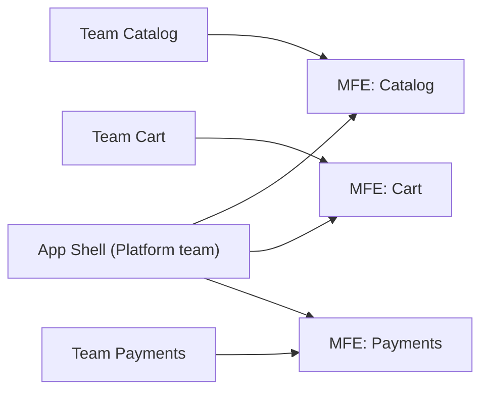
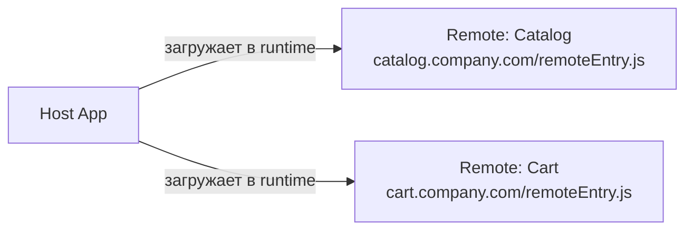
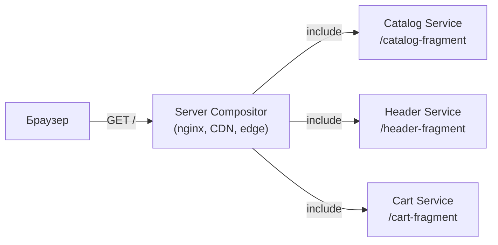

# Зачем микрофронтенды — углублённая теория

## Как монолит умирает медленно

Монолитный фронтенд редко становится проблемой в один момент. Он деградирует постепенно — и именно поэтому сложно поймать момент, когда стоит что-то менять.

Вот типичный путь:

**Фаза 1. Стартап (1-2 разработчика).** Один репо, один бандл, всё просто. CI занимает 3 минуты. Деплой — нажать кнопку.

**Фаза 2. Рост (5-10 человек).** Репо разросся. CI — 15 минут. Иногда кто-то сломает мержем общий layout. Всё ещё управляемо.

**Фаза 3. Масштаб (3+ команды, 20+ разработчиков).** CI — 40 минут. Перед каждым релизом — «freeze» в пятницу и ручное тестирование. Команда Catalog не может выпустить критичный фикс, потому что команда Payments ещё не закончила свою фичу.

Это называется **deploy coupling** — когда судьба одного деплоя зависит от готовности других.

---

## Conway's Law и архитектура фронтенда

В 1967 году Мелвин Конвей сформулировал: «организации проектируют системы, которые воспроизводят их коммуникационные структуры».

Если три команды работают в одном репозитории — рано или поздно их код начнёт переплетаться так же, как их Slack-переписки. MFE — это способ сделать архитектуру системы осознанно совпадающей со структурой команд.



Каждая команда владеет своим MFE целиком — от кода до деплоя.

---

## Подходы к интеграции: детальный разбор

### Build-time integration

Все MFE собираются в один бандл на этапе сборки. Технически это просто npm-пакеты или workspace-зависимости.

```
host package.json:
  "dependencies": {
    "@company/catalog-mfe": "^2.1.0",
    "@company/cart-mfe": "^1.8.0"
  }
```

**Плюсы:** максимальная производительность, нет runtime overhead, статический анализ типов работает нативно.

**Минусы:** чтобы задеплоить обновление одного MFE, нужно пересобрать и задеплоить host. Независимость деплоев — иллюзия.

**Когда подходит:** небольшие команды, которые хотят модульности кода, но не независимости деплоев.

---

### Runtime integration (Module Federation)

Webpack Module Federation (или vite-plugin-federation) позволяет загружать чужой код прямо в runtime.



Host не знает заранее версию remote — он загружает её в момент открытия страницы. Команда Catalog задеплоила новую версию — пользователь получит её без пересборки host.

**Плюсы:** настоящая независимость деплоев.

**Минусы:** сложность управления версиями shared-зависимостей (например, React должен быть singleton), runtime ошибки если remote недоступен, TypeScript-типы нужно шарить отдельно.

---

### iframe

Самый изолированный подход: каждый MFE живёт в отдельном iframe.

**Плюсы:** абсолютная изоляция CSS и JS, разные стеки без проблем, безопасность (sandbox).

**Минусы:**
- Плохой UX: два скроллбара, проблемы с модальными окнами и тултипами выходящими за границы iframe
- Нет SEO для контента внутри iframe
- Коммуникация только через `postMessage` — громоздко
- Увеличенное потребление памяти

**Когда подходит:** внешние виджеты (чаты, платёжные формы), легаси-части которые нельзя трогать.

---

### Server-side composition

HTML-фрагменты от разных MFE собираются на сервере перед отправкой браузеру.



Технологии: Edge Side Includes (ESI), Tailor (Zalando), Podium (FINN.no), Astro Islands.

**Плюсы:** отличный SEO, быстрая первая загрузка, нет клиентского bootstrap overhead.

**Минусы:** сложная инфраструктура, latency при composition, сложнее отлаживать.

---

## Когда MFE — это ошибка

MFE добавляют серьёзный инфраструктурный overhead. Это не бесплатная архитектура.

**Признаки, что MFE преждевременны:**

```
❌ "Мы хотим MFE, потому что Google и Zalando так делают"
   → Масштаб не тот. У них тысячи разработчиков.

❌ "У нас одна команда, но мы хотим независимость кода"
   → Для этого достаточно хорошо структурированного монолита с четкими модульными границами.

❌ "Мы только начинаем продукт"
   → Преждевременная оптимизация. Сначала найдите product-market fit.

❌ "Наш backend уже на микросервисах"
   → Backend и frontend живут по разным законам масштабирования.
```

**Зрелые аргументы за MFE:**

```
✅ 3+ независимые продуктовые команды с разными roadmap
✅ Деплой нужен несколько раз в день, но монолит тормозит
✅ Есть legacy-часть, которую хочется изолировать для постепенной замены
✅ Разные команды хотят использовать разные версии зависимостей
```

---

## Ключевые метрики для принятия решения

### Team Autonomy Index
Могут ли команды планировать, разрабатывать и деплоить независимо? Если для любого деплоя нужна координация с другой командой — автономии нет.

### Time-to-Deploy (TTD)
Время от `git push` до production. В здоровой MFE-архитектуре это 5-15 минут для каждого MFE независимо. В нездоровом монолите — часы или дни из-за очереди.

### Bundle Size Growth Rate
Как быстро растёт main bundle за квартал? Если рост линейный и бандл уже > 500 КБ — это сигнал.

### Conflict Rate
Количество merge-конфликтов между командами за спринт. Более 2-3 конфликтов в неделю с участием нескольких команд — сигнал для реструктуризации.

---

## Анти-паттерны первого шага

### Выделить "общий компонент" как MFE

```
❌ Не надо:
   MFE: Button, MFE: Input, MFE: Modal

✅ Надо:
   Shared components → npm-пакет
   MFE → независимая бизнес-область (Catalog, Cart, Profile)
```

Разделять нужно по **доменным границам**, а не по техническим компонентам.

### Создать слишком много MFE сразу

Начните с 1-2 пилотных MFE. Выделите наиболее независимую часть приложения. Убедитесь, что инфраструктура работает, команда понимает подход — и только потом масштабируйте.

### Игнорировать shared state

Если у вас глобальный Redux store, куда пишут все компоненты — разделение на MFE не убирает эту зависимость. Нужно сначала проработать архитектуру state: что остаётся shared (auth, user), что изолируется в каждом MFE.

---

## Итог

Микрофронтенды — это ответ на конкретную боль: **несколько команд, которые мешают друг другу**. Если этой боли нет — не создавайте её искусственно.

Но если у вас три команды и один релиз в месяц, потому что "все должны быть готовы" — MFE это именно то, что превратит три команды в три независимых продуктовых потока.
