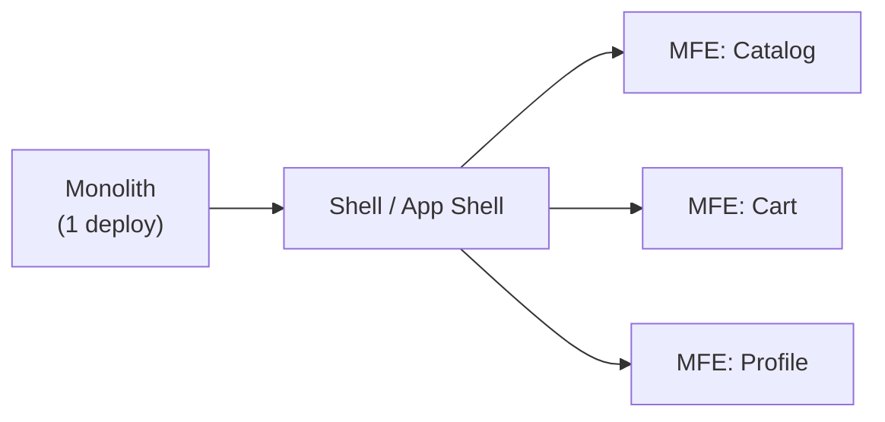

# Why Micro-Frontends

## When the Monolith Starts to Hurt

Imagine: one frontend repository, three teams — and every time before a release, all three sit down at the table and agree on who merges when. This is what a monolith looks like at scale.

Problems appear gradually:

```
1 team → 1 repo → everything is fine
2 teams → conflicts once a week → tolerable
3+ teams → conflicts every day → pain
5+ teams → deploy became a political event → disaster
```

**Merge conflicts** are not just technical inconveniences. They create a queue: one team waits while another resolves their conflict. CI runs as a single pipeline — and one team's tests block another team's release.

**A single release cycle** means: if the Payments team is not ready, the Catalog team waits. Even if Catalog has been ready to deploy for a long time.

---

## What Are Micro-Frontends

Micro-frontends are an architectural approach where a frontend application is split into independent parts that can be developed, tested, and deployed separately.

By analogy with microservices on the backend — but for the UI.



Each MFE is a separate application with its own pipeline, its own team, and its own area of responsibility.

---

## Integration Approaches

| Approach | When integrated | Pros | Cons |
|---|---|---|---|
| Build-time | During build | No runtime overhead | No independent deploy |
| Runtime (Module Federation) | On page load | Independent deploy | Versioning complexity |
| iframe | Always isolated | Full isolation | UX issues, no SEO |
| Server-side composition | On the server | SEO, fast loading | Complex infrastructure |

---

## When MFEs Are Needed, and When They're Not

**MFEs are needed if:**
- 3+ independent teams
- Teams want to deploy independently
- There are legacy parts on a different stack
- Bundle is growing faster than you can trim it

**MFEs are not needed if:**
- One team of up to ~10 people
- Rare deploys (once a month)
- Strong shared state across the entire application
- No culture of autonomous teams

💡 MFEs are not a silver bullet. They add infrastructure complexity. Make sure this complexity is justified.

---

## Key Metrics

- **Team autonomy** — can teams deploy without coordinating with others?
- **Time-to-deploy** — how long from commit to production?
- **Bundle size** — how fast is the main bundle growing?

If all three metrics are healthy — perhaps you don't need MFEs yet.
