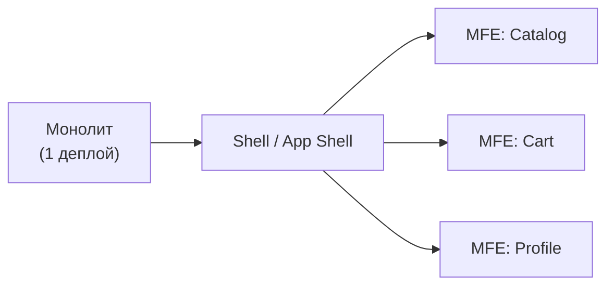

# Зачем микрофронтенды

## Когда монолит начинает болеть

Представьте: у вас один репозиторий фронтенда, три команды — и каждый раз перед релизом все три садятся за стол и договариваются, кто когда мержит. Это и есть монолит в масштабе.

Проблемы появляются постепенно:

```
1 команда → 1 репо → всё нормально
2 команды → конфликты раз в неделю → терпимо
3+ команд  → конфликты каждый день → боль
5+ команд  → деплой стал политическим событием → катастрофа
```

**Merge-конфликты** — это не просто технические неудобства. Они создают очередь: одна команда ждёт, пока другая разрулит свой конфликт. CI запускается общий — и тесты одной команды блокируют релиз другой.

**Единый релизный цикл** означает: если команда Payments не готова, команда Catalog ждёт. Даже если Catalog давно готов к деплою.

---

## Что такое микрофронтенды

Микрофронтенды — это архитектурный подход, при котором фронтенд-приложение делится на независимые части, которые можно разрабатывать, тестировать и деплоить по отдельности.

По аналогии с микросервисами на бэкенде — только для UI.



Каждый MFE — это отдельное приложение со своим pipeline, своей командой и своей зоной ответственности.

---

## Подходы к интеграции

| Подход | Когда интегрируется | Плюсы | Минусы |
|---|---|---|---|
| Build-time | При сборке | Нет runtime overhead | Нет независимого деплоя |
| Runtime (Module Federation) | При загрузке | Независимый деплой | Сложность версионирования |
| iframe | Всегда изолировано | Полная изоляция | UX-проблемы, нет SEO |
| Server-side composition | На сервере | SEO, быстрая загрузка | Сложная инфраструктура |

---

## Когда MFE нужны, а когда — нет

**MFE нужны, если:**
- 3+ независимых команды
- Команды хотят деплоить независимо
- Есть legacy части на другом стеке
- Бандл растёт быстрее, чем вы успеваете его резать

**MFE не нужны, если:**
- Одна команда до ~10 человек
- Редкие деплои (раз в месяц)
- Сильный shared state по всему приложению
- Нет культуры автономных команд

💡 MFE — не серебряная пуля. Они добавляют инфраструктурную сложность. Убедитесь, что эта сложность оправдана.

---

## Ключевые метрики

- **Team autonomy** — могут ли команды деплоить без согласования с другими?
- **Time-to-deploy** — сколько времени от коммита до продакшена?
- **Bundle size** — насколько быстро растёт main bundle?

Если все три метрики здоровы — возможно, MFE вам пока не нужны.
