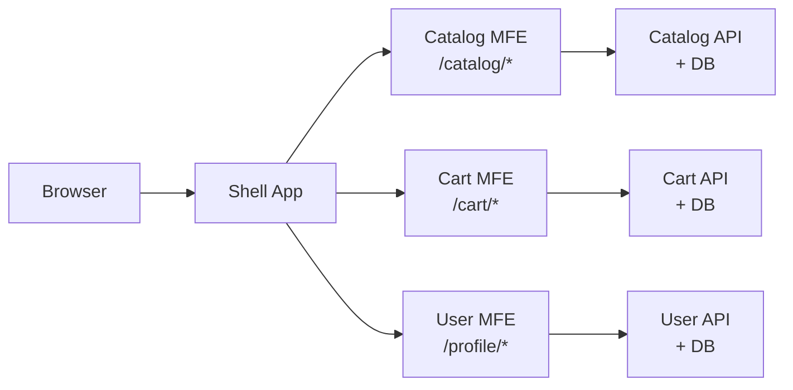
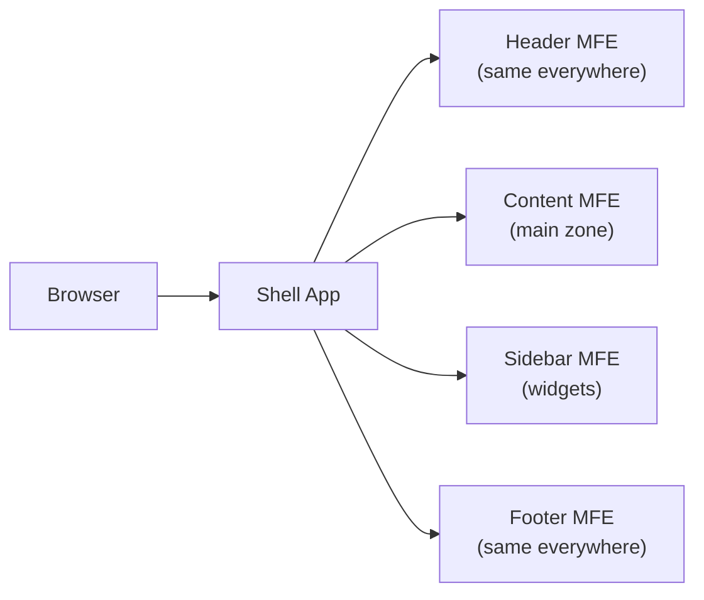
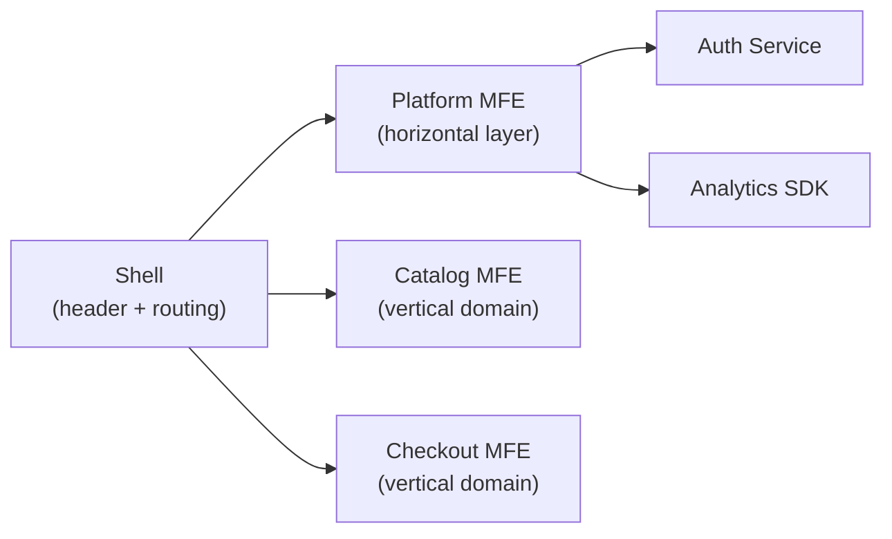
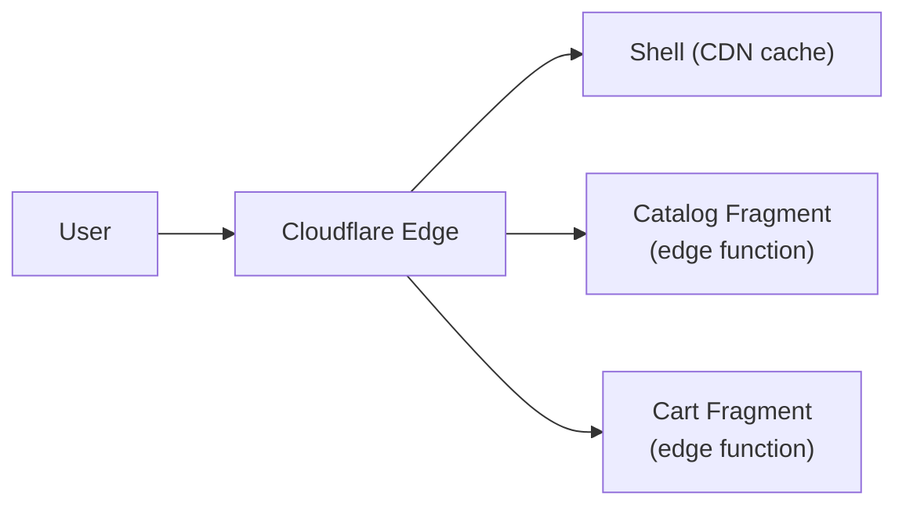
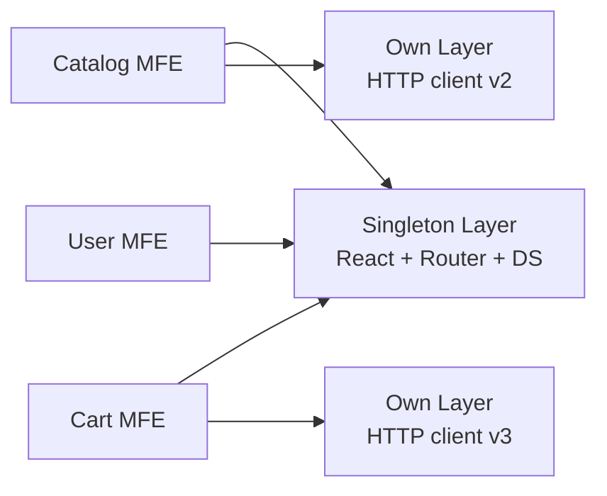
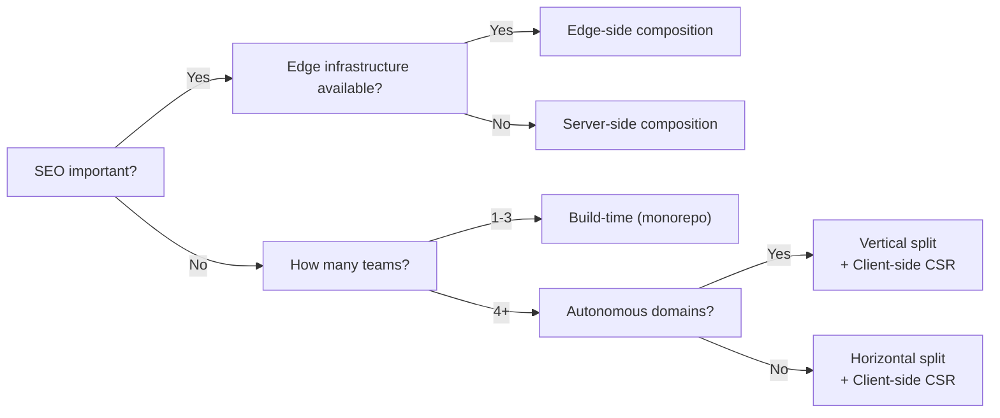

# Microfrontend Architecture Patterns — Detailed Breakdown

## Why the Architectural Choice is Made Once

When you build a house, the foundation is laid first. It cannot be changed without demolishing the entire building. MFE architecture is the foundation. Teams with the wrong architecture discover this after 6-12 months, when a redo costs more than building from scratch.

Therefore, the first level of the course is not "how to configure Module Federation," but **"how to think about architecture."** The right choice of patterns determines everything else.

---

## Decomposition Principles: What to Split By?

### Vertical Split (Feature/Domain Decomposition)

A team owns a **vertical slice** of the product: UI, business logic, API, database of a single domain.



**Advantages:**
- Team Catalog can deploy a change without coordinating with Team Cart
- Conway's Law works in your favor: team structure reflects system structure
- Fewer cross-team PRs, fewer conflicts
- Each MFE can use different technologies (React vs Vue)

**Disadvantages:**
- UI pattern duplication without strict conventions
- Harder to achieve unified UX/style
- Overlapping data concerns (cart knows about catalog products)

**When to choose:**
- Many teams (5+) with clear business domains
- Domains rarely overlap (e-commerce: catalog, cart, checkout, profile)
- Teams want full deployment autonomy

### Horizontal Split (Layer Decomposition)

Teams split the page by **technical zones**. The header team owns the header everywhere. The content team owns the main content of all pages.



**Advantages:**
- Uniform header/footer — one deploy, updated everywhere
- Easier for teams with narrow specialization (UX team owns the header)
- Less duplication at the layer level

**Disadvantages:**
- Layout changes block all teams
- When a feature spans multiple layers — coordination is needed
- Blurred responsibility boundaries ("whose button is this in the sidebar?")

**When to choose:**
- Teams are organized by specialization, not by product
- Layers change independently and rarely
- Stable layout, frequent changes in the content zone

### Hybrid: The Best of Both Worlds

In practice, most large products use a **hybrid**: horizontal shell layer (header, navigation) + vertical domains inside.



---

## Composition Types: Where the Application is Assembled

### Client-side Composition (CSR)

The browser loads the shell, the shell dynamically loads remote MFE via Module Federation or dynamic import.

```
1. User opens app.example.com
2. Shell is loaded (HTML + JS ~50KB)
3. Shell sees route /catalog → loads catalog.example.com/remoteEntry.js
4. React renders CatalogApp inside shell
```

**Trade-offs:**
- ✅ Simple deploy: each MFE — static on its own CDN
- ✅ Independent releases in real time
- ❌ Long TTI (Time to Interactive): waterfall loads
- ❌ Poor SEO without additional rendering
- ❌ Flickering on first render

**Suitable:** SPA applications without SEO requirements, B2B products, authenticated areas.

### Server-side Composition (SSR)

The server (or BFF) assembles HTML from fragments of different MFEs before sending to the client. Tools: Tailor (Zalando), Podium (FINN.no), Mosaic (Zalando).

```
1. Request hits the server
2. Server requests fragments in parallel:
   - catalog-service.internal/fragment → <div>Catalog</div>
   - cart-service.internal/fragment → <div>Cart</div>
3. Server assembles → single HTML → browser
4. Hydration on the client
```

**Trade-offs:**
- ✅ Excellent FCP and SEO
- ✅ Works without JS
- ❌ Latency depends on the slowest fragment
- ❌ Complex hydration: client and server state must match
- ❌ Need infrastructure for server-side orchestration

**Suitable:** Public pages (landing pages, catalogs), media, e-commerce with SEO.

### Edge-side Composition (ESI / Edge Workers)

CDN or Edge (Cloudflare Workers, Vercel Edge) assembles fragments from different sources.



**Trade-offs:**
- ✅ Minimal latency (processing close to the user)
- ✅ Cacheable by zone
- ❌ Limited runtime (no Node.js API)
- ❌ Vendor lock-in on CDN provider
- ❌ Complex debugging

**Suitable:** Global products with high performance requirements.

### Build-time Composition (NPM Packages)

MFEs are published as npm packages. The shell imports them as regular dependencies.

```
// package.json shell
{
  "dependencies": {
    "@company/catalog-mfe": "^1.2.0",
    "@company/cart-mfe": "^2.0.1"
  }
}
```

⚠️ **This is not a true MFE.** The main advantage of MFE — independent deploys — is lost here: to update Cart MFE, you need to rebuild and deploy the shell. This is a well-organized monolith with a modular structure. Use when type safety is more important than deployment independence.

---

## Shared Dependencies: The Spectrum of Solutions

### Full Isolation ("Shared Nothing")

Each MFE bundles everything: React, Router, Design System.

```
Shell:    React 18 (130KB) + Router (28KB) + DS (200KB)
Catalog:  React 18 (130KB) + Router (28KB) + DS (200KB)
Cart:     React 18 (130KB) + Router (28KB) + DS (200KB)
Total:    ~1.5MB on infrastructure alone
```

**Problem:** React contexts don't work between MFEs (different React instances). Hooks can break.

### Maximum Sharing ("Shared Everything")

Everything shared via Module Federation singleton.

**Problem:** Updating React in one MFE breaks others. Version coupling grows to the monolith level.

### Balanced Approach



**Sharing Rules:**
- ✅ Share: React, ReactDOM, React-Router, Design System (contexts needed everywhere)
- ✅ Share: libraries with global state (if they are used)
- ❌ Don't share: utilities, HTTP clients, team-specific libraries

---

## MFE Boundaries: How to Find the Right Cut

A good MFE boundary is when a change inside it **does not require communication with other teams**.

### Boundary Test

Ask the question: "If we want to change [X], how many teams need to be involved?"

- 1 team → correct boundary
- 2+ teams → incorrect boundary or poorly decomposed feature

### Typically Correct Boundaries

```
/catalog/* → Catalog MFE (all catalog pages)
/cart/* → Cart MFE (cart and checkout)
Widget: mini-cart in header → Cart MFE exports widget
Entire authentication domain → Auth MFE
```

### Typical Mistakes

```
❌ "Add to cart" button as a separate MFE
   (overhead exceeds the benefit)

❌ Shared "UI components" MFE with 200 components
   (this is a Design System, not an MFE)

❌ MFE by technical criteria: "MFE for forms"
   (violates domain boundary principle)
```

---

## ⚠️ Common Beginner Mistakes

### Mistake 1: Shell with Business Logic

```tsx
// ❌ Shell knows business rules
function Shell() {
  const { user } = useAuth()
  if (user.plan === 'premium') {
    return <AnalyticsMFE /> // Shell decides what to show
  }
  return <BasicMFE />
}

// ✅ Shell only routes
function Shell() {
  return (
    <Route path="/analytics" component={AnalyticsMFE} />
  )
}
// Logic "show or not" — inside AnalyticsMFE
```

### Mistake 2: Synchronous Communication via Direct Imports

```tsx
// ❌ Cart MFE imports from Catalog MFE
import { useProductStore } from '@catalog-mfe/store'
// Creates a hard dependency between MFEs

// ✅ Custom Events or shared URL-state
window.dispatchEvent(new CustomEvent('cart:add', { detail: { productId } }))
```

### Mistake 3: Different React Versions Without Singleton

```js
// ❌ In webpack.config of both MFEs
shared: { react: { singleton: false } } // false by default!

// ✅ Always singleton for React
shared: {
  react: { singleton: true, requiredVersion: '^18.0.0' },
  'react-dom': { singleton: true, requiredVersion: '^18.0.0' },
}
```

### Mistake 4: Horizontal Split Without a Stable Layout Contract

```
❌ Header MFE changes header height from 60px to 80px
   → All content shifts
   → All teams must update padding simultaneously
   → "Independent deploys" become coordinated deploys

✅ Layout contract fixed in Design Tokens:
   --header-height: 60px (not changed without major version)
```

---

## Choosing a Pattern: Decision Tree



---

## Summary

Architectural decisions in MFE form a **connected system**: composition type affects communication patterns, split strategy affects shared dependencies, deployment strategy affects versioning.

There is no universally correct answer. There is a **correct answer for your context**: team size, SEO requirements, technical debt, iteration speed.

ADR (Architecture Decision Record) is a formal way to capture the choice and its context. A year later, when a new team lead joins, they will understand **why** the system is built this way — this is invaluable.
