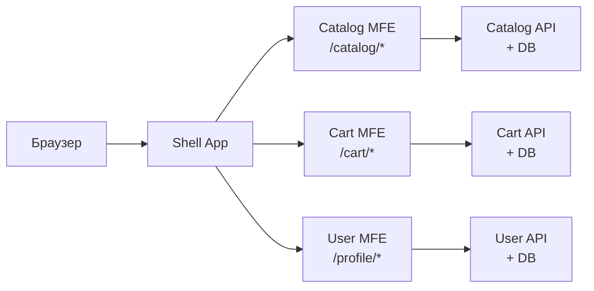
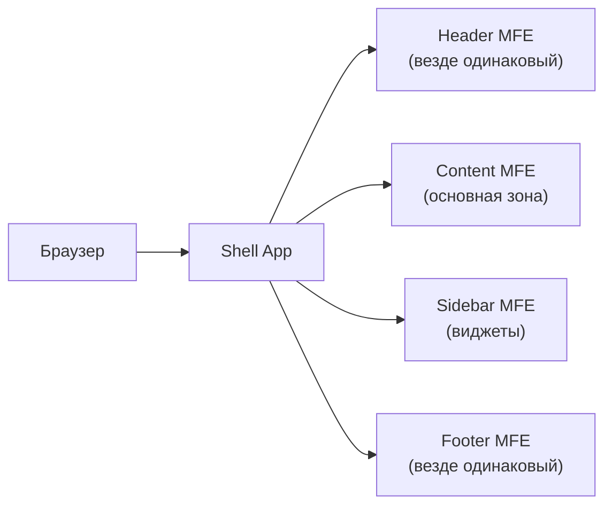
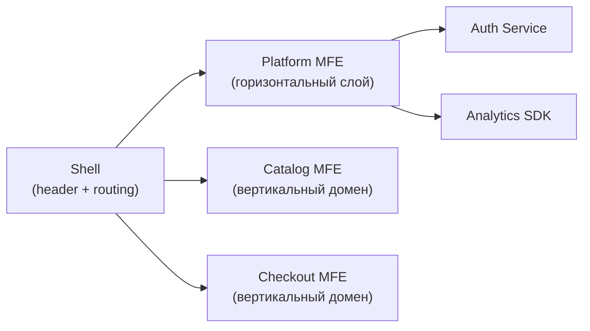
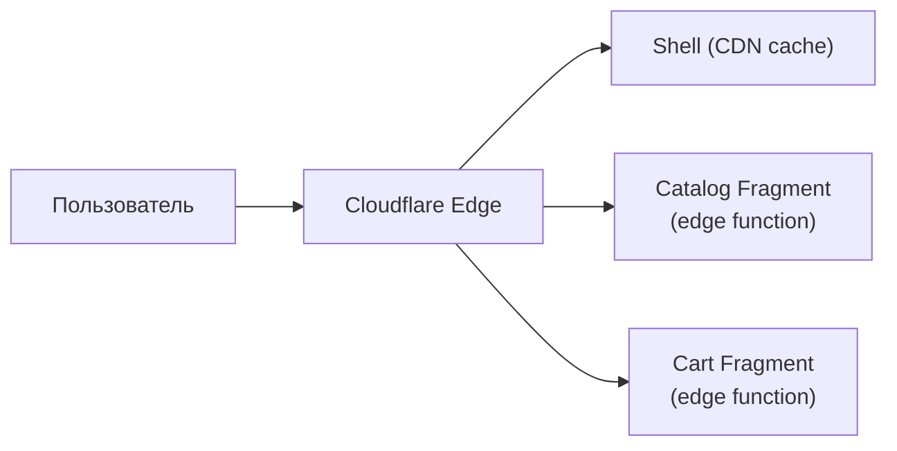
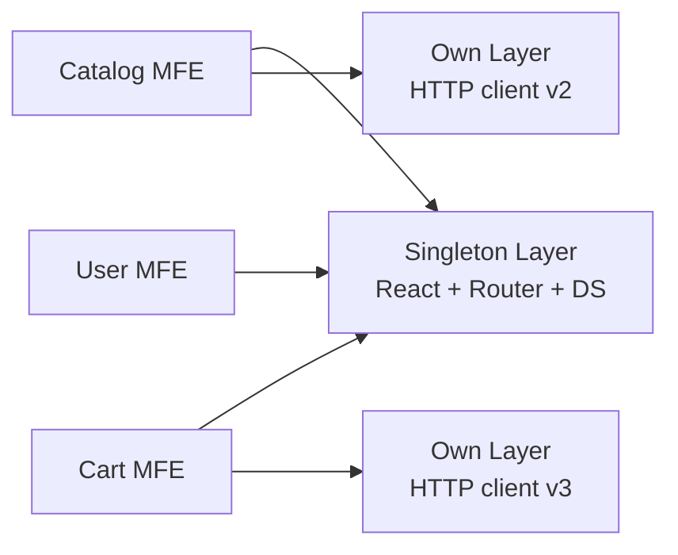
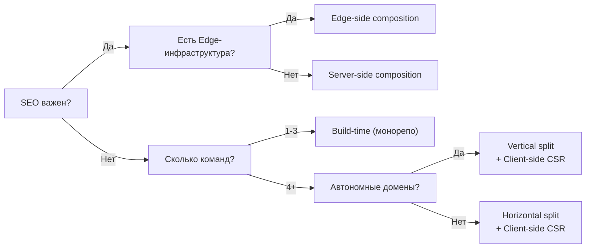

# Паттерны архитектуры микрофронтендов — подробный разбор

## Почему архитектурный выбор делается один раз

Когда вы строите дом, фундамент закладывается первым. Его нельзя поменять, не снося всё здание. Архитектура MFE — это фундамент. Команды с неправильной архитектурой обнаруживают это через 6-12 месяцев, когда переделка уже стоит дороже создания с нуля.

Поэтому первый уровень курса — не "как настроить Module Federation", а **"как думать об архитектуре"**. Правильный выбор паттернов определяет всё остальное.

---

## Принципы декомпозиции: по чему резать?

### Vertical Split (Feature/Domain decomposition)

Команда владеет **вертикальным срезом** продукта: UI, бизнес-логика, API, база данных одного домена.



**Преимущества:**
- Команда Team Catalog может задеплоить изменение без согласования с Team Cart
- Conway's Law работает на вас: структура команд отражает структуру системы
- Меньше cross-team PR, меньше конфликтов
- Каждый MFE можно написать на разных технологиях (React vs Vue)

**Недостатки:**
- Дублирование UI-паттернов без строгих договорённостей
- Сложнее добиться единого UX/стиля
- Пересечения в данных (корзина знает о продуктах каталога)

**Когда выбирать:**
- Много команд (5+) с чёткими бизнес-доменами
- Домены редко пересекаются (e-commerce: catalog, cart, checkout, profile)
- Команды хотят полной автономии в деплое

### Horizontal Split (Layer decomposition)

Команды делят страницу по **техническим зонам**. Header-команда владеет шапкой везде. Content-команда — основным контентом всех страниц.



**Преимущества:**
- Единообразный хедер/футер — один деплой, везде обновилось
- Проще для команд с узкой специализацией (UX-команда владеет хедером)
- Меньше дублирования на уровне слоёв

**Недостатки:**
- Изменение layout блокирует все команды
- Когда фича затрагивает несколько слоёв — нужна координация
- Размытые границы ответственности ("чья эта кнопка в сайдбаре?")

**Когда выбирать:**
- Команды организованы по специализации, а не по продукту
- Слои меняются независимо и редко
- Стабильный layout, частые изменения в content-зоне

### Hybrid: лучшее из двух миров

На практике большинство больших продуктов используют **гибрид**: горизонтальный shell-слой (шапка, навигация) + вертикальные домены внутри.



---

## Типы композиции: где склеивается приложение

### Client-side Composition (CSR)

Браузер загружает shell, shell динамически подгружает remote MFE через Module Federation или dynamic import.

```
1. Пользователь открывает app.example.com
2. Загружается Shell (HTML + JS ~50KB)
3. Shell видит route /catalog → загружает catalog.example.com/remoteEntry.js
4. React рендерит CatalogApp внутри shell
```

**Trade-offs:**
- ✅ Простой деплой: каждый MFE — статика на своём CDN
- ✅ Независимые релизы в реальном времени
- ❌ Долгий TTI (Time to Interactive): waterfall загрузок
- ❌ Плохой SEO без дополнительного рендеринга
- ❌ Мерцание при первом рендере

**Подходит:** SPA-приложения без SEO-требований, B2B-продукты, авторизованные зоны.

### Server-side Composition (SSR)

Сервер (или BFF) собирает HTML из фрагментов разных MFE перед отправкой клиенту. Инструменты: Tailor (Zalando), Podium (FINN.no), Mosaic (Zalando).

```
1. Запрос на сервер
2. Сервер запрашивает фрагменты параллельно:
   - catalog-service.internal/fragment → <div>Каталог</div>
   - cart-service.internal/fragment → <div>Корзина</div>
3. Сервер склеивает → единый HTML → браузер
4. Гидрация на клиенте
```

**Trade-offs:**
- ✅ Отличный FCP и SEO
- ✅ Работает без JS
- ❌ Латентность зависит от самого медленного фрагмента
- ❌ Сложная гидрация: клиентский и серверный стейт должны совпасть
- ❌ Нужна инфраструктура для server-side оркестрации

**Подходит:** Публичные страницы (лендинги, каталоги), медиа, e-commerce с SEO.

### Edge-side Composition (ESI / Edge Workers)

CDN или Edge (Cloudflare Workers, Vercel Edge) склеивает фрагменты из разных источников.



**Trade-offs:**
- ✅ Минимальная задержка (обработка близко к пользователю)
- ✅ Кешируемость по зонам
- ❌ Ограниченный runtime (нет Node.js API)
- ❌ Vendor lock-in на CDN-провайдера
- ❌ Сложная отладка

**Подходит:** Глобальные продукты с высокими требованиями к производительности.

### Build-time Composition (NPM packages)

MFE публикуются как npm-пакеты. Shell импортирует их как обычные зависимости.

```
// package.json shell
{
  "dependencies": {
    "@company/catalog-mfe": "^1.2.0",
    "@company/cart-mfe": "^2.0.1"
  }
}
```

⚠️ **Это не настоящий MFE.** Главное преимущество MFE — независимые деплои — здесь теряется: чтобы обновить Cart MFE, нужно пересобрать и задеплоить shell. Это хорошо организованный монолит с модульной структурой. Используйте, когда типобезопасность важнее независимости деплоя.

---

## Shared зависимости: спектр решений

### Полная изоляция ("Shared ничего")

Каждый MFE бандлит всё своё: React, Router, Design System.

```
Shell:    React 18 (130KB) + Router (28KB) + DS (200KB)
Catalog:  React 18 (130KB) + Router (28KB) + DS (200KB)
Cart:     React 18 (130KB) + Router (28KB) + DS (200KB)
Итого:    ~1.5MB только на инфраструктуру
```

**Проблема:** React-контексты не работают между MFE (разные инстансы React). Хуки могут сломаться.

### Максимальный шаринг ("Shared всё")

Всё shared через Module Federation singleton.

**Проблема:** обновление React в одном MFE ломает другие. Coupling по версиям растёт до уровня монолита.

### Сбалансированный подход



**Правило шаринга:**
- ✅ Делить: React, ReactDOM, React-Router, Design System (контексты нужны везде)
- ✅ Делить: библиотеки с глобальным состоянием (если они используются)
- ❌ Не делить: утилиты, HTTP-клиенты, специфичные библиотеки команды

---

## Границы MFE: как найти правильный разрез

Хорошая граница MFE — это когда изменение внутри неё **не требует коммуникации с другими командами**.

### Тест границы

Задайте вопрос: "Если мы хотим изменить [X], сколько команд нужно вовлечь?"

- 1 команда → граница правильная
- 2+ команды → граница неправильная или фича плохо декомпозирована

### Типичные правильные границы

```
/catalog/* → Catalog MFE (все страницы каталога)
/cart/* → Cart MFE (корзина и оформление)
Widget: mini-cart в хедере → Cart MFE экспортирует виджет
Весь домен аутентификации → Auth MFE
```

### Типичные ошибки

```
❌ Кнопка "Добавить в корзину" как отдельный MFE
   (overhead превышает выгоду)

❌ Shared "UI-компоненты" MFE с 200 компонентами
   (это Design System, а не MFE)

❌ MFE по техническому признаку: "MFE для форм"
   (нарушает принцип доменной границы)
```

---

## ⚠️ Распространённые ошибки начинающих

### Ошибка 1: Shell с бизнес-логикой

```tsx
// ❌ Shell знает про бизнес-правила
function Shell() {
  const { user } = useAuth()
  if (user.plan === 'premium') {
    return <AnalyticsMFE /> // Shell решает, что показывать
  }
  return <BasicMFE />
}

// ✅ Shell только маршрутизирует
function Shell() {
  return (
    <Route path="/analytics" component={AnalyticsMFE} />
  )
}
// Логика "показывать или нет" — внутри AnalyticsMFE
```

### Ошибка 2: Синхронная коммуникация через прямые импорты

```tsx
// ❌ Cart MFE импортирует из Catalog MFE
import { useProductStore } from '@catalog-mfe/store'
// Создаёт жёсткую зависимость между MFE

// ✅ Custom Events или shared URL-state
window.dispatchEvent(new CustomEvent('cart:add', { detail: { productId } }))
```

### Ошибка 3: Разные версии React без singleton

```js
// ❌ В webpack.config обоих MFE
shared: { react: { singleton: false } } // По умолчанию false!

// ✅ Обязательно singleton для React
shared: {
  react: { singleton: true, requiredVersion: '^18.0.0' },
  'react-dom': { singleton: true, requiredVersion: '^18.0.0' },
}
```

### Ошибка 4: Горизонтальное разделение без стабильного layout-контракта

```
❌ Header MFE меняет высоту header с 60px на 80px
   → Весь контент смещается
   → Все команды должны обновить отступы одновременно
   → "Независимые деплои" превращаются в координированные

✅ Layout-контракт зафиксирован в Design Tokens:
   --header-height: 60px (не меняется без major version)
```

---

## Выбор паттерна: decision tree



---

## Итог

Архитектурные решения в MFE образуют **связанную систему**: тип композиции влияет на коммуникационные паттерны, стратегия split влияет на shared-зависимости, деплой-стратегия влияет на версионирование.

Нет универсально правильного ответа. Есть **правильный ответ для вашего контекста**: размер команды, SEO-требования, технический долг, скорость итераций.

ADR (Architecture Decision Record) — это формальный способ зафиксировать выбор и его контекст. Через год, когда появится новый тимлид, он поймёт **почему** система устроена именно так — это бесценно.
