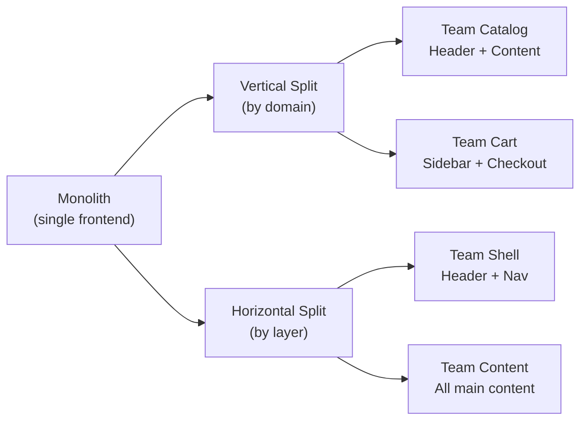
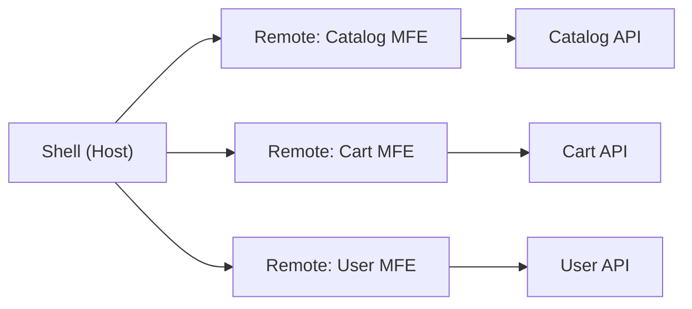
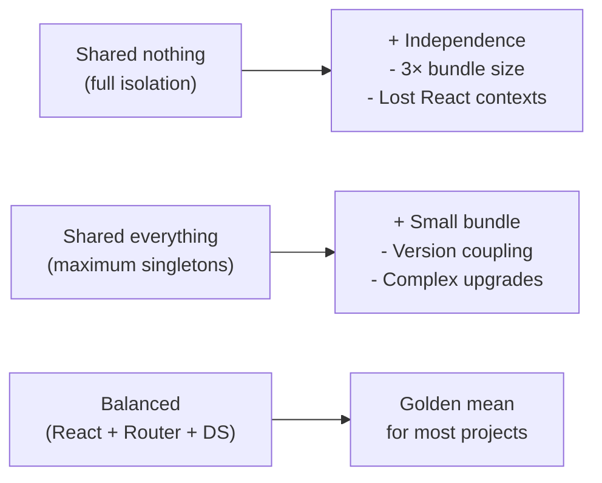

# Microfrontend Architecture Patterns

## What is MFE Architecture

A microfrontend is not a technology, but an **organizational pattern**. Imagine a large department store: each department (shoes, electronics, clothing) has its own salespeople, its own display design, its own checkout. But the building is shared, there is one entrance, and the navigation signs are common. That's how MFE architecture works: one shell application as the building, several teams as departments.

---

## Vertical vs Horizontal Split

The first question when designing MFEs: **what principle to split by?**

**Vertical split** — a team owns an entire domain from UI to API. Team Catalog deploys its own header, its own page, its own backend. Maximum autonomy, minimal dependencies.

**Horizontal split** — teams split the page by technical layers. Header team, content team, footer team. Easier to achieve a unified style, but teams constantly need to coordinate when changing the layout.

💡 **Analogy:** Vertical = each chef cooks a dish from start to finish. Horizontal = one cuts, another fries, a third serves. The first approach is faster for independent tasks, the second — when precise specialization is needed.

---

## Shell + Remote: The Orchestrator Role

**Shell** — this is the orchestrator. Its tasks:
- Load the required remote applications
- Render the common layout (header, navigation, footer)
- Manage global routing
- Provide shared context (theme, locale, auth token)

The Shell should be **as thin as possible** — business logic is prohibited in it. It is the "load-bearing walls," not the "furniture."

---

## Types of Composition

| Type | Where assembled | When to use |
|------|----------------|-------------|
| **Client-side** | In the browser | SPA, no SEO requirements |
| **Server-side** | On the server | SEO, fast FCP |
| **Edge-side** | On CDN/Edge | Maximum performance |
| **Build-time** | At build time | Monorepo, maximum typing |

⚠️ **Build-time is not a true MFE**: deployment independence is lost. This is just a well-organized monolith.

---

## Shared Nothing vs Shared Everything

Practical rule: **share what doesn't change often and where version mismatch is critical** (React, Router, Design System). Don't share what each team can update independently (HTTP client, utilities).

---

## Microfrontend Boundaries

An MFE boundary must align with a **business domain boundary**. A sign of a correct boundary — a team can deploy a change without talking to other teams.

- One route (`/catalog`, `/cart`) — a good MFE
- One widget (cart in the header) — can be an MFE during active development
- An entire domain (Checkout: pages + widgets + API) — ideal for mature teams

⚠️ **Common beginner mistakes:**
- Splitting UI by components (a button as an MFE) — overhead without benefit
- Shell with business logic — violates autonomy
- Shared State Manager without versioning — a source of production incidents
