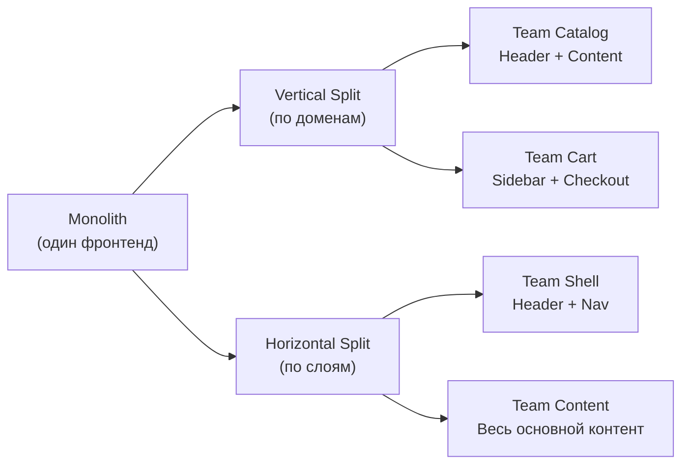
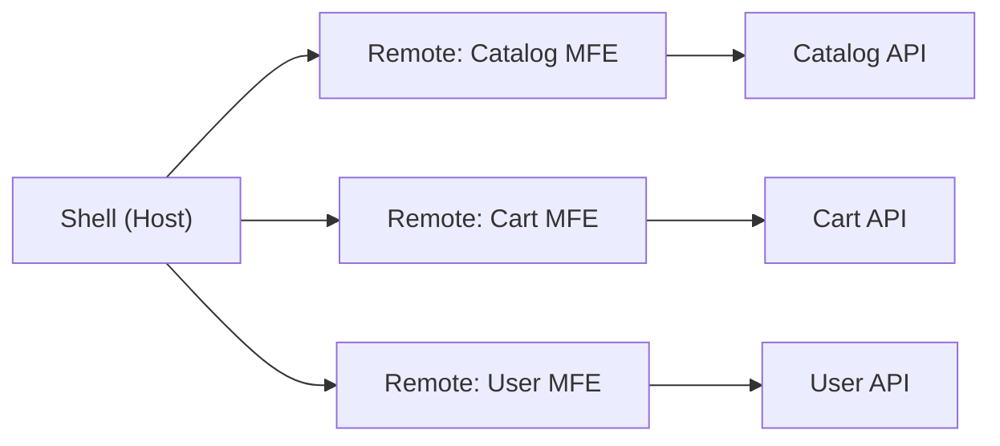
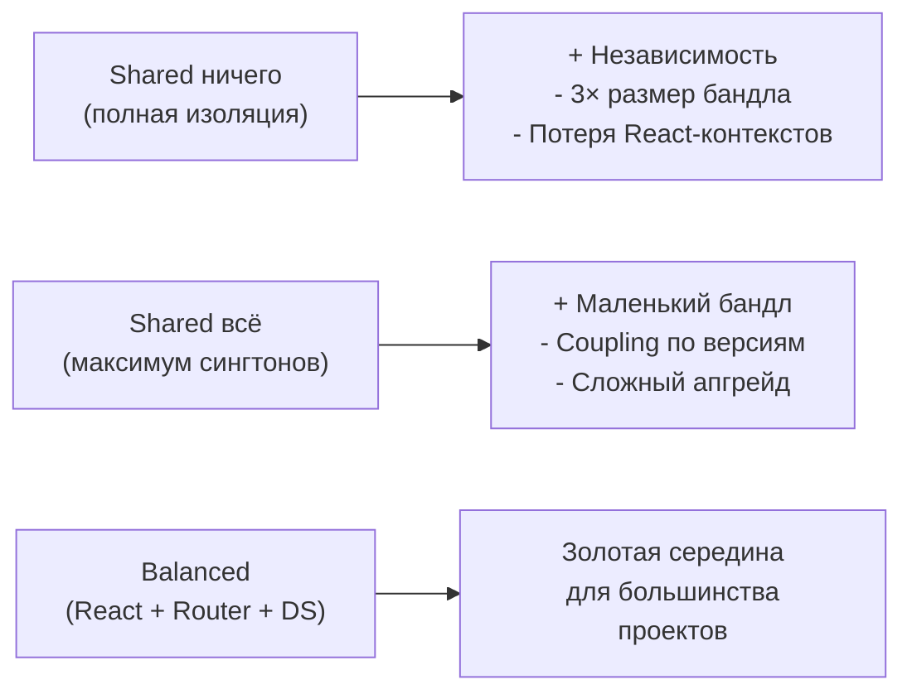

# Паттерны архитектуры микрофронтендов

## Что такое MFE-архитектура

Микрофронтенд — это не технология, а **организационный паттерн**. Представьте большой универмаг: у каждого отдела (обувь, электроника, одежда) свои продавцы, своё оформление витрины, своя касса. Но здание одно, вход один, навигационные указатели общие. Так же устроена MFE-архитектура: один shell-приложение как здание, несколько команд как отделы.

---

## Vertical vs Horizontal Split

Первый вопрос при проектировании MFE: **по какому принципу делить?**

**Vertical split** — команда владеет целым доменом от UI до API. Team Catalog деплоит свой хедер, свою страницу, свой бэкенд. Максимальная автономия, минимальные зависимости.

**Horizontal split** — команды делят страницу по техническим слоям. Header-команда, content-команда, footer-команда. Проще добиться единого стиля, но команды постоянно координируются при изменении layout.

💡 **Аналогия:** Vertical = каждый повар готовит блюдо от начала до конца. Horizontal = один режет, другой жарит, третий подаёт. Первый подход быстрее для независимых задач, второй — когда нужна точная специализация.

---

## Shell + Remote: роль оркестратора

**Shell** — это оркестратор. Его задачи:
- Загрузить нужные remote-приложения
- Отрендерить общий layout (шапка, навигация, подвал)
- Управлять глобальной маршрутизацией
- Предоставить shared-контекст (тема, локаль, токен авторизации)

Shell должен быть **максимально тонким** — бизнес-логика в нём запрещена. Он — "несущие стены", не "мебель".

---

## Типы композиции

| Тип | Где собирается | Когда использовать |
|-----|---------------|-------------------|
| **Client-side** | В браузере | SPA, нет SEO-требований |
| **Server-side** | На сервере | SEO, быстрый FCP |
| **Edge-side** | На CDN/Edge | Максимальная производительность |
| **Build-time** | При сборке | Монорепо, максимальная типизация |

⚠️ **Build-time — не настоящий MFE**: теряется независимость деплоя. Это просто хорошо организованный монолит.

---

## Shared ничего vs Shared всё

Практическое правило: **делите то, что не меняется часто и разрыв версий критичен** (React, Router, Design System). Не делите то, что каждая команда может независимо обновить (HTTP-клиент, утилиты).

---

## Границы микрофронтенда

Граница MFE должна совпадать с **границей бизнес-домена**. Признак правильной границы — команда может задеплоить изменение, не переговорив с другими командами.

- Один route (`/catalog`, `/cart`) — хороший MFE
- Один виджет (корзина в хедере) — может быть MFE при активной разработке
- Весь домен (Checkout: страницы + виджеты + API) — идеально для зрелых команд

⚠️ **Распространённые ошибки начинающих:**
- Делить UI по компонентам (кнопка как MFE) — overhead без выгоды
- Shell с бизнес-логикой — нарушает автономию
- Shared State Manager без версионирования — источник production-инцидентов
