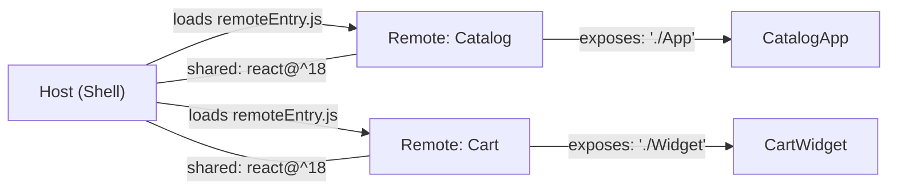
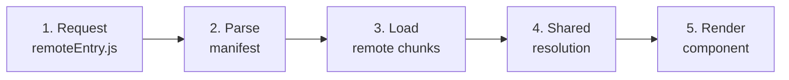

# Module Federation: Basics

## What is Module Federation

Imagine you are building an office center. Each tenant (team) wants to put their own furniture, coffee machines, lighting. But everyone shares the same electrical grid, plumbing, and load-bearing walls.

**Module Federation** is the standard "sockets and plugs" for microfrontends. One MFE (`remote`) publishes its components through a standardized interface. Another MFE (`host`) connects them like plugging a cord into a socket — no recompilation, directly in the browser.

Before Module Federation, shared dependencies had to be either duplicated (each MFE pulled its own React) or versions strictly coordinated via npm monorepo. Both approaches broke team independence.

---

## Key Roles



- **Host** — the orchestrator. Knows about all remotes, loads them dynamically, provides shared dependencies
- **Remote** — an autonomous MFE. Declares what to export (`exposes`) and what it expects as shared
- **exposes** — a dictionary: key `"./Button"` → path `"./src/Button.tsx"`. This is the remote's public API
- **shared** — libraries that the runtime will try to reuse (not download again)
- **filename** — the output file name for the entry point (default `remoteEntry.js`)

---

## Remote Module Load Lifecycle

When host does `import('catalogApp/App')`, this chain fires:



**Step 1 — remoteEntry.js** (~2-5 KB): a tiny file containing module metadata — which chunks are available, which shared dependencies are needed. This is the remote's "table of contents."

**Step 2 — manifest**: webpack/vite builds the graph: what needs to be loaded, in what order, what can be taken from already loaded.

**Step 3 — chunks**: JS files of the MFE itself are loaded in parallel. This is the main part by size.

**Step 4 — shared resolution**: 🔥 the key moment. Module Federation checks: "Is there already a compatible version of react in memory?" If host already loaded `react@18.2.0` and remote wants `react@^18`, the condition is compatible — remote uses the same instance. No duplication, no two React contexts.

**Step 5 — rendering**: the component mounts. React Context, Router, all singleton dependencies are already available via shared.

---

## Basic Configuration

### Remote (vite-plugin-federation)

```ts
// vite.config.ts — remote application
federation({
  name: 'catalogApp',        // unique identifier
  filename: 'remoteEntry.js', // entry point
  exposes: {
    './App': './src/App.tsx',           // public API
    './Button': './src/ui/Button.tsx',
  },
  shared: {
    'react': { singleton: true, requiredVersion: '^18.0.0' },
    'react-dom': { singleton: true, requiredVersion: '^18.0.0' },
  },
})
```

### Host (vite-plugin-federation)

```ts
// vite.config.ts — host application
federation({
  name: 'hostApp',
  remotes: {
    catalogApp: 'catalogApp@http://localhost:3001/remoteEntry.js',
    // format: <name>@<url>
  },
  shared: {
    'react': { singleton: true, requiredVersion: '^18.0.0' },
    'react-dom': { singleton: true, requiredVersion: '^18.0.0' },
  },
})
```

Usage in host code:

```tsx
const CatalogApp = React.lazy(() => import('catalogApp/App'))
// or without lazy:
import CatalogButton from 'catalogApp/Button'
```

---

## ⚠️ Common Beginner Mistakes

**Forgot `singleton: true` for React**

```ts
// ❌ Bad
shared: { 'react': { requiredVersion: '^18' } }
```

Without `singleton`, each MFE may load its own copy of React. Result: React Hooks throw "Invalid hook call" because hook states are tied to a specific React instance.

```ts
// ✅ Good
shared: { 'react': { singleton: true, requiredVersion: '^18' } }
```

**Key in `exposes` without `"./"`**

```ts
// ❌ Bad
exposes: { 'App': './src/App.tsx' }
```

Module Federation requires keys to start with `"./"`. This is a path convention relative to the remote.

```ts
// ✅ Good
exposes: { './App': './src/App.tsx' }
```

**Different `requiredVersion` in host and remote**

If host specified `react@^17` in shared, and remote expects `react@^18` — Module Federation won't find a compatible version and will load a second copy. Result — two Reacts, broken contexts.

---

## Webpack MF vs vite-plugin-federation

| | Webpack Module Federation | vite-plugin-federation |
|---|---|---|
| Support | Webpack 5 (native) | Vite (plugin) |
| SSR | Partial | Limited |
| HMR in dev | No for federated | Limited |
| Maturity | High (since 2020) | Growing (since 2022) |
| Target | esnext only | Configurable |

💡 vite-plugin-federation works well for SPA projects on Vite. For SSR (Next.js), Webpack MF or specialized solutions (Module Federation 2.0) are still better.
