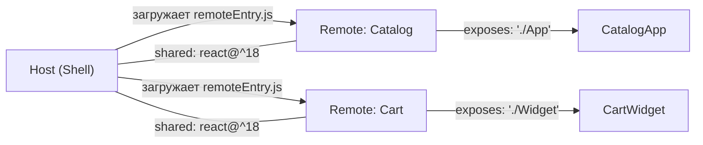
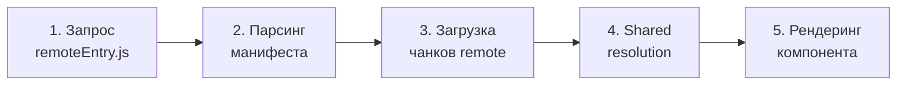

# Module Federation: основы

## Что такое Module Federation

Представьте, что вы строите офисный центр. Каждый арендатор (команда) хочет поставить свою мебель, свою кофемашину, своё освещение. Но электросеть у всех одна, водопровод один, несущие стены общие.

**Module Federation** — это стандарт "розеток и вилок" для микрофронтендов. Один MFE (`remote`) публикует наружу свои компоненты через стандартизированный интерфейс. Другой MFE (`host`) подключает их как вилку в розетку — без перекомпиляции, прямо в браузере.

До Module Federation общие зависимости приходилось либо дублировать (каждый MFE тянул свой React), либо жёстко согласовывать версии через npm-монорепо. Оба подхода ломали независимость команд.

---

## Ключевые роли



- **Host** — оркестратор. Знает о всех remote, загружает их динамически, предоставляет shared-зависимости
- **Remote** — автономный MFE. Декларирует что экспортировать (`exposes`) и на что рассчитывает как на shared
- **exposes** — словарь: ключ `"./Button"` → путь `"./src/Button.tsx"`. Это публичный API remote
- **shared** — библиотеки, которые runtime попытается переиспользовать (не скачивать повторно)
- **filename** — имя выходного файла точки входа (по умолчанию `remoteEntry.js`)

---

## Жизненный цикл загрузки remote-модуля

Когда host делает `import('catalogApp/App')`, запускается цепочка:



**Шаг 1 — remoteEntry.js** (~2-5 KB): крошечный файл, который содержит метаданные о модуле — какие чанки доступны, какие shared-зависимости нужны. Это "оглавление" remote.

**Шаг 2 — манифест**: webpack/vite строит граф: что нужно загрузить, в каком порядке, что можно взять из уже загруженного.

**Шаг 3 — чанки**: параллельно загружаются JS-файлы самого MFE. Это основная часть по объёму.

**Шаг 4 — shared resolution**: 🔥 ключевой момент. Module Federation проверяет: "Есть ли уже подходящая версия react в памяти?" Если host уже загрузил `react@18.2.0` и remote хочет `react@^18`, условие совместимо — remote использует тот же экземпляр. Нет дублирования, нет двух React-контекстов.

**Шаг 5 — рендеринг**: компонент монтируется. React Context, Router, все singleton-зависимости уже доступны через shared.

---

## Базовая конфигурация

### Remote (vite-plugin-federation)

```ts
// vite.config.ts — remote-приложение
federation({
  name: 'catalogApp',        // уникальный идентификатор
  filename: 'remoteEntry.js', // точка входа
  exposes: {
    './App': './src/App.tsx',           // публичный API
    './Button': './src/ui/Button.tsx',
  },
  shared: {
    'react': { singleton: true, requiredVersion: '^18.0.0' },
    'react-dom': { singleton: true, requiredVersion: '^18.0.0' },
  },
})
```

### Host (vite-plugin-federation)

```ts
// vite.config.ts — host-приложение
federation({
  name: 'hostApp',
  remotes: {
    catalogApp: 'catalogApp@http://localhost:3001/remoteEntry.js',
    // формат: <name>@<url>
  },
  shared: {
    'react': { singleton: true, requiredVersion: '^18.0.0' },
    'react-dom': { singleton: true, requiredVersion: '^18.0.0' },
  },
})
```

Использование в коде host:

```tsx
const CatalogApp = React.lazy(() => import('catalogApp/App'))
// или без lazy:
import CatalogButton from 'catalogApp/Button'
```

---

## ⚠️ Типичные ошибки новичков

**Забыть `singleton: true` для React**

```ts
// ❌ Плохо
shared: { 'react': { requiredVersion: '^18' } }
```

Без `singleton` каждый MFE может загрузить собственную копию React. Итог: React Hooks выбрасывают ошибку "Invalid hook call", потому что hook-состояния привязаны к конкретному экземпляру React.

```ts
// ✅ Хорошо
shared: { 'react': { singleton: true, requiredVersion: '^18' } }
```

**Ключ в `exposes` без `"./"`**

```ts
// ❌ Плохо
exposes: { 'App': './src/App.tsx' }
```

Module Federation требует, чтобы ключи начинались с `"./"`. Это конвенция пути относительно remote.

```ts
// ✅ Хорошо
exposes: { './App': './src/App.tsx' }
```

**Разные версии `requiredVersion` в host и remote**

Если host указал `react@^17` в shared, а remote ожидает `react@^18` — Module Federation не найдёт совместимую версию и загрузит вторую копию. Итог — два React, сломанные контексты.

---

## Webpack MF vs vite-plugin-federation

| | Webpack Module Federation | vite-plugin-federation |
|---|---|---|
| Поддержка | Webpack 5 (нативно) | Vite (плагин) |
| SSR | Частичная | Ограниченная |
| HMR в dev | Нет для federated | Ограниченный |
| Зрелость | Высокая (с 2020) | Растёт (с 2022) |
| Target | esnext only | Настраивается |

💡 vite-plugin-federation хорошо подходит для SPA-проектов на Vite. Для SSR (Next.js) пока лучше Webpack MF или специализированные решения (Module Federation 2.0).
