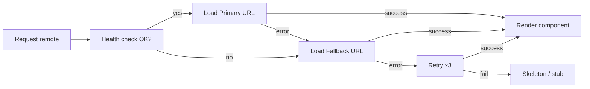

# Module Federation: Advanced Level — Extended Theory

## Why Shared Versioning is the Biggest Pain Point of MFEs

Imagine: you have 5 teams, each deploys their own remote. One team updated React to 18.3, another is still on 18.0. The third enabled strictVersion, the fourth — didn't. And the fifth forgot to specify requiredVersion altogether.

In a monolith, this doesn't happen — there's one React version for the entire project, defined in package.json. In MFE, each remote is a separately deployed artifact with its own package.json. And at runtime they need to somehow agree on which React version to use.

Module Federation solves this through **shared scope** — a common space where all dependency versions are registered, and the runtime picks a "winner" by semver rules.

---

## How Shared Scope Works Internally

On initialization, each MFE (host and all remotes) calls `__webpack_init_sharing__('default')`. This populates the global object `__webpack_share_scopes__.default` with entries like:

```
{
  "react": {
    "18.2.0": {
      get: () => Promise<ReactModule>,
      loaded: boolean,
      eager: boolean,
      requiredVersion: "^18.0.0",
      singleton: true,
      strictVersion: false,
    },
    "18.0.0": {
      // ...
    }
  }
}
```

When a remote requests `react`, the runtime looks into this object and searches for the best version:

1. If there's already a loaded (loaded=true) compatible version — use it
2. If there are multiple unloaded compatible versions — take the maximum
3. If there's no compatible version and singleton=true — take what's there (with a warning)
4. If there's no compatible version and strictVersion=true — throw an error

---

## Detailed Semver in the MFE Context

Module Federation uses standard semver. Let's review the main ranges:

| Range | Example | Matches |
|---|---|---|
| `^18.0.0` | `^18.0.0` | 18.0.0 — 18.x.x (except 19+) |
| `~18.2.0` | `~18.2.0` | 18.2.0 — 18.2.x (patch only) |
| `18.2.0` | `18.2.0` | Strictly 18.2.0 |
| `>=18.0.0` | `>=18.0.0` | Any 18+ |

For React, `^18.0.0` is typically used. This means: "compatible with any 18.x.x, but not 17 or 19."

### What Happens on Minor Mismatch

```
Host: react@18.0.0, requiredVersion: "^18.0.0"
Remote: react@18.3.1, requiredVersion: "^18.0.0"
```

Both versions fall into `^18.0.0`. The runtime will pick the newer one — 18.3.1. The console will show:

```
[Module Federation] Sharing react@18.3.1, current version is 18.0.0
```

This is a warning, not an error. React minor versions are usually backward compatible, so everything works. But it's good practice to keep versions synchronized — agree on one base version across teams.

---

## Dynamic Remotes: Industrial-Level Patterns

### Remote Configuration Registry

In large projects, the remote list isn't hardcoded in the host — it's stored in a configuration service:

```ts
// Configuration is loaded from API at startup
interface RemoteManifest {
  name: string
  url: string
  fallbackUrl?: string
  version: string
  healthUrl?: string
  timeout: number
}

async function fetchRemoteManifest(): Promise<RemoteManifest[]> {
  const res = await fetch('/api/mfe-manifest')
  return res.json()
}
```

This approach gives operational flexibility: to update a remote URL, you just update the record in the API — no need to rebuild the host.

### Promise-Based Remote Initialization

Webpack Module Federation supports asynchronous remote initialization:

```js
// webpack.config.js host
module.exports = {
  plugins: [
    new ModuleFederationPlugin({
      remotes: {
        catalogApp: `promise new Promise(resolve => {
          const remoteUrl = window.__REMOTE_CONFIG__.catalog
          const script = document.createElement('script')
          script.src = remoteUrl
          script.onload = () => {
            const proxy = {
              get: (request) => window.catalogApp.get(request),
              init: (arg) => {
                try {
                  return window.catalogApp.init(arg)
                } catch(e) {
                  console.log('remote already initialized')
                }
              }
            }
            resolve(proxy)
          }
          document.head.appendChild(script)
        })`,
      },
    }),
  ],
}
```

Here `window.__REMOTE_CONFIG__` is an object injected at application startup from the configuration API.

---

## Graceful Degradation: Level System

For production systems, several degradation levels are recommended:



### LoadableRemote Implementation

```tsx
interface LoadableRemoteOptions {
  load: () => Promise<{ default: React.ComponentType }>
  fallback: React.ComponentType
  skeleton?: React.ComponentType
  retries?: number
}

function createLoadableRemote({ load, fallback: Fallback, skeleton: Skeleton, retries = 3 }: LoadableRemoteOptions) {
  let attempt = 0

  const loadWithRetry = (): Promise<{ default: React.ComponentType }> => {
    return load().catch(err => {
      if (attempt < retries) {
        attempt++
        return new Promise<{ default: React.ComponentType }>(resolve =>
          setTimeout(() => resolve(loadWithRetry()), 1000 * attempt)
        )
      }
      console.error('Remote load failed after retries:', err)
      return { default: Fallback }
    })
  }

  const LazyComponent = React.lazy(loadWithRetry)

  return function LoadableRemote(props: Record<string, unknown>) {
    return (
      <ErrorBoundary fallback={<Fallback />}>
        <Suspense fallback={Skeleton ? <Skeleton /> : <div>Loading...</div>}>
          <LazyComponent {...props} />
        </Suspense>
      </ErrorBoundary>
    )
  }
}

// Usage
const Catalog = createLoadableRemote({
  load: () => import('catalogApp/App'),
  fallback: CatalogUnavailable,
  skeleton: CatalogSkeleton,
  retries: 3,
})
```

---

## Typing: Three Strategies

### Strategy 1: Manual Declarations (Good for Small Teams)

Each remote publishes a `federation-types.d.ts` file as an artifact:

```ts
// packages/catalog-types/federation-types.d.ts
declare module 'catalogApp/App' {
  const App: React.ComponentType<{
    basePath?: string
    onProductSelect?: (id: string) => void
  }>
  export default App
}

declare module 'catalogApp/ProductCard' {
  export interface ProductCardProps {
    id: string
    title: string
    price: number
    imageUrl: string
  }
  export const ProductCard: React.ComponentType<ProductCardProps>
}
```

Host adds the package as a devDependency. When remote API changes — a new types package version is published.

### Strategy 2: @module-federation/typescript

The plugin automatically generates types from the `exposes` config:

```bash
# Remote: generates src/typings/@mf-types/ after build
# Host: downloads types from remote
npx @module-federation/typescript download --remotes catalogApp
```

Types are stored in `.federation/` and added to tsconfig.

### Strategy 3: Shared Contract Package (Most Scalable)

```
packages/
  mfe-contracts/
    src/
      catalog.types.ts    // Props, Events, API
      cart.types.ts
      auth.types.ts
    package.json
```

All MFEs depend on `@company/mfe-contracts`. A contract change is a change in one place with semver versioning.

```ts
// @company/mfe-contracts/catalog.types.ts
export interface CatalogAppProps {
  basePath: string
  onProductSelect: (productId: string) => void
  initialFilters?: ProductFilters
}

export interface ProductFilters {
  category?: string
  priceRange?: [number, number]
  inStockOnly?: boolean
}
```

---

## Feature Flags via Dynamic Remotes

Feature flags for MFEs work at the URL level, not the code level:

```ts
// feature-flags.ts
interface MFEFeatureFlags {
  useNewCheckout: boolean
  catalogExperiment: 'control' | 'variant-a' | 'variant-b'
  enableRecommendations: boolean
}

async function resolveRemoteUrl(name: string, flags: MFEFeatureFlags): Promise<string> {
  const BASE = 'https://mfe.example.com'

  switch (name) {
    case 'checkout':
      return flags.useNewCheckout
        ? `${BASE}/checkout-v2/remoteEntry.js`
        : `${BASE}/checkout-v1/remoteEntry.js`

    case 'catalog':
      const variant = flags.catalogExperiment
      return `${BASE}/catalog-${variant}/remoteEntry.js`

    default:
      return `${BASE}/${name}/remoteEntry.js`
  }
}
```

Teams deploy multiple versions of their remote in parallel. The shell switches between them without rebuilding — just by changing the feature flag in the configuration service.

---

## Industrial Anti-patterns

### Antipattern: Runtime Discovery Without Caching

```ts
// ❌ Bad: HTTP request on every component render
function CatalogPage() {
  const [url, setUrl] = useState('')
  useEffect(() => {
    fetch('/api/remote-url/catalog').then(r => r.text()).then(setUrl)
  }, [])
  // ...
}
```

Remote manifest should be loaded once at application initialization, not on every render.

### Antipattern: Ignoring Remote Version in Monitoring

In production, it's important to log which remote version was actually loaded. Otherwise, during an incident it's impossible to tell which deploy is at fault.

```ts
// ✅ Good: log version after loading
async function loadRemoteWithTracking(name: string, url: string) {
  await loadRemoteScript(url)
  const version = (window as Record<string, unknown>)[`${name}_version`] as string | undefined
  analytics.track('remote_loaded', { name, url, version: version ?? 'unknown' })
}
```

### Antipattern: Shared Without Explicit Version Bounds

```ts
// ❌ Bad: no requiredVersion
shared: { 'react': { singleton: true } }

// Without requiredVersion, Module Federation can't check compatibility.
// Loading a remote with an incompatible version → silent bug.

// ✅ Good
shared: { 'react': { singleton: true, requiredVersion: '^18.0.0' } }
```
