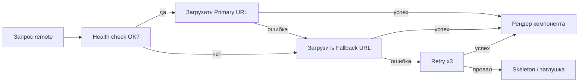

# Module Federation: продвинутый уровень — расширенная теория

## Почему версионирование shared — самая больная точка MFE

Представьте: у вас 5 команд, каждая деплоит свой remote. Одна команда обновила React до 18.3, другая ещё на 18.0. Третья включила strictVersion, четвёртая — нет. А пятая вообще забыла указать requiredVersion.

В монолите такого нет — там одна версия React на весь проект, и она определяется в package.json. В MFE каждый remote — это отдельно задеплоенный артефакт с собственным package.json. И в runtime они должны как-то договориться, какую версию React использовать.

Module Federation решает это через **shared scope** — общее пространство, где регистрируются все версии зависимостей, и runtime выбирает "победителя" по semver-правилам.

---

## Как работает shared scope изнутри

При инициализации каждый MFE (host и все remote) вызывает `__webpack_init_sharing__('default')`. Это заполняет глобальный объект `__webpack_share_scopes__.default` записями вида:

```
{
  "react": {
    "18.2.0": {
      get: () => Promise<ReactModule>,
      loaded: boolean,
      eager: boolean,
      requiredVersion: "^18.0.0",
      singleton: true,
      strictVersion: false,
    },
    "18.0.0": {
      // ...
    }
  }
}
```

Когда remote запрашивает `react`, runtime смотрит в этот объект и ищет лучшую версию:

1. Если есть уже загруженная (loaded=true) совместимая версия — берёт её
2. Если есть несколько незагруженных совместимых — берёт максимальную
3. Если нет совместимых и singleton=true — берёт что есть (с предупреждением)
4. Если нет совместимых и strictVersion=true — выбрасывает ошибку

---

## Детальный разбор semver в контексте MFE

Module Federation использует стандартный semver. Разберём основные диапазоны:

| Диапазон | Пример | Совпадает с |
|---|---|---|
| `^18.0.0` | `^18.0.0` | 18.0.0 — 18.x.x (кроме 19+) |
| `~18.2.0` | `~18.2.0` | 18.2.0 — 18.2.x (только patch) |
| `18.2.0` | `18.2.0` | Строго 18.2.0 |
| `>=18.0.0` | `>=18.0.0` | Любая 18+ |

Для React обычно используют `^18.0.0`. Это означает: "совместим с любой 18.x.x, но не с 17 или 19".

### Что происходит при minor mismatch

```
Host: react@18.0.0, requiredVersion: "^18.0.0"
Remote: react@18.3.1, requiredVersion: "^18.0.0"
```

Обе версии попадают в `^18.0.0`. Runtime выберет более новую — 18.3.1. В консоли будет:

```
[Module Federation] Sharing react@18.3.1, current version is 18.0.0
```

Это предупреждение, не ошибка. Обычно minor-версии React обратно совместимы, так что всё работает. Но хорошей практикой считается поддерживать версии synchronized — договориться командами об одной базовой версии.

---

## Dynamic remotes: паттерны промышленного уровня

### Реестр remote-конфигураций

В крупных проектах список remote не прописывается в коде host — он хранится в конфигурационном сервисе:

```ts
// Конфигурация загружается из API при старте
interface RemoteManifest {
  name: string
  url: string
  fallbackUrl?: string
  version: string
  healthUrl?: string
  timeout: number
}

async function fetchRemoteManifest(): Promise<RemoteManifest[]> {
  const res = await fetch('/api/mfe-manifest')
  return res.json()
}
```

Такой подход даёт операционную гибкость: чтобы обновить URL remote, достаточно обновить запись в API — не нужно пересобирать host.

### Инициализация через Promise в конфиге

Webpack Module Federation поддерживает асинхронную инициализацию remote:

```js
// webpack.config.js host
module.exports = {
  plugins: [
    new ModuleFederationPlugin({
      remotes: {
        catalogApp: `promise new Promise(resolve => {
          const remoteUrl = window.__REMOTE_CONFIG__.catalog
          const script = document.createElement('script')
          script.src = remoteUrl
          script.onload = () => {
            const proxy = {
              get: (request) => window.catalogApp.get(request),
              init: (arg) => {
                try {
                  return window.catalogApp.init(arg)
                } catch(e) {
                  console.log('remote already initialized')
                }
              }
            }
            resolve(proxy)
          }
          document.head.appendChild(script)
        })`,
      },
    }),
  ],
}
```

Здесь `window.__REMOTE_CONFIG__` — объект, инжектированный при старте приложения из конфигурационного API.

---

## Graceful degradation: система уровней

Для production-систем рекомендуется несколько уровней деградации:



### Реализация LoadableRemote

```tsx
interface LoadableRemoteOptions {
  load: () => Promise<{ default: React.ComponentType }>
  fallback: React.ComponentType
  skeleton?: React.ComponentType
  retries?: number
}

function createLoadableRemote({ load, fallback: Fallback, skeleton: Skeleton, retries = 3 }: LoadableRemoteOptions) {
  let attempt = 0

  const loadWithRetry = (): Promise<{ default: React.ComponentType }> => {
    return load().catch(err => {
      if (attempt < retries) {
        attempt++
        return new Promise<{ default: React.ComponentType }>(resolve =>
          setTimeout(() => resolve(loadWithRetry()), 1000 * attempt)
        )
      }
      console.error('Remote load failed after retries:', err)
      return { default: Fallback }
    })
  }

  const LazyComponent = React.lazy(loadWithRetry)

  return function LoadableRemote(props: Record<string, unknown>) {
    return (
      <ErrorBoundary fallback={<Fallback />}>
        <Suspense fallback={Skeleton ? <Skeleton /> : <div>Загрузка...</div>}>
          <LazyComponent {...props} />
        </Suspense>
      </ErrorBoundary>
    )
  }
}

// Использование
const Catalog = createLoadableRemote({
  load: () => import('catalogApp/App'),
  fallback: CatalogUnavailable,
  skeleton: CatalogSkeleton,
  retries: 3,
})
```

---

## Типизация: три стратегии

### Стратегия 1: Ручные декларации (подходит для небольших команд)

Каждый remote публикует файл `federation-types.d.ts` как артефакт:

```ts
// packages/catalog-types/federation-types.d.ts
declare module 'catalogApp/App' {
  const App: React.ComponentType<{
    basePath?: string
    onProductSelect?: (id: string) => void
  }>
  export default App
}

declare module 'catalogApp/ProductCard' {
  export interface ProductCardProps {
    id: string
    title: string
    price: number
    imageUrl: string
  }
  export const ProductCard: React.ComponentType<ProductCardProps>
}
```

Host добавляет пакет как devDependency. При обновлении API remote — публикует новую версию пакета типов.

### Стратегия 2: @module-federation/typescript

Плагин автоматически генерирует типы из конфига `exposes`:

```bash
# Remote: после сборки генерирует src/typings/@mf-types/
# Host: скачивает типы от remote
npx @module-federation/typescript download --remotes catalogApp
```

Типы хранятся в `.federation/` и добавляются в tsconfig.

### Стратегия 3: Shared contract package (наиболее масштабируемо)

```
packages/
  mfe-contracts/
    src/
      catalog.types.ts    // Props, Events, API
      cart.types.ts
      auth.types.ts
    package.json
```

Все MFE зависят от `@company/mfe-contracts`. Изменение контракта — это изменение в одном месте с версионированием через semver.

```ts
// @company/mfe-contracts/catalog.types.ts
export interface CatalogAppProps {
  basePath: string
  onProductSelect: (productId: string) => void
  initialFilters?: ProductFilters
}

export interface ProductFilters {
  category?: string
  priceRange?: [number, number]
  inStockOnly?: boolean
}
```

---

## Feature flags через dynamic remotes

Feature flags для MFE работают на уровне URL, а не кода:

```ts
// feature-flags.ts
interface MFEFeatureFlags {
  useNewCheckout: boolean
  catalogExperiment: 'control' | 'variant-a' | 'variant-b'
  enableRecommendations: boolean
}

async function resolveRemoteUrl(name: string, flags: MFEFeatureFlags): Promise<string> {
  const BASE = 'https://mfe.example.com'

  switch (name) {
    case 'checkout':
      return flags.useNewCheckout
        ? `${BASE}/checkout-v2/remoteEntry.js`
        : `${BASE}/checkout-v1/remoteEntry.js`

    case 'catalog':
      const variant = flags.catalogExperiment
      return `${BASE}/catalog-${variant}/remoteEntry.js`

    default:
      return `${BASE}/${name}/remoteEntry.js`
  }
}
```

Команды деплоят несколько версий своего remote параллельно. Shell переключается между ними без пересборки — только через изменение feature flag в конфигурационном сервисе.

---

## Промышленные антипаттерны

### Antipattern: Runtime discovery без кеширования

```ts
// ❌ Плохо: HTTP-запрос на каждый рендер компонента
function CatalogPage() {
  const [url, setUrl] = useState('')
  useEffect(() => {
    fetch('/api/remote-url/catalog').then(r => r.text()).then(setUrl)
  }, [])
  // ...
}
```

Remote manifest должен загружаться один раз при инициализации приложения, не при каждом рендере.

### Antipattern: Игнорирование версии remote в мониторинге

В production важно логировать, какая версия remote реально загружена. Иначе при инциденте невозможно понять, какой деплой виноват.

```ts
// ✅ Хорошо: логировать версию после загрузки
async function loadRemoteWithTracking(name: string, url: string) {
  await loadRemoteScript(url)
  const version = (window as Record<string, unknown>)[`${name}_version`] as string | undefined
  analytics.track('remote_loaded', { name, url, version: version ?? 'unknown' })
}
```

### Antipattern: shared без explicit version bounds

```ts
// ❌ Плохо: нет requiredVersion
shared: { 'react': { singleton: true } }

// Без requiredVersion Module Federation не может проверить совместимость.
// При загрузке remote с несовместимой версией → тихий баг.

// ✅ Хорошо
shared: { 'react': { singleton: true, requiredVersion: '^18.0.0' } }
```
