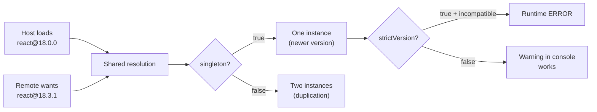

# Module Federation: Advanced Level

## Dynamic Remotes: When URL is Not a Constant

In the basic scenario, remote is hardcoded in the build config:

```ts
remotes: {
  catalogApp: 'catalogApp@https://catalog.example.com/remoteEntry.js',
}
```

This works for simple cases. But what if you need to:
- Load different remotes depending on environment (dev/staging/prod)?
- Read the remote list from an API at application startup?
- Switch to a fallback URL when the primary is unavailable?
- Enable/disable remotes via feature flags?

For all of this, you need **dynamic remotes** — loading remotes from runtime configuration.

---

## How Dynamic Remotes Work

Instead of a string in the config, you dynamically add a script to the DOM and register the remote manually:

```ts
// Step 1: Load remoteEntry.js as a script
function loadRemoteScript(url: string): Promise<void> {
  return new Promise((resolve, reject) => {
    const script = document.createElement('script')
    script.src = url
    script.onload = () => resolve()
    script.onerror = () => reject(new Error(`Failed to load ${url}`))
    document.head.appendChild(script)
  })
}

// Step 2: Get Module Federation container
declare const __webpack_init_sharing__: (scope: string) => Promise<void>
declare const __webpack_share_scopes__: { default: unknown }

async function loadComponent(scope: string, module: string) {
  await __webpack_init_sharing__('default')
  const container = (window as Record<string, unknown>)[scope] as {
    init: (s: unknown) => Promise<void>
    get: (m: string) => Promise<() => unknown>
  }
  await container.init(__webpack_share_scopes__.default)
  const factory = await container.get(module)
  return factory()
}
```

This is the low-level webpack API. For Vite, there's an equivalent via `__federation_method_getRemote__`.

---

## Versioning: singleton, strictVersion, requiredVersion

Three key shared options determine how Module Federation resolves version conflicts.



### singleton: true

Guarantees a single library instance in memory. Required for React, React Router, Redux Store — anything that stores state in a module singleton.

```ts
// ✅ React must be a singleton
shared: {
  'react': { singleton: true, requiredVersion: '^18.0.0' },
  'react-dom': { singleton: true, requiredVersion: '^18.0.0' },
}
```

### requiredVersion

Declares the semver range this MFE expects. Module Federation compares the loaded version against this range. If versions are compatible — the already loaded one is used.

```ts
// Host loaded with react@18.0.0, requiredVersion: '^18.0.0'
// Remote wants react@18.3.1, requiredVersion: '^18.0.0'
// → 18.3.1 is compatible with ^18.0.0
// → The one loaded first is used (or the newer one)
// → Warning in console, but no error
```

### strictVersion: true

Strict mode: if the loaded version doesn't match `requiredVersion` — Runtime throws an error instead of continuing with an incompatible version.

```ts
// ❌ Dangerous scenario without strictVersion
// Host: react@17.0.2, remote wants react@^18.0.0
// Without strictVersion: remote gets react@17 (incompatible) → silent bug
// ✅ With strictVersion: error in console → problem visible immediately

shared: {
  'react': {
    singleton: true,
    requiredVersion: '^18.0.0',
    strictVersion: true, // better to catch explicitly than get silent bugs
  },
}
```

---

## Fallback and Error Handling

Remote may be unavailable — deploy failed, CDN didn't respond, network is poor. Protection patterns:

### ErrorBoundary + lazy

```tsx
const RemoteCatalog = React.lazy(() =>
  import('catalogApp/App').catch(() => ({
    default: () => <div>Catalog is temporarily unavailable</div>,
  }))
)

function Shell() {
  return (
    <ErrorBoundary fallback={<CatalogSkeleton />}>
      <Suspense fallback={<CatalogSkeleton />}>
        <RemoteCatalog />
      </Suspense>
    </ErrorBoundary>
  )
}
```

### Retry with Exponential Backoff

```ts
async function loadWithRetry(url: string, retries = 3): Promise<void> {
  for (let i = 0; i < retries; i++) {
    try {
      await loadRemoteScript(url)
      return
    } catch {
      if (i < retries - 1) {
        await new Promise(r => setTimeout(r, 1000 * 2 ** i)) // 1s, 2s, 4s
      }
    }
  }
  throw new Error(`Failed after ${retries} retries: ${url}`)
}
```

### Health Check Before Loading

```ts
async function isRemoteHealthy(healthUrl: string): Promise<boolean> {
  try {
    const res = await fetch(healthUrl, { signal: AbortSignal.timeout(2000) })
    return res.ok
  } catch {
    return false
  }
}

async function loadRemoteSafely(config: RemoteConfig): Promise<void> {
  const urls = [config.primaryUrl, config.fallbackUrl].filter(Boolean)

  for (const url of urls) {
    if (config.healthEndpoint) {
      const healthy = await isRemoteHealthy(config.healthEndpoint)
      if (!healthy) continue
    }
    try {
      await loadRemoteScript(url)
      return
    } catch { /* try next */ }
  }

  throw new Error(`All URLs failed for remote: ${config.name}`)
}
```

---

## Typing Remote Modules

TypeScript doesn't know about Module Federation runtime imports. You need to explicitly declare types:

### Option 1: Manual Declarations

```ts
// src/remotes.d.ts
declare module 'catalogApp/App' {
  const App: React.ComponentType<{ initialPath?: string }>
  export default App
}

declare module 'catalogApp/Button' {
  export const Button: React.ComponentType<{
    variant: 'primary' | 'secondary'
    onClick: () => void
    children: React.ReactNode
  }>
}
```

### Option 2: @module-federation/typescript

The `@module-federation/typescript` package automatically generates `.d.ts` from the remote's `exposes` config and publishes them as a build artifact.

```ts
// webpack.config.js remote
plugins: [
  new ModuleFederationPlugin({
    // ...
  }),
  new FederationTypesPlugin({
    // publishes src/typings/@mf-types.d.ts
  })
]
```

Host downloads types via `@module-federation/typescript` CLI or npm script.

### Option 3: Module Federation 2.0

```ts
// mf.config.ts
export default defineConfig({
  name: 'catalogApp',
  exposes: {
    './App': './src/App.tsx',
  },
  // Type generation built-in
  dts: true,
})
```

---

## Feature Flags and A/B Testing via Remote

Dynamic remotes enable changing application behavior without recompiling the host.

### Feature Flags

```ts
// Config from API / env
const remoteConfig = await fetchRemoteConfig('/api/mfe-config')

const REMOTE_URL = remoteConfig.features.newCatalog
  ? 'https://catalog-v2.example.com/remoteEntry.js'
  : 'https://catalog.example.com/remoteEntry.js'
```

### A/B Testing

```ts
// 50% of users see version B
const variant = Math.random() < 0.5 ? 'A' : 'B'

const url = {
  A: 'https://checkout-stable.example.com/remoteEntry.js',
  B: 'https://checkout-experiment.example.com/remoteEntry.js',
}[variant]

await loadRemoteScript(url)
trackExperiment('checkout-redesign', variant)
```

Key advantage: the Checkout team deploys both versions independently. The shell only switches the URL — no rebuild needed.

---

## ⚠️ Common Beginner Mistakes

**strictVersion Without Understanding the Consequences**

```ts
// ❌ Bad: strictVersion everywhere, without semver compatibility awareness
shared: {
  'lodash': { singleton: true, strictVersion: true, requiredVersion: '4.17.21' },
}
// If remote uses lodash@4.17.20 — Runtime error!
// lodash is compatible within patch versions
```

```ts
// ✅ Good: strictVersion only where incompatibility is truly critical
shared: {
  'react': { singleton: true, strictVersion: true, requiredVersion: '^18.0.0' },
  'lodash': { singleton: false, requiredVersion: '^4.0.0' }, // lodash not a singleton
}
```

**No Fallback When Remote is Unavailable**

```tsx
// ❌ Bad: no error handling
const CatalogApp = React.lazy(() => import('catalogApp/App'))
// If remote crashes — entire Shell crashes

// ✅ Good: always wrap in ErrorBoundary + Suspense
const CatalogApp = React.lazy(() =>
  import('catalogApp/App').catch(() => ({ default: FallbackComponent }))
)
```

**Duplication Due to Uncoordinated Singleton**

```ts
// ❌ Bad: host and remote are not coordinated
// host: shared: { 'react': { singleton: false } }
// remote: shared: { 'react': { singleton: true } }
// Result: two React instances → invalid hooks
```

```ts
// ✅ Good: singleton is consistent across all participants
// If even one MFE declares singleton: false — duplication is guaranteed
```
