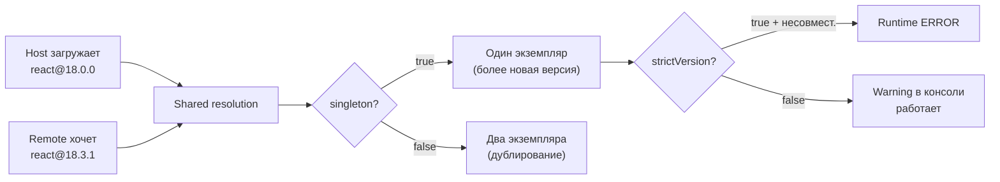

# Module Federation: продвинутый уровень

## Dynamic remotes: когда URL — не константа

В базовом сценарии remote прописывается в конфиге сборки жёстко:

```ts
remotes: {
  catalogApp: 'catalogApp@https://catalog.example.com/remoteEntry.js',
}
```

Это работает для простых случаев. Но что, если нужно:
- Загружать разные remote в зависимости от окружения (dev/staging/prod)?
- Читать список remote из API при старте приложения?
- Переключаться на резервный URL при недоступности основного?
- Включать/выключать remote через feature flags?

Для всего этого нужны **dynamic remotes** — загрузка remote по URL из runtime-конфигурации.

---

## Как работает dynamic remote

Вместо строки в конфиге вы динамически добавляете скрипт в DOM и регистрируете remote вручную:

```ts
// Шаг 1: Загрузить remoteEntry.js как скрипт
function loadRemoteScript(url: string): Promise<void> {
  return new Promise((resolve, reject) => {
    const script = document.createElement('script')
    script.src = url
    script.onload = () => resolve()
    script.onerror = () => reject(new Error(`Failed to load ${url}`))
    document.head.appendChild(script)
  })
}

// Шаг 2: Получить контейнер Module Federation
declare const __webpack_init_sharing__: (scope: string) => Promise<void>
declare const __webpack_share_scopes__: { default: unknown }

async function loadComponent(scope: string, module: string) {
  await __webpack_init_sharing__('default')
  const container = (window as Record<string, unknown>)[scope] as {
    init: (s: unknown) => Promise<void>
    get: (m: string) => Promise<() => unknown>
  }
  await container.init(__webpack_share_scopes__.default)
  const factory = await container.get(module)
  return factory()
}
```

Это низкоуровневый API webpack. Для Vite есть аналог через `__federation_method_getRemote__`.

---

## Версионирование: singleton, strictVersion, requiredVersion

Три ключевых опции shared определяют, как Module Federation разрешает конфликты версий.



### singleton: true

Гарантирует один экземпляр библиотеки в памяти. Обязателен для React, React Router, Redux Store — всего, что хранит состояние в модульном синглтоне.

```ts
// ✅ React должен быть singleton
shared: {
  'react': { singleton: true, requiredVersion: '^18.0.0' },
  'react-dom': { singleton: true, requiredVersion: '^18.0.0' },
}
```

### requiredVersion

Объявляет диапазон semver, который ожидает этот MFE. Module Federation сравнивает загруженную версию с этим диапазоном. Если версии совместимы — используется уже загруженная.

```ts
// Host загружен с react@18.0.0, requiredVersion: '^18.0.0'
// Remote хочет react@18.3.1, requiredVersion: '^18.0.0'
// → 18.3.1 совместима с ^18.0.0
// → Используется та, что загружена первой (или более новая)
// → Предупреждение в консоли, но ошибки нет
```

### strictVersion: true

Жёсткий режим: если загруженная версия не попадает в `requiredVersion` — Runtime выбрасывает ошибку вместо того чтобы продолжать с несовместимой версией.

```ts
// ❌ Опасный сценарий без strictVersion
// Host: react@17.0.2, remote хочет react@^18.0.0
// Без strictVersion: remote получит react@17 (несовместимо) → тихий баг
// ✅ С strictVersion: ошибка в консоли → видно проблему сразу

shared: {
  'react': {
    singleton: true,
    requiredVersion: '^18.0.0',
    strictVersion: true, // лучше ловить явно, чем получать тихие баги
  },
}
```

---

## Fallback и обработка ошибок

Remote может быть недоступен — деплой упал, CDN не ответил, сеть плохая. Паттерны защиты:

### ErrorBoundary + lazy

```tsx
const RemoteCatalog = React.lazy(() =>
  import('catalogApp/App').catch(() => ({
    default: () => <div>Каталог временно недоступен</div>,
  }))
)

function Shell() {
  return (
    <ErrorBoundary fallback={<CatalogSkeleton />}>
      <Suspense fallback={<CatalogSkeleton />}>
        <RemoteCatalog />
      </Suspense>
    </ErrorBoundary>
  )
}
```

### Retry с exponential backoff

```ts
async function loadWithRetry(url: string, retries = 3): Promise<void> {
  for (let i = 0; i < retries; i++) {
    try {
      await loadRemoteScript(url)
      return
    } catch {
      if (i < retries - 1) {
        await new Promise(r => setTimeout(r, 1000 * 2 ** i)) // 1s, 2s, 4s
      }
    }
  }
  throw new Error(`Failed after ${retries} retries: ${url}`)
}
```

### Health-check перед загрузкой

```ts
async function isRemoteHealthy(healthUrl: string): Promise<boolean> {
  try {
    const res = await fetch(healthUrl, { signal: AbortSignal.timeout(2000) })
    return res.ok
  } catch {
    return false
  }
}

async function loadRemoteSafely(config: RemoteConfig): Promise<void> {
  const urls = [config.primaryUrl, config.fallbackUrl].filter(Boolean)

  for (const url of urls) {
    if (config.healthEndpoint) {
      const healthy = await isRemoteHealthy(config.healthEndpoint)
      if (!healthy) continue
    }
    try {
      await loadRemoteScript(url)
      return
    } catch { /* try next */ }
  }

  throw new Error(`All URLs failed for remote: ${config.name}`)
}
```

---

## Типизация remote-модулей

TypeScript не знает о runtime-импортах Module Federation. Нужно явно объявить типы:

### Вариант 1: ручные декларации

```ts
// src/remotes.d.ts
declare module 'catalogApp/App' {
  const App: React.ComponentType<{ initialPath?: string }>
  export default App
}

declare module 'catalogApp/Button' {
  export const Button: React.ComponentType<{
    variant: 'primary' | 'secondary'
    onClick: () => void
    children: React.ReactNode
  }>
}
```

### Вариант 2: @module-federation/typescript

Пакет `@module-federation/typescript` автоматически генерирует `.d.ts` из конфига `exposes` remote и публикует их как артефакт сборки.

```ts
// webpack.config.js remote
plugins: [
  new ModuleFederationPlugin({
    // ...
  }),
  new FederationTypesPlugin({
    // публикует src/typings/@mf-types.d.ts
  })
]
```

Host скачивает типы через `@module-federation/typescript` CLI или npm-скрипт.

### Вариант 3: Module Federation 2.0

```ts
// mf.config.ts
export default defineConfig({
  name: 'catalogApp',
  exposes: {
    './App': './src/App.tsx',
  },
  // Генерация типов встроена
  dts: true,
})
```

---

## Feature flags и A/B тестирование через remote

Dynamic remotes открывают возможность менять поведение приложения без перекомпиляции host.

### Feature flags

```ts
// Конфиг из API / env
const remoteConfig = await fetchRemoteConfig('/api/mfe-config')

const REMOTE_URL = remoteConfig.features.newCatalog
  ? 'https://catalog-v2.example.com/remoteEntry.js'
  : 'https://catalog.example.com/remoteEntry.js'
```

### A/B тестирование

```ts
// 50% пользователей видят версию B
const variant = Math.random() < 0.5 ? 'A' : 'B'

const url = {
  A: 'https://checkout-stable.example.com/remoteEntry.js',
  B: 'https://checkout-experiment.example.com/remoteEntry.js',
}[variant]

await loadRemoteScript(url)
trackExperiment('checkout-redesign', variant)
```

Ключевое преимущество: команда Checkout деплоит обе версии независимо. Shell только переключает URL — без пересборки.

---

## ⚠️ Типичные ошибки новичков

**strictVersion без понимания последствий**

```ts
// ❌ Плохо: strictVersion везде, без учёта semver-совместимости
shared: {
  'lodash': { singleton: true, strictVersion: true, requiredVersion: '4.17.21' },
}
// Если remote использует lodash@4.17.20 — Runtime error!
// lodash совместим в рамках patch-версий
```

```ts
// ✅ Хорошо: strictVersion только там, где несовместимость действительно критична
shared: {
  'react': { singleton: true, strictVersion: true, requiredVersion: '^18.0.0' },
  'lodash': { singleton: false, requiredVersion: '^4.0.0' }, // lodash не singleton
}
```

**Нет fallback при недоступном remote**

```tsx
// ❌ Плохо: нет обработки ошибок
const CatalogApp = React.lazy(() => import('catalogApp/App'))
// При падении remote — весь Shell крашится

// ✅ Хорошо: всегда оборачивать в ErrorBoundary + Suspense
const CatalogApp = React.lazy(() =>
  import('catalogApp/App').catch(() => ({ default: FallbackComponent }))
)
```

**Дублирование из-за несогласованного singleton**

```ts
// ❌ Плохо: host и remote не согласованы
// host: shared: { 'react': { singleton: false } }
// remote: shared: { 'react': { singleton: true } }
// Результат: два экземпляра React → невалидные хуки
```

```ts
// ✅ Хорошо: singleton одинаков у всех участников
// Если хотя бы один MFE объявляет singleton: false — дублирование гарантировано
```
