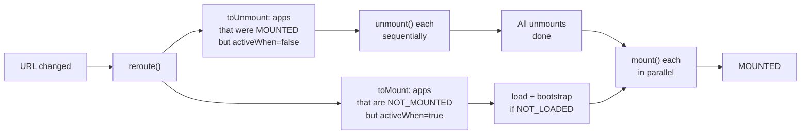

# Single-SPA: Extended Theory

## How Single-SPA Intercepts Navigation

Single-SPA doesn't replace the History API — it subscribes to it. When `start()` is called, it patches the global `window.addEventListener`:

```js
// Simplified — what Single-SPA does internally
const originalPushState = history.pushState
history.pushState = function (...args) {
  originalPushState.apply(history, args)
  // After every URL change — re-evaluate activity functions
  reroute()
}

window.addEventListener('popstate', reroute)
window.addEventListener('hashchange', reroute)
```

`reroute()` — the key function. It:
1. Iterates all registered applications
2. Calls `activeWhen(location)` for each
3. Builds two lists: "need to mount" and "need to unmount"
4. Runs lifecycle functions in the correct order

---

## Lifecycle Order During Route Transition



📌 Key detail: **unmount always happens before mount**. This ensures correct cleanup order. If two apps compete for the same DOM node — the old one fully leaves before the new one appears.

---

## Implementing Lifecycle Functions in an Application

Each MFE must export three functions. Here's how it looks for a React app:

```ts
// catalog-app/src/single-spa-root.tsx
import React from 'react'
import ReactDOM from 'react-dom/client'
import App from './App'

let root: ReturnType<typeof ReactDOM.createRoot> | null = null

// bootstrap: called once before the first mount
// Initialize here: store, i18n, lazy imports
export async function bootstrap(): Promise<void> {
  console.log('[catalog] bootstrap')
  // await initI18n()
  // await preloadCriticalChunks()
}

// mount: every time the route activates
export async function mount(props: { domElement: HTMLElement; [key: string]: unknown }): Promise<void> {
  const container = props.domElement ?? document.getElementById('catalog-container')
  root = ReactDOM.createRoot(container)
  root.render(
    <React.StrictMode>
      <App />
    </React.StrictMode>
  )
}

// unmount: every time the route deactivates
export async function unmount(props: { domElement: HTMLElement; [key: string]: unknown }): Promise<void> {
  root?.unmount()
  root = null
}
```

For Vue.js:

```ts
// cart-app/src/single-spa-root.ts
import { createApp, type App as VueApp } from 'vue'
import App from './App.vue'

let vueApp: VueApp | null = null

export async function bootstrap() {}

export async function mount(props: { domElement: HTMLElement }) {
  vueApp = createApp(App)
  vueApp.mount(props.domElement)
}

export async function unmount() {
  vueApp?.unmount()
  vueApp = null
}
```

---

## SystemJS: Why Single-SPA Loves It

Single-SPA is often used with SystemJS — a browser module loader in System.register format. This allows loading bundles by URL without webpack/vite on the host side.

```html
<!-- index.html root config -->
<script type="systemjs-importmap">
{
  "imports": {
    "single-spa": "https://cdn.jsdelivr.net/npm/single-spa/dist/lib/system/single-spa.min.js",
    "@company/catalog": "https://catalog.example.com/catalog.js",
    "@company/cart": "https://cart.example.com/cart.js"
  }
}
</script>
<script src="https://cdn.jsdelivr.net/npm/systemjs/dist/system.min.js"></script>
```

```js
// root-config.js
System.import('@company/root-config')
```

SystemJS advantage: each remote is an independent file by URL. Updating a remote = changing URL in import-map. No need to rebuild the host.

Alternative — native `import()`. Works with Module Federation and modern browsers, but requires more complex CDN configuration.

---

## Inter-Application Communication in Single-SPA

Single-SPA doesn't dictate how apps communicate. Three popular approaches:

### 1. Custom Events (Simple Way)

```ts
// catalog dispatches event
window.dispatchEvent(new CustomEvent('product-added-to-cart', {
  detail: { productId: '123', name: 'iPhone 15', price: 999 }
}))

// cart subscribes
window.addEventListener('product-added-to-cart', (e: Event) => {
  const event = e as CustomEvent<{ productId: string; name: string; price: number }>
  addToCart(event.detail)
})
```

Drawback: global events — poorly typed, no delivery guarantees.

### 2. Shared Event Bus via Import-Map

```ts
// @company/event-bus — separate package
export class EventBus {
  private handlers = new Map<string, Set<Function>>()

  on(event: string, handler: Function) {
    if (!this.handlers.has(event)) this.handlers.set(event, new Set())
    this.handlers.get(event)!.add(handler)
    return () => this.handlers.get(event)?.delete(handler) // unsubscribe
  }

  emit(event: string, payload: unknown) {
    this.handlers.get(event)?.forEach(h => h(payload))
  }
}

export const bus = new EventBus()
```

Registered in import-map as a singleton — all MFEs get the same instance.

### 3. Single-SPA Props

Single-SPA passes custom props to lifecycle functions — a way to pass data from root config to the application:

```js
registerApplication({
  name: '@company/catalog',
  app: () => System.import('@company/catalog'),
  activeWhen: '/catalog',
  customProps: {
    authToken: () => localStorage.getItem('auth-token'), // function — called on every mount
    apiBaseUrl: 'https://api.example.com',
  },
})
```

In the application:

```ts
export async function mount(props: {
  domElement: HTMLElement
  authToken: string
  apiBaseUrl: string
}) {
  // props.authToken — token from root config
}
```

---

## single-spa-layout: Advanced Usage

`single-spa-layout` supports loading UI and error states directly in the template:

```html
<single-spa-router>
  <!-- Navbar always active -->
  <application name="@company/navbar"></application>

  <route path="catalog">
    <application name="@company/catalog" loader="loading-catalog" error="error-catalog">
    </application>
  </route>

  <!-- 404 for unknown routes -->
  <route default>
    <application name="@company/not-found"></application>
  </route>
</single-spa-router>
```

```js
const routes = constructRoutes(layoutTemplate, {
  loaders: {
    'loading-catalog': '<div class="skeleton">Loading catalog...</div>',
  },
  errors: {
    'error-catalog': err => `<div class="error">Catalog unavailable: ${err.message}</div>`,
  },
})
```

---

## Performance: What Happens on First Load

The key Single-SPA problem with SystemJS is waterfall loading:

```
t=0ms    root-config.js loaded
t=100ms  single-spa initialized
t=200ms  URL analyzed, needed apps identified
t=300ms  catalog.js (300kb) starts loading
t=800ms  catalog bootstrapped
t=900ms  catalog mounted
```

Total ~900ms to content. Solutions:

1. **Preload hints** — tell the browser to load key bundles early:
   ```html
   <link rel="modulepreload" href="https://catalog.example.com/catalog.js">
   ```

2. **Server-side import-map** — CDN edge injects actual URLs, cache works correctly

3. **Split root-config into async chunks** — don't load all app bundles on initialization

---

## Industrial Anti-patterns

### Antipattern: Giant Root Config

```js
// ❌ Bad: root config turns into a monolith
registerApplication({ name: 'auth', ... })
registerApplication({ name: 'catalog', ... })
registerApplication({ name: 'cart', ... })
// ... 20 more applications
// + business logic, error handlers, analytics
// = 400 lines in root-config.js
```

```js
// ✅ Good: root config registers applications, everything else in separate modules
import { setupErrorTracking } from './error-tracking'
import { setupAnalytics } from './analytics'
import { APPS } from './app-registry'

setupErrorTracking()
setupAnalytics()
APPS.forEach(registerApplication)
start({ urlRerouteOnly: true })
```

### Antipattern: Not Cleaning Up Resources in unmount

```ts
// ❌ Bad: subscriptions not unsubscribed — memory leak
export async function mount() {
  window.addEventListener('resize', handleResize)
  store.subscribe(render)
  root = ReactDOM.createRoot(container)
  root.render(<App />)
}

export async function unmount() {
  root?.unmount() // only React tree
  // resize listener and store subscription still there!
}
```

```ts
// ✅ Good: clean everything in unmount
let cleanups: (() => void)[] = []

export async function mount(props) {
  const handleResize = () => { /* ... */ }
  window.addEventListener('resize', handleResize)
  cleanups.push(() => window.removeEventListener('resize', handleResize))

  const unsubscribe = store.subscribe(render)
  cleanups.push(unsubscribe)

  root = ReactDOM.createRoot(props.domElement)
  root.render(<App />)
}

export async function unmount() {
  root?.unmount()
  cleanups.forEach(fn => fn())
  cleanups = []
}
```

### Antipattern: Synchronous Bootstrap with Heavy Initialization

```ts
// ❌ Bad: everything in mount — blocks display
export async function bootstrap() {}

export async function mount() {
  await initTranslations() // 200ms
  await connectToStore() // 100ms
  await preloadImages() // 300ms
  root.render(<App />)
}
// User sees blank screen ~600ms on every transition
```

```ts
// ✅ Good: heavy stuff in bootstrap (once), mount should be fast
export async function bootstrap() {
  await Promise.all([initTranslations(), connectToStore(), preloadImages()])
}

export async function mount(props) {
  root = ReactDOM.createRoot(props.domElement)
  root.render(<App />) // immediate, data already loaded
}
```
