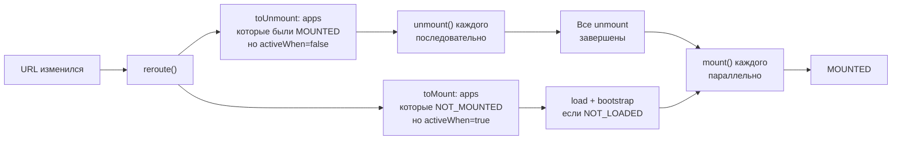

# Single-SPA: расширенная теория

## Как Single-SPA перехватывает навигацию

Single-SPA не заменяет History API — он подписывается на него. При вызове `start()` происходит патч глобального `window.addEventListener`:

```js
// Упрощённо — что делает Single-SPA внутри
const originalPushState = history.pushState
history.pushState = function (...args) {
  originalPushState.apply(history, args)
  // После каждого изменения URL — переоцениваем activity functions
  reroute()
}

window.addEventListener('popstate', reroute)
window.addEventListener('hashchange', reroute)
```

`reroute()` — ключевая функция. Она:
1. Обходит все зарегистрированные приложения
2. Для каждого вызывает `activeWhen(location)`
3. Строит два списка: "нужно смонтировать" и "нужно размонтировать"
4. Запускает lifecycle-функции в правильном порядке

---

## Порядок lifecycle при переходе маршрута



📌 Важная деталь: **unmount всегда происходит до mount**. Это гарантирует корректный порядок очистки. Если два приложения конкурируют за один DOM-узел — старое полностью уходит перед тем как новое появляется.

---

## Реализация lifecycle functions в приложении

Каждый MFE должен экспортировать три функции. Вот как это выглядит для React-приложения:

```ts
// catalog-app/src/single-spa-root.tsx
import React from 'react'
import ReactDOM from 'react-dom/client'
import App from './App'

let root: ReturnType<typeof ReactDOM.createRoot> | null = null

// bootstrap: вызывается один раз перед первым mount
// Инициализируйте здесь: store, i18n, lazy imports
export async function bootstrap(): Promise<void> {
  console.log('[catalog] bootstrap')
  // await initI18n()
  // await preloadCriticalChunks()
}

// mount: каждый раз при активации маршрута
export async function mount(props: { domElement: HTMLElement; [key: string]: unknown }): Promise<void> {
  const container = props.domElement ?? document.getElementById('catalog-container')
  root = ReactDOM.createRoot(container)
  root.render(
    <React.StrictMode>
      <App />
    </React.StrictMode>
  )
}

// unmount: каждый раз при деактивации маршрута
export async function unmount(props: { domElement: HTMLElement; [key: string]: unknown }): Promise<void> {
  root?.unmount()
  root = null
}
```

Для Vue.js:

```ts
// cart-app/src/single-spa-root.ts
import { createApp, type App as VueApp } from 'vue'
import App from './App.vue'

let vueApp: VueApp | null = null

export async function bootstrap() {}

export async function mount(props: { domElement: HTMLElement }) {
  vueApp = createApp(App)
  vueApp.mount(props.domElement)
}

export async function unmount() {
  vueApp?.unmount()
  vueApp = null
}
```

---

## SystemJS: почему Single-SPA его любит

Single-SPA часто используется с SystemJS — браузерным загрузчиком модулей в формате System.register. Это позволяет загружать бандлы по URL без webpack/vite на стороне host.

```html
<!-- index.html root config -->
<script type="systemjs-importmap">
{
  "imports": {
    "single-spa": "https://cdn.jsdelivr.net/npm/single-spa/dist/lib/system/single-spa.min.js",
    "@company/catalog": "https://catalog.example.com/catalog.js",
    "@company/cart": "https://cart.example.com/cart.js"
  }
}
</script>
<script src="https://cdn.jsdelivr.net/npm/systemjs/dist/system.min.js"></script>
```

```js
// root-config.js
System.import('@company/root-config')
```

Преимущество SystemJS: каждый remote — это независимый файл по URL. Обновить remote = сменить URL в import-map. Не нужно пересобирать host.

Альтернатива — нативный `import()`. Работает с Module Federation и современными браузерами, но требует более сложной конфигурации CDN.

---

## Межприложенное взаимодействие в Single-SPA

Single-SPA не диктует способ общения между приложениями. Три популярных подхода:

### 1. Custom Events (простой способ)

```ts
// catalog отправляет событие
window.dispatchEvent(new CustomEvent('product-added-to-cart', {
  detail: { productId: '123', name: 'iPhone 15', price: 999 }
}))

// cart подписывается
window.addEventListener('product-added-to-cart', (e: Event) => {
  const event = e as CustomEvent<{ productId: string; name: string; price: number }>
  addToCart(event.detail)
})
```

Минус: глобальные события — плохо типизированы, нет гарантий доставки.

### 2. Shared event bus через import-map

```ts
// @company/event-bus — отдельный пакет
export class EventBus {
  private handlers = new Map<string, Set<Function>>()

  on(event: string, handler: Function) {
    if (!this.handlers.has(event)) this.handlers.set(event, new Set())
    this.handlers.get(event)!.add(handler)
    return () => this.handlers.get(event)?.delete(handler) // unsubscribe
  }

  emit(event: string, payload: unknown) {
    this.handlers.get(event)?.forEach(h => h(payload))
  }
}

export const bus = new EventBus()
```

Регистрируется в import-map как singleton — все MFE получают один и тот же экземпляр.

### 3. Single-SPA props

Single-SPA передаёт кастомные props в lifecycle functions — способ передать данные от root config к приложению:

```js
registerApplication({
  name: '@company/catalog',
  app: () => System.import('@company/catalog'),
  activeWhen: '/catalog',
  customProps: {
    authToken: () => localStorage.getItem('auth-token'), // функция — будет вызываться при каждом mount
    apiBaseUrl: 'https://api.example.com',
  },
})
```

В приложении:

```ts
export async function mount(props: {
  domElement: HTMLElement
  authToken: string
  apiBaseUrl: string
}) {
  // props.authToken — токен от root config
}
```

---

## single-spa-layout: продвинутое использование

`single-spa-layout` поддерживает loading UI и error states прямо в шаблоне:

```html
<single-spa-router>
  <!-- Navbar всегда активен -->
  <application name="@company/navbar"></application>

  <route path="catalog">
    <application name="@company/catalog" loader="loading-catalog" error="error-catalog">
    </application>
  </route>

  <!-- 404 для неизвестных маршрутов -->
  <route default>
    <application name="@company/not-found"></application>
  </route>
</single-spa-router>
```

```js
const routes = constructRoutes(layoutTemplate, {
  loaders: {
    'loading-catalog': '<div class="skeleton">Загружаем каталог...</div>',
  },
  errors: {
    'error-catalog': err => `<div class="error">Каталог недоступен: ${err.message}</div>`,
  },
})
```

---

## Производительность: что происходит при первой загрузке

Ключевая проблема Single-SPA с SystemJS — waterfall загрузки:

```
t=0ms    root-config.js загружен
t=100ms  single-spa инициализирован
t=200ms  URL проанализирован, определены нужные приложения
t=300ms  начинается загрузка catalog.js (300kb)
t=800ms  catalog bootstrapped
t=900ms  catalog mounted
```

Итого ~900ms до появления контента. Решения:

1. **Preload hints** — подсказать браузеру загрузить ключевые бандлы заранее:
   ```html
   <link rel="modulepreload" href="https://catalog.example.com/catalog.js">
   ```

2. **Server-side import-map** — CDN edge подставляет актуальные URL, кеш работает корректно

3. **Разбить root-config на async chunks** — не загружать бандлы всех приложений при инициализации

---

## Промышленные антипаттерны

### Antipattern: Giant root config

```js
// ❌ Плохо: root config превратился в монолит
registerApplication({ name: 'auth', ... })
registerApplication({ name: 'catalog', ... })
registerApplication({ name: 'cart', ... })
// ... ещё 20 приложений
// + бизнес-логика, обработчики ошибок, аналитика
// = 400 строк в root-config.js
```

```js
// ✅ Хорошо: root config регистрирует приложения, остальное в отдельных модулях
import { setupErrorTracking } from './error-tracking'
import { setupAnalytics } from './analytics'
import { APPS } from './app-registry'

setupErrorTracking()
setupAnalytics()
APPS.forEach(registerApplication)
start({ urlRerouteOnly: true })
```

### Antipattern: Не очищать ресурсы в unmount

```ts
// ❌ Плохо: subscriptions не отписаны — утечка памяти
export async function mount() {
  window.addEventListener('resize', handleResize)
  store.subscribe(render)
  root = ReactDOM.createRoot(container)
  root.render(<App />)
}

export async function unmount() {
  root?.unmount() // только React-дерево
  // resize listener и store subscription остались!
}
```

```ts
// ✅ Хорошо: чистим всё в unmount
let cleanups: (() => void)[] = []

export async function mount(props) {
  const handleResize = () => { /* ... */ }
  window.addEventListener('resize', handleResize)
  cleanups.push(() => window.removeEventListener('resize', handleResize))

  const unsubscribe = store.subscribe(render)
  cleanups.push(unsubscribe)

  root = ReactDOM.createRoot(props.domElement)
  root.render(<App />)
}

export async function unmount() {
  root?.unmount()
  cleanups.forEach(fn => fn())
  cleanups = []
}
```

### Antipattern: Синхронный bootstrap с тяжёлой инициализацией

```ts
// ❌ Плохо: всё в mount — блокирует отображение
export async function bootstrap() {}

export async function mount() {
  await initTranslations() // 200ms
  await connectToStore() // 100ms
  await preloadImages() // 300ms
  root.render(<App />)
}
// Пользователь видит пустой экран ~600ms при каждом переходе
```

```ts
// ✅ Хорошо: тяжёлое в bootstrap (один раз), mount должен быть быстрым
export async function bootstrap() {
  await Promise.all([initTranslations(), connectToStore(), preloadImages()])
}

export async function mount(props) {
  root = ReactDOM.createRoot(props.domElement)
  root.render(<App />) // немедленно, данные уже загружены
}
```
