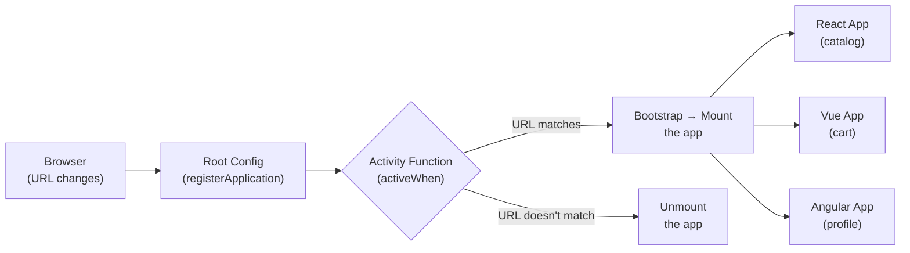
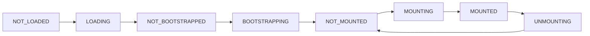

# Single-SPA: Microfrontend Orchestration

## What is Single-SPA and Why It's Needed

Imagine an airport. Airplanes (teams) arrive and depart independently. The dispatcher (Single-SPA) decides which airplane can use the runway (DOM) and when. No airplane knows about the others — each just executes its own flight. The dispatcher coordinates everything without interfering with the planes themselves.

Single-SPA is exactly such a dispatcher for microfrontends. It doesn't replace your React/Vue/Angular — it manages **when** each application mounts and unmounts.

---

## Architecture: Three Levels



**Root Config** — the entry point of the entire MFE system. The single page that knows about all applications. Registers them via `registerApplication()` and calls `start()`.

**Applications** — individual apps (React, Vue, Angular, Svelte, Vanilla). Each exports three required functions: `bootstrap`, `mount`, `unmount`.

**Parcels** — reusable components that can be mounted manually into any application. Like a shared component without Module Federation.

---

## Lifecycle: From Load to Unmount



| State | What's happening |
|---|---|
| NOT_LOADED | Application hasn't been loaded yet |
| LOADING | Loading remoteEntry / bundle |
| NOT_BOOTSTRAPPED | Code is loaded, bootstrap not yet called |
| BOOTSTRAPPING | Executing `bootstrap()` — initialization (Redux store, i18n) |
| NOT_MOUNTED | Ready to mount, but not active |
| MOUNTING | Executing `mount()` — render to DOM |
| MOUNTED | Active, displayed to user |
| UNMOUNTING | Executing `unmount()` — cleanup |

💡 After the first `bootstrap`, the application on subsequent activations goes directly NOT_MOUNTED → MOUNTING → MOUNTED — without reloading or re-bootstrapping.

---

## registerApplication: Route Configuration

```js
import { registerApplication, start } from 'single-spa'

// Option 1: string path (activeWhen = prefix match)
registerApplication({
  name: '@company/catalog',
  app: () => System.import('@company/catalog'),
  activeWhen: '/catalog', // active on /catalog, /catalog/1, /catalog/filters
})

// Option 2: predicate function (full control)
registerApplication({
  name: '@company/shell',
  app: () => System.import('@company/shell'),
  activeWhen: location => location.pathname === '/',
})

// Option 3: array of paths
registerApplication({
  name: '@company/auth',
  app: () => System.import('@company/auth'),
  activeWhen: ['/login', '/register', '/forgot-password'],
})

start({ urlRerouteOnly: true })
```

📌 `urlRerouteOnly: true` — an important option. Without it, Single-SPA triggers `popstate` on every `history.pushState` call, which can cause double rendering in some routers.

---

## single-spa-layout: Declarative Approach

Instead of `registerApplication()` in code, you can describe routes in an HTML-like template:

```html
<!-- microfrontends-layout.html -->
<single-spa-router>
  <application name="@company/navbar"></application>

  <route path="catalog">
    <application name="@company/catalog"></application>
  </route>

  <route path="cart">
    <application name="@company/cart"></application>
  </route>

  <route default>
    <application name="@company/home"></application>
  </route>
</single-spa-router>
```

```js
import { constructApplications, constructRoutes, constructLayoutEngine } from 'single-spa-layout'

const routes = constructRoutes(document.querySelector('#single-spa-layout'))
const applications = constructApplications({
  routes,
  loadApp: ({ name }) => System.import(name),
})
const layoutEngine = constructLayoutEngine({ routes, applications })

applications.forEach(registerApplication)
start()
```

🔥 Advantage: application structure reads like markup, not JavaScript. This simplifies onboarding and route changes.

---

## Differences from Module Federation

These are fundamentally different tools with different purposes:

| Aspect | Module Federation | Single-SPA |
|---|---|---|
| **Main Task** | Code sharing | Orchestration (lifecycle management) |
| **Level** | Bundler (webpack/vite) | Runtime framework-agnostic |
| **Binding** | Compile-time + runtime | Runtime only |
| **Frameworks** | Good with one/few | Any, including legacy |
| **What's configured** | vite.config / webpack.config | root-config.js |
| **Code Reuse** | Built-in (shared) | No (needs SystemJS) |

🎯 They are not competitors — they can be combined: Single-SPA orchestrates independent applications, while Module Federation is used within each group of related teams for code sharing.

---

## ⚠️ Common Beginner Mistakes

**Confusing Single-SPA's Purpose with Module Federation**

```js
// ❌ Bad: trying to do code sharing through Single-SPA parcels
// Single-SPA Parcels are UI components, not libraries
// For sharing react, lodash, design system — need Module Federation or npm packages

// ✅ Good: understand the roles
// Single-SPA → "when to show which application"
// Module Federation → "what to reuse between applications"
```

**Forgetting to call start() after registerApplication()**

```js
// ❌ Bad: applications won't activate
registerApplication({ name: 'catalog', app: loadCatalog, activeWhen: '/catalog' })
// start() is missing!

// ✅ Good
registerApplication({ name: 'catalog', app: loadCatalog, activeWhen: '/catalog' })
start({ urlRerouteOnly: true }) // nothing works without this
```

**Using activeWhen String for Root Route**

```js
// ❌ Bad: '/' as a string is a prefix match
// Activates on /, /catalog, /cart, /anything — all pages
registerApplication({ name: 'home', app: loadHome, activeWhen: '/' })

// ✅ Good: for '/' you need a predicate function
registerApplication({
  name: 'home',
  app: loadHome,
  activeWhen: location => location.pathname === '/',
})
```

**Global CSS Without Isolation**

```js
// ❌ Bad: CSS from one MFE affects others
// Single-SPA has no built-in CSS isolation like iframe or Shadow DOM
// When catalog mounts, it adds .button { color: red } — breaks all buttons

// ✅ Good: CSS Modules / BEM / Shadow DOM / CSS-in-JS
// Each MFE must isolate its own styles
// On unmount — remove added styles
```
