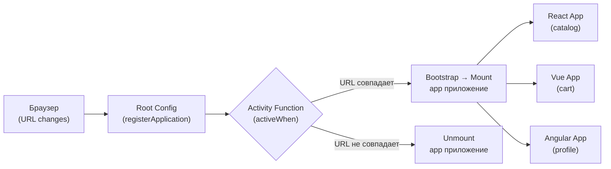
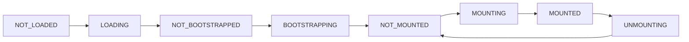

# Single-SPA: оркестрация микрофронтендов

## Что такое Single-SPA и зачем он нужен

Представьте аэропорт. Самолёты (команды) прилетают и улетают независимо. Диспетчер (Single-SPA) решает, когда какой самолёт может выйти на взлётную полосу (DOM). Ни один самолёт не знает о других — каждый просто выполняет свой рейс. Диспетчер координирует всё это без вмешательства в сам самолёт.

Single-SPA — это именно такой диспетчер для микрофронтендов. Он не заменяет ваш React/Vue/Angular, он управляет тем, **когда** каждое приложение монтируется и размонтируется.

---

## Архитектура: три уровня



**Root Config** — точка входа всей MFE-системы. Единственная страница, которая знает обо всех приложениях. Регистрирует их через `registerApplication()` и вызывает `start()`.

**Applications** — отдельные приложения (React, Vue, Angular, Svelte, Vanilla). Каждое экспортирует три обязательные функции: `bootstrap`, `mount`, `unmount`.

**Parcels** — переиспользуемые компоненты, которые можно монтировать вручную в любое приложение. Аналог shared component без Module Federation.

---

## Жизненный цикл: от загрузки до удаления



| Состояние | Что происходит |
|---|---|
| NOT_LOADED | Приложение ещё не загружалось |
| LOADING | Загружается remoteEntry / bundle |
| NOT_BOOTSTRAPPED | Код загружен, bootstrap ещё не вызван |
| BOOTSTRAPPING | Выполняется `bootstrap()` — инициализация (Redux store, i18n) |
| NOT_MOUNTED | Готово к монтированию, но не активно |
| MOUNTING | Выполняется `mount()` — рендер в DOM |
| MOUNTED | Активно, отображается пользователю |
| UNMOUNTING | Выполняется `unmount()` — очистка |

💡 После первого `bootstrap` приложение при следующей активации переходит сразу NOT_MOUNTED → MOUNTING → MOUNTED — без повторной загрузки и bootstrap.

---

## registerApplication: конфигурация маршрутов

```js
import { registerApplication, start } from 'single-spa'

// Вариант 1: строка-путь (activeWhen = prefix match)
registerApplication({
  name: '@company/catalog',
  app: () => System.import('@company/catalog'),
  activeWhen: '/catalog', // активен на /catalog, /catalog/1, /catalog/filters
})

// Вариант 2: функция-предикат (полный контроль)
registerApplication({
  name: '@company/shell',
  app: () => System.import('@company/shell'),
  activeWhen: location => location.pathname === '/',
})

// Вариант 3: массив путей
registerApplication({
  name: '@company/auth',
  app: () => System.import('@company/auth'),
  activeWhen: ['/login', '/register', '/forgot-password'],
})

start({ urlRerouteOnly: true })
```

📌 `urlRerouteOnly: true` — важная опция. Без неё Single-SPA вызывает `popstate` при каждом вызове `history.pushState`, что может привести к двойному рендерингу в некоторых роутерах.

---

## single-spa-layout: декларативный подход

Вместо `registerApplication()` в коде можно описать маршруты в HTML-подобном шаблоне:

```html
<!-- microfrontends-layout.html -->
<single-spa-router>
  <application name="@company/navbar"></application>

  <route path="catalog">
    <application name="@company/catalog"></application>
  </route>

  <route path="cart">
    <application name="@company/cart"></application>
  </route>

  <route default>
    <application name="@company/home"></application>
  </route>
</single-spa-router>
```

```js
import { constructApplications, constructRoutes, constructLayoutEngine } from 'single-spa-layout'

const routes = constructRoutes(document.querySelector('#single-spa-layout'))
const applications = constructApplications({
  routes,
  loadApp: ({ name }) => System.import(name),
})
const layoutEngine = constructLayoutEngine({ routes, applications })

applications.forEach(registerApplication)
start()
```

🔥 Преимущество: структура приложений читается как разметка, а не как JavaScript. Это облегчает onboarding и изменения маршрутов.

---

## Отличия от Module Federation

Это принципиально разные инструменты с разными целями:

| Аспект | Module Federation | Single-SPA |
|---|---|---|
| **Основная задача** | Code sharing (общий код) | Оркестрация (управление жизненным циклом) |
| **Уровень** | Bundler (webpack/vite) | Runtime framework-agnostic |
| **Связь** | Compile-time + runtime | Только runtime |
| **Фреймворки** | Хорошо с одним/несколькими | Любые, включая legacy |
| **Что конфигурируется** | vite.config / webpack.config | root-config.js |
| **Переиспользование кода** | Встроено (shared) | Нет (нужен SystemJS) |

🎯 Они не конкуренты — их можно комбинировать: Single-SPA оркестрирует независимые приложения, а внутри каждой группы связанных команд используется Module Federation для sharing кода.

---

## ⚠️ Типичные ошибки новичков

**Перепутать цель Single-SPA с Module Federation**

```js
// ❌ Плохо: пытаться сделать code sharing через Single-SPA parcels
// Single-SPA Parcels — это UI-компоненты, не библиотеки
// Для sharing react, lodash, дизайн-системы нужен Module Federation или npm-пакеты

// ✅ Хорошо: понимать роли
// Single-SPA → "когда какое приложение показывать"
// Module Federation → "что переиспользовать между приложениями"
```

**Не вызвать start() после registerApplication()**

```js
// ❌ Плохо: приложения не будут активированы
registerApplication({ name: 'catalog', app: loadCatalog, activeWhen: '/catalog' })
// start() забыт!

// ✅ Хорошо
registerApplication({ name: 'catalog', app: loadCatalog, activeWhen: '/catalog' })
start({ urlRerouteOnly: true }) // без этого ничего не работает
```

**Использовать activeWhen строку для корневого маршрута**

```js
// ❌ Плохо: '/' как строка — это prefix match
// Активируется на /, /catalog, /cart, /anything — на всех страницах
registerApplication({ name: 'home', app: loadHome, activeWhen: '/' })

// ✅ Хорошо: для '/' нужна функция-предикат
registerApplication({
  name: 'home',
  app: loadHome,
  activeWhen: location => location.pathname === '/',
})
```

**Глобальные CSS без изоляции**

```js
// ❌ Плохо: CSS из одного MFE влияет на другие
// В Single-SPA нет встроенной CSS-изоляции как в iframe или Shadow DOM
// При монтировании catalog добавляет .button { color: red } — сломает все кнопки

// ✅ Хорошо: CSS Modules / BEM / Shadow DOM / CSS-in-JS
// Каждый MFE должен самостоятельно изолировать свои стили
// При unmount — удалять добавленные стили
```
