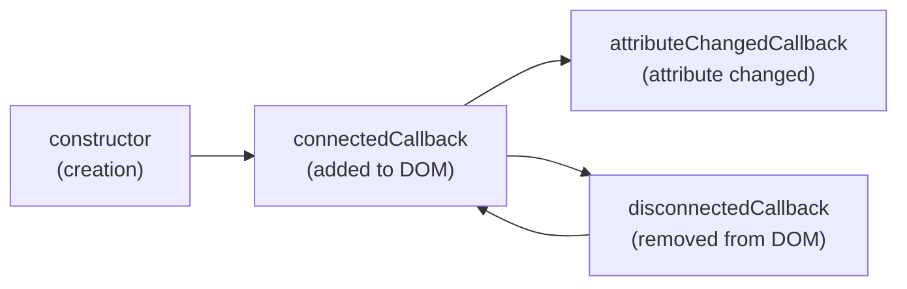
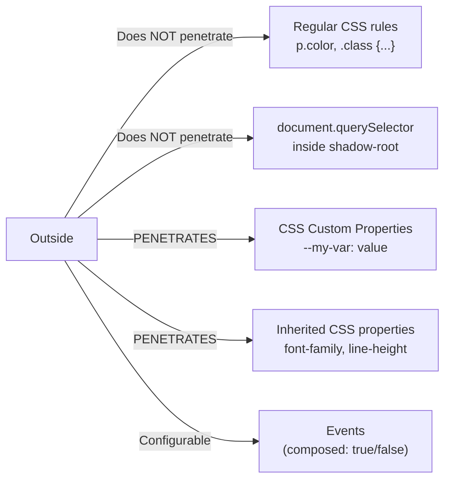
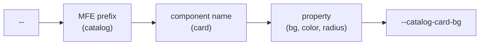
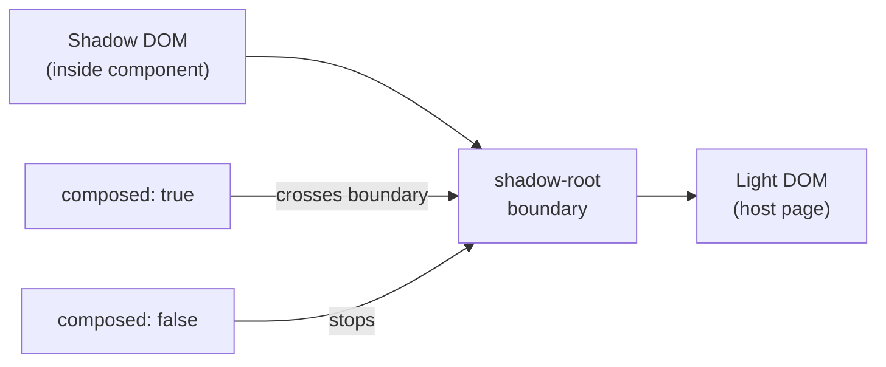

# Web Components as Contracts in Microfrontends — Detailed Theory

## Context: Why an Architect Needs This

Imagine a real-world scenario: an e-commerce platform, three teams. Team A writes Shell on React 18. Team B writes Catalog on Vue 3. Team C writes Cart on Angular 17. All deploy independently.

Each team created an excellent `ProductCard` component. How does the Shell team render `ProductCard` from the Vue team? Directly importing a Vue component into React means pulling Vue into the bundle. This violates MFE independence.

Web Components provide the solution: each MFE exports components as native HTML elements. `<catalog-card item-id="123">` — this is just HTML. Any framework knows how to render HTML.

## Custom Elements — Registering a Native Tag

### How It Works

The browser maintains a Custom Elements registry. When the parser encounters an unknown tag, it checks the registry. If the tag is registered — an instance of your class is created.

```js
class CatalogCard extends HTMLElement {
  connectedCallback() {
    console.log('Element added to DOM')
    this.render()
  }

  disconnectedCallback() {
    console.log('Element removed from DOM')
    // Unsubscribe from events, clear timers here
  }

  adoptedCallback() {
    console.log('Element moved to another document')
  }

  render() {
    this.innerHTML = `<div class="card">Product</div>`
  }
}

customElements.define('catalog-card', CatalogCard)
```

After registration, you can use it in HTML:
```html
<catalog-card item-id="123"></catalog-card>
```

Or create programmatically:
```js
const card = document.createElement('catalog-card')
document.body.appendChild(card)
```

### Naming Rules

A Custom Element name **must** contain a hyphen. This is an intentional specification limitation to avoid conflicts with future native browser elements. Examples of valid names: `my-button`, `catalog-product-card`, `mfe-shell-nav`.

### Custom Element Lifecycle



⚠️ **Common mistake**: accessing attributes or child elements in the `constructor`. The DOM is not ready in the constructor. Do all DOM interaction in `connectedCallback`.

```js
// ❌ Wrong
class MyElement extends HTMLElement {
  constructor() {
    super()
    this.innerHTML = 'Hello'  // May crash
    this.getAttribute('title') // Attribute may not be set
  }
}

// ✅ Correct
class MyElement extends HTMLElement {
  constructor() {
    super()
    this.attachShadow({ mode: 'open' })  // Only shadow root
  }

  connectedCallback() {
    this.render()  // DOM work here
  }
}
```

## Shadow DOM — Real Encapsulation

### What is Shadow DOM

Shadow DOM is a separate, isolated DOM subtree attached to a regular element (called the "host"). The browser renders both trees together, but CSS and JavaScript see them separately.

Analogy: think of the `<video>` element. Play buttons, slider — that's the browser's Shadow DOM. Your styles don't affect them. Web Components give you the same mechanism.

```js
const host = document.querySelector('#my-element')
const shadow = host.attachShadow({ mode: 'open' })
// mode: 'open'   — shadowRoot accessible externally via element.shadowRoot
// mode: 'closed' — shadowRoot not accessible externally (rarely needed)

shadow.innerHTML = `
  <style>
    /* This style affects ONLY elements inside Shadow DOM */
    p { color: red; font-size: 14px; }
  </style>
  <p>This text is red</p>
`
```

There may be a global style `p { color: blue }` on the page — it won't affect `<p>` inside Shadow DOM.

### What Penetrates Shadow DOM, What Doesn't



💡 Inherited CSS properties (font-family, color for text, line-height) **inherit** into Shadow DOM. This allows setting typography at the host application level. But block styles (background, border, padding) — no.

### :host and :host-context

From Shadow DOM you can style the host element itself:

```css
/* Base element styles */
:host {
  display: block;  /* Custom Elements are inline by default */
  padding: 16px;
}

/* When element is disabled */
:host([disabled]) {
  opacity: 0.5;
  pointer-events: none;
}

/* When element is inside .dark-theme */
:host-context(.dark-theme) {
  background: #1e1e2e;
  color: #cdd6f4;
}
```

### ::part — Advanced Customization

When CSS Custom Properties aren't enough, you can expose specific parts of the component for external styling via the `part` attribute:

```html
<!-- Inside Shadow DOM -->
<div part="container">
  <button part="button primary">Buy</button>
</div>
```

```css
/* Outside — host application */
catalog-card::part(button) {
  border-radius: 20px;
  text-transform: uppercase;
}

catalog-card::part(button primary) {
  background: linear-gradient(to right, #1a73e8, #0d47a1);
}
```

📌 `::part` is "surgical" access to component internals. Use cautiously: this exposes implementation details.

## Attributes vs Properties: The Core Concept

This is the most common error zone when creating Web Components. Understanding the difference is critical.

### Attributes

Attributes are strings in HTML markup. When you write `<my-element count="5">`, the browser sets the `count` attribute with the string value `"5"`.

```js
class MyElement extends HTMLElement {
  static get observedAttributes() {
    return ['count', 'disabled', 'title']
    // Only listed attributes trigger attributeChangedCallback
  }

  attributeChangedCallback(name, oldValue, newValue) {
    if (name === 'count') {
      const count = parseInt(newValue || '0', 10)  // Need to parse the string!
      this.render()
    }
    if (name === 'disabled') {
      // Boolean attribute: present = true, absent = false
      const isDisabled = newValue !== null
    }
  }
}
```

```html
<!-- Set attribute in HTML -->
<my-element count="10" disabled></my-element>
```

```js
// Set attribute programmatically
element.setAttribute('count', '10')
const count = element.getAttribute('count')  // Always a string!
```

### Properties

Properties are JavaScript values of any type. They don't automatically reflect as HTML attributes.

```js
class MyElement extends HTMLElement {
  private _items = []
  private _config = {}

  get items() { return this._items }
  set items(value) {
    this._items = value
    this.render()
  }

  get config() { return this._config }
  set config(value) {
    this._config = value
    this.render()
  }
}
```

```js
// Set property (only programmatically, not via HTML)
element.items = [{ id: 1, name: 'Product' }]
element.config = { theme: 'dark', locale: 'ru' }
```

### Selection Rule

| Data Type | Attribute | Property |
|---|---|---|
| String (`"hello"`) | ✅ | ✅ |
| Number (`42`) | ✅ (but needs parsing) | ✅ |
| Boolean (`true/false`) | ✅ (attribute present/absent) | ✅ |
| Object (`{ a: 1 }`) | ❌ (only JSON — bad idea) | ✅ |
| Array (`[1, 2, 3]`) | ❌ | ✅ |
| Function | ❌ | ✅ |

⚠️ **Mistake**: passing objects via attributes as JSON strings.

```js
// ❌ Bad — serialization/deserialization, encoding issues
element.setAttribute('config', JSON.stringify({ theme: 'dark' }))
// attributeChangedCallback will need JSON.parse — this is fragile

// ✅ Good — property
element.config = { theme: 'dark' }
```

## CSS Custom Properties — Styling Contract

Custom Properties (CSS variables) intentionally cross the Shadow DOM boundary. This isn't a bug, it's a feature — a mechanism for creating a public styling API.

### Defining the Contract

```css
/* Inside Shadow DOM — component declares its styling API */
:host {
  /* Main colors */
  --mf-primary: var(--catalog-card-primary, #1a73e8);
  --mf-text: var(--catalog-card-text, #212121);
  --mf-bg: var(--catalog-card-bg, #ffffff);

  /* Sizes */
  --mf-radius: var(--catalog-card-radius, 8px);
  --mf-padding: var(--catalog-card-padding, 16px);

  display: block;
  background: var(--mf-bg);
  color: var(--mf-text);
  border-radius: var(--mf-radius);
  padding: var(--mf-padding);
}

.price {
  color: var(--catalog-card-price-color, #d93025);
  font-weight: 600;
}
```

```css
/* Outside — host application applies the theme */
catalog-card {
  --catalog-card-primary: #7b1fa2;
  --catalog-card-bg: #f3e5f5;
  --catalog-card-radius: 16px;
}

/* Or global theme */
:root {
  --catalog-card-primary: #1a73e8;
  --catalog-card-text: #212121;
}
```

### Naming CSS Custom Properties

Recommended conventions for MFE architecture:



```css
/* ✅ Good: namespace + component + property */
--catalog-card-bg: #fff;
--catalog-card-text: #333;
--catalog-card-border-radius: 8px;
--catalog-card-price-color: #d93025;

/* ❌ Bad: too generic names — conflicts with other MFEs */
--bg: #fff;
--color: #333;
--radius: 8px;
```

## Slots — Content Projection

Slots are a way to insert custom content into Shadow DOM without breaking encapsulation. The content physically remains in Light DOM (accessible to page scripts and styles), but visually renders where `<slot>` is in Shadow DOM.

### Default Slot and Named Slots

```html
<!-- Shadow DOM template -->
<div class="card">
  <div class="card-header">
    <slot name="header">
      <!-- Fallback content if slot is empty -->
      <span class="default-title">No title</span>
    </slot>
  </div>

  <div class="card-body">
    <slot></slot>  <!-- Default slot — for everything without slot="" -->
  </div>

  <div class="card-footer">
    <slot name="footer"></slot>
  </div>
</div>
```

```html
<!-- Usage in Light DOM -->
<catalog-card>
  <h2 slot="header">Dell XPS 15 Laptop</h2>

  <!-- This content goes to default slot -->
  <p>Intel Core i7, 16GB RAM, SSD 512GB</p>
  

  <div slot="footer">
    <span class="price">$999</span>
    <button>Add to Cart</button>
  </div>
</catalog-card>
```

### Styling Slotted Content

```css
/* From inside Shadow DOM — style content in slots */
::slotted(*) {
  /* All elements in any slot */
}

::slotted(p) {
  /* Only <p> in slots */
  margin: 0 0 8px;
}

::slotted([slot="header"]) {
  /* Only content in named slot */
  font-size: 1.2em;
  font-weight: 600;
}
```

⚠️ `::slotted()` applies to **direct** children of the slot. Nested descendants are inaccessible.

### slotchange Event

```js
connectedCallback() {
  const slot = this.shadowRoot.querySelector('slot')
  slot.addEventListener('slotchange', (e) => {
    const nodes = slot.assignedNodes({ flatten: true })
    console.log('Slot content changed:', nodes)
  })
}
```

## CustomEvent — Communication Across Boundaries

### Basic Pattern

```js
// Inside Custom Element
class CatalogCard extends HTMLElement {
  handleAddToCart() {
    this.dispatchEvent(new CustomEvent('catalog:add-to-cart', {
      bubbles: true,      // Bubbles up the DOM tree
      composed: true,     // Crosses shadow-root ← CRITICAL!
      detail: {
        itemId: this.getAttribute('item-id'),
        quantity: 1,
        price: this._price,
      }
    }))
  }
}
```

```js
// In host application
document.addEventListener('catalog:add-to-cart', (event) => {
  cartStore.addItem(event.detail)
})

// Or targeted subscription
const card = document.querySelector('catalog-card')
card.addEventListener('catalog:add-to-cart', handler)
```

### composed: true vs false



When to use `composed: false`: for events intended only for internal communication within Shadow DOM. For example, a click on an internal button that should only be handled inside the component.

### Event Typing in TypeScript

```typescript
// Declare component event types
interface CatalogCardEventMap {
  'catalog:add-to-cart': CustomEvent<{ itemId: string; quantity: number; price: number }>
  'catalog:wishlist-add': CustomEvent<{ itemId: string }>
  'catalog:view-details': CustomEvent<{ itemId: string; source: 'click' | 'keyboard' }>
}

// Extend HTMLElementEventMap
declare global {
  interface HTMLElementEventMap extends CatalogCardEventMap {}
}

// Now TypeScript hints types
const card = document.querySelector('catalog-card')!
card.addEventListener('catalog:add-to-cart', (e) => {
  const { itemId, quantity, price } = e.detail  // Typed!
})
```

## Wrapping a React/Vue Component in a Custom Element

Classic pattern for gradual migration and exporting MFE components:

```typescript
import { createRoot, Root } from 'react-dom/client'
import React from 'react'
import { CatalogCard } from './CatalogCard'  // React component

class CatalogCardElement extends HTMLElement {
  private root: Root | null = null

  static get observedAttributes() {
    return ['item-id', 'currency']
  }

  connectedCallback() {
    this.root = createRoot(this)
    this.renderReact()
  }

  disconnectedCallback() {
    // Important: unmount React before removing element
    this.root?.unmount()
    this.root = null
  }

  attributeChangedCallback() {
    this.renderReact()
  }

  // Property for passing objects
  private _config: Record<string, unknown> = {}
  get config() { return this._config }
  set config(value: Record<string, unknown>) {
    this._config = value
    this.renderReact()
  }

  private renderReact() {
    const itemId = this.getAttribute('item-id') || ''
    const currency = this.getAttribute('currency') || 'RUB'

    this.root?.render(
      <CatalogCard
        itemId={itemId}
        currency={currency}
        config={this._config}
        onAddToCart={(detail) => {
          this.dispatchEvent(new CustomEvent('catalog:add-to-cart', {
            bubbles: true,
            composed: true,
            detail,
          }))
        }}
      />
    )
  }
}

customElements.define('catalog-card', CatalogCardElement)
```

## Full Custom Element Contract — Documentation

Good Web Component documentation for an MFE team should include all aspects of the public API:

```markdown
## catalog-card

Product card. Used in Shell, Cart, and Wishlist MFEs.

### Attributes
| Attribute | Type | Default | Description |
|-----------|------|---------|-------------|
| item-id | string | — | Product ID (required) |
| currency | string | 'USD' | Currency for price display |
| disabled | boolean | false | Disable interactivity |

### Properties (JS)
| Property | Type | Description |
|----------|------|-------------|
| config | CatalogCardConfig | Component configuration |
| priceFormatter | (price: number) => string | Custom price formatter |

### Events
| Event | Payload | Description |
|-------|---------|-------------|
| catalog:add-to-cart | { itemId, quantity, price } | Add to cart |
| catalog:view-details | { itemId } | Click on product details |

### CSS Custom Properties
| Variable | Default | Description |
|----------|---------|-------------|
| --catalog-card-bg | #ffffff | Card background |
| --catalog-card-radius | 8px | Corner radius |
| --catalog-card-price-color | #d93025 | Price color |

### Slots
| Slot | Description |
|------|-------------|
| (default) | Additional product description |
| badge | Badge (e.g. "Bestseller") |
| actions | Additional action buttons |
```

## When NOT to Use Web Components

Web Components are a powerful tool, but not a silver bullet:

| Situation | Recommendation |
|-----------|---------------|
| All MFEs on the same framework (React) | Module Federation without WC is simpler |
| High-frequency state updates | Direct integration via framework is faster |
| SSR (server-side rendering) | WC poorly supported in SSR without polyfills |
| Simple leaf components | Overkill — Module Federation is enough |
| Shared design system | WC well suited for framework-agnostic UI |

## ⚠️ Common Mistakes

### 1. DOM Access in Constructor

```js
// ❌ Error
class MyElement extends HTMLElement {
  constructor() {
    super()
    this.innerHTML = 'Hello'  // DOMException!
    this.render()             // Will also crash
  }
}

// ✅ Correct
class MyElement extends HTMLElement {
  constructor() {
    super()
    this.attachShadow({ mode: 'open' })  // Only this
  }

  connectedCallback() {
    this.render()  // DOM work here
  }
}
```

### 2. Forgetting composed: true for Events

```js
// ❌ Event doesn't exit Shadow DOM
this.dispatchEvent(new CustomEvent('my-event', {
  bubbles: true,
  // composed not specified → defaults to false
}))

// ✅ Event crosses shadow boundary
this.dispatchEvent(new CustomEvent('my-event', {
  bubbles: true,
  composed: true,
}))
```

### 3. Passing Objects via Attributes

```js
// ❌ Bad idea
element.setAttribute('config', JSON.stringify({ theme: 'dark', items: [...] }))

// ✅ Property for objects
element.config = { theme: 'dark', items: [...] }
```

### 4. Not Cleaning Resources in disconnectedCallback

```js
// ❌ Memory leak
class MyElement extends HTMLElement {
  connectedCallback() {
    this.handler = () => this.update()
    window.addEventListener('resize', this.handler)
    this.interval = setInterval(() => this.tick(), 1000)
  }
  // No disconnectedCallback → handlers and intervals live forever
}

// ✅ Proper cleanup
class MyElement extends HTMLElement {
  connectedCallback() {
    this.handler = () => this.update()
    window.addEventListener('resize', this.handler)
    this.interval = setInterval(() => this.tick(), 1000)
  }

  disconnectedCallback() {
    window.removeEventListener('resize', this.handler)
    clearInterval(this.interval)
    this.root?.unmount()  // If wrapping React
  }
}
```

### 5. Global Event Names Without Namespace

```js
// ❌ Conflicts with other MFEs and native browser events
this.dispatchEvent(new CustomEvent('click', { ... }))
this.dispatchEvent(new CustomEvent('change', { ... }))
this.dispatchEvent(new CustomEvent('update', { ... }))

// ✅ Namespace — MFE or domain name
this.dispatchEvent(new CustomEvent('catalog:item-selected', { ... }))
this.dispatchEvent(new CustomEvent('cart:quantity-changed', { ... }))
this.dispatchEvent(new CustomEvent('mf:navigation-requested', { ... }))
```
